# Backend Express — CampusNube

## Documentación del proyecto

**Proyecto:** CampusNube – Aprendizaje virtual\
**Backend:** Express + TypeScript + Sequelize\
**Base de datos:** MySQL\
**Arquitectura:** Organización por features\
**Repositorio:** wenmendez26

------------------------------------------------------------------------

# 1. ISS-00 — Requisitos previos

**Objetivo:** entorno listo para el laboratorio.\
**Bloqueado por:** ninguno.

### Criterios de aceptación (ISS-00)

- [x] `node -v` muestra v20+ (lab: v24.x)
- [x] `npm -v` responde
- [ ] Motor de BD accesible (MySQL recomendado para el primer `sync`)

### Pasos

``` bash
node -v npm -v
```

### Verificación del ISS

``` bash
node -v && npm -v
```

#### EVIDENCIA

#### 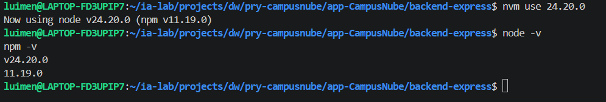

------------------------------------------------------------------------

# 2. ISS-01 — Esqueleto del proyecto

**Objetivo:** proyecto npm + TypeScript + Express con estructura `features/` y servidor HTTP base.\
**Bloqueado por:** ISS-00.

### Criterios de aceptación (ISS-01) — consolidados

- [ ] **2.1** Existe `package.json` con `"type": "commonjs"` y scripts `build` / `dev`

  #### Evidencia

  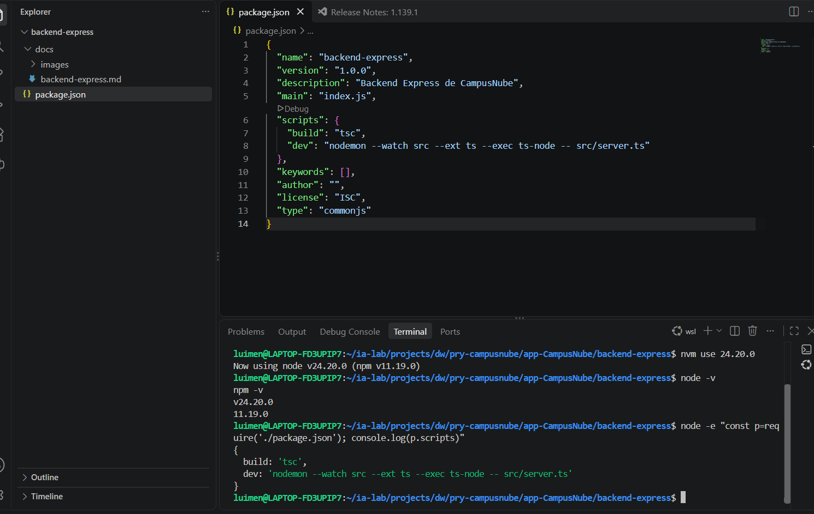

- [ ] **2.2** Árbol `src/` con `config`, `database/seeders`, `routes`, `features/business/` (auth **fuera de alcance** de este lab)

  #### Se creó la estructura base del backend Express organizada por features, adaptada al dominio de CampusNube. Se prepararon las carpetas correspondientes a las 11 entidades del sistema.

  La estructura contempla los features Learner, Teacher, Course, Module, Lesson, Enrollment, Evaluation, Attempt, Submission, Progress y Certificate.

  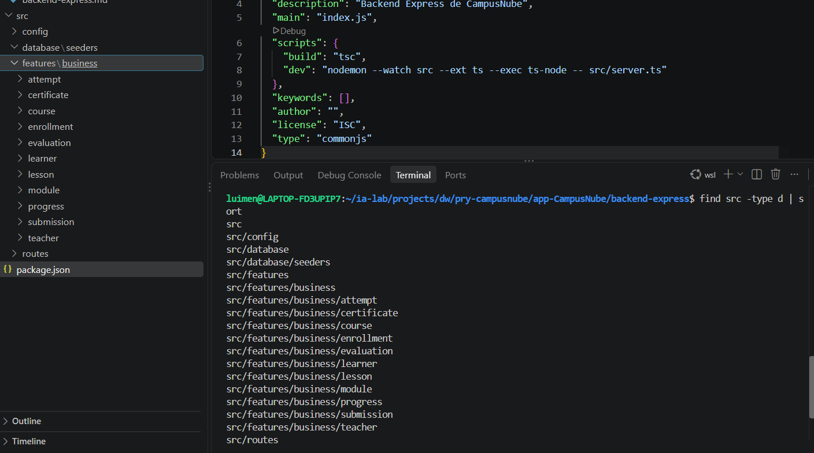

- [ ] **2.3** Dependencias Express/TS instaladas (`npm ls --depth=0`)

  ### Evidencia

  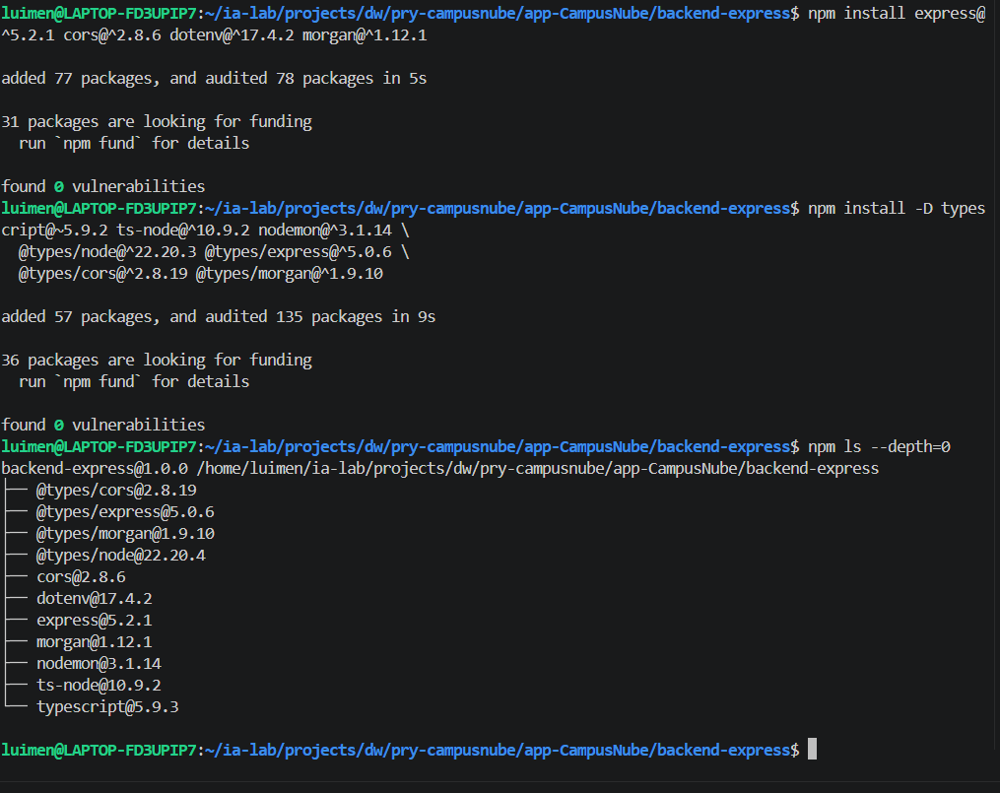

- [ ] **2.4** Existe `tsconfig.json` (`rootDir: ./src`, `outDir: ./dist`, `strict: true`)

  ### Evidencia

  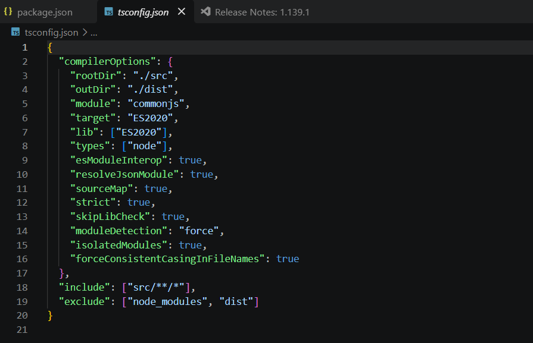

- [ ] **2.5** Existen `src/server.ts` y `src/config/index.ts` (esqueleto App) `npx tsc --noEmit` sin errores al cerrar el ISS

  CREAMOS EL ESQUELETO DE APP

  #### 2.5.1 — `src/server.ts`

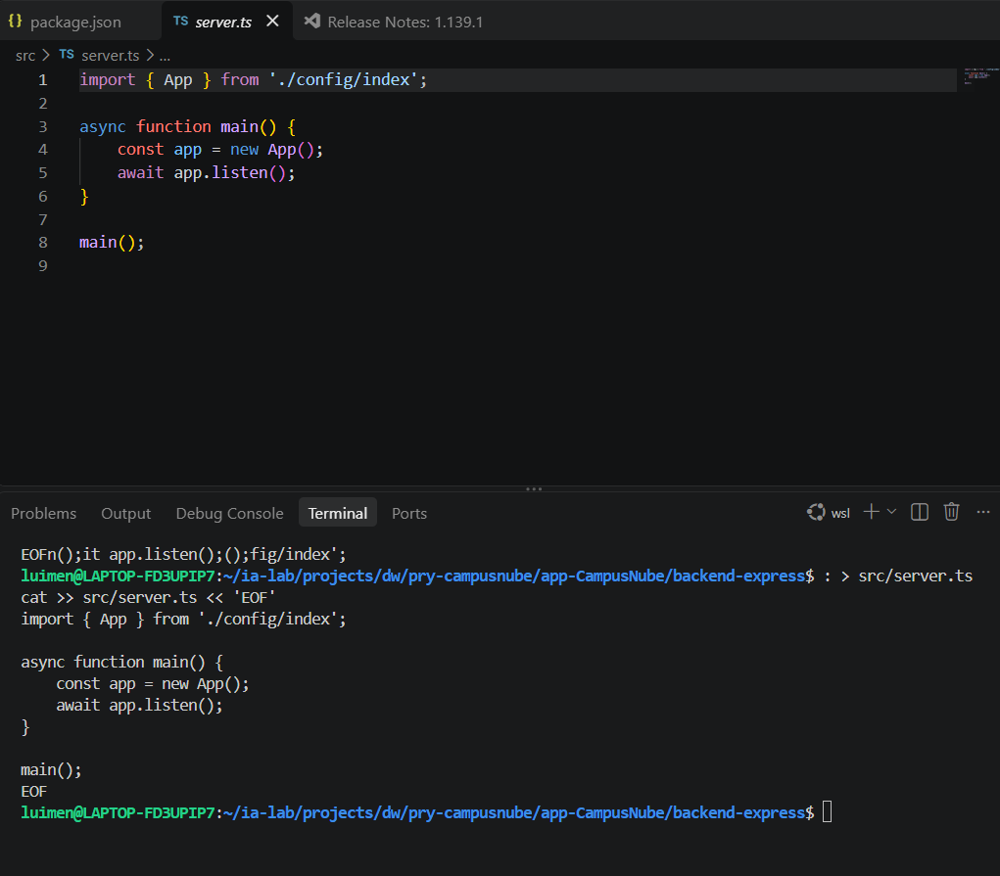

### 2.5.3 — Verificar los archivos creados

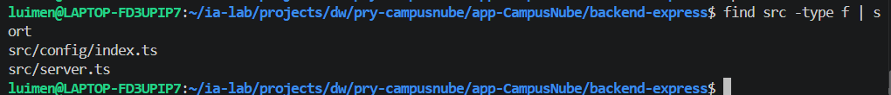

### 2.5.4 — Ejecutar el servidor

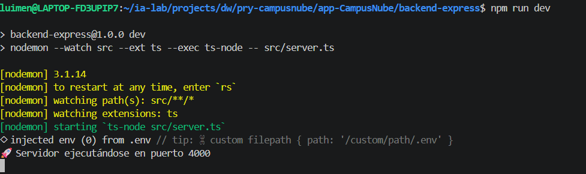

### Realizamos el primer commit

``` bash
git add .
git commit -m "ISS-01: Esqueleto del proyecto"
git push origin main
```

# 2. ISS-01 — Esqueleto del proyecto

**Objetivo:** proyecto npm + TypeScript + Express con estructura `features/` y servidor HTTP base.\
**Bloqueado por:** ISS-00.

### Criterios de aceptación (ISS-01) — consolidados

- [ ] **2.1** Existe `package.json` con `"type": "commonjs"` y scripts `build` / `dev`

  ### EVIDENCIA

  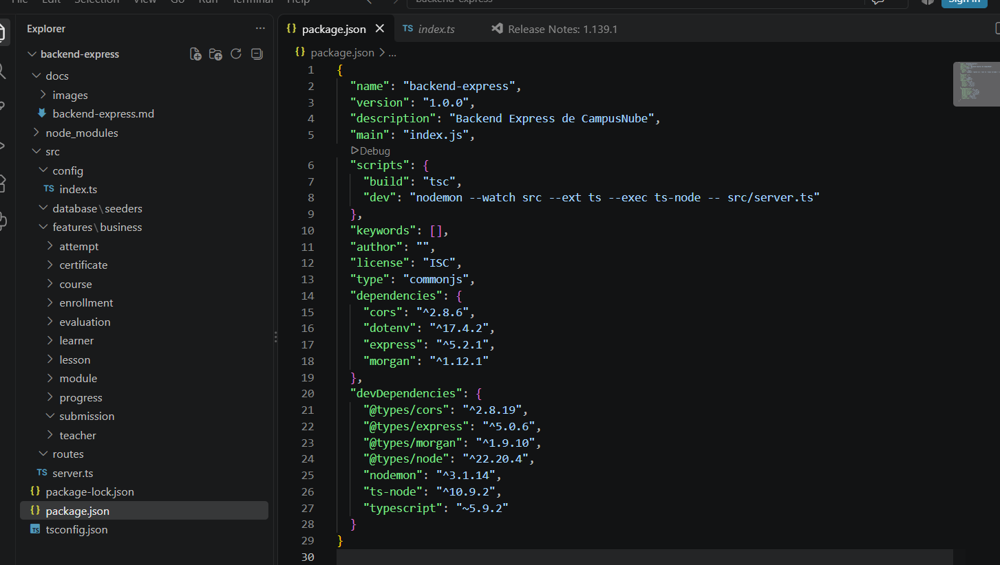

- [ ] **2.2** Árbol `src/` con `config`, `database/seeders`, `routes`, `features/business/`

  #### EVIDENCIA

  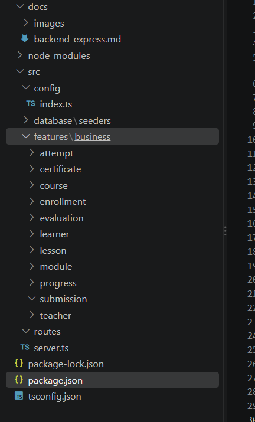

- [ ] **2.3** Dependencias Express/TS instaladas (`npm ls --depth=0`)

  #### EVIDENCIA

  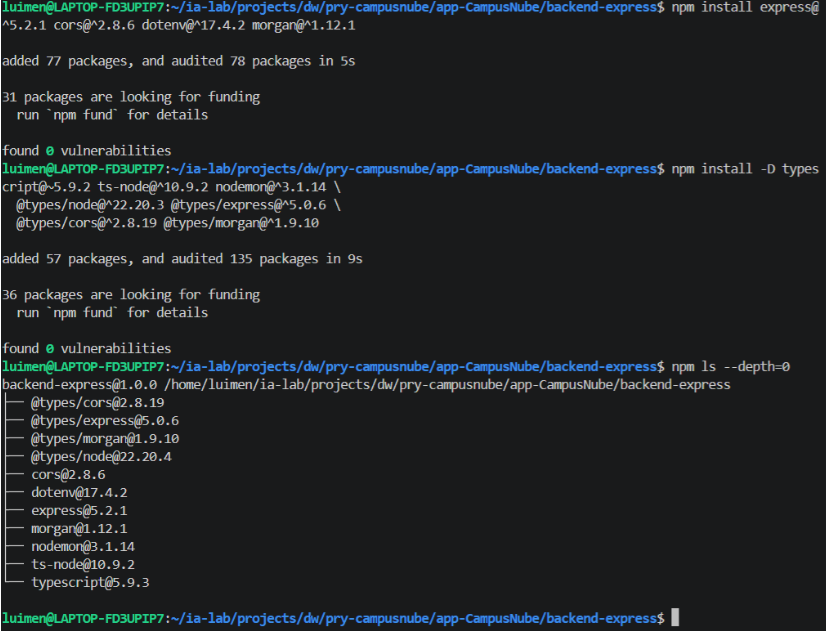

- [ ] **2.4** Existe `tsconfig.json` (`rootDir: ./src`, `outDir: ./dist`, `strict: true`)

  #### EVIDENCIA

  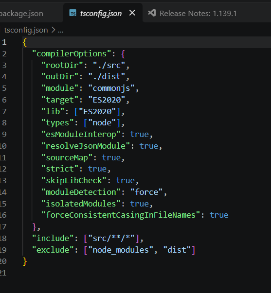

  **2.5** Existen `src/server.ts` y `src/config/index.ts` (esqueleto App)

  `npx tsc --noEmit` sin errores al cerrar el ISS

  ### EVIDENCIA `config/index.ts`

  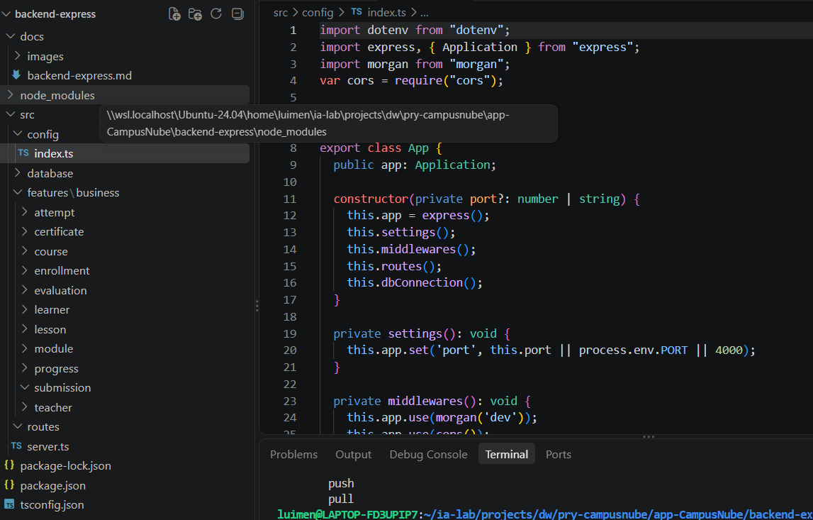

  ### EVIDENCIA `config/server.ts`

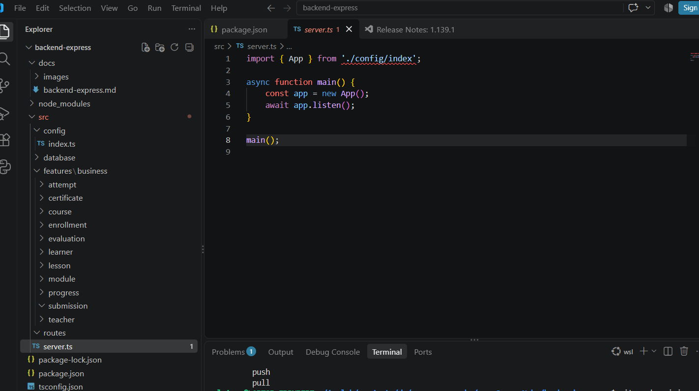

## 2.1 Inicializar npm y scripts

**Criterios de este sub-ítem**

- [x] `package.json` creado
- [x] Scripts `build` y `dev` definidos
- [x] **PARCHE** — `package.json` **ya existe** (lo creó `npm init -y`).

<!-- -->

- **Dentro de** `"scripts"`: deja solo (o añade) `build` y `dev` como abajo.
- **Debajo de** `"license"` (o al mismo nivel que `"scripts"`): asegúrate de `"type": "commonjs"`.

### EVIDENCIA

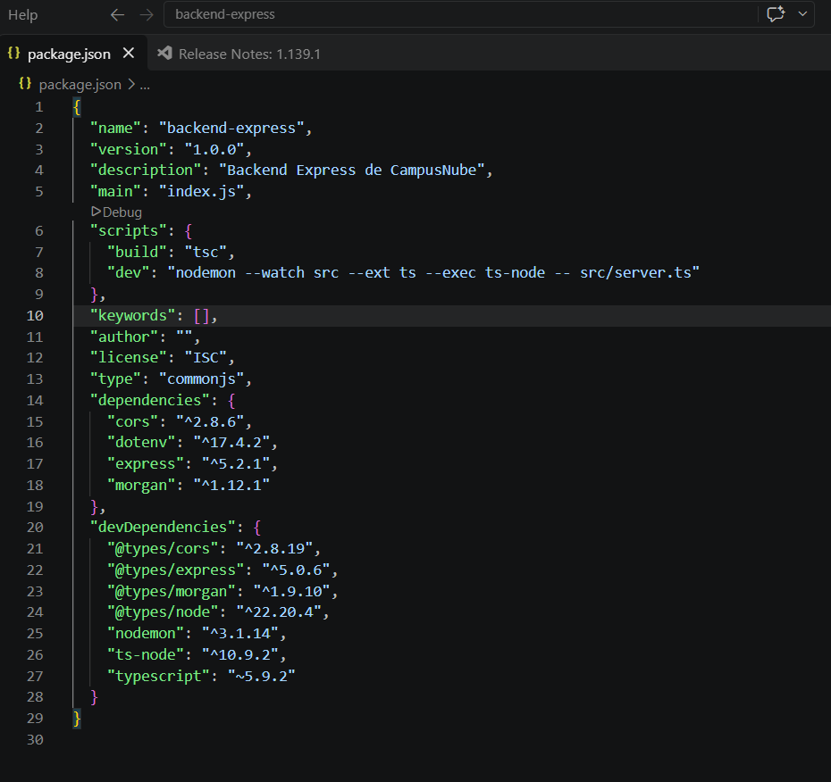

#### Verificación

``` bash
node -e "const p=require('./package.json'); console.log(p.scripts)"
```

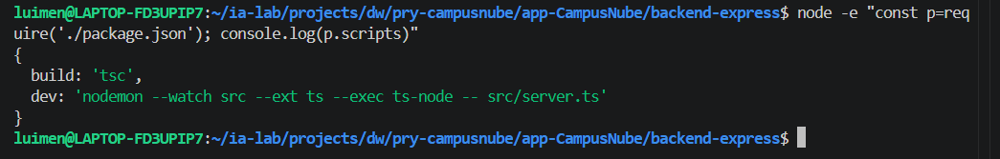

------------------------------------------------------------------------

## 2.2 Estructura de carpetas (features)

**Criterios de este sub-ítem**

- [x] Carpetas de infra y features creadas según el árbol

| Carpeta | Uso |
|----------------------------------------------|--------------------------|
| `features/business/<entidad>/` | model + controller + routes (+ seeder, swagger, http, associations) |
| `database/seeders/` | counts + SeedersRunner (`npm run db:seed`) |
| `routes/index.ts` | Agregador de features |
| `config/` · `database/` | Arranque e infraestructura |

**Seeders (patrón del lab)**

| Pieza | Dónde |
|------------------------------------|------------------------------------|
| Por entidad | `src/features/business/<entidad>/<entidad>.seeder.ts` |
| Runner + counts | `src/database/seeders/{index,counts}.ts` → `npm run db:seed` |
| Datos falsos | `@faker-js/faker` |

``` bash
find src -type d | sort
```

#### Evidencia

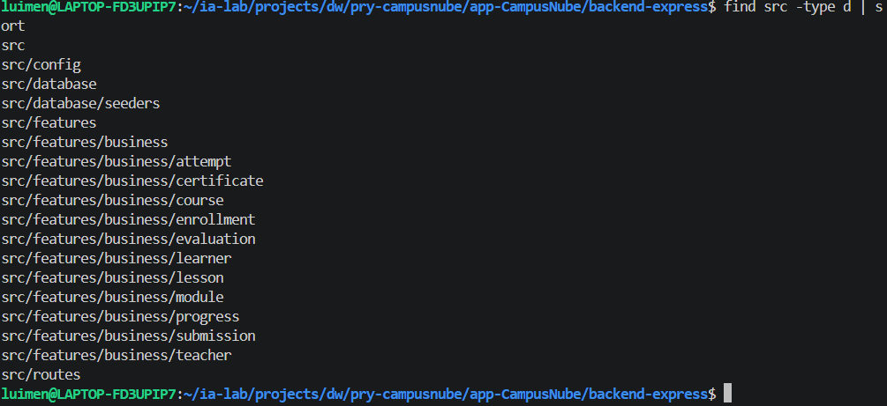

------------------------------------------------------------------------

## 2.3 Dependencias base (Express + TypeScript)

**Criterios de este sub-ítem**

- [x] `express`, `cors`, `dotenv`, `morgan` instalados
- [x] `typescript`, `ts-node`, `nodemon`, `@types/*` instalados

``` bash
npm install express@^5.2.1 cors@^2.8.6 dotenv@^17.4.2 morgan@^1.12.1  npm install -D typescript@~5.9.2 ts-node@^10.9.2 nodemon@^3.1.14 \   @types/node@^22.20.3 @types/express@^5.0.6 \   @types/cors@^2.8.19 @types/morgan@^1.9.10
```

> En este paso ya habíamos realizado este paso
>
> TypeScript en **5.9.x** por compatibilidad con `ts-node`.

``` bash
npm ls --depth=0
```

#### Evidencia

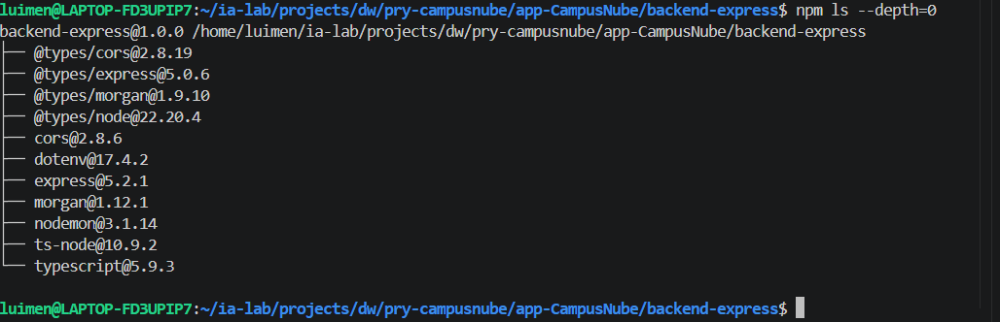

------------------------------------------------------------------------

## 2.4 TypeScript (`tsconfig.json`)

**Criterios de este sub-ítem**

- [x] `tsconfig.json` con `rootDir: ./src`, `outDir: ./dist`, `strict: true`

``` bash
Ya este pasó se realizó correctamente solo verificamos 
```

``` bash
test -f tsconfig.json && npx tsc --showConfig | head -20
```

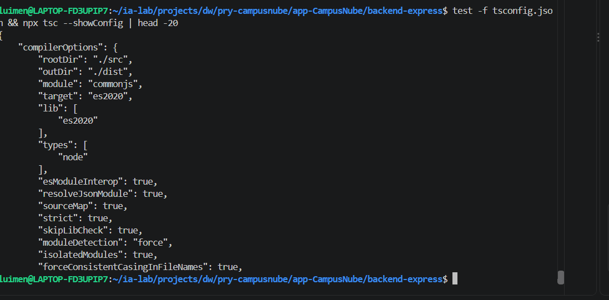

------------------------------------------------------------------------

## 2.5 Servidor y App (esqueleto HTTP)

**Criterios de este sub-ítem**

- [x] Existen `src/server.ts` y `src/config/index.ts`

  #### Evidencia `src/server.ts`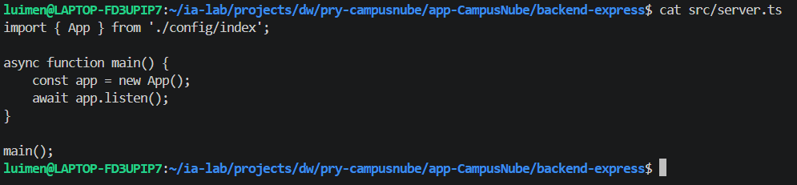

  #### Evidencia `src/config/index.ts`

  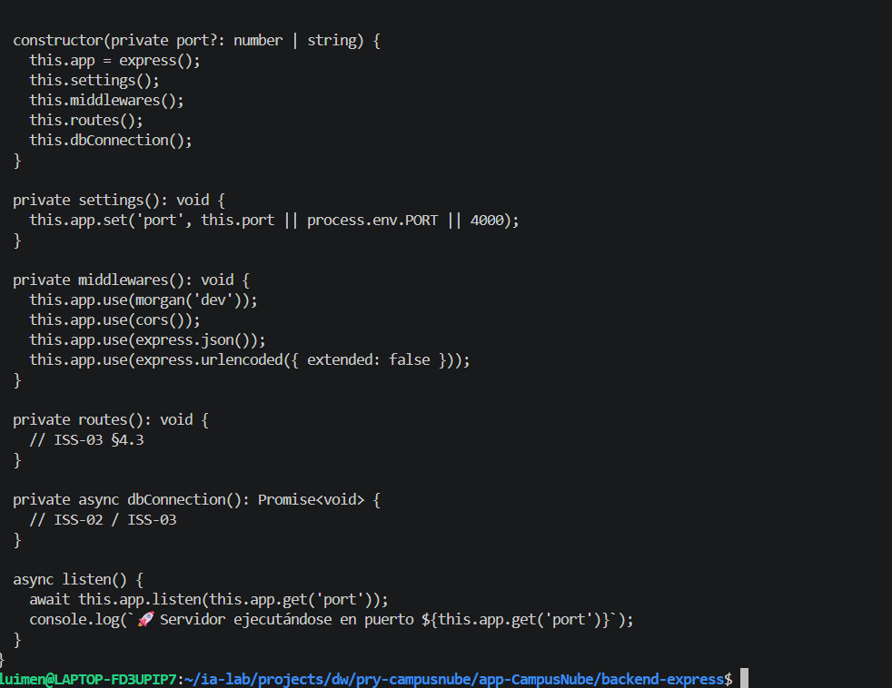

- [x] `App` define `settings`, `middlewares`, `routes`, `dbConnection`, `listen` (placeholders OK)

### Verificación del ISS-01

``` bash
npx tsc --noEmit find src -type f | sort
```

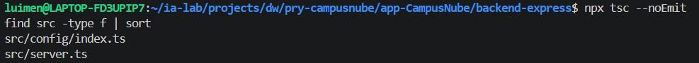

### Cierre del ISS

``` bash
npm run dev
```

> El servidor debe arrancar sin error. Detenerlo con Ctrl+C antes de continuar.
>
> 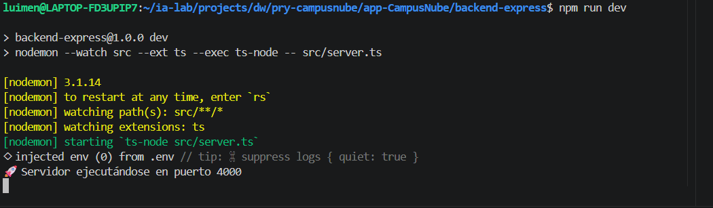

### Realizamos el commit

``` bash
git add . 
git commit -m "ISS-01: ISS-01: Inicializar npm y scripts" 
git push origin main
```

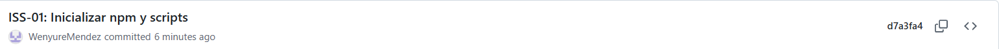{width="722"}

# 3. ISS-02 — Infraestructura de base de datos

**Objetivo:** drivers + `.env` + módulo Sequelize + carpeta `seeders/`.\
**Bloqueado por:** ISS-01.

### Criterios de aceptación (ISS-02) — consolidados

- [ ] **3.1** Paquetes Sequelize/drivers instalados; existe `.env` con `DB_ENGINE` y bloques de motores

  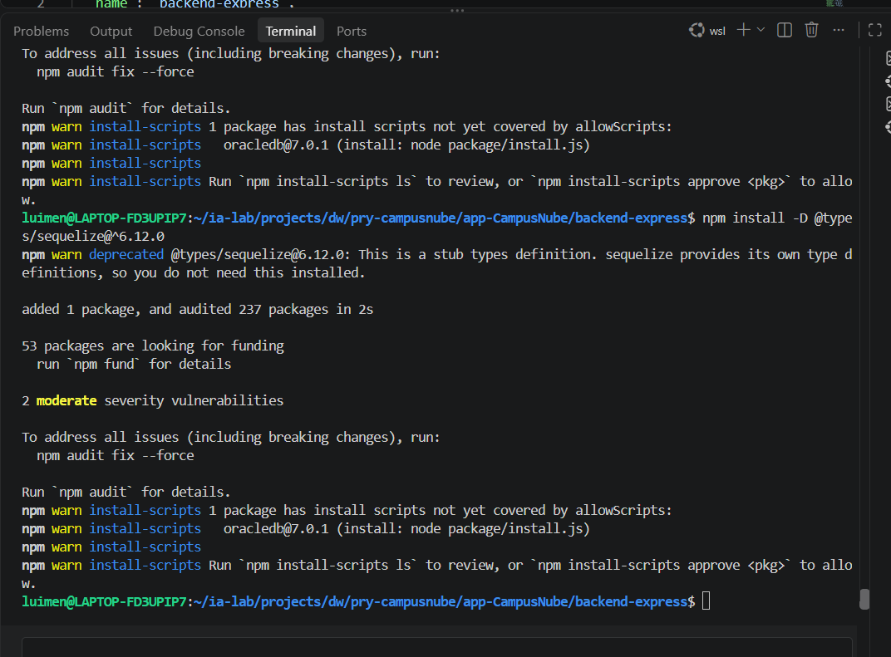

- [ ] **3.2** Existe `src/database/db.ts` exportando `sequelize`, `getDatabaseInfo`, `testConnection`

  Crear `src/database/db.ts`

  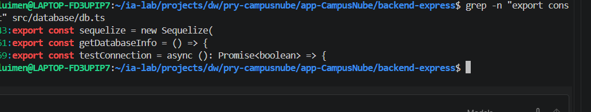

- [ ] **3.3** Existe carpeta `src/database/seeders/` **sin** lógica implementada aún

  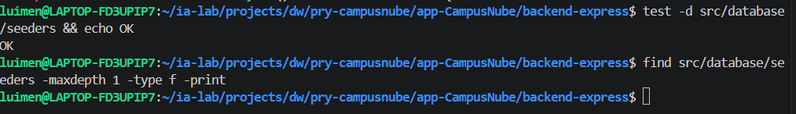

- [ ] `npx tsc --noEmit`

  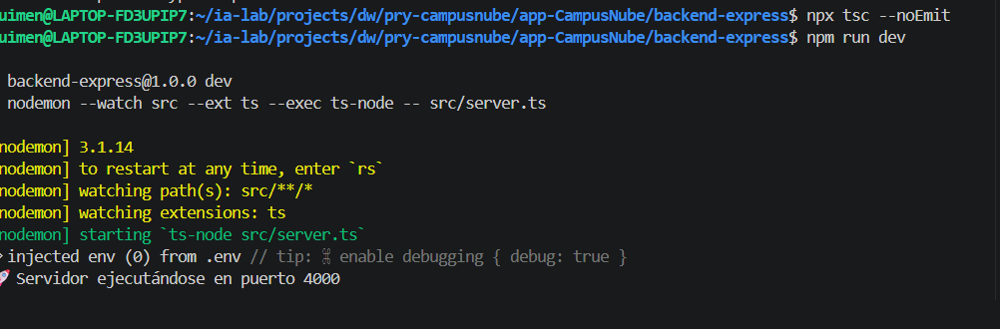

  ### Realizamos el commit

  ``` bash
  git add . 
  git commit -m "ISS-02: Infraestructura de base de datos"  
  git push origin main
  ```

  # 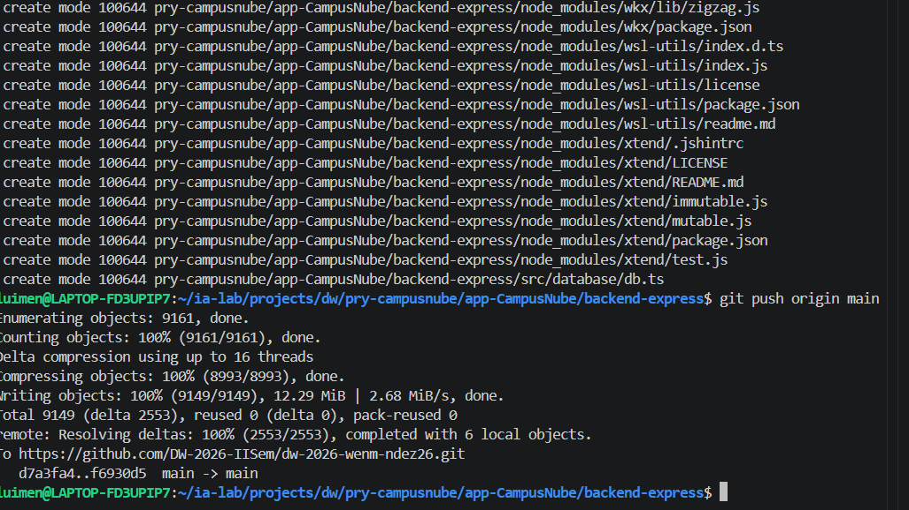

------------------------------------------------------------------------

## 3.1 Drivers Sequelize y `.env`

**Criterios de este sub-ítem**

- [x] `sequelize`, `mysql2`, `pg`, `pg-hstore`, `tedious`, `oracledb` instalados

- [x] `.env` con `PORT`, `DB_ENGINE`, MySQL/Postgres/MSSQL/Oracle

- [x] Instalar Sequelize y los drivers

  #### Evidencia

  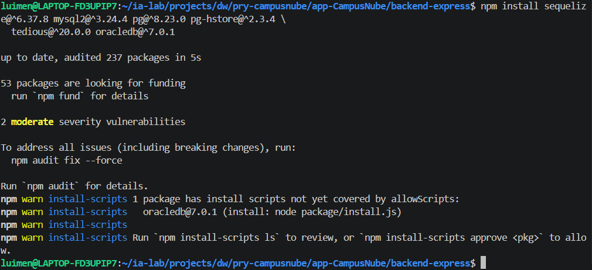

- [x] 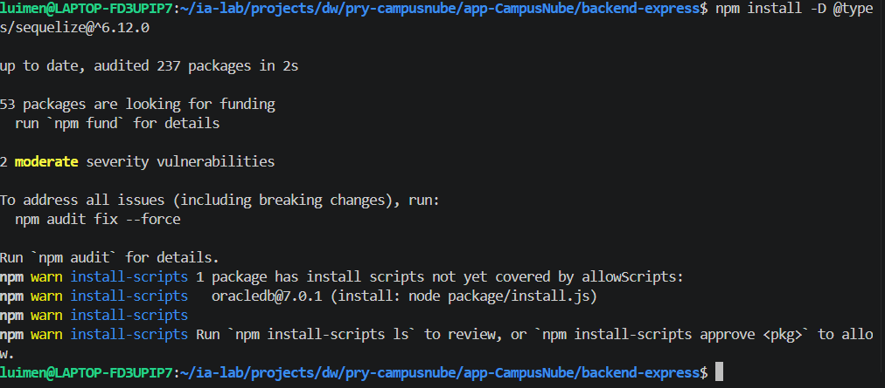

  #### Crear `.env` para CampusNube

  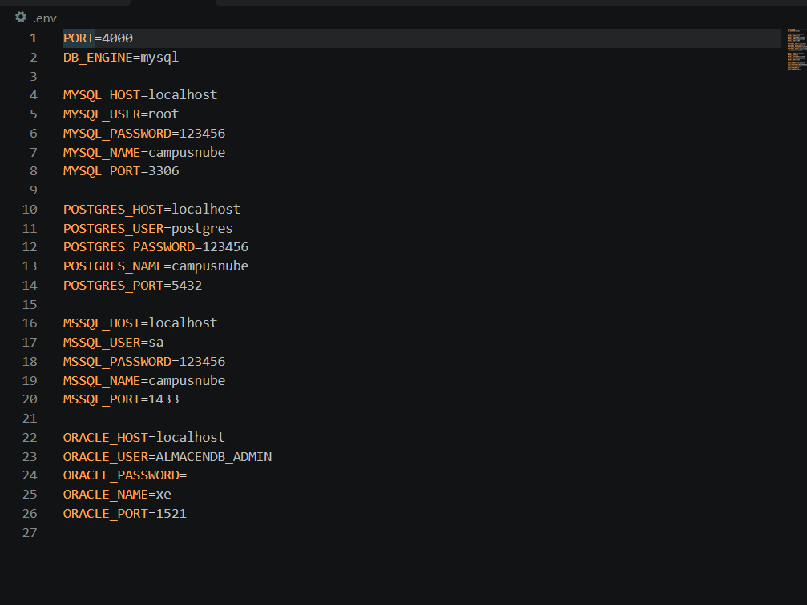

#### Verificar Sequelize y MySQL

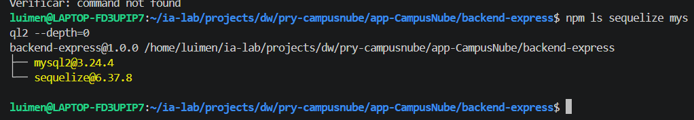

- ::: {}
  ### Realizamos el commit

  ``` bash
  git add . 
  git commit -m "ISS-02: Drivers Sequelize y .env"  
  git push origin main
  ```
  :::

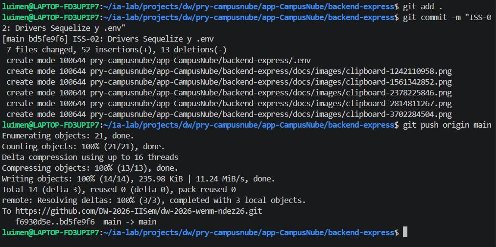

## 3.2 Configuración Sequelize (`database/db.ts`)

**Criterios de este sub-ítem**

- [ ] Archivo `src/database/db.ts` creado

  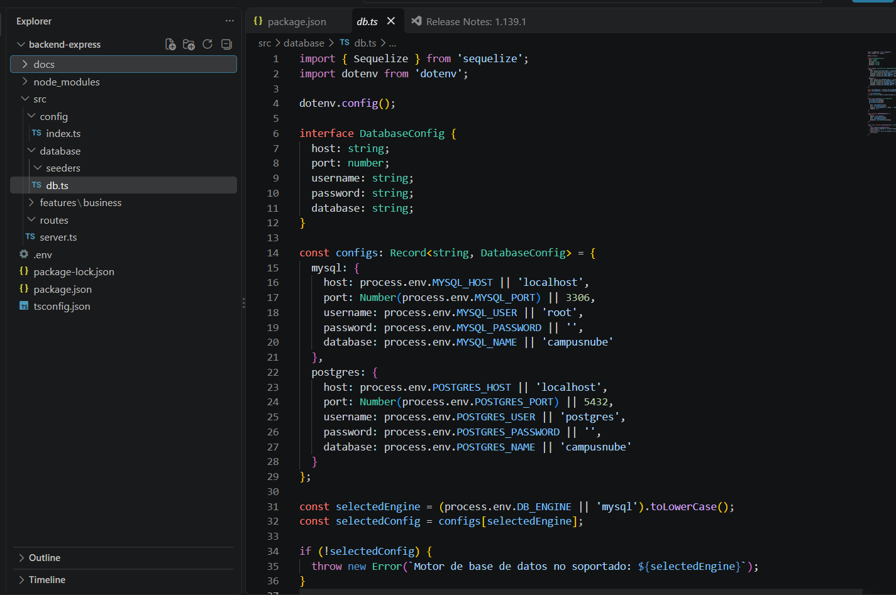

- [ ] Exporta `sequelize`, `getDatabaseInfo`, `testConnection`

``` bash
test -f src/database/db.ts && npx tsc --noEmit
```

- ::: {}
  ### Realizamos el commit

  ``` bash
  git add . 
  git commit -m "Configuración Sequelize (database/db.ts)"
  git push origin main
  ```
  :::

  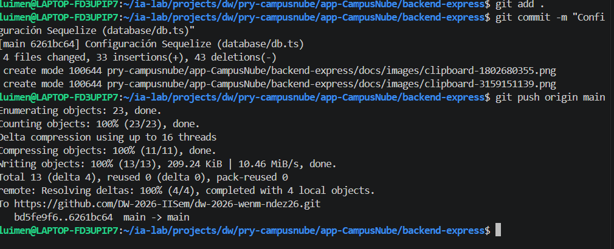

------------------------------------------------------------------------

## 3.3 Carpeta seeders (reservada)

**Criterios de este sub-ítem**

- [x] `src/database/seeders/` existe (la lógica llega en ISS-04)

  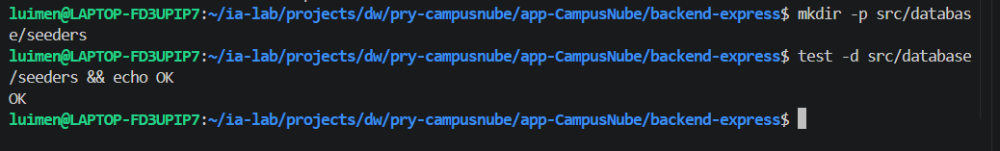

- [x] `src/database/seeders/` existe **sin** `*.seeder.ts` ni runner

  ### Verificación del ISS-02

``` bash
npx tsc --noEmit test -f src/database/db.ts && test -f .env && test -d src/database/seeders
```

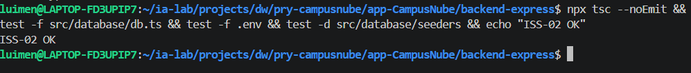

### Cierre del ISS

``` bash
npm run dev
```

> 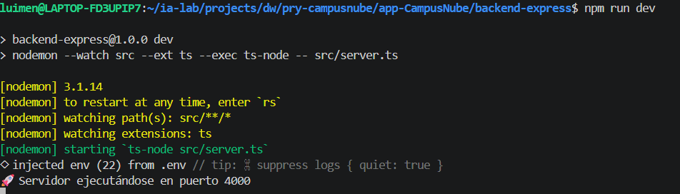
>
> El servidor debe arrancar sin error. Detenerlo con Ctrl+C antes de continuar.

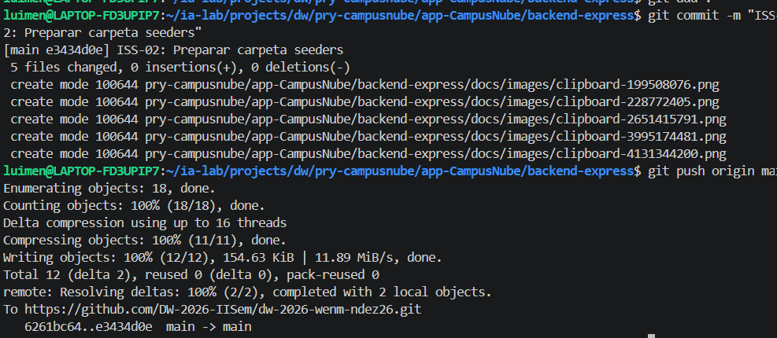

### Realizamos commit

``` bash
git add . 
git commit -m "ISS-02: Preparar carpeta seeders" 
git push origin main
```

# 4. ISS-03-A — Feature leaners — fundación (modelo, esqueleto, HTTP, cableado)

**Nombre recomendado:** *Feature Client — fundación*\
**Objetivo:** dejar el feature listo para CRUD: modelo con columnas obligatorias, esqueleto controller/routes, carpeta `http/`, agregador y sync.\
**Bloqueado por:** ISS-02.

## 4.1 Modelo learners

**Criterios**

- [x] `src/features/business/learners/leaner.model.ts`
- [x] Enum `active`/`inactive`, default `inactive`; `timestamps: true`

``` bash
npm install bcryptjs@^3.0.3
npm install -D @types/bcryptjs@^3.0.0
```

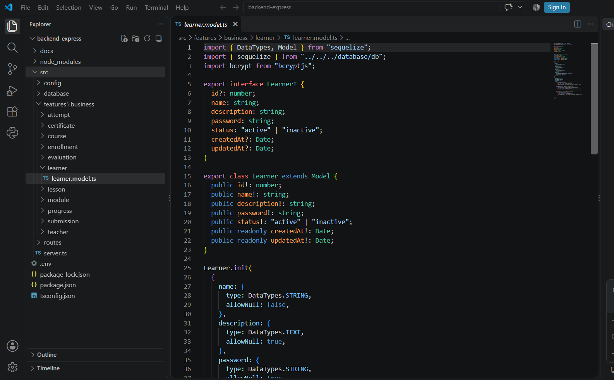

### Realizamos el commit

``` bash
git add . 
git commit -m "ISS-03-A: Modelo Learner" 
git push origin main
```

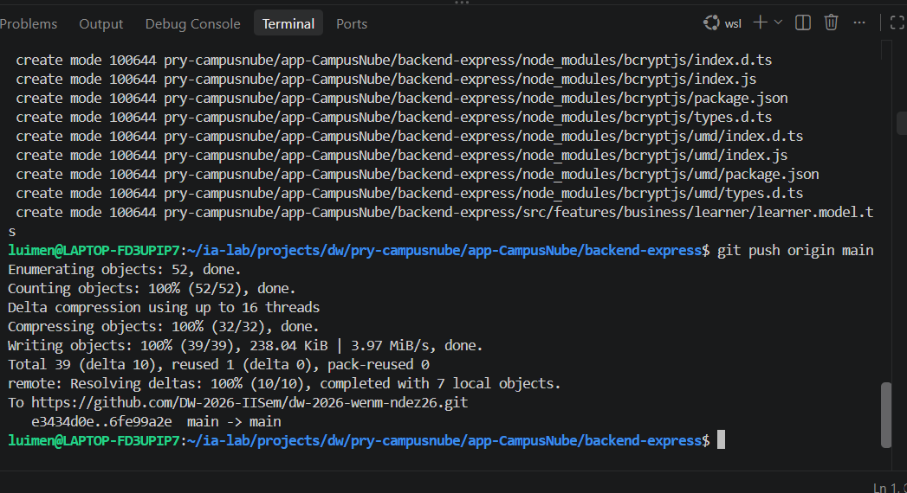

## 4.2 Esqueleto controller / routes + carpeta HTTP

**Criterios**

- [x] Archivos `leaner.controller.ts` y `leaner.routes.ts` existen (esqueleto)

``` bash
mkdir -p src/features/business/learner/http
```

> #### Evidencia `leaner.controller.ts`
>
> 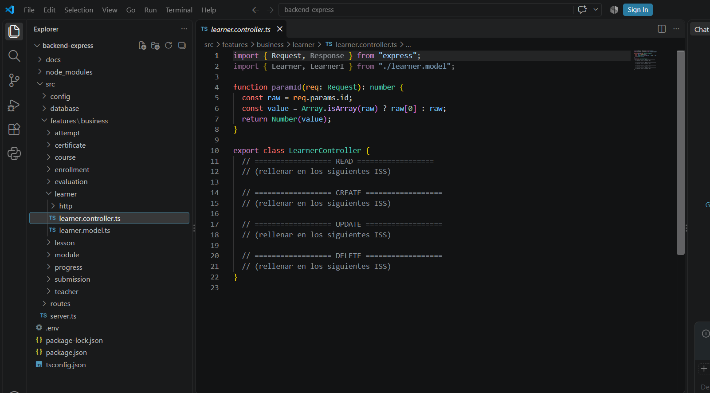
>
> > #### Evidencia `leaner.routes.ts`
>
> 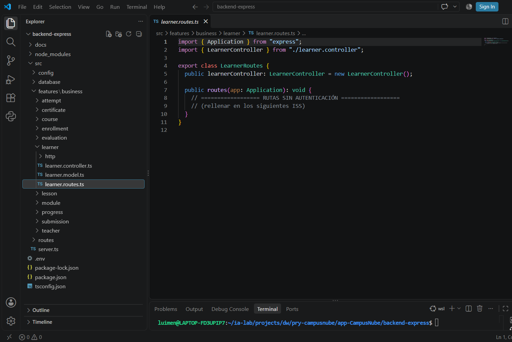
>
> ### Realizamos el commit
>
> ``` bash
> git add .  
> git commit -m "ISS-03-A: Esqueleto Controller y Routes de Learner" 
> git push origin main
> ```
>
> 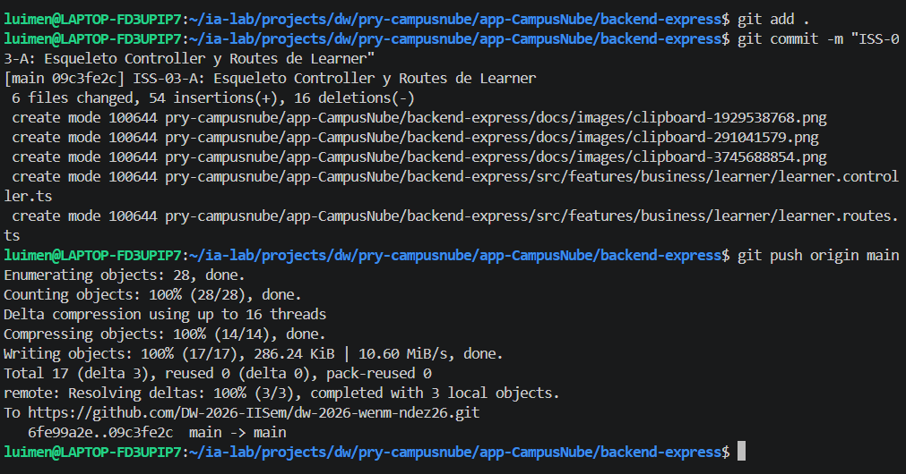
>
> ### 4.3 Agregador Routes + cableado en Config

**Criterios**

- [ ] `src/routes/index.ts` con `leanerRoutes`

  **Crear `src/routes/index.ts`**

  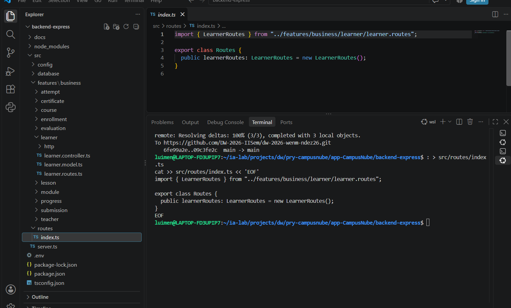

- [x] **PARCHE** — `src/config/index.ts` **ya existe** (ISS-01).

1.  **Debajo de** `var cors = require("cors");` **añadir**:

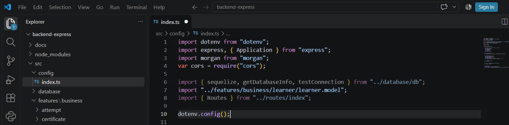

2.  **Dentro de** `export class App`, **debajo de** `public app: Application;` **añadir**:

``` ts
  public routePrv: Routes = new Routes();
```

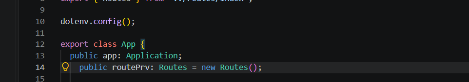

3.  **Dentro de** `routes()`, **reemplazar** el comentario `// ISS-03 §4.3` por:

``` ts
  this.routePrv.learnerRoutes.routes(this.app);
```

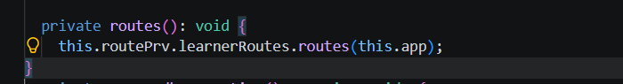

4.  **Dentro de** `dbConnection()`, **reemplazar** el comentario `// ISS-02 / ISS-03` por: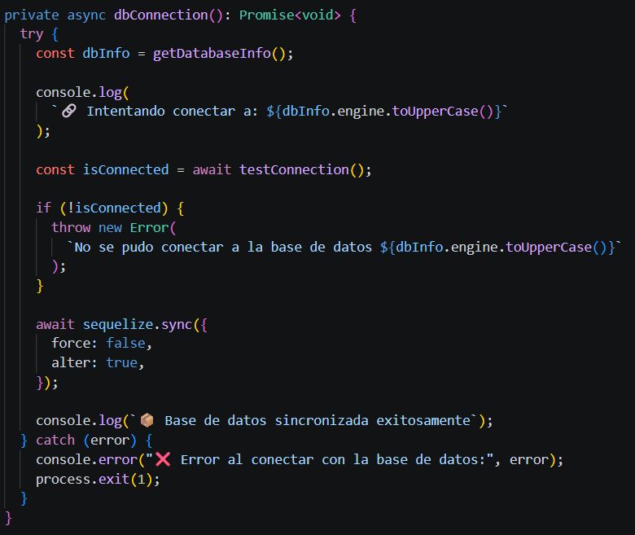

### Verificación ISS-03-A

``` bash
test -d src/features/business/learner/http && echo HTTP_FOLDER_OK
```


### Cierre del ISS

``` bash
npm run dev
```

> 

### Realizamos el commit

``` bash
git add .  
git commit -m "ISS-03-A: Agregador Routes + cableado en Config"  
git push origin main
```


# 5. ISS-03-B — Feature leaners — GetAll y GetOne

**Objetivo:** listar activos y obtener uno por id. Es el primer paso del feature: getAll, getOne, luego create, update y delete.\
**Bloqueado por:** ISS-03-A.

### Controller — **PARCHE** `leaner.controller.ts` (ya existe)

**Debajo de** el comentario `// ================== READ ==================` (y **encima de** `// ================== CREATE ==================`), **añadir** primero `getAll` y después `getOne`:


Rutas — **PARCHE** `learns.routes.ts` (ya existe)

### Realizamos el commit

``` bash
git add .   
git commit -m "ISS-03-B: Learner - Controller GetAll y GetOne"  
git push origin main
```

**Debajo de** el comentario `// ================== RUTAS SIN AUTENTICACIÓN / SIN MIDDLEWARE JWT ==================`, **añadir** primero `getAll` y después `getOne`:


### Realizamos el commit

``` bash
git add .   
git commit -m "ISS-03-B: Learner - Rutas GetAll y GetOne"  
git push origin main
```


### HTTP — archivo nuevo


### Verificación

``` bash
curl -s http://localhost:4000/api/aprendices
curl -s http://localhost:4000/api/aprendices/1
```


### Cierre del ISS

``` bash
npm run dev
```

> 

### Realizamos el commit

``` bash
git add .    
git commit -m "ISS-03-B: Learner - HTTP GetAll y GetOne"  
git push origin main
```


# 6. ISS-03-C — Feature learn— learn

**Objetivo:** alta de aprendiz vía API, después de getAll y getOne.\
**Bloqueado por:** ISS-03-B.

### Controller — **PARCHE** `leaner.controller.ts` (ya existe)

**Debajo de** el comentario `// ================== CREATE ==================` (y **encima de** `// ================== UPDATE ==================`), **añadir** el método `create`:Rutas — **PARCHE** `client.routes.ts` (ya existe)


### Realizamos el commit

``` bash
git add .     
git commit -m "ISS-03-C: Learner - Controller Create"  
git push origin main
```


**Debajo de** el bloque `// getOne`, **añadir**:

``` ts
    // create     app       .route("/api/clientes")       .post(this.clientController.create.bind(this.clientController));
```


### HTTP — archivo nuevo


### Verificación


### Cierre del ISS

``` bash
npm run dev
```

> 
>
> ### Realizamos el commit

``` bash
git add .     
git commit -m "ISS-03-C: Learner - Crear aprendiz vía API" 
git push origin main
```


# 7. ISS-03-D — Feature learn — Update (PUT) y Update (PATCH)

**Objetivo:** actualización completa y parcial.\
**Bloqueado por:** ISS-03-C.

### Controller — **PARCHE** `learn.controller.ts` (ya existe)

**Debajo de** el comentario `// ================== UPDATE ==================` (y **encima de** `// ================== DELETE ==================`), **añadir**:


> ### Realizamos el commit

``` bash
git add .     
git commit -m "ISS-03-D: Learner - Controller Update PUT y PATCH"
git push origin main
```


### Rutas — **PARCHE** `learns.routes.ts` (ya existe)

**Debajo de** el bloque `// create`, **añadir** PUT y PATCH:


> ### Realizamos el commit

``` bash
git add .      
git commit -m "ISS-03-D: Learner - Rutas Update PUT y PATCH"
git push origin main
```


### HTTP — archivo nuevo


### Verificación


### Cierre del ISS

``` bash
npm run dev
```


### Realizamos el commit

``` bash
git add .    
git commit -m "ISS-03-D: Learner - HTTP Update PUT y PATCH"
git push origin main
```


# 8. ISS-03-E — controller: eliminación física y lógica

**Objetivo:** borrado físico (`DELETE`) y lógico (`status = 'inactive'`).\
**Bloqueado por:** ISS-03-D.

### Controller — **PARCHE** `client.controller.ts` (ya existe)

**Debajo de** el comentario `// ================== DELETE ==================`, **añadir** primero el borrado físico y después el lógico:


ELIMINACIÓN LÓGICA


### Realizamos el commit

``` bash
git add .     
git commit -m "ISS-03-E: Learner - Controller Delete físico y lógico" 
git push origin main
```


### Rutas — **PARCHE** `client.routes.ts` (ya existe)

1.  **Debajo de** el bloque `// update (PUT / PATCH)`, **añadir** el borrado físico
2.  **Debajo de** ese bloque, **añadir** la baja lógica:


### Realizamos el commit

``` bash
git add .      
git commit -m "ISS-03-E: Learner - Rutas Delete físico y lógico"
git push origin main
```


### **HTTP — archivo nuevo**


### Verificación

``` bash
curl -i -X PATCH http://localhost:4000/api/aprendices/1/deactivate
curl -i http://localhost:4000/api/aprendices
```


### Cierre del ISS

``` bash
npm run dev
```

> 

### Realizamos el commit

``` bash
git add .    
git commit -m "ISS-03-E: Learner - HTTP Delete físico y lógico"
git push origin main
```


# 9. ISS-04 — Seeders con Faker

**Objetivo:** datos falsos por feature (Faker) y un orquestador externo que ejecuta todos los seeders enviando la **cantidad por entidad**.\
**Bloqueado por:** ISS-03-A (modelo); recomendado tras ISS-03-E.

**Diseño**

| Pieza | Ubicación | Rol |
|---------------------|--------------------------------|-------------------|
| Seeder del feature | `src/features/business/leanrs/client.seeder.ts` | Genera filas falsas de learns |
| Conteos | `src/database/seeders/counts.ts` | `learns: N` (y futuras entidades) |
| Runner | `src/database/seeders/index.ts` | Importa seeders de features y los ejecuta en orden |

------------------------------------------------------------------------

## 9.1 Seeder dentro del feature learns

**Criterios**

``` bash
npm install -D @faker-js/faker@^10.6.0
```

``` bash
Instalar Faker
```


------------------------------------------------------------------------

## 9.2 SeedersRunner + conteos por entidad (`database/seeders`)

## **Creamos el seders.learns**


### Realizamos el commit

``` bash
git add .  
git commit -m "ISS-04: Learner - Seeder con Faker"
git push origin main
```


### 9.2.1 Conteos


### Realizamos el commit

``` bash
git add .   
git commit -m "ISS-04: Learner - Configuración de cantidad del seeder"
git push origin main
```


### 9.2.2 Runner


### **PARCHE** — `package.json` **ya existe**.

**Dentro de** `"scripts"`, **debajo de** `"dev": "..."`, **añadir** la coma al final de `dev` (si falta) y la clave:


#### **Verificación ISS-04**

``` bash
npm run db:seed
```

**Al agregar otra entidad (patrón):**

1.  Archivo **nuevo** `features/.../<entidad>.seeder.ts` con `: >` + `cat >>`.
2.  **PARCHE** `counts.ts`: **dentro de** `SeedCounts` / defaults, **añadir** clave (ej. `products: 10`).
3.  **PARCHE** `database/seeders/index.ts`: **debajo de** `await seedClients(...)`, **añadir** la llamada al nuevo seeder.


### Realizamos el commit

``` bash
git add .    
git commit -m "ISS-04: Learner - SeedersRunner"
git push origin main
```


# 10. ISS-05 — leaner-Swagger / OpenAPI

**Objetivo:** documentar el API del feature leaner en OpenAPI 3 y montar Swagger UI desde un **registry externo** (mismo patrón que seeders).\
**Bloqueado por:** ISS-03-E (rutas CRUD definidas).

**Diseño**

| Pieza | Ubicación | Rol |
|---------------------|--------------------------------|-------------------|
| Docs del feature | `src/features/business/learn/leaner.swagger.ts` | Paths + schemas Leaner |
| Registry | `src/swagger/index.ts` | Fusiona features + `setupSwagger(app)` |
| UI | `/api/docs` | Swagger UI |
| Spec | `/api/docs.json` | OpenAPI JSON |

------------------------------------------------------------------------

## 10.1 OpenAPI dentro del feature Leaner

**Criterios**

- [ ] Exporta `clientSwagger` con `tags`, `paths`, `components.schemas`
- [ ] Endpoints documentados como **SIN AUTH**
- [ ]

``` bash
# Paquetes (una vez) npm install swagger-ui-express@^5.0.1
npm install -D @types/swagger-ui-express@^4.1.8
```


#### creamos learner.swagger.ts:


### Realizamos el commit

``` bash
git add .     
git commit -m "ISS-05: Learner - Documentación OpenAPI"
git push origin main
```


## 10.2 Registry externo + montaje en Config

**Criterios**

``` bash
CREAMOS Registry Swagger
mkdir -p src/swagger
```

### Archivo **nuevo**:


**PARCHE** — `src/config/index.ts` **ya existe**.

1.  **Debajo de** `import { Routes } from "../routes/index";` (o **debajo de** los imports de BD/modelo), **añadir**:

    

2.  **Dentro del** `constructor`, **debajo de** `this.routes();` y **encima de** `this.dbConnection();`, **añadir**:


3.  **Dentro de** la clase `App`, **debajo de** el método `routes()` y **encima de** `dbConnection()`, **añadir**:


### Verificación ISS-05

``` bash
curl -s http://localhost:4000/api/docs.json | head
```

> Con el servidor del cierre: abrir [`http://localhost:4000/api/docs`](http://localhost:4000/api/docs).


### Cierre del ISS

``` bash
npm run dev
```

> 

### Realizamos el commit

``` bash
git add .     
git commit -m "ISS-05: Learner - Registry Swagger y montaje en Config" 
git push origin main
```


# 11. ISS-06 — Modelo Teacher

**Objetivo:** CRUD + seeder + swagger de Teacher (sin FK).\
**Bloqueado por:** ISS-05.\
**API:** `/api/tipos-producto` — **SIN AUTH**.\
**Patrón:** mismo que Client (ISS-03-A…E + 04 + 05).

## 11.1 Modelo Teacher

``` bash
mkdir -p src/features/business/Teacher/http
```


### Realizamos el commit

``` bash
git add .    
git commit -m "ISS-06: Teacher - Modelo"
git push origin main
```


## 11.2 Teacher Controller + routes (CRUD completo)


### 11.2.1 crear teacher routers


### Realizamos el commit

``` bash
git add .   
git commit -m "ISS-06: Teacher - Controller y Routes CRUD"
git push origin main
```


## 11.3 HTTP TEACHER

### 1. GET TEACHER


### 2. CREATE TEACHER


### 3. UPDATE TECAHER


### 4. DELETE TEACHER

### 

### VERIFICAMOS

``` bash
npm run dev 
curl -i http://localhost:4000/api/docentes
curl -i http://localhost:4000/api/docentes/1
```


### Realizamos el commit

``` bash
git add .    
git commit -m "ISS-06: Teacher - Archivos HTTP CRUD" 
git push origin main
```


### 11.4 Cableado Routes + Config

**PARCHE** — `src/routes/index.ts` **ya existe**.


**PARCHE** — `src/config/index.ts` **ya existe**.

4.  **Dentro de** `routes()`, **debajo de** `this.routePrv.clientRoutes.routes(this.app);`, **añadir**:

    

### Verificación

``` bash
curl -s -X POST http://localhost:4000/api/docentes \
  -H 'Content-Type: application/json' \
  -d '{"name":"Carlos Rodríguez","description":"Docente de CampusNube","isActive":true}'
curl -s http://localhost:4000/api/docentes
```


### Realizamos el commit

``` bash
git add .   
git commit -m "ISS-06: Teacher - Cableado Routes y Config"
git push origin main
```


------------------------------------------------------------------------

## 11.5 Seeder Teacher


**PARCHE** — `src/database/seeders/counts.ts` **ya existe**.

- **Dentro de** `SeedCounts`, **añadir** `product_types: number;`

  

- **Dentro de** `DEFAULT_SEED_COUNTS`, **añadir** `product_types: 25,`

  

- **Dentro de** la resolución por env, **añadir** lectura de `SEED_PRODUCT_TYPES` (ver archivo final abajo en ISS-08 si consolidás).


**PARCHE** — `src/database/seeders/index.ts` **ya existe**.

1.  **Debajo de** imports de client, **añadir** import de `seedProductTypes`.

    

2.  **Debajo de** `await seedClients(...)`, **añadir** `await`

    

------------------------------------------------------------------------

### Realizamos el commit

``` bash
git add .   
git commit -m "ISS-06: Teacher - Seeder y SeedersRunner"
git push origin main
```


## 11.6 Swagger Teacher


**PARCHE** — `src/swagger/index.ts` **ya existe**.

1.  **Debajo de** `import { leanerSwagger } ...`, **añadir** import de `productTypeSwagger`.

    

2.  **Dentro de** `featureSwaggerModules`, **debajo de** `leanerSwagger,`, **añadir** `teacherpeSwagger,`.


### Cierre del ISS

``` bash
npm run dev
```


### Realizamos el commit

``` bash
git add .    
git commit -m "ISS-06: Teacher - Seeder y Swagger"
git push origin main
```


# 12. ISS-07 — Modelo Course

### **Objetivo:** CRUD + seeder + swagger de Course y preparación de sus relaciones con las demás entidades de CampusNube. **Bloqueado por:** ISS-06. **API:** `/api/cursos` — **SIN AUTH**.

### 12.1 Modelo Course

Primero creamos la carpeta HTTP.

mkdir -p src/features/business/course/http


### Realizamos el commit

``` bash
git add .  
git commit -m "ISS-07: Course - Modelo"
git push origin main
```


### 12.2.1 Crear Course Controller


## 12.2.2 Crear Course Routes


### Realizamos el commit

``` bash
git add .   
git commit -m "ISS-07: Course - Controller y Routes CRUD"
git push origin main
```


# 12.3 HTTP COURSE

Vamos a crear cuatro archivos:

src/features/business/course/http/

- courses.get.http

- courses.create.http

- courses.update.http

- courses.delete.http

### 12.3.1 GET COURSE


### 12.3.2 CREATE COURSE


### 12.3.3 UPDATE COURSE


### 12.3.4 DELETE COURSE


# VERIFICAMOS

Primero:

``` bash
npx tsc --noEmit
```

Luego arrancamos

``` bash
npm run dev
```


### Realizamos el commit

``` bash
git add .    
git commit -m "ISS-07: Course - Archivos HTTP CRUD"
git push origin main
```


# 12.4 Cableado Routes + Config

**Objetivo:** conectar `Course` con el agregador de rutas y con la configuración principal de Express.

## 12.4.1 `src/routes/index.ts`

Este archivo **ya existe**, por lo tanto hacemos **PARCHE**.

1.  **Debajo de** `import { teacherSwagger } ...`, **añadir** import de `coursepeSwagger`.


2.  **Debajo de** `class { teacherSwagger } ...`, **añadir** import de `coursepeSwagger`.


## 12.4.2 `src/config/index.ts`

Ahora abre:

```         
src/config/index.ts
```

Busca los imports de los modelos.


### Modficamos `routes()`


### 12.4.4 Levantamos el servidor

### 

### Realizamos el commit

``` bash
git add .   
git commit -m "ISS-07: Course - Cableado Routes y Config"
git push origin main
```


# 12.5 Relación Teacher ↔ Course

**Objetivo:** implementar la relación N:M entre `Teacher` y `Course`.

**Relación:**

```         
Teacher N:M Course
```

**Tabla intermedia:**

```         
teacher_courses
```

**FK:**

```         
teacher_id course_id
```

## 12.5.1 Crear archivo de asociaciones

Creamos el archivo nuevo:


# 12.5.2 Cargar las asociaciones

Ahora debemos hacer el mismo tipo de **PARCHE en `config/index.ts`**


# 12.5.3 Verificar TypeScript

Guarda todo y ejecuta:

```         
npx tsc --noEmit
```

# 12.5.4 Verificar que Sequelize cree la relación

Ahora arrancamos:

```         
npm run dev
```


#### 12.5.5 Verificar la tabla en MySQL


### Realizamos el commit

``` bash
git add .   
git commit -m "ISS-07: Course - Relacion Teacher y Course"
git push origin main
```


# 12.6 Seeder + Swagger — Course

**Objetivo:** generar datos falsos de `Course` de forma idempotente y documentar `/api/cursos` en Swagger.

**API:** `/api/cursos` — **SIN AUTH**.

## 12.6.1 Crear Course Seeder

vamos a crear **solo el archivo del seeder**.


## 12.6.2 Verificar el archivo

Ejecuta:

```         
npx tsc --noEmit
```


## 2.6.3 Ahora conectar Course al SeedersRunner

Aquí hacemos el parche sobre **el archivo que ya existe**

### Agrega Course DEBAJO de Teacher


Debajo de:

```         
teachers: number; y 
Course: number;
```


Dentro del `SeedersRunner`

```         
await seedTeachers(counts.teachers);
```

**Debajo de esa línea**, agrega:

```         
await seedCourses(counts.courses);
```


Si `npm run dev` está ejecutándose


### Comprobar en DBeaver


### Realizamos el commit

``` bash
git add .   
git commit -m "ISS-07: Course - Seeder y SeedersRunner"
git push origin main
```


# 12.7 — Swagger de Course

El objetivo es documentar el CRUD de **Course** dentro de Swagger, igual que hicimos con las demás entidades.

## 12.7.1 — Crear `course.swagger.ts`

Primero creamos el archivo:


### Verificamos

Guardamos el archivo y ejecutamos:

```         
npx tsc --noEmit
```

## 12.7.2 — Agregar Course al registro central

Vamos a modificar **solamente**:

```         
src/swagger/index.ts
```

### Abrir el archivo

```         
code src/swagger/index.ts
```

Busca exactamente esta línea:

```         
import { learnerSwagger } from "../features/business/learner/learner.swagger";
```

Y debajo de ella agrega:

```         
import { courseSwagger } from "../features/business/course/course.swagger";
```


### Agregar Course al registro

Ahora buscamos exactamente este bloque:

```         
const featureSwaggerModules: FeatureSwaggerModule[] = [   learnerSwagger, ];
```

Reemplázalo **solamente por**:

```         
const featureSwaggerModules: FeatureSwaggerModule[] = [   learnerSwagger,   courseSwagger, ];
```


### Levantar el servidor

```         
npm run dev
```


## Verificar Swagger


### Realizamos el commit

``` bash
git add .  
git commit -m "ISS-07: Course - Swagger"
git push origin main
```


# 13. ISS-08 — Feature Enrollment + relaciones de aprendizaje

**Objetivo:** implementar el proceso de **Inscripción (Enrollment)** de CampusNube y las relaciones que dependen de ella, manteniendo la estructura metodológica del ISS-08 del profesor.

**Bloqueado por:** ISS-07 — Course.

**API:** `/api/inscripciones` — **SIN AUTH**.

# 13.1 — Modelo Enrollment

Primero creamos la carpeta `enrollment` si no existe:

```         
mkdir -p src/features/business/enrollment/http
```

Ahora creamos el modelo:

```         
: > src/features/business/enrollment/enrollment.model.ts
```


### Realizamos el commit

``` bash
git add .   
git commit -m "ISS-08: Enrollment - Modelo"
git push origin main
```


# 13.2 — Enrollment Controller + CRUD completo

Primero vamos a crear el controller siguiendo el mismo orden que hemos usado en las entidades anteriores:

1.  `getAll`

2.  `getOne`

3.  `create`

4.  `update` — PUT

5.  `patch` — PATCH

6.  `delete` físico

7.  `deactivate` — eliminación lógica

Creamos

```         
: > src/features/business/enrollment/enrollment.controller.ts
```


### 13.2.2 Crear Enrollment Routes


## Verificamos


### Realizamos el commit

``` bash
git add .  
git commit -m "ISS-08: Enrollment - Controller y Routes CRUD"
git push origin main
```


# 13.3 HTTP ENROLLMENT

Vamos a crear los mismos **cuatro archivos HTTP** que utilizaste para Course:

```         
src/features/business/enrollment/http/
├── enrollments.get.http 
├── enrollments.create.http
├── enrollments.update.http
└── enrollments.delete.http
```

## 13.3.1 GET ENROLLMENT

Primero creamos el archivo:

```         
: > src/features/business/enrollment/http/enrollments.get.http
```


## 13.3.2 CREATE ENROLLMENT

Crea:

```         
: > src/features/business/enrollment/http/enrollments.create.http
```


## 13.3.3 UPDATE ENROLLMENT

Crea:

```         
: > src/features/business/enrollment/http/enrollments.update.http
```


## 13.3.4 DELETE ENROLLMENT

Crea:

```         
: > src/features/business/enrollment/http/enrollments.delete.http
```


# VERIFICAMOS

Primero detén el servidor si está ejecutándose con `Ctrl + C`.

Después:

```         
npx tsc --noEmit
```

Si está limpio, arrancamos:

```         
npm run dev
```


### Realizamos el commit

``` bash
git add . 
git commit -m "ISS-08: Enrollment - Archivos HTTP CRUD"
git push origin main
```


# 13.4 Cableado Routes + Config

**Objetivo:** conectar `Enrollment` con el agregador de rutas y con la configuración principal de Express.

## 13.4.1 `src/routes/index.ts`

Este archivo **ya existe**, por lo tanto hacemos **PARCHE**.

Abrimos:

```         
code src/routes/index.ts
```

### 1. Debajo de:

```         
import { CourseRoutes } from "../features/business/course/course.routes";
```

**añadir:**

```         
import { EnrollmentRoutes } from "../features/business/enrollment/enrollment.routes";
```


### 2. Dentro de la clase `Routes`

Debajo de:

```         
public courseRoutes: CourseRoutes = new CourseRoutes();
```

**añadir:**

```         
public enrollmentRoutes: EnrollmentRoutes = new EnrollmentRoutes();
```


# 13.4.2 `src/config/index.ts`

Ahora abrimos:

```         
code src/config/index.ts
```

Aquí también hacemos **PARCHE**.

### 1. Imports del modelo

Buscamos:

```         
import "../features/business/course/course.model";
```

**Debajo de esa línea**, añade:

```         
import "../features/business/enrollment/enrollment.model";
```


### 3. Modificar `routes()`

Busca en `src/config/index.ts`:

```         
private routes(): void {   this.routePrv.learnerRoutes.routes(this.app);   this.routePrv.teacherRoutes.routes(this.app);   this.routePrv.courseRoutes.routes(this.app); }
```

**Debajo de:**

```         
this.routePrv.courseRoutes.routes(this.app);
```

añade:

```         
this.routePrv.enrollmentRoutes.routes(this.app);
```


# Verificamos

Primero:

```         
npx tsc --noEmit
```

Si está limpio, arrancamos:

```         
npm run dev
```


### Realizamos el commit

``` bash
git add .  
}git commit -m "ISS-08: Enrollment - Cableado Routes y Config"
git push origin main
```


# 13.5 Relaciones Enrollment

Aquí vamos a implementar la relación de **Enrollment con Learner y Course**, que es una parte fundamental de esta entidad.

La estructura será:

```         
Learner 1:N Enrollment Course  1:N Enrollment
```

## 13.5.1 Crear `enrollment.associations.ts`

Ejecuta:

```         
: > src/features/business/enrollment/enrollment.associations.ts
```


# 13.5.2 Cablear las asociaciones en Config

Ahora abrimos:

```         
code src/config/index.ts
```

Busca esta línea que agregamos anteriormente:

```         
import "../features/business/enrollment/enrollment.model";
```

**Debajo de esa línea**, añade:

```         
import "../features/business/enrollment/enrollment.associations";
```


# Verificamos

Guarda todo y ejecuta:

```         
npx tsc --noEmit
```

Si queda limpio, levantamos:

```         
npm run dev
```


### Realizamos el commit

``` bash
git add .   
git commit -m "ISS-08: Enrollment - Relaciones"
git push origin main
```


# 13.6 Seeder Enrollment

Aquí vamos a hacer el Seeder y los dos parches correspondientes:

- `rc/features/business/enrollment/enrollment.seeder.ts`

- `src/database/seeders/counts.ts`

- `src/database/seeders/index.ts`

El orden será importante porque **Enrollment depende de Learner y Course**.

## 13.6.1 Crear Enrollment Seeder

Primero:

```         
: > src/features/business/enrollment/enrollment.seeder.ts
```


### 13.6.2 Parche — `src/database/seeders/counts.ts`

### 

### 13.6.3 Parche — `src/database/seeders/index.ts`

Abrimos:

```         
code src/database/seeders/index.ts
```

Busca los imports de los seeders actuales.

**Debajo del import de `seedCourses`**, añade:

```         
import { seedEnrollments } from "../../features/business/enrollment/enrollment.seeder";
```


Después

```         
await seedCourses(...)
```

**Debajo de esa línea**, añadimos:

```         
await seedEnrollments(counts.enrollments);
```


# Verificamos

Primero:

```         
npx tsc --noEmit
```

Si queda limpio:

```         
npm run db:seed
```


### Realizamos el commit

``` bash
git add .  
git commit -m "ISS-08: Enrollment - Seeder y SeedersRunner"
git push origin main
```


# 13.7 Swagger Enrollment

Primero vamos a crear el archivo Swagger de la entidad.

## 13.7.1 Crear `enrollment.swagger.ts`

Ejecuta:

```         
: > src/features/business/enrollment/enrollment.swagger.ts
```


# 13.7.2 Parche — `src/swagger/index.ts`

Ahora abre:

```         
code src/swagger/index.ts
```

Buscamos el último import de Swagger

```         
import { courseSwagger } from "../features/business/course/course.swagger";
```

**Debajo de esa línea**, añadimos:

```         
import { enrollmentSwagger } from "../features/business/enrollment/enrollment.swagger";
```


Después:

```         
const featureSwaggerModules: FeatureSwaggerModule[] = [
```

Y dentro del arreglo, **debajo de**:

```         
courseSwagger,
```

añadimos:

```         
enrollmentSwagger,
```


# Verificamos

Primero:

```         
npx tsc --noEmit
```

Si está limpio, levanta:

```         
npm run dev
```


### Realizamos el commit

``` bash
git add .   
git commit -m "ISS-08: Enrollment - CRUD, relaciones, seeder y Swagger"
git push origin main
```


# 14. ISS-09 — Modelo Evaluation

**Objetivo:** CRUD + relación con Course + seeder + Swagger de Evaluation.

**Bloqueado por:** ISS-08 — Enrollment.

**Relación:**

```         
Course 1:N Evaluation
```

## 14.1 Modelo Evaluation

Primero creamos la carpeta de la feature:

```         
mkdir -p src/features/business/evaluation/http
```

Ahora creamos el modelo


## Verificamos el modelo

Ejecuta:

```         
npx tsc --noEmit
```

Debe terminar **sin errores**.


### Realizamos el commit

``` bash
git add .   
git commit -m "ISS-09: Evaluation - Modelo" 
git push origin main
```


# 14.2 Controller Evaluation

La evaluación pertenece a un curso, así que al crear o actualizar una evaluación vamos a validar que `course_id` corresponda a un **curso existente y activo**.

## 14.2.1 Crear `evaluation.controller.ts`


### Verificación

Ahora:

```         
npx tsc --noEmit
```

Debe terminar sin errores.


# 14.2.2 Crear `evaluation.routes.ts`

Creamos el archivo:


### Verificación

Ahora ejecuta:

```         
npx tsc --noEmit
```


# 14.3 HTTP Evaluation

Ahora creamos los archivos de prueba HTTP.

## 14.3.1 GET Evaluation

Ejecutamos:


## 14.3.2 CREATE Evaluation


#### Aquí usamos `course_id: 1` porque Evaluation pertenece a Course.

## 14.3.3 UPDATE Evaluation


## 14.3.4 DELETE Evaluation


# Verificación

Primero comprobamos TypeScript:

```         
npx tsc --noEmit
```

Después verifica que quedaron los cuatro archivos:

```         
ls -l src/features/business/evaluation/http/
```


# 14.4 Cableado Routes + Config

Aquí vamos a registrar `EvaluationRoutes` en `src/routes/index.ts` y luego conectarlo en `src/config/index.ts`.

## 14.4.1 Modificar `src/routes/index.ts`


### 14.4.2 Modificar `src/config/index.ts`

### Agregamos el import del modelo

Junto a los otros modelos:


### Agrega la ruta

En `private routes()`:

```         
this.routePrv.evaluationRoutes.routes(this.app);
```


### 14.4.3 Verificación

```         
npx tsc --noEmit
```

Si está limpio, inicia el servidor:

```         
npm run dev
```


### Realizamos el commit

``` bash
git add .  
git commit -m "ISS-09: Evaluation - Controller, Routes, HTTP y Cableado" 
git push origin main
```


### 14.5 Relación Course ↔ Evaluation

La relación definida para Evaluation es:

```         
Course 1:N Evaluation
```

Esto significa que:

-  Un **Course** puede tener muchas **Evaluations**.

-  Una **Evaluation** pertenece a un **Course**.

-  La clave foránea se encuentra en `evaluations.course_id`.


# 14.6 Seeder Evaluation

La evaluación necesita un `course_id` válido.

## 14.6.1 Crear `evaluation.seeder.ts`


# 14.62 Agregar `evaluations` a `counts.ts`

Abre:

```         
code src/database/seeders/counts.ts
```

En `SeedCounts` agrega:

```         
evaluations: number;
```

En `DEFAULT_SEED_COUNTS` agrega:

```         
evaluations: 10,
```


Y agrega la lectura del `.env`:


# 14.6.3 Modificar `seeders/index.ts`

```         
code src/database/seeders/index.ts
```

Agregamos el import:

```         
import { seedEvaluations } from "../../features/business/evaluation/evaluation.seeder";
```


Y después de ejecutar el seeder de Enrollment, agregamos:

```         
await seedEvaluations(counts.evaluations);
```


# 14.6.4 Verificación TypeScript

Ejecuta:

```         
npx tsc --noEmit
```

Debe quedar sin errores.

Después:

```         
npm run db:seed
```


# 14.7 — Swagger Evaluation

Primero vamos a crear la documentación completa de Evaluation, igual que hicimos con Enrollment.


## Ahora registramos Swagger

Agregamos el import:

## 

Y en `featureSwaggerModules`:

```         
evaluationSwagger,
```


ejecutamos

```         
npx tsc --noEmit
```

```         
npm run dev
```


### Realizamos el commit

``` bash
git add .   
git commit -m "ISS-09: Evaluation - Seeder y Swagger"
git push origin main
```


### Realizamos el commit

``` bash
git add .  
git commit -m "ISS-09: Evaluation - Relaciones Course y Evaluation"
git push origin main
```


# 15. ISS-10 — Feature Module + relaciones de aprendizaje

**Objetivo:** implementar el proceso de **Módulo (Module)** de CampusNube y su relación con Course.

**Bloqueado por:** ISS-09 — Evaluation.

**API:** `/api/modulos` — **SIN AUTH**.

**Relación:**

```         
Course 1:N Module
```

# 15.1 — Modelo Module

Primero creamos la carpeta `module` si no existe:

```         
mkdir -p src/features/business/module/http
```

Ahora creamos el modelo:


### Realizamos el commit

``` bash
git add .
git commit -m "ISS-10: Module - Modelo"
git push origin main
```


# 15.2 Controller Module + CRUD completo

El módulo pertenece a un curso, así que al crear o actualizar un módulo vamos a validar que `course_id` corresponda a un **curso existente y activo**.

Primero vamos a crear el controller siguiendo el mismo orden utilizado en Enrollment:

1.   `getAll`

2.   `getOne`

3.   `create`

4.   `update` — PUT

5.   `patch` — PATCH

6.   `delete` físico

7.   `deactivate` — eliminación lógica

## 15.2.1 Crear `module.controller.ts`


### Verificamos

```         
npx tsc --noEmit
```

Debe terminar sin errores.


### 15.2.2 Crear Module Routes


## Verificamos

```         
npx tsc --noEmit
```


# 15.3 HTTP MODULE

Vamos a crear **cuatro archivos HTTP**.

```         
src/features/business/module/http/ 
├── modules.get.http
├── modules.create.http 
├── modules.update.http 
└── modules.delete.http
```

## 15.3.1 GET MODULE

Primero:


## 15.3.2 CREATE MODULE

Creamos:


## 15.3.3 UPDATE MODULE

Creamos:


### 15.3.4 DELETE MODULE

### 

# VERIFICAMOS


i está limpio, arrancamos:

```         
npm run dev
```


# 15.4 Cableado Routes + Config

**Objetivo:** conectar `Module` con el agregador de rutas y con la configuración principal de Express.

## 15.4.1 `src/routes/index.ts`

Este archivo ya existe, por lo tanto hacemos **PARCHE**.

Abrimos:

```         
code src/routes/index.ts
```

Debajo de:

```         
import { EvaluationRoutes } from "../features/business/evaluation/evaluation.routes";
```

añadimos:

```         
import { ModuleRoutes } from "../features/business/module/module.routes";
```


Dentro de la clase `Routes`, debajo de:

```         
public evaluationRoutes: EvaluationRoutes = new EvaluationRoutes();
```

añadimos:

```         
public moduleRoutes: ModuleRoutes = new ModuleRoutes();
```


# 15.4.2 `src/config/index.ts`

Abrimos:

```         
code src/config/index.ts
```

Aquí también hacemos **PARCHE**.

### 1. Imports del modelo

Debajo de:

```         
import "../features/business/evaluation/evaluation.model";
```

añadimos:

```         
import "../features/business/module/module.model";
```


### 2. Agregamos la ruta

En `private routes()` buscamos:

```         
this.routePrv.evaluationRoutes.routes(this.app);
```

Debajo añadimos:

```         
this.routePrv.moduleRoutes.routes(this.app);
```


# Verificamos

Primero:

```         
npx tsc --noEmit
```

Si está limpio, arrancamos:

```         
npm run dev
```


### Realizamos el commit

```         
git add .
git commit -m "ISS-10: Module - Controller, Routes, HTTP y Cableado"
git push origin main
```


# 15.5 Relaciones Module

Aquí vamos a implementar la relación de **Module con Course**, definida en la ficha de CampusNube:

```         
Course 1:N Module
```

## 15.5.1 Crear `module.associations.ts`

Ejecutamos:


## 15.5.2 Cablear las asociaciones en Config

Abrimos:

```         
code src/config/index.ts
```

Buscamos:

```         
import "../features/business/module/module.model";
```

Debajo añadimos:

```         
import "../features/business/module/module.associations";
```


# Verificamos

Guardamos y ejecutamos:

```         
npx tsc --noEmit
```

Si queda limpio:

```         
npm run dev
```


### Realizamos el commit

```         
git add .
git commit -m "ISS-10: Module - Relaciones" 
git push origin main
```
