## FASE 1 — `00_BASE_INIT_NESTJS`

### Inicialización del proyecto NestJS

#### 1.1 — Crear carpetas padre y permisos

##### En este caso ya habíamos creado la carpeta vamos a dar el permiso

mkdir -p backend-manual

chmod -R 755 backend-manual

## Evidencia

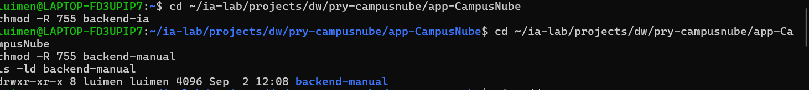

**Sugerencia de commit (issue):**

Realizamos el primer commit

git add .

git commit -m "chore: prepare workspace folders for nest backend"

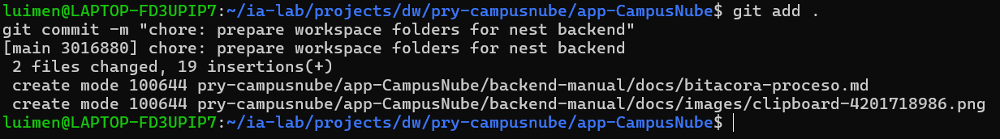

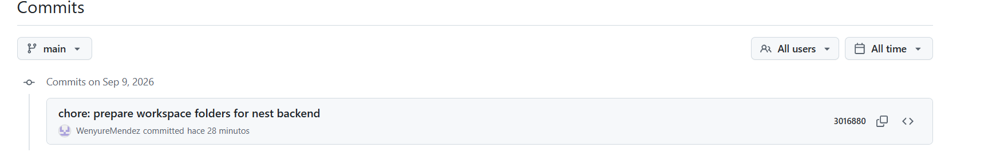

#### 1.2 — Instalar Nest CLI (si no existe)

El CLI generamos `main.ts`, `app.module.ts`, `tsconfig`, scripts npm entre otros

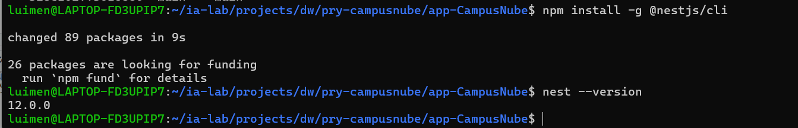

**Sugerencia de commit (issue):**

Realizamos el segundo commit

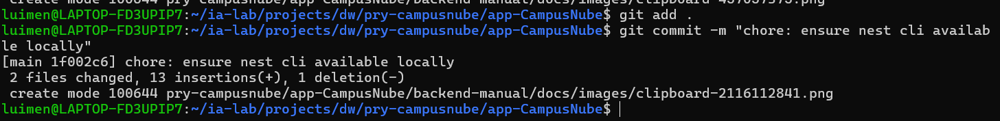

#### 1.3 — Crear proyecto NestJS

Usamos el nombre `backend_ia` (workspace didáctico). Responde las preguntas del CLI (package manager: npm).

``` bash
cd ~/ia-lab/projects/dw/pry-campusnube/app-CampusNube
nest new backend-manual
```

Evidencia de que quedo creado el proyecto

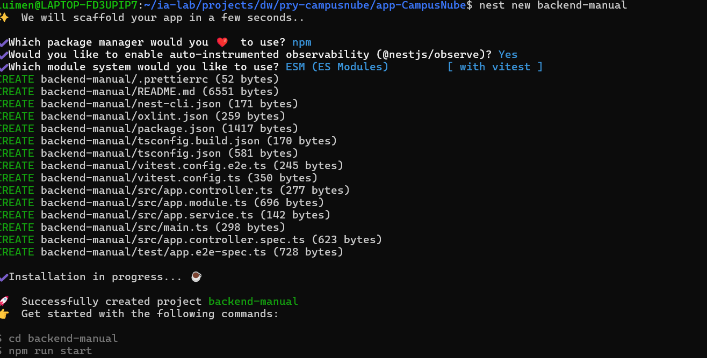

**Sugerencia de commit (issue):**

**Sugerencia de commit (issue):**

``` bash
git add . 
git commit -m "chore: scaffold nestjs project backend_manual"
git push origin main
```

#### 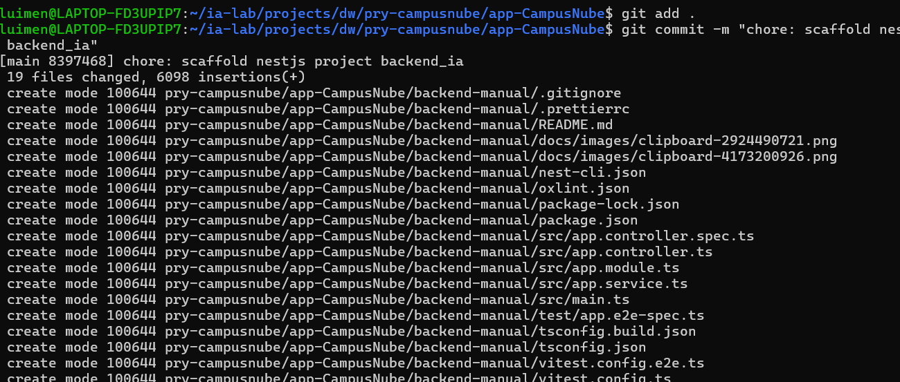

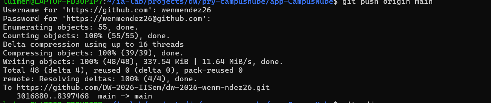

#### 1.4 — Crear `.env` mínimo (puerto)

El puerto `3002` evita choques con el 3000. Más adelante el `.env` crecerá con BD y JWT.

``` bash
cat > .env <<'EOF_BACKEND_MANUAL' PORT=3002 NODE_ENV=development EOF_BACKEND_MANUAL
```

Evidenciamos

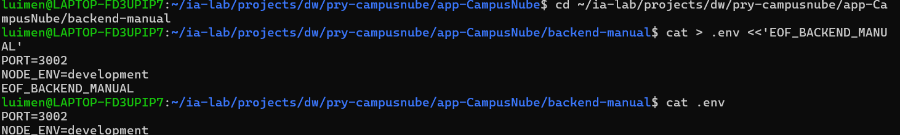

**Sugerencia de commit (issue):**

``` bash
git add .
git commit -m "chore: add initial .env with PORT=3002"
```

Evidencia de qeu se realizó el commit correctamente desde la terminal de Ubutntun y en Github

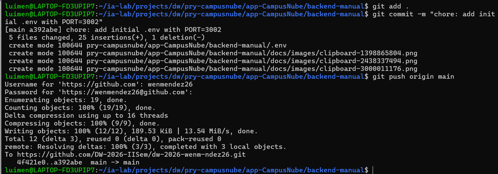

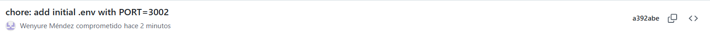

#### 1.5 — Commit inicial del esqueleto

Congela el punto de partida reproducible.

``` bash
git init
git add .
git commit -m "chore: inicialización del proyecto NestJS"
```

## FASE 2 — `01_BASE_DEPS_Y_PUERTO`

### Dependencias + manejo de puerto (EADDRINUSE)

En esta fase realizamos las dependencias y el manejo de puesto de CampusNube

#### 2.1 — Dependencias de producción

Config, Swagger, JWT/Passport, Sequelize + drivers de 4 motores, validación, bcrypt y utilidades HTTP.

``` bash
npm install @nestjs/config @nestjs/swagger @nestjs/jwt @nestjs/passport @nestjs/mapped-types \   passport passport-jwt sequelize sequelize-typescript mysql2 pg tedious oracledb \   class-validator class-transformer bcrypt reflect-metadata express compression helmet
```

Evidencia del las dependencias

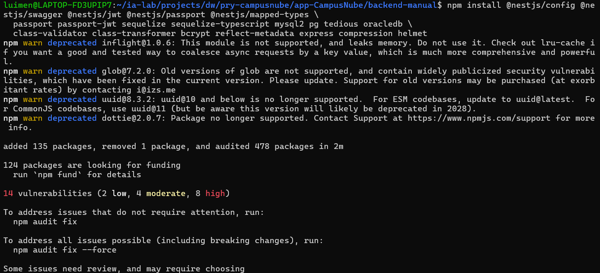

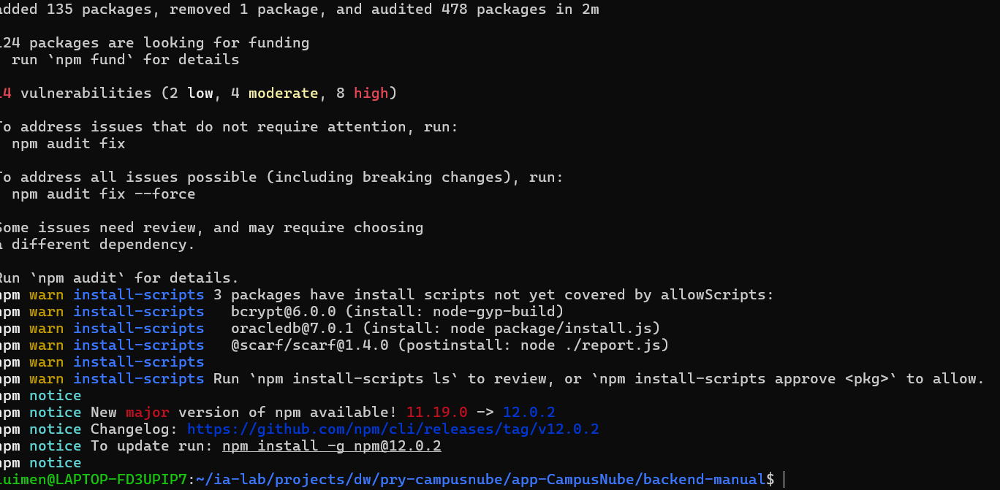

**Sugerencia de commit (issue):**

``` bash
git add .
git commit -m "chore: install production dependencies for ca backend"
```

Evudencia del Commit Por Ubuntu

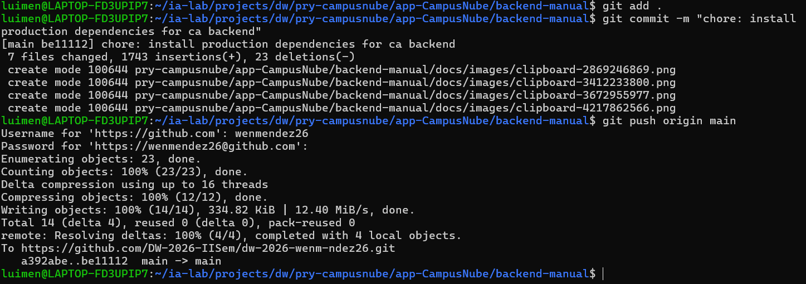

En github se verfica si quedo registrado.

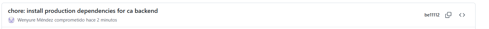

#### 2.2 — Dependencias de desarrollo

En este paso se realizan las dependencias de desarrollo

Tipados y sequelize-cli para herramientas de BD.

``` bash
npm install -D @types/bcrypt @types/passport-jwt sequelize-cli
```

Evidencia de que se instalo de dependencias de desarrollo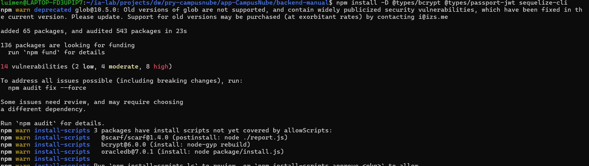

**Sugerencia de commit (issue):**

``` bash
git add . 
git commit -m "chore: install auth and sequelize-cli devDependencies"
```

Se evidencia que se realizó el commit correctamente desde la consola de Ubuntu

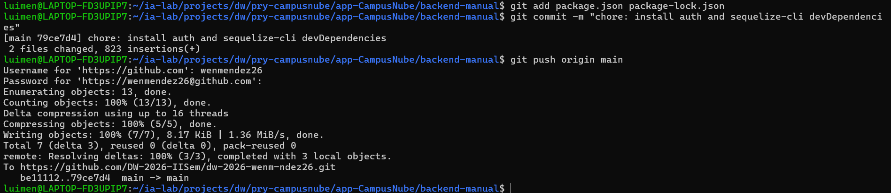

Desde Github

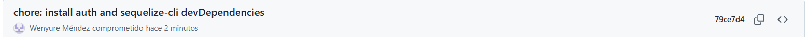

#### 2.3 — Script para liberar puerto (evita EADDRINUSE)

En este paso realizamos para liberar el puerto en Linux/WSL

Si reinicias Nest sin matar el proceso anterior, Node lanza `listen EADDRINUSE`. Este script lee `PORT` del `.env` y libera el puerto en Linux/WSL.

``` bash
mkdir -p scripts cat > scripts/free-port.js <<'EOF_BACKEND_IA' /**  * Libera el puerto configurado en .env (PORT) antes de arrancar Nest.  * Evita EADDRINUSE cuando queda una instancia previa de start:dev.  */ const { execSync } = require('child_process'); const fs = require('fs'); const path = require('path');  function readPortFromEnv() {   const envPath = path.join(__dirname, '..', '.env');   let port = 3002;    if (fs.existsSync(envPath)) {     const content = fs.readFileSync(envPath, 'utf8');     const match = content.match(/^\s*PORT\s*=\s*(\d+)\s*$/m);     if (match) {       port = parseInt(match[1], 10);     }   }    if (process.env.PORT) {     port = parseInt(process.env.PORT, 10) || port;   }    return port; }  function freePort(port) {   try {     // Linux/WSL: mata el proceso que escucha en el puerto     execSync(`fuser -k ${port}/tcp`, { stdio: 'ignore' });     console.log(`✅ Puerto ${port} liberado`);   } catch {     // No había proceso escuchando: ok     console.log(`ℹ️  Puerto ${port} disponible`);   } }  const port = readPortFromEnv(); freePort(port); EOF_BACKEND_MANUAL
```

Evudencia desde la consola de ubuntu

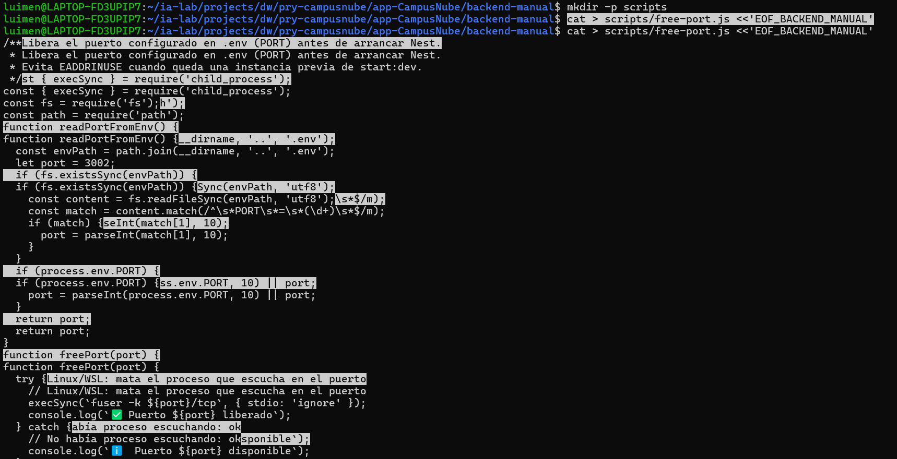

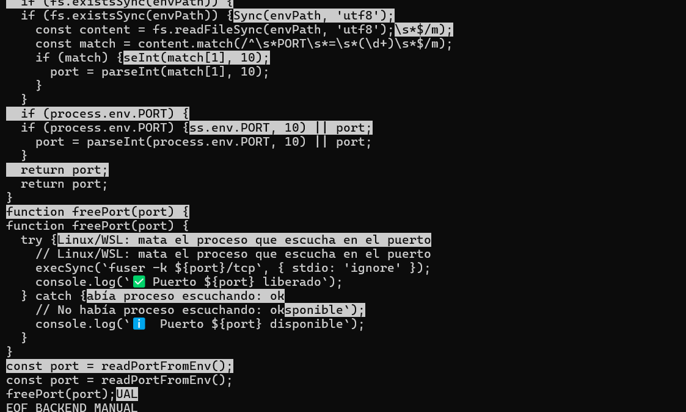

**Sugerencia de commit (issue):**

``` bash
git add .
git commit -m "chore: add scripts/free-port.js to avoid EADDRINUSE"
```

En este paso realizamos el commit desde la consola de Ubuntu

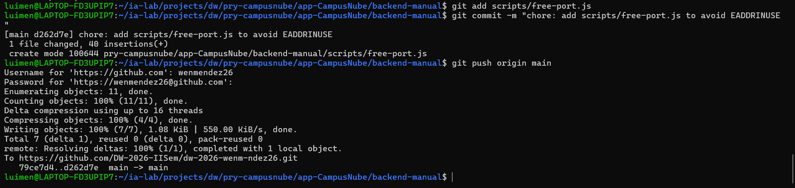

Verficamos desde Github

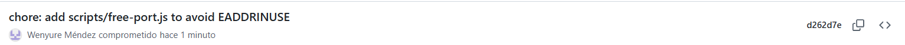

#### 2.4 — Actualizar scripts npm en package.json

En este paso se actualiza los scripts npm

Integra `free:port` en `start:dev` / `start:debug`. Aplica el cambio con Node para no editar JSON a mano.

``` bash
node <<'EOF_BACKEND_MANUAL' const fs = require('fs'); const pkg = JSON.parse(fs.readFileSync('package.json', 'utf8')); pkg.scripts = {   ...pkg.scripts,   'free:port': 'node scripts/free-port.js',   'start:dev': 'npm run free:port && nest start --watch',   'start:debug': 'npm run free:port && nest start --debug --watch', }; fs.writeFileSync('package.json', JSON.stringify(pkg, null, 2) + '\n'); console.log('✅ package.json scripts actualizados'); EOF_BACKEND_MANUAL
```

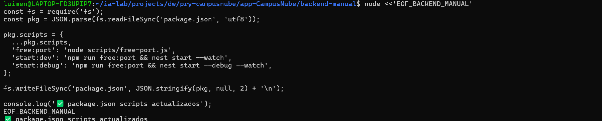

Se verifica si se actualizó correctamente

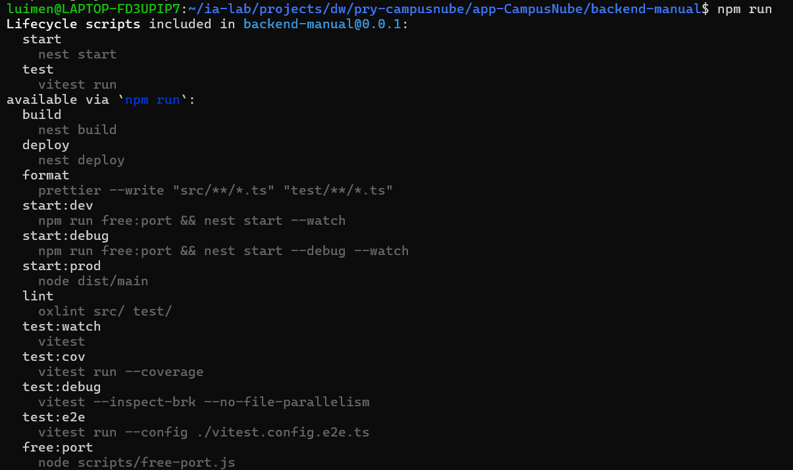

**Sugerencia de commit (issue):**

Ahora se realizá el commit desde la consola de Ubuntu.

``` bash
git add . 
git commit -m "chore: wire free:port into nest start scripts"
```

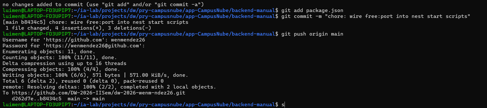

Desde Github

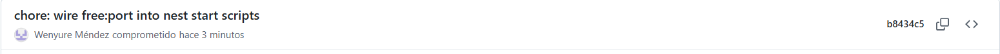

#### 2.5 — Verificar arranque base

En este paso se realizá el levantamiento del Hello World de Nest en el Puerto del `.env`.

``` bash
npm run start:dev # Ctrl+C cuando veas el log de arranque curl -s http://localhost:3002 || true
```

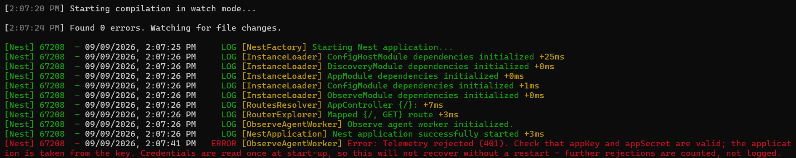

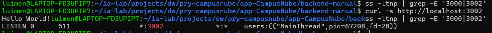

**Sugerencia de commit (issue):**

Ahora realizamos el commit desde la terminal de Ubuntu

``` bash
git add . git commit -m "test: verify nest boots after dependency install"
```

------------------------------------------------------------------------

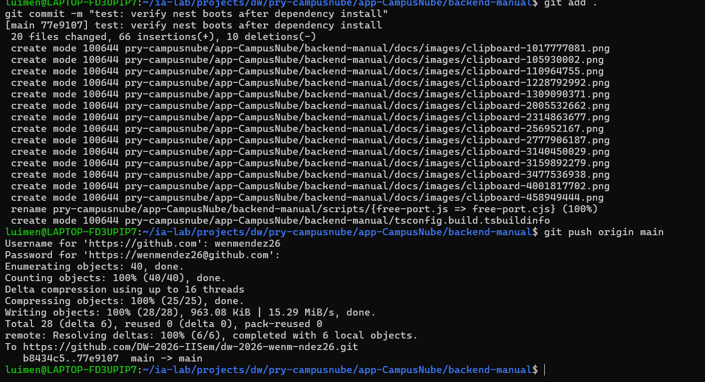

Ahora verifficamos desde Github

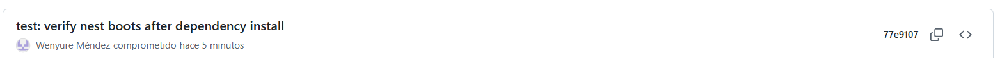

## FASE 3 — `02_BASE_ESTRUCTURA_CA`

### Estructura de carpetas Clean Architecture

> En esta fase se realizó la creación del mapa mental: config / common / infrastructure / features (business + auth).

#### 3.1 — Crear árbol base de carpetas

Aún no hay código de dominio. Solo directorios y módulos vacíos de features para anclar imports futuros.

``` bash
cd ~/ia-lab/projects/dw/pry-campusnube/app-CampusNube/backend-manual

mkdir -p src/config/{app,database,environment,jwt,logger,swagger}

mkdir -p src/common/{constants,decorators,enums,exceptions,filters,guards,interceptors,interfaces,pipes,types,utils,validators}

mkdir -p src/infrastructure/database/{sequelize,migrations,seeders}

mkdir -p src/infrastructure/{logging,security/hashing,security/tokens}
```

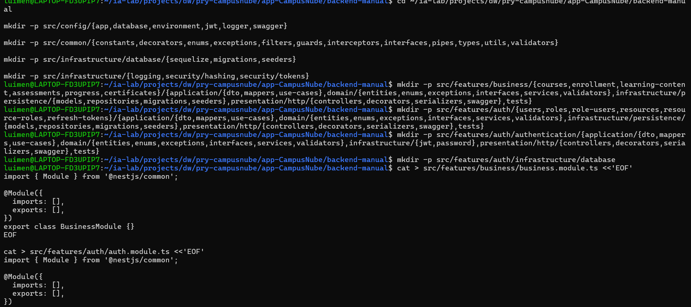

**Sugerencia de commit (issue):**

Ahora realizamos el commit en la terminal de Ubuntu

``` bash
git add . 
git commit -m "chore: create clean architecture folder tree and empty feature modules"
```

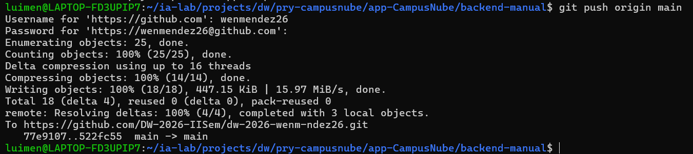

Ahora se verifica si se creo el commit correctamente en Github

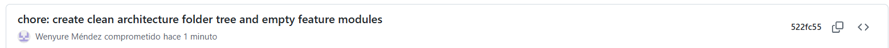

#### 3.2 — Recordatorio de responsabilidades

| Carpeta           | Responsabilidad                              |
|-------------------|----------------------------------------------|
| `config/`         | Cómo se configura la app (env, jwt, swagger) |
| `common/`         | Piezas transversales reutilizables           |
| `infrastructure/` | Detalles técnicos (Sequelize, bcrypt, JWT)   |
| `features/*`      | Dominios (business/auth) con CA interna      |

**Error típico:** poner `@Table` de Sequelize dentro de `domain/entities`.

**Sugerencia de commit (issue):**

Realizamos el commit

``` bash
git add . git commit -m "docs: note clean architecture folder responsibilities"
```

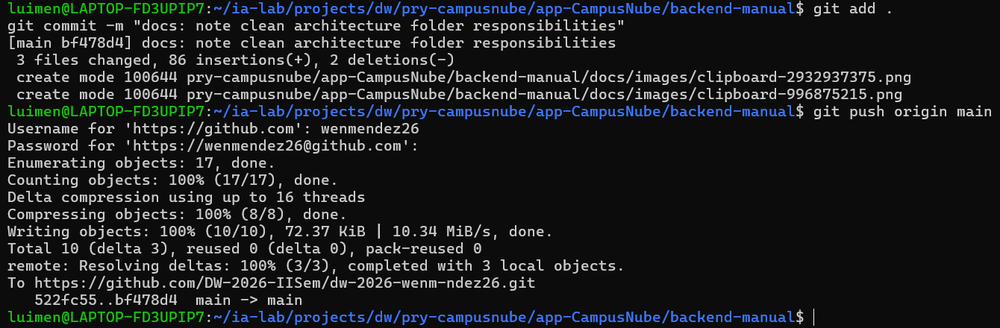

Verfificamos en Github

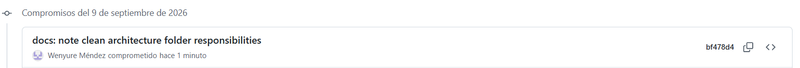

------------------------------------------------------------------------

## FASE 4 — `03_BASE_ENTORNO_ENV`

### Configuración del entorno tipado (multi-base)

> **Objetivo de la fase:** Centralizar variables en `.env`: selector `DB_DIALECT` y un bloque de credenciales por motor (MySQL, PostgreSQL, SQL Server, Oracle). Validar antes del boot.

#### 4.1 — Crear `.env.example` y actualizar `.env` completo

El `.env` real NO se sube a Git. Usa BD dedicada CampusNube.

**Contrato multi-base (igual que `docs/Prompt.md`):** - `DB_DIALECT` = `mysql` \| `postgres` \| `mssql` \| `oracle` (elige qué motor corre). - MySQL: `DB_MYSQL_HOST`, `DB_MYSQL_PORT`, `DB_MYSQL_USERNAME`, `DB_MYSQL_PASSWORD`, `DB_MYSQL_NAME`. - PostgreSQL: `DB_POSTGRES_*` (puerto lab 5432). - SQL Server: `DB_MSSQL_*` (puerto lab 1433, usuario `sa`). - Oracle: `DB_ORACLE_*` + `DB_ORACLE_CONNECT_STRING` (puerto lab 1521). - Para cambiar de motor, cambia **solo** `DB_DIALECT`. No uses `DB_HOST` / `DB_USERNAME` genéricos.

``` bash
```

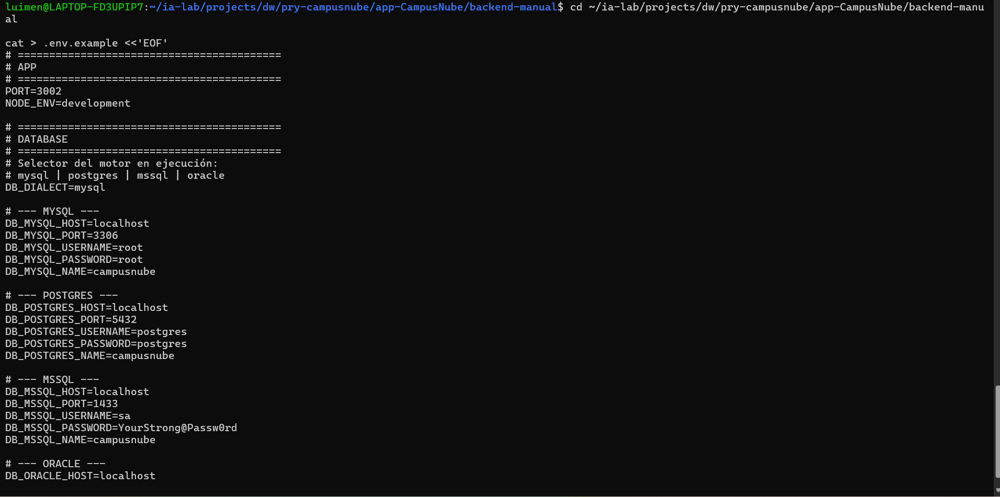

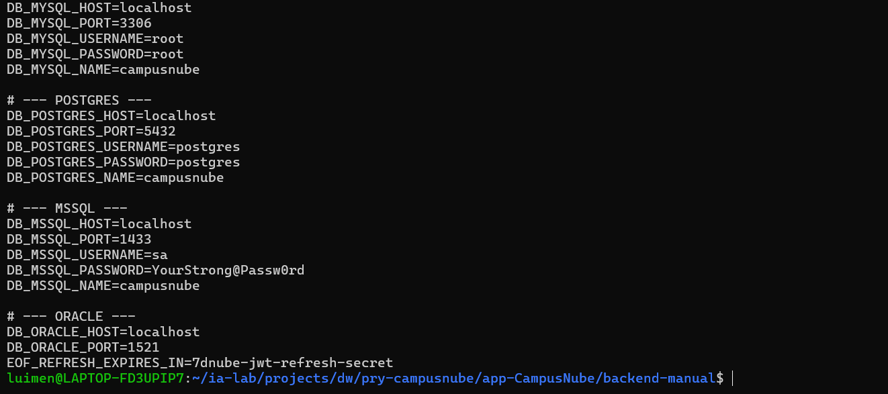

**Ahora realizamos el siguiente paso:**

``` bash

cp .env.example .env # Laboratorio: DB_DIALECT + un bloque por motor (MYSQL/POSTGRES/MSSQL/ORACLE). # Cambia solo el bloque del motor que uses. Mantén DB_*_NAME=tecnogua_ia
```

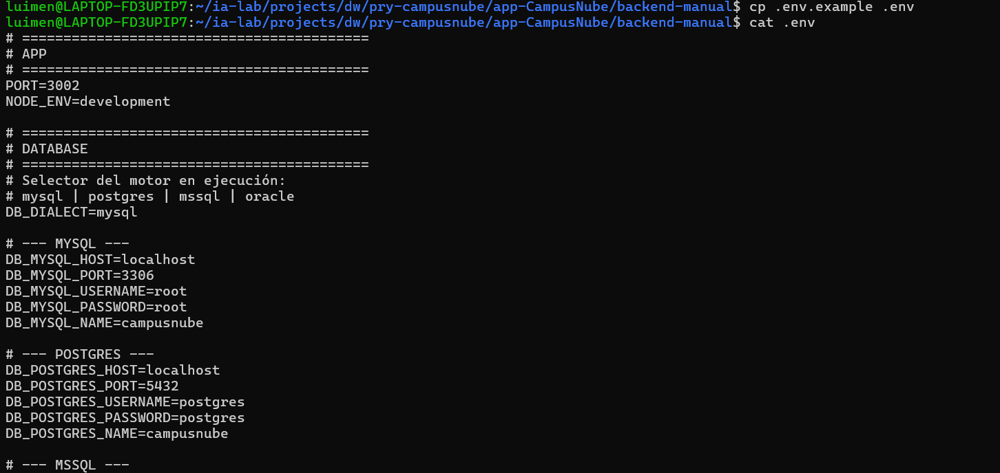

**Sugerencia de commit (issue):**

Realizamos el commit correspondinete

``` bash
git add .
git commit -m "chore: add typed env template and local .env for campusnube"
```

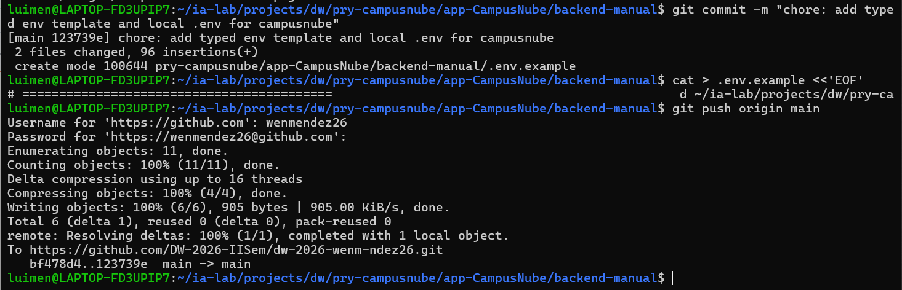

Verificamos en Github

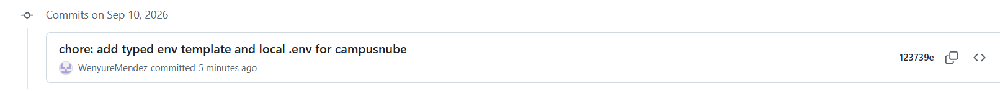

#### 4.2 — Interface de entorno

En este paso relaizamos lo siguiente

Tipos TypeScript de las variables de entorno (APP, DB, JWT) y enum de dialectos.

**Archivo:** `src/config/environment/env.interface.ts`

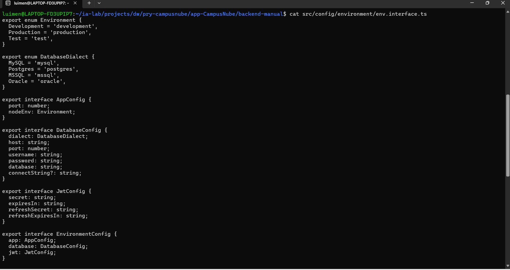

**Sugerencia de commit (issue):**

Realizamos el commit

``` bash
git add .
git commit -m "feat: add environment interfaces and DatabaseDialect enum"
```

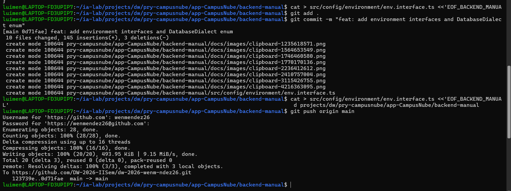

Verficamos en Github

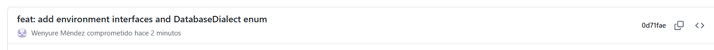

#### 4.3 — Validación de entorno con class-validator

Si falta JWT_SECRET o DB_DIALECT es inválido, o el bloque del motor activo está vacío, el boot falla con mensaje claro.

**Archivo:** `src/config/environment/env.validation.ts`

``` bash
```

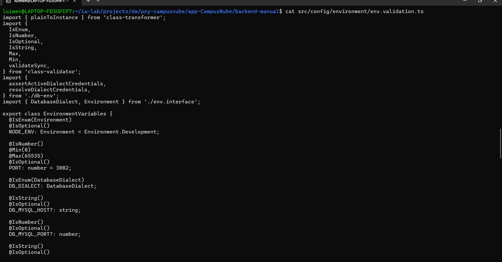

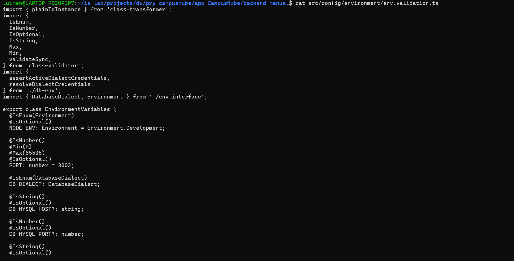

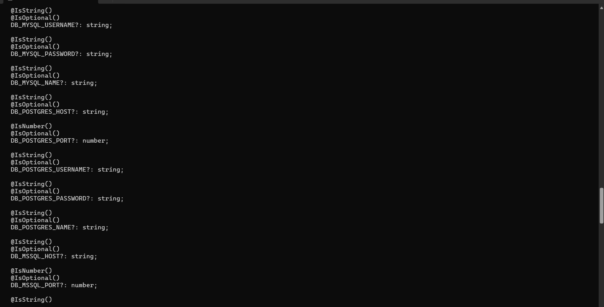

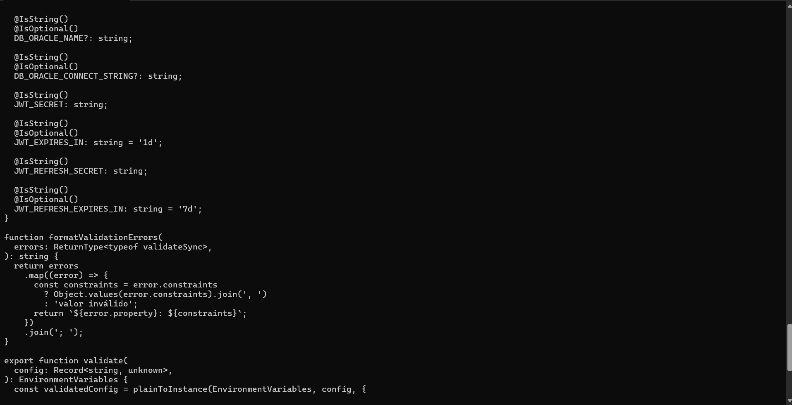

**Sugerencia de commit (issue):**

``` bash
git add .
git commit -m "feat: validate environment variables with class-validator"
```

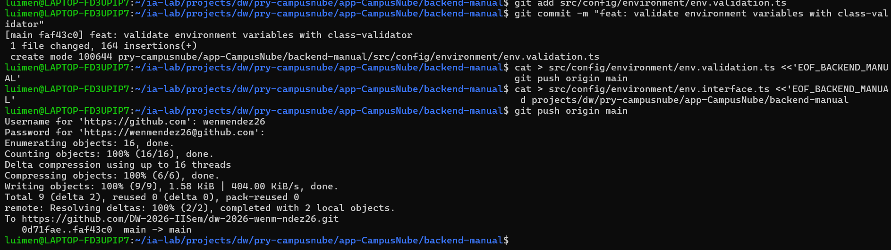

Verifacamos en Github

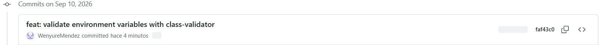

#### 4.4 — Resolver de credenciales por motor

Lee el bloque DB_MYSQL\_\* / DB_POSTGRES\_\* / DB_MSSQL\_\* / DB_ORACLE\_\* según DB_DIALECT.

**Archivo:** `src/config/environment/db-env.ts`

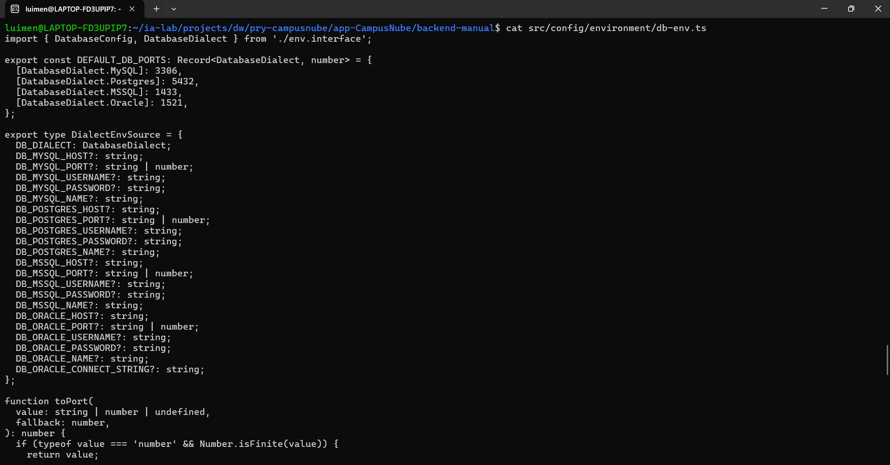

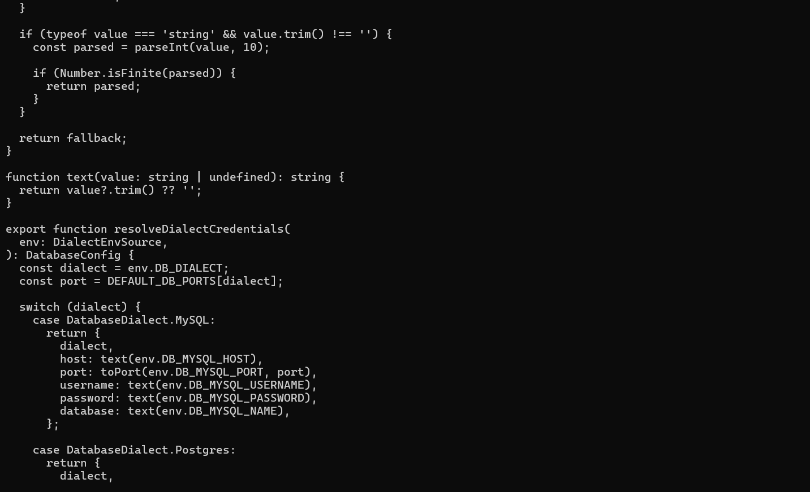

**Sugerencia de commit (issue):**

``` bash
git add . 
git commit -m "feat: resolve database credentials per dialect"
```

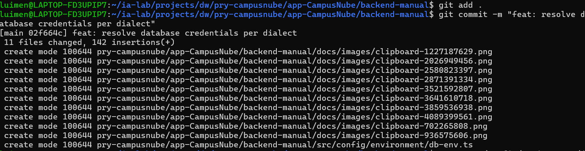

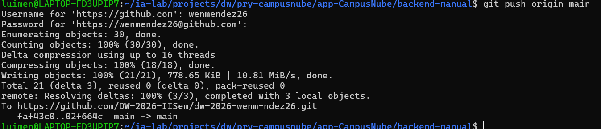

Verifacamos en Github

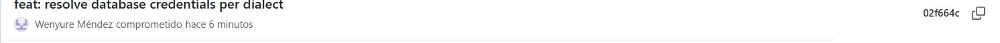

#### 4.5 — Factory registerAs de entorno

Expone `environment.*` vía ConfigService (`registerAs`).

**Archivo:** `src/config/environment/env.config.ts`

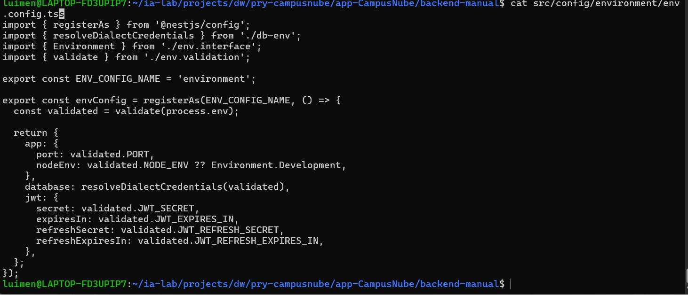

**Sugerencia de commit (issue):**

``` bash
git add . 
git commit -m "feat: register environment config factory"
```

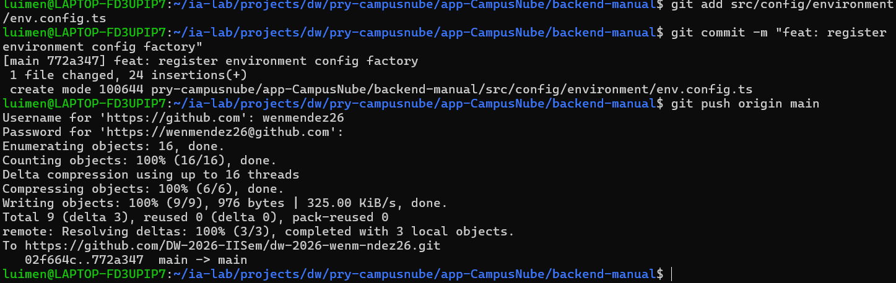

Vereficamos en Github

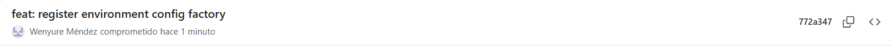

## FASE 5 — `04_BASE_DATABASE_SEQUELIZE`

### Base de datos multi-dialecto (Sequelize)

> Conectamos Sequelize al motor de `DB_DIALECT` usando el bloque `DB_MYSQL_*` / `DB_POSTGRES_*` / `DB_MSSQL_*` / `DB_ORACLE_*`. Aún sin features (ALL_MODELS vacío).

#### 5.1 — Constante SEQUELIZE_TOKEN

Token DI para inyectar la instancia Sequelize en repositorios.

**Archivo:** `src/common/constants/database.constants.ts`

``` bash
mkdir -p src/common/constants cat > src/common/constants/database.constants.ts <<'EOF_BACKEND_MANUAL' export const SEQUELIZE_TOKEN = 'SEQUELIZE'; EOF_BACKEND_MANUAL
```

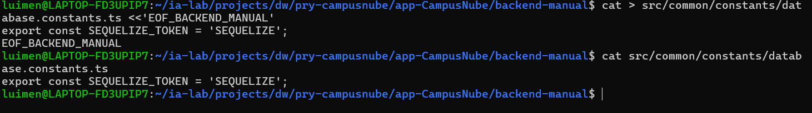

**Sugerencia de commit (issue):**

``` bash
git add .
git commit -m "feat: add SEQUELIZE_TOKEN constant"
```

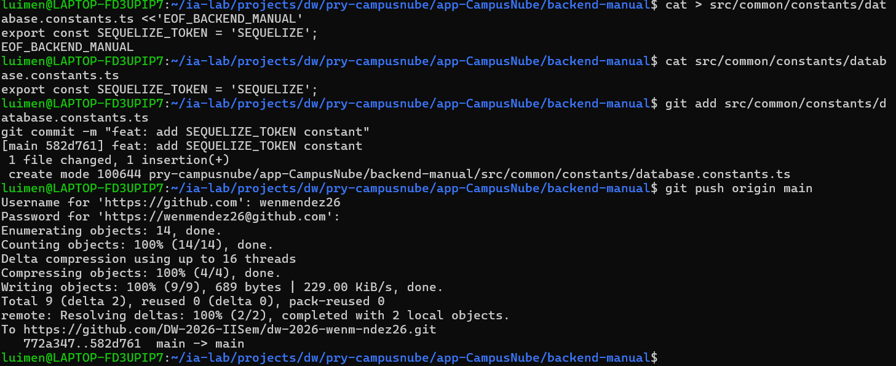

#### 5.2 — Tipos auxiliares de database config

Tipos auxiliares del bloque config/database (legado/compat).

**Archivo:** `src/config/database/database.types.ts`

``` bash
```

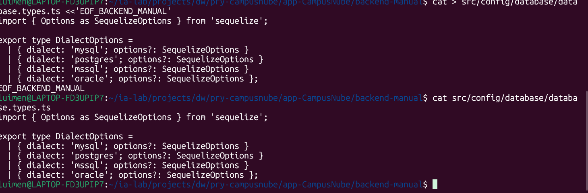

**Sugerencia de commit (issue):**

``` bash
git add . git commit -m "chore: add database.types helpers"
```

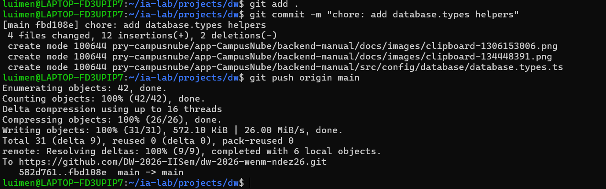

Verificamos si se creo en Github

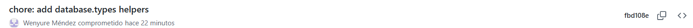

#### 5.3 — database.config.ts

Factory registerAs opcional para namespace `database` (complementa environment).

**Archivo:** `src/config/database/database.config.ts`

``` bash
```

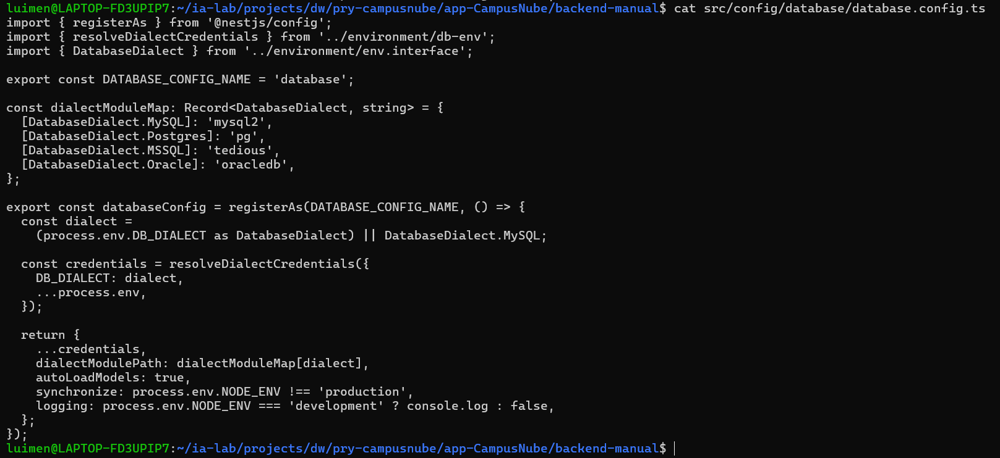

**Sugerencia de commit (issue):**

``` bash
git add .
git commit -m "feat: add database.config registerAs"
```

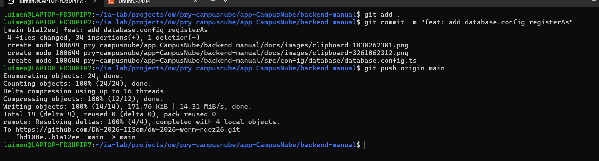

Verificamos en Github

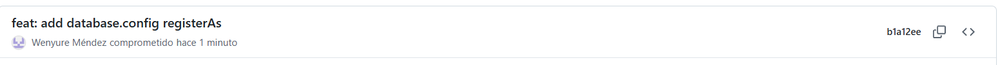

#### 5.4 — database.module.ts / providers

Módulo de configuración de BD (forFeature). Los providers quedan vacíos a propósito.

**Archivo:** `src/config/database/database.module.ts`

``` bash
mkdir -p src/config/database cat > src/config/database/database.module.ts <<'EOF_BACKEND_MANUAL' import { Module } from '@nestjs/common'; import { ConfigModule } from '@nestjs/config'; import { databaseConfig } from './database.config';  @Module({   imports: [ConfigModule.forFeature(databaseConfig)],   exports: [ConfigModule], }) export class DatabaseConfigModule {} EOF_BACKEND_MANUAL
```

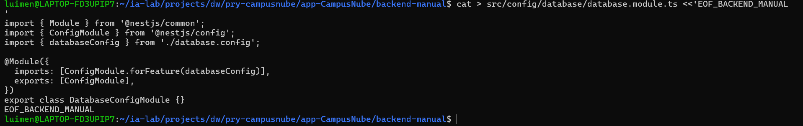

**Sugerencia de commit (issue):**

``` bash
git add .
git commit -m "feat: add DatabaseConfigModule"
```

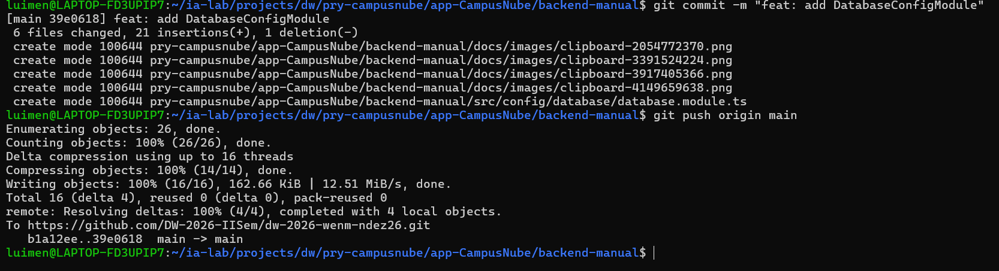

Se verifica en Github

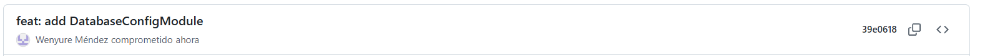

#### 5.5 — database.providers.ts

Placeholder de providers de config/database.

**Archivo:** `src/config/database/database.providers.ts`

``` bash
mkdir -p src/config/database cat > src/config/database/database.providers.ts <<'EOF_BACKEND_MANULA' export const DATABASE_PROVIDERS = []; EOF_BACKEND_MANUAL
```

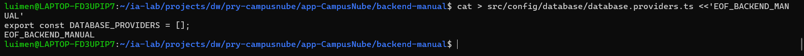

**Sugerencia de commit (issue):**

``` bash
git add .
git commit -m "chore: add empty DATABASE_PROVIDERS"
```

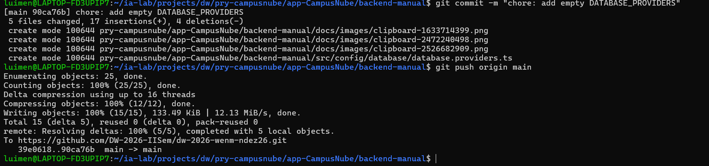

Se verifica en Github

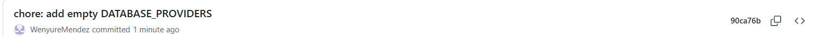

#### 5.6 — Opciones Sequelize por dialecto

Arma host/port/user/password/logging con el bloque del motor seleccionado por DB_DIALECT.

**Archivo:** `src/infrastructure/database/sequelize/sequelize.options.ts`

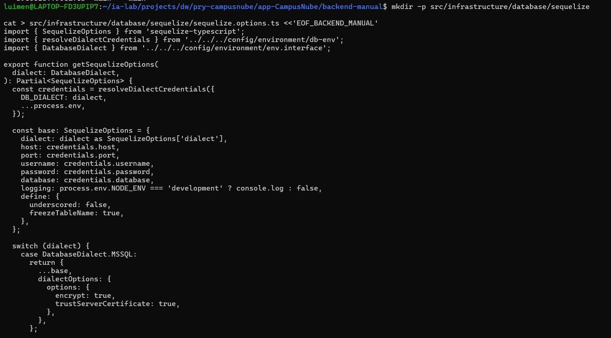

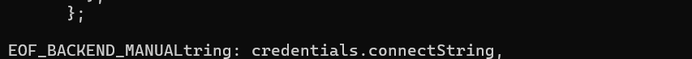

**Sugerencia de commit (issue):**

``` bash
git add .
git commit -m "feat: add getSequelizeOptions multi-dialect"
```

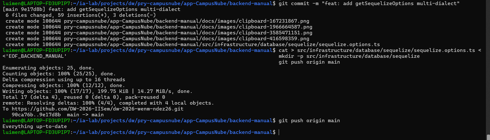

Se verificó si se creo en Github

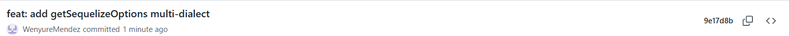

#### 5.7 — Factory Sequelize (sin modelos aún)

Crea la instancia Sequelize. `ALL_MODELS` empieza vacío: se llena al crear cada entidad.

**Archivo:** `src/infrastructure/database/sequelize/sequelize.factory.ts`

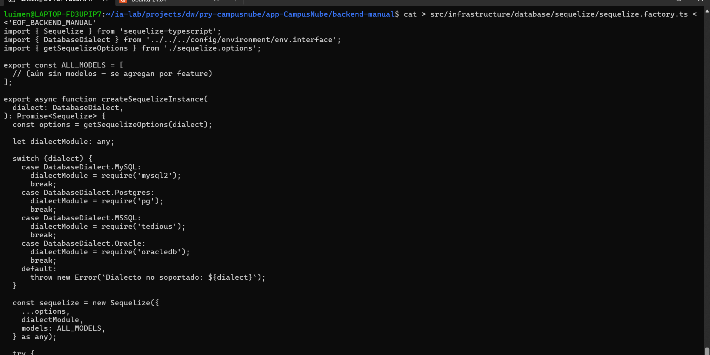

**Sugerencia de commit (issue):**

``` bash
git add . 
git commit -m "feat: add createSequelizeInstance with empty ALL_MODELS"
```

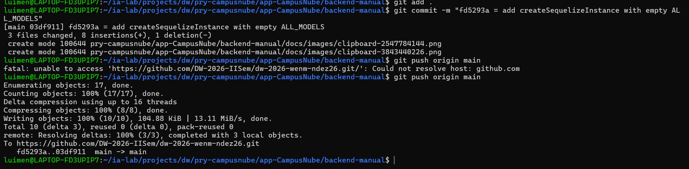

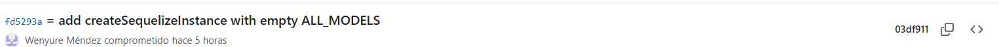

#### 5.8 — DatabaseSeederService (sin seeders aún)

Hook OnModuleInit para seeders. Todavía no llama a ningún seeder de feature.

**Archivo:** `src/infrastructure/database/seeders/database-seeder.service.ts`

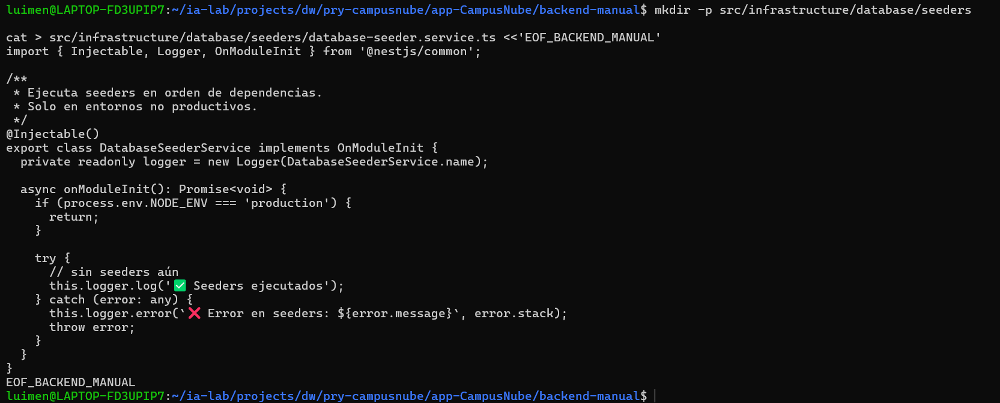

**Sugerencia de commit (issue):**

``` bash
git add . 
git commit -m "feat: add DatabaseSeederService scaffold"
```

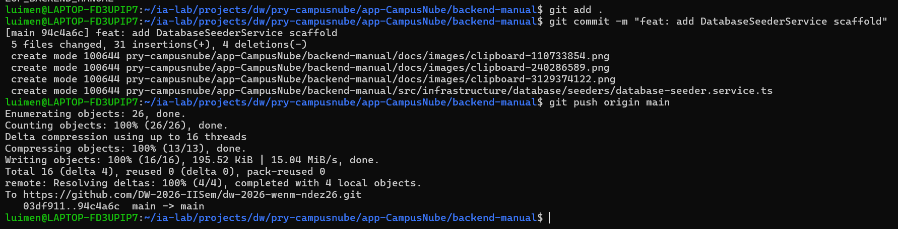

Se verifica en Github

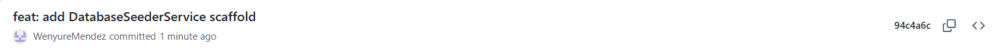

#### 5.9 — Módulo global Sequelize

Módulo `@Global()` que provee `SEQUELIZE_TOKEN` + ejecuta seeders.

**Archivo:** `src/infrastructure/database/sequelize/sequelize.module.ts`

``` bash
```

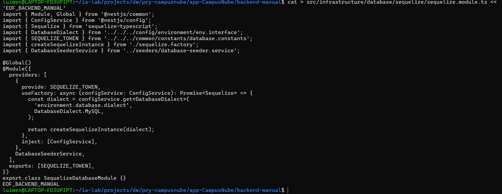

**Sugerencia de commit (issue):**

``` bash
git add . 
git commit -m "feat: add global SequelizeDatabaseModule"
```

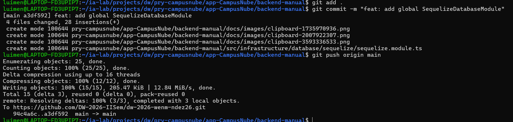

Se verifica en Github

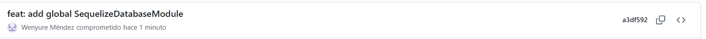

#### 5.10 — Verificar conexión a BD

Crea la BD vacía CampusNube en el motor que indica `DB_DIALECT`. Aún no hay tablas de negocio. Si falla el authenticate, corrige el **bloque de ese motor** en `.env` (no el de otro).

``` bash
# mysql: # mysql -u root -p -e "CREATE DATABASE IF NOT EXISTS campusnube;" # postgres: # createdb campusnube # mssql (sqlcmd): # sqlcmd -S localhost -U sa -Q "CREATE DATABASE campusnube;" # oracle: crea el schema/PDB que apunte DB_ORACLE_CONNECT_STRING npm run start:dev # Busca: ✅ Conexión exitosa a MYSQL (o POSTGRES / MSSQL / ORACLE según DB_DIALECT) # Ctrl+C
```

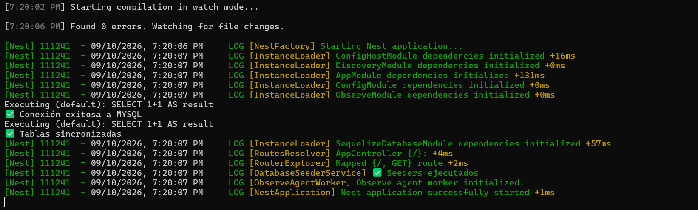

**Sugerencia de commit (issue):**

``` bash
git add .
git commit -m "test: verify sequelize authenticates against tecnogua_ia"
```

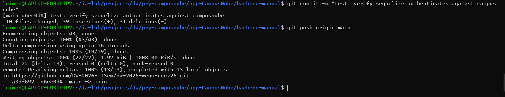

Ahora verificamos en Github

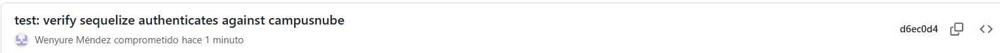

#### 6.1 — config/app/app.constants.ts

Archivo del feature en Clean Architecture.

**Archivo:** `src/config/app/app.constants.ts`

``` bash
mkdir -p src/config/app cat > src/config/app/app.constants.ts <<'EOF_BACKEND_MANUAL' export const APP_CONFIG_NAME = 'app';  export const APP_DEFAULTS = {   PORT: 3002,   NODE_ENV: 'development', }; EOF_BACKEND_MANUAL
```

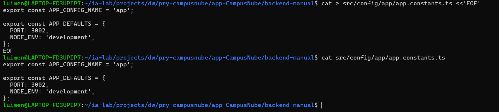

**Sugerencia de commit (issue):**

``` bash
git add .
git commit -m "feat: add app.constants.ts"
```

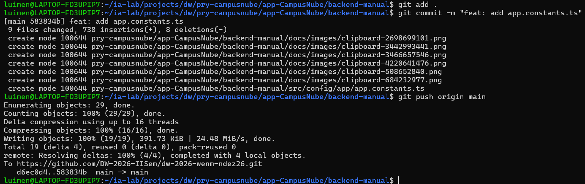

Se verifica desde Github

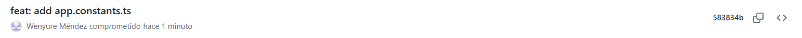

#### 6.2 — config/app/app.config.ts

Archivo del feature en Clean Architecture.

**Archivo:** `src/config/app/app.config.ts`

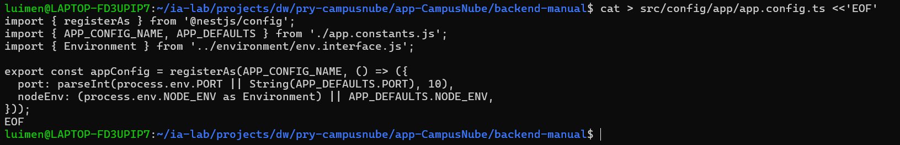

**Sugerencia de commit (issue):**

``` bash
git add . 
git commit -m "feat: add app.config.ts"
```

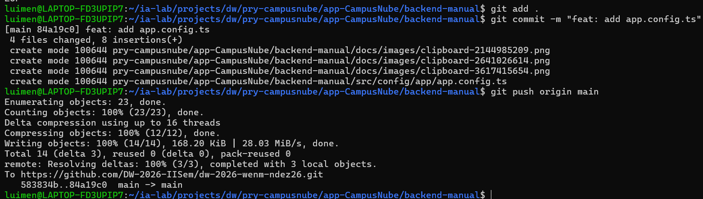

Verificamos en Github

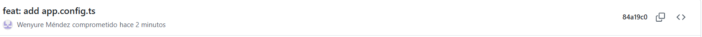

#### 6.3 — config/logger/logger.config.ts

Archivo del feature en Clean Architecture.

**Archivo:** `src/config/logger/logger.config.ts`

``` bash
```

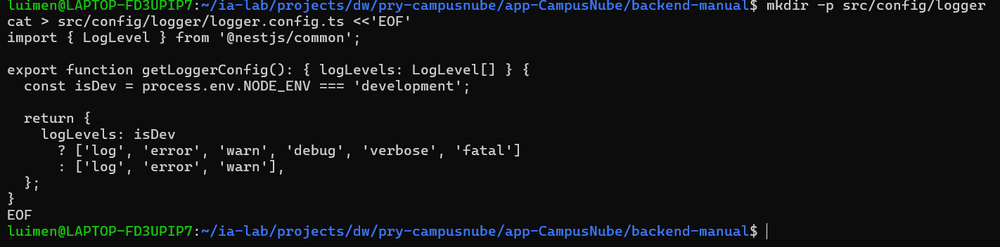

**Sugerencia de commit (issue):**

``` bash
git add . 
git commit -m "feat: add logger.config.ts"
```

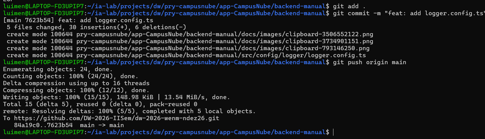

Verificamos en Github

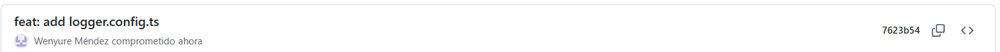

#### 6.4 — config/logger/logger.module.ts

Módulo Nest del feature: cablea providers, tokens DI y controller.

**Archivo:** `src/config/logger/logger.module.ts`

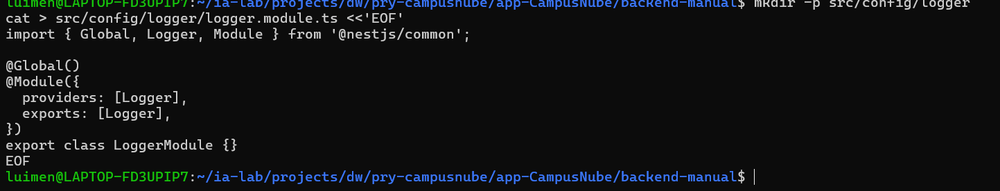

**Sugerencia de commit (issue):**

``` bash
git add . 
git commit -m "feat: wire nest module logger.module.ts"
```

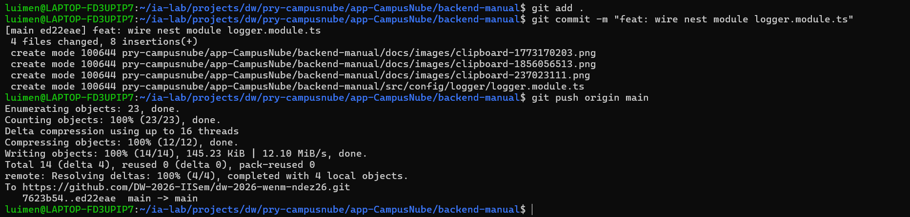

Verficamos en Github

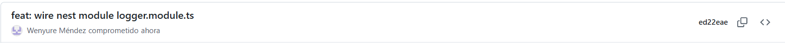

#### 6.5 — config/jwt/jwt.constants.ts

Archivo del feature en Clean Architecture.

**Archivo:** `src/config/jwt/jwt.constants.ts`

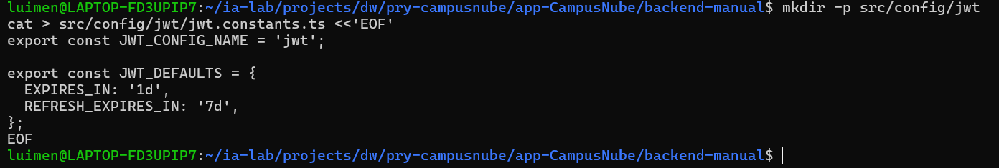

**Sugerencia de commit (issue):**

``` bash
git add .
git commit -m "feat: add jwt.constants.ts"
```

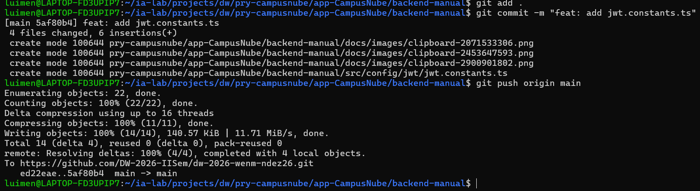

Verificamos Github

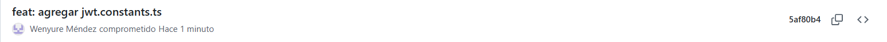

#### 6.6 — config/jwt/jwt.config.ts

Archivo del feature en Clean Architecture.

**Archivo:** `src/config/jwt/jwt.config.ts`

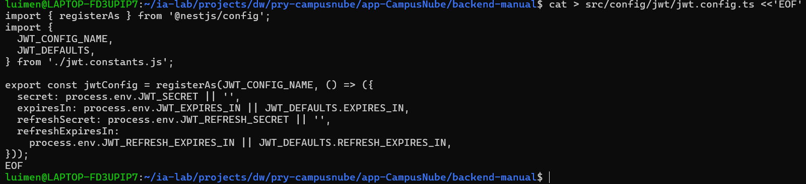

**Sugerencia de commit (issue):**

``` bash
git add . 
git commit -m "feat: add jwt.config.ts"
```

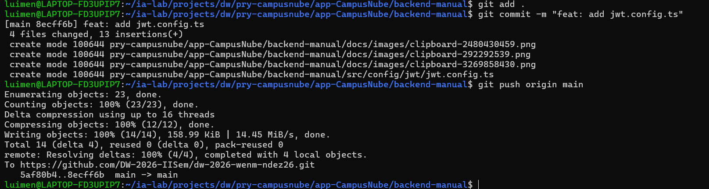

Verificamos en Github

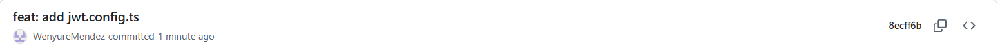

#### 6.7 — config/swagger/swagger.constants.ts

Archivo del feature en Clean Architecture.

**Archivo:** `src/config/swagger/swagger.constants.ts`

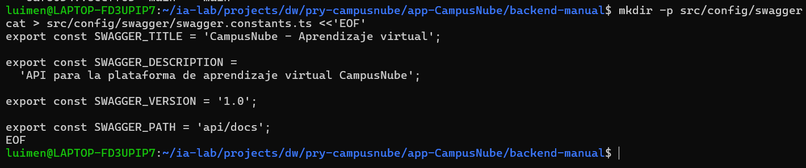

**Sugerencia de commit (issue):**

``` bash
git add .
git commit -m "feat: add swagger.constants.ts"
```

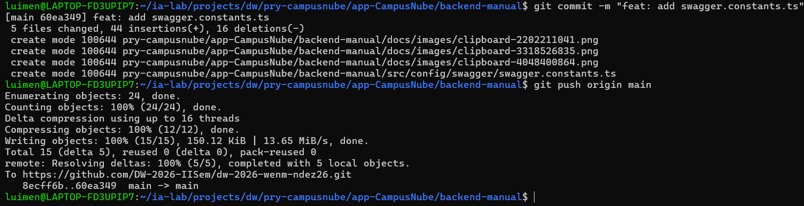

Verificamos en Github

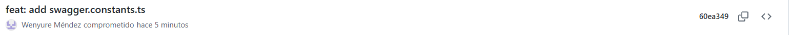

#### 6.8 — config/swagger/swagger.config.ts

Archivo del feature en Clean Architecture.

**Archivo:** `src/config/swagger/swagger.config.ts`

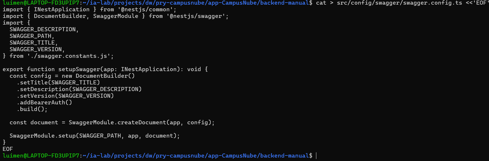

**Sugerencia de commit (issue):**

``` bash
git add .
git commit -m "feat: add swagger.config.ts"
```

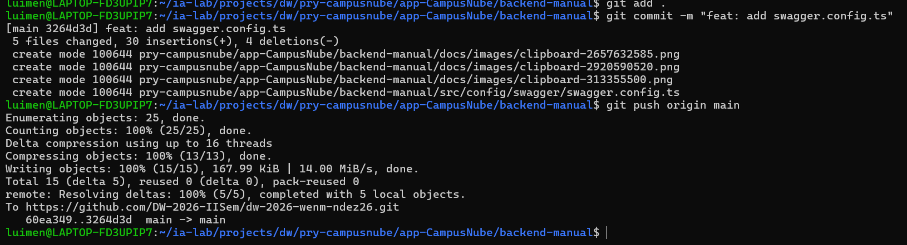

Verificamos en Ghitub

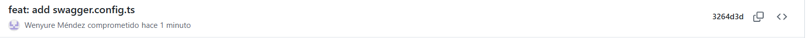

#### 6.9 — common/enums/status.enum.ts

Archivo del feature en Clean Architecture.

**Archivo:** `src/common/enums/status.enum.ts`

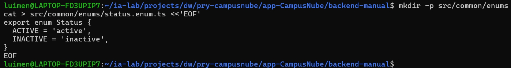

**Sugerencia de commit (issue):**

``` bash
git add . 
git commit -m "feat: add status.enum.ts"
```

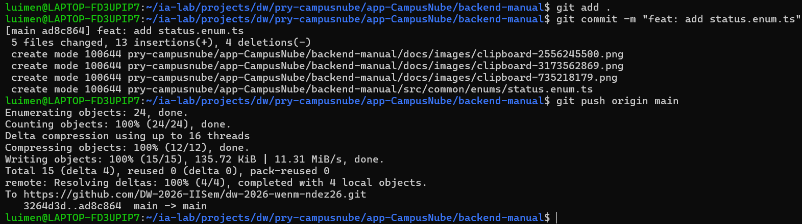

Verificamos en Github

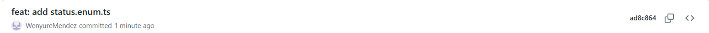

#### 6.10 — common/enums/http-method.enum.ts

Archivo del feature en Clean Architecture.

**Archivo:** `src/common/enums/http-method.enum.ts`

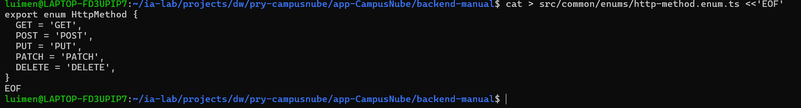

**Sugerencia de commit (issue):**

``` bash
git add .
git commit -m "feat: add http-method.enum.ts"
```

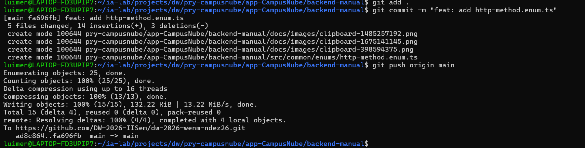

Verificamos en Github

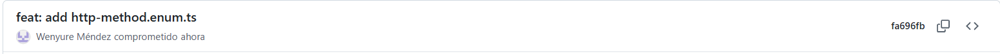

#### 6.11 — common/enums/sort-order.enum.ts

Archivo del feature en Clean Architecture.

**Archivo:** `src/common/enums/sort-order.enum.ts`

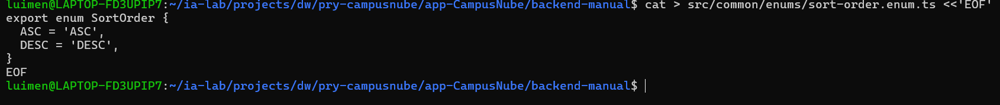

**Sugerencia de commit (issue):**

``` bash
git add . 
git commit -m "feat: add sort-order.enum.ts"
```

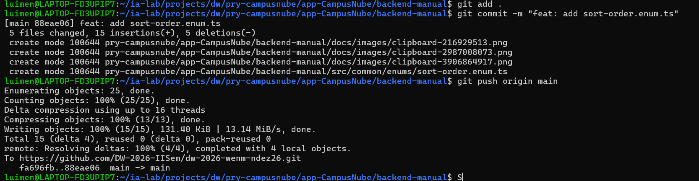

Verificar en Github

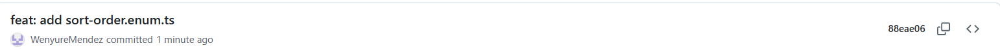

#### 6.12 — common/constants/app.constants.ts

Archivo del feature en Clean Architecture.

**Archivo:** `src/common/constants/app.constants.ts`

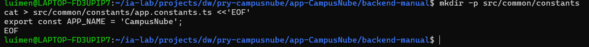

**Sugerencia de commit (issue):**

``` bash
git add .
git commit -m "feat: add app.constants.ts"
```

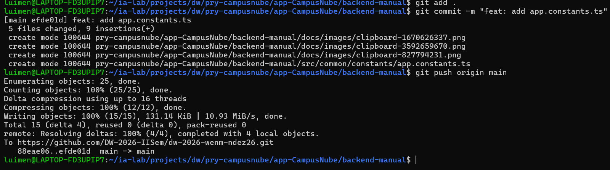

Se verfica en Github

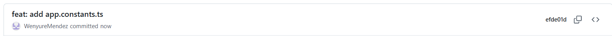

#### 6.13 — common/constants/pagination.constants.ts

Archivo del feature en Clean Architecture.

**Archivo:** `src/common/constants/pagination.constants.ts`

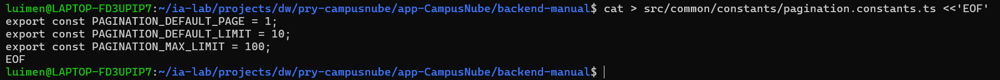

**Sugerencia de commit (issue):**

``` bash
git add .
git commit -m "feat: add pagination.constants.ts"
```

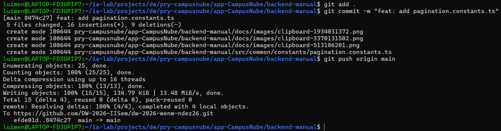

Verificamos en Github

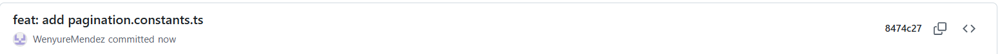

#### 6.14 — common/exceptions/application.exception.ts

Archivo del feature en Clean Architecture.

**Archivo:** `src/common/exceptions/application.exception.ts`

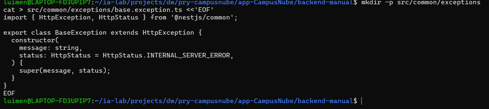

**Sugerencia de commit (issue):**

``` bash
git add . 
git commit -m "feat: add application.exception.ts"
```

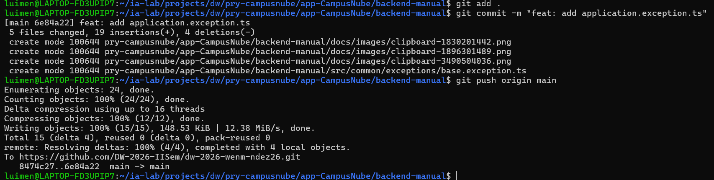

Verificamos en Github

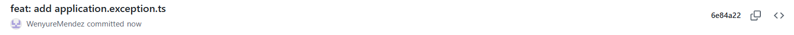

#### 6.15 — common/exceptions/domain.exception.ts

Archivo del feature en Clean Architecture.

**Archivo:** `src/common/exceptions/domain.exception.ts`

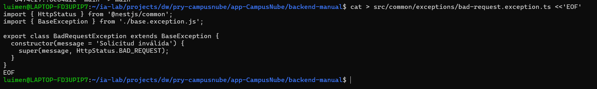

**Sugerencia de commit (issue):**

``` bash
git add . 
git commit -m "feat: add domain.exception.ts"
```

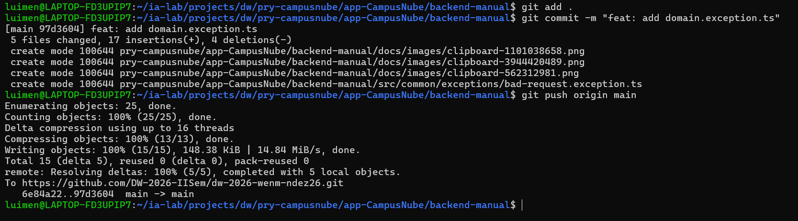

Verificamos con Github

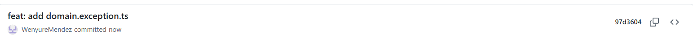

#### 6.16 — common/exceptions/entity-not-found.exception.ts

Archivo del feature en Clean Architecture.

**Archivo:** `src/common/exceptions/entity-not-found.exception.ts`

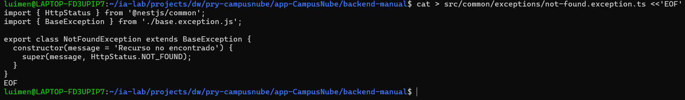

**Sugerencia de commit (issue):**

``` bash
git add .
git commit -m "feat: add entity-not-found.exception.ts"
```

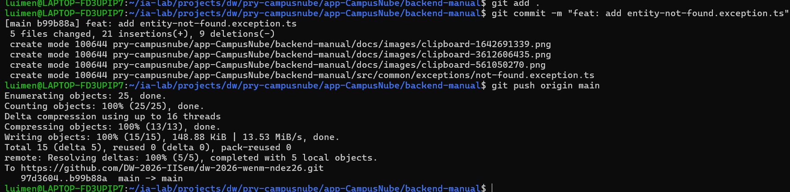

Verificamos en Github

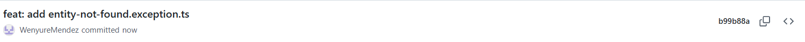

#### 6.17 — common/exceptions/validation.exception.ts

Archivo del feature en Clean Architecture.

**Archivo:** `src/common/exceptions/validation.exception.ts`

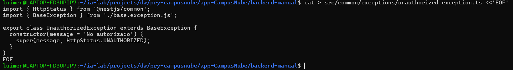

**Sugerencia de commit (issue):**

``` bash
git add .
git commit -m "feat: add validation.exception.ts"
```

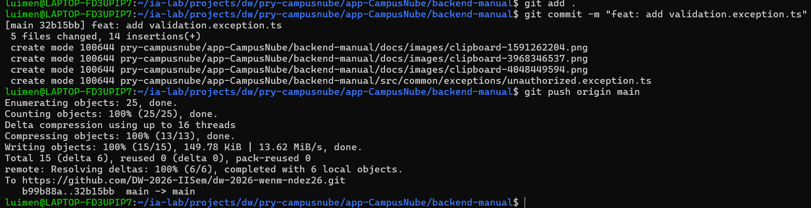

Verificar en Github

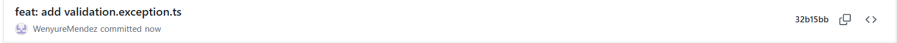

#### 6.18 — common/filters/global-exception.filter.ts

Archivo del feature en Clean Architecture.

**Archivo:** `src/common/filters/global-exception.filter.ts`

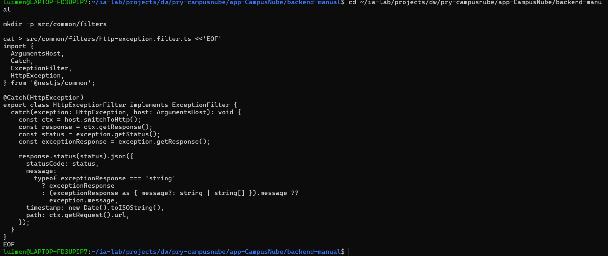

**Sugerencia de commit (issue):**

``` bash
git add .
git commit -m "feat: add global-exception.filter.ts"
```

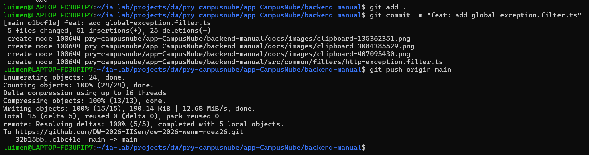

Verificamos en Github

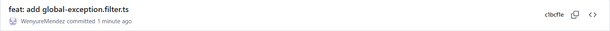

#### 6.19 — common/filters/sequelize-exception.filter.ts

Archivo del feature en Clean Architecture.

**Archivo:** `src/common/filters/sequelize-exception.filter.ts`

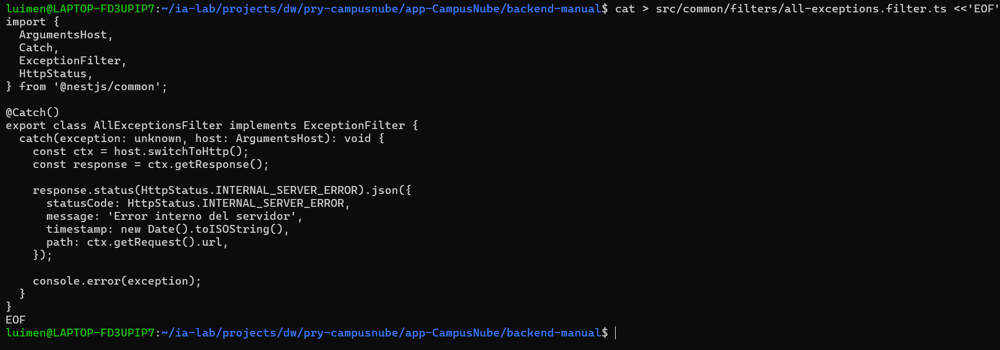

**Sugerencia de commit (issue):**

``` bash
git add . 
git commit -m "feat: add sequelize-exception.filter.ts"
```

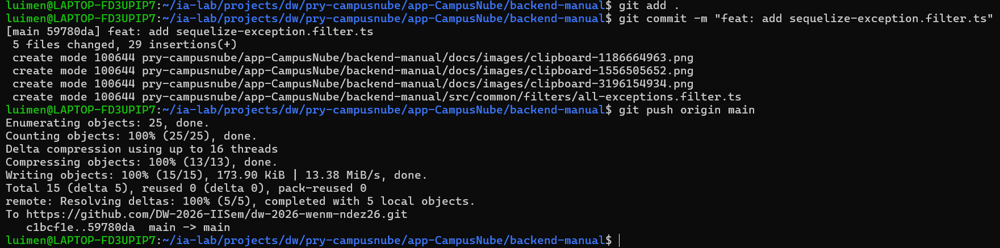

Verificamos en Github

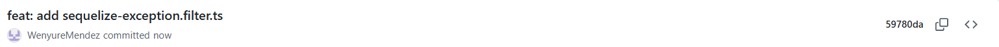

#### 6.20 — common/interceptors/response.interceptor.ts

Archivo del feature en Clean Architecture.

**Archivo:** `src/common/interceptors/response.interceptor.ts`

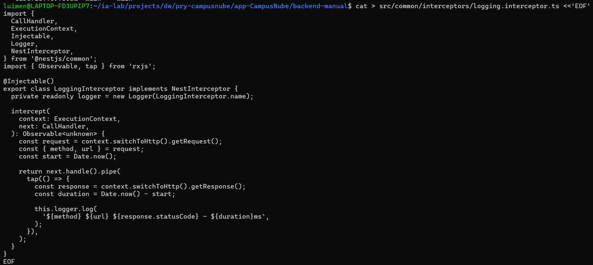

**Sugerencia de commit (issue):**

``` bash
git add . 
git commit -m "feat: add response.interceptor.ts"
```

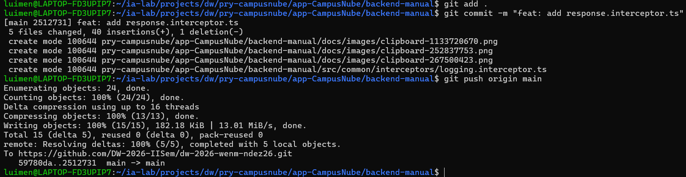

Verificamos en Github

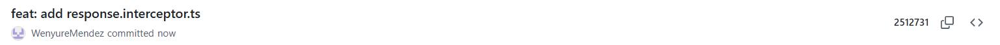

#### 6.21 — common/interceptors/logging.interceptor.ts

Archivo del feature en Clean Architecture.

**Archivo:** `src/common/interceptors/logging.interceptor.ts`

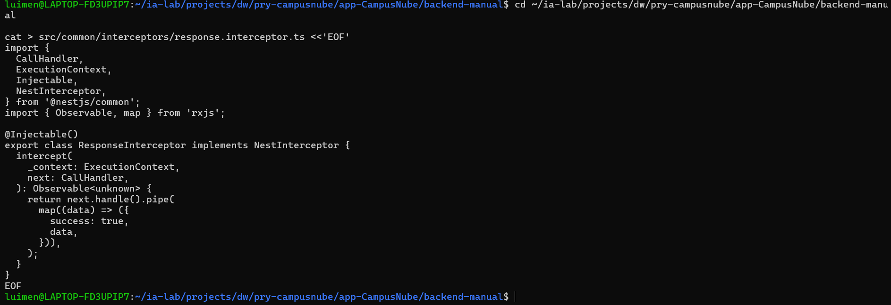

**Sugerencia de commit (issue):**

``` bash
git add . 
git commit -m "feat: add logging.interceptor.ts"
```

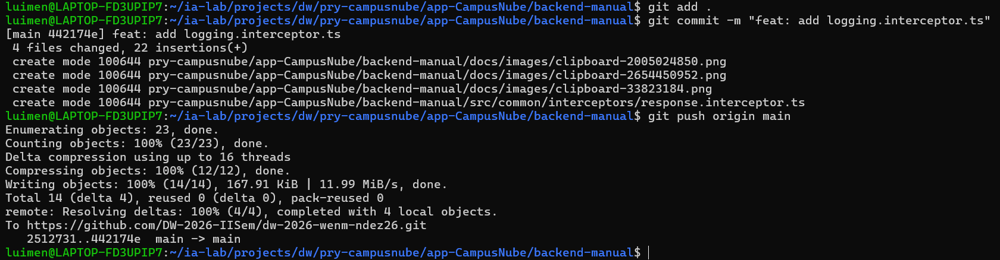

Verificamos en Github

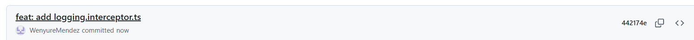

#### 6.22 — common/interceptors/timeout.interceptor.ts

Archivo del feature en Clean Architecture.

**Archivo:** `src/common/interceptors/timeout.interceptor.ts`

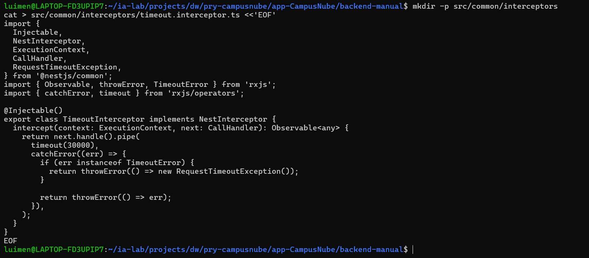

**Sugerencia de commit (issue):**

``` bash
git add .
git commit -m "feat: add timeout.interceptor.ts"
```

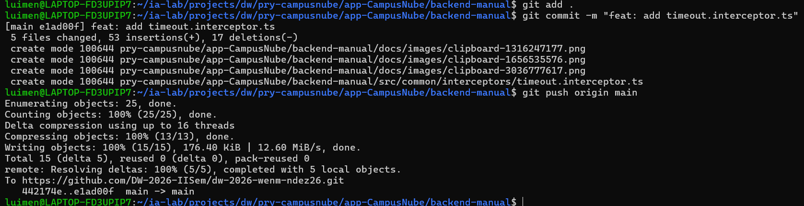

Verificamos en Github

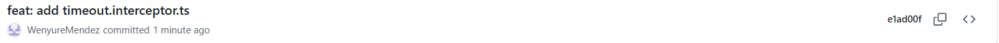

#### 6.23 — common/pipes/validation.pipe.ts

Archivo del feature en Clean Architecture.

**Archivo:** `src/common/pipes/validation.pipe.ts`

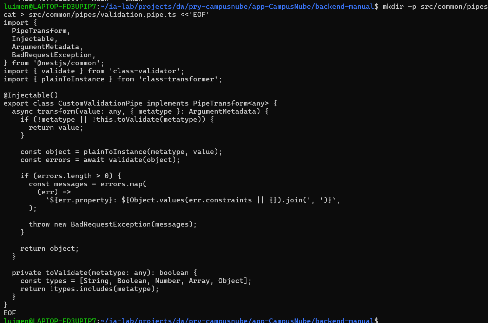

**Sugerencia de commit (issue):**

``` bash
git add .
git commit -m "feat: add validation.pipe.ts"
```

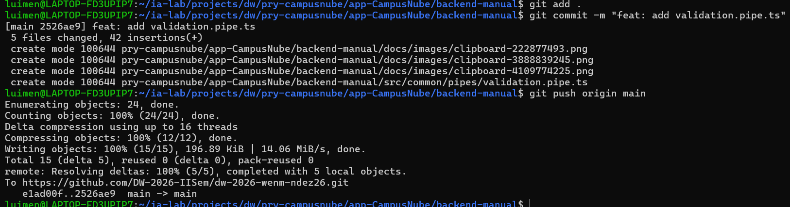

Verificamos en Github

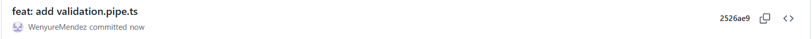

#### 6.24 — common/pipes/parse-positive-int.pipe.ts

Archivo del feature en Clean Architecture.

**Archivo:** `src/common/pipes/parse-positive-int.pipe.ts`

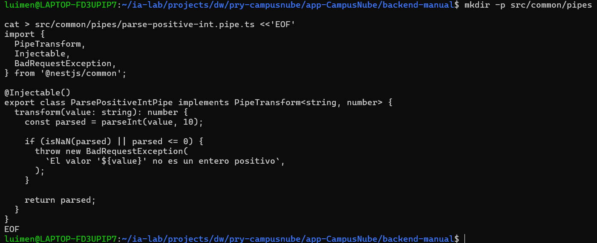

**Sugerencia de commit (issue):**

``` bash
git add . 
git commit -m "feat: add parse-positive-int.pipe.ts"
```

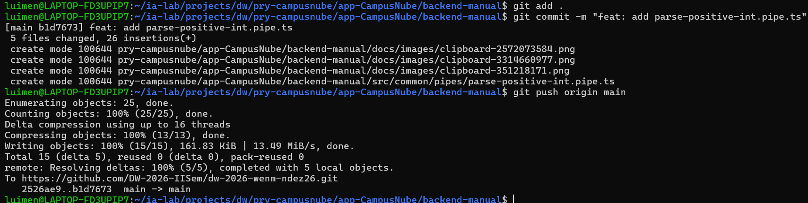

Verificamos en Github

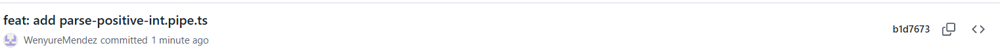

#### 6.25 — common/decorators/public.decorator.ts

Archivo del feature en Clean Architecture.

**Archivo:** `src/common/decorators/public.decorator.ts`

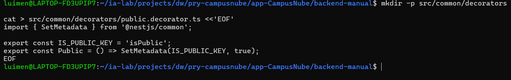

**Sugerencia de commit (issue):**

``` bash
git add . 
git commit -m "feat: add public.decorator.ts"
```

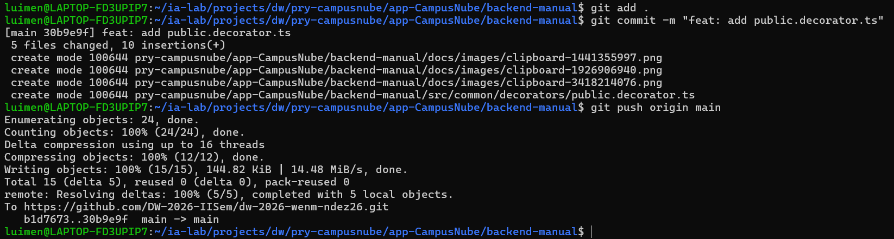

Verificamos en Github

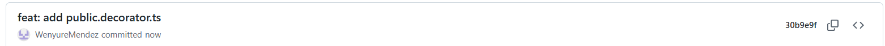

#### 6.26 — common/decorators/roles.decorator.ts

Archivo del feature en Clean Architecture.

**Archivo:** `src/common/decorators/roles.decorator.ts`

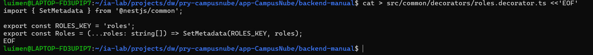

**Sugerencia de commit (issue):**

``` bash
git add . 
git commit -m "feat: add roles.decorator.ts"
```

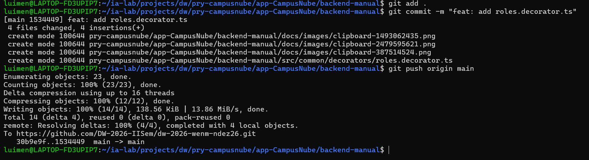

Verificamos con Github

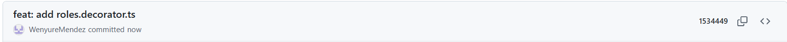

#### 6.27 — common/decorators/current-user.decorator.ts

Archivo del feature en Clean Architecture.

**Archivo:** `src/common/decorators/current-user.decorator.ts`

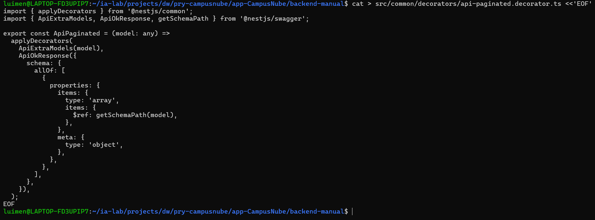

**Sugerencia de commit (issue):**

``` bash
git add . 
git commit -m "feat: add current-user.decorator.ts"
```

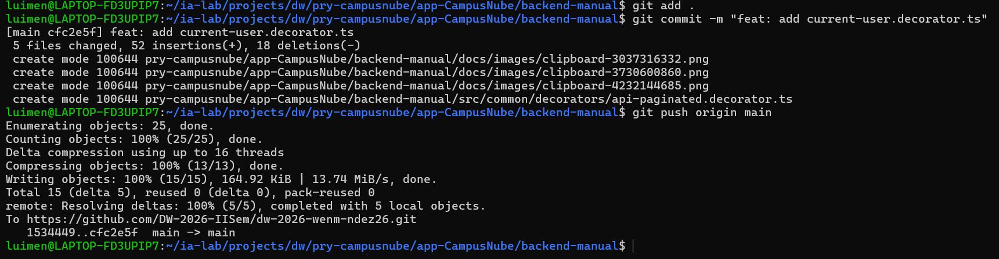

Verificamos en Github

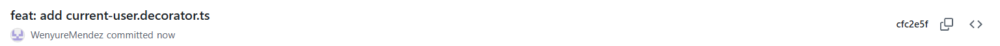

#### 6.28 — common/decorators/resource.decorator.ts

Archivo del feature en Clean Architecture.

**Archivo:** `src/common/decorators/resource.decorator.ts`

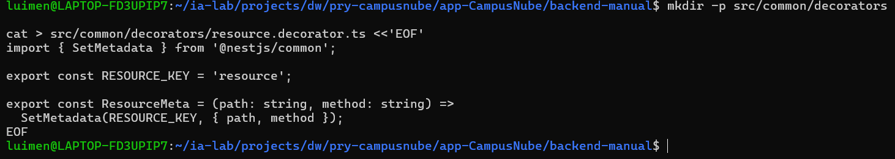

**Sugerencia de commit (issue):**

``` bash
git add .
git commit -m "feat: add resource.decorator.ts"
```

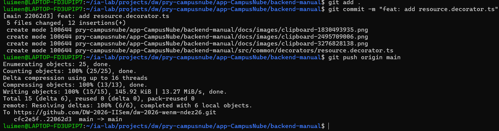

Verificamos en Github

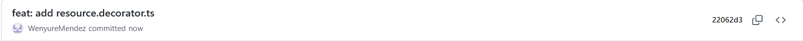

#### 6.29 — common/interfaces/authenticated-user.interface.ts

Archivo del feature en Clean Architecture.

**Archivo:** `src/common/interfaces/authenticated-user.interface.ts`

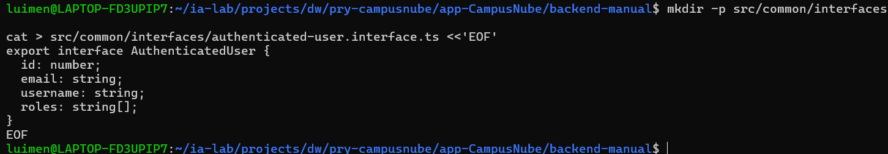

**Sugerencia de commit (issue):**

``` bash
git add . 
git commit -m "feat: add authenticated-user.interface.ts"
```

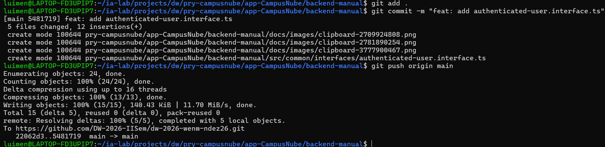

Verificamos en Github

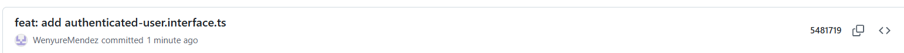

#### 6.30 — common/interfaces/pagination.interface.ts

Archivo del feature en Clean Architecture.

**Archivo:** `src/common/interfaces/pagination.interface.ts`

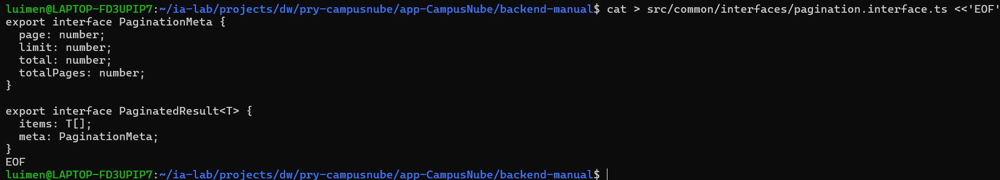

**Sugerencia de commit (issue):**

``` bash
git add . 
git commit -m "feat: add pagination.interface.ts"
```

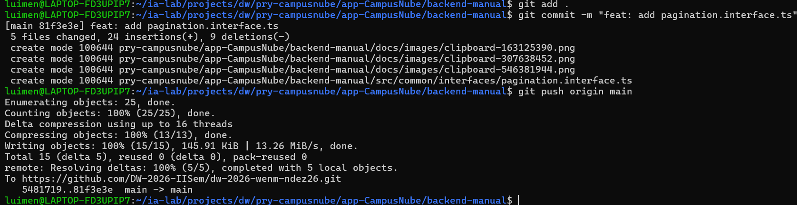

Se verifcó en Github

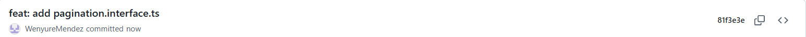

#### 6.31 — common/interfaces/api-response.interface.ts

Archivo del feature en Clean Architecture.

**Archivo:** `src/common/interfaces/api-response.interface.ts`

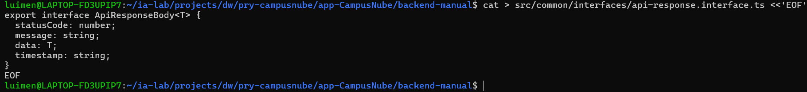

**Sugerencia de commit (issue):**

``` bash
git add . 
git commit -m "feat: add api-response.interface.ts"
```

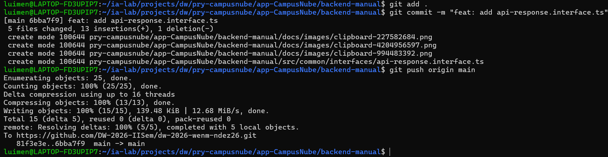

Se verificó en Github

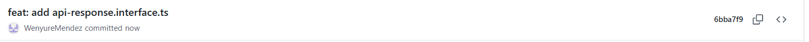

#### 6.32 — common/types/nullable.type.ts

Archivo del feature en Clean Architecture.

**Archivo:** `src/common/types/nullable.type.ts`

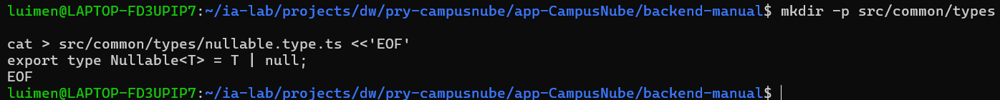

**Sugerencia de commit (issue):**

``` bash
git add . 
git commit -m "feat: add nullable.type.ts"
```

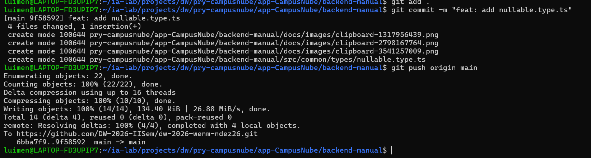

Se verificó en Github

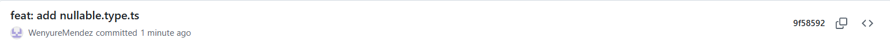

#### 6.33 — common/types/optional.type.ts

Archivo del feature en Clean Architecture.

**Archivo:** `src/common/types/optional.type.ts`

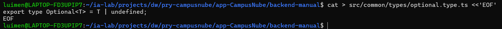

**Sugerencia de commit (issue):**

``` bash
git add . 
git commit -m "feat: add optional.type.ts"
```

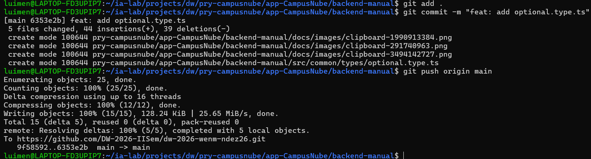

Se verificó en Github

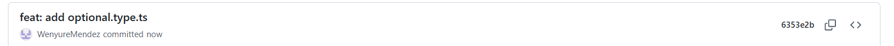

#### 6.34 — common/utils/pagination.util.ts

Archivo del feature en Clean Architecture.

**Archivo:** `src/common/utils/pagination.util.ts`

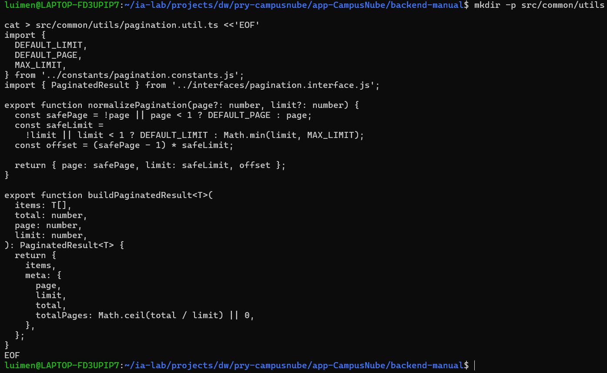

**Sugerencia de commit (issue):**

``` bash
git add . 
git commit -m "feat: add pagination.util.ts"
```

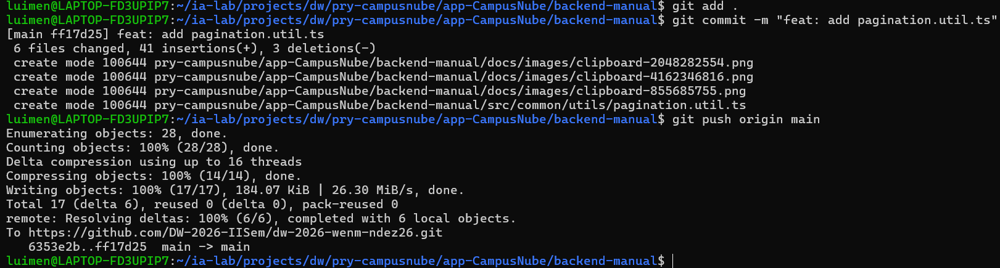

Se verifcó en Github

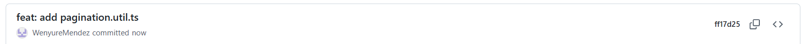

#### 6.35 — common/utils/date.util.ts

Archivo del feature en Clean Architecture.

**Archivo:** `src/common/utils/date.util.ts`

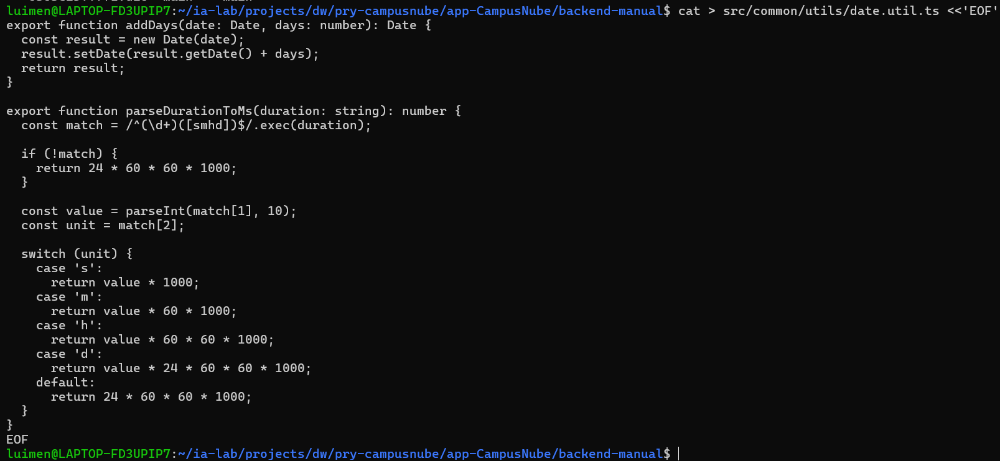

**Sugerencia de commit (issue):**

``` bash
git add .
git commit -m "feat: add date.util.ts"
```

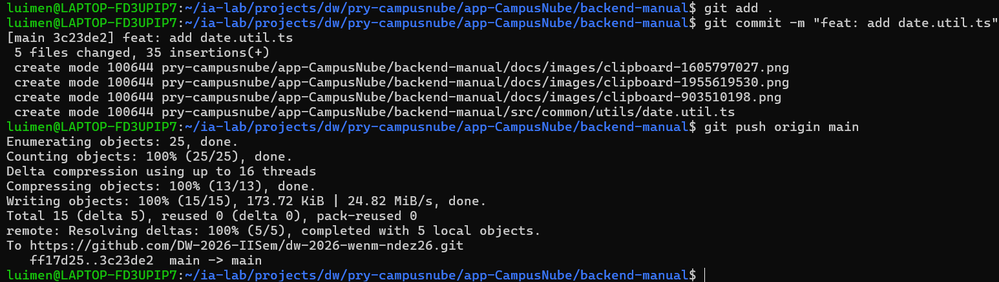

Se verificó en Github

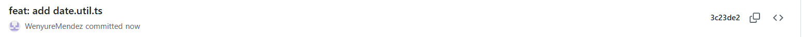

#### 6.36 — common/utils/string.util.ts

Archivo del feature en Clean Architecture.

**Archivo:** `src/common/utils/string.util.ts`¿

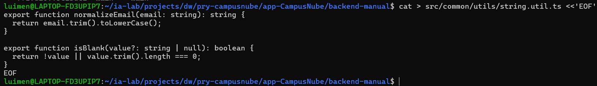

**Sugerencia de commit (issue):**

``` bash
git add . 
git commit -m "feat: add string.util.ts"
```

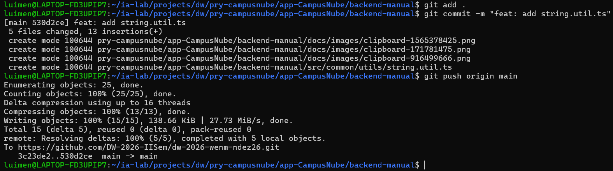

Verificamos en Github

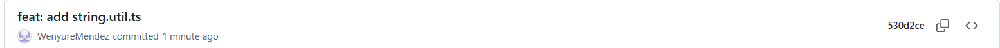

#### 6.37 — infrastructure/security/hashing/password-hasher.interface.ts

Archivo del feature en Clean Architecture.

**Archivo:** `src/infrastructure/security/hashing/password-hasher.interface.ts`

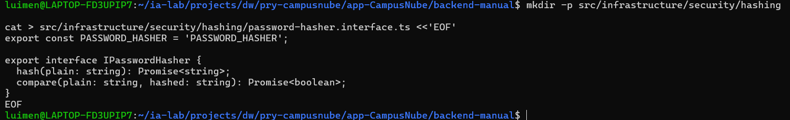

**Sugerencia de commit (issue):**

``` bash
git add . 
git commit -m "feat: add password-hasher.interface.ts"
```

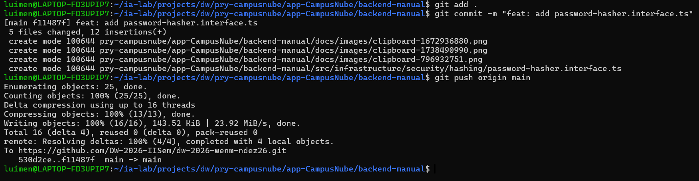

Verficamos en Github

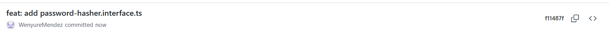

#### 6.38 — infrastructure/security/hashing/bcrypt-password-hasher.service.ts

Archivo del feature en Clean Architecture.

**Archivo:** `src/infrastructure/security/hashing/bcrypt-password-hasher.service.ts`

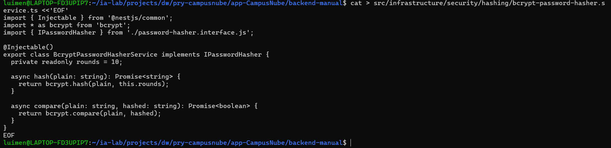

**Sugerencia de commit (issue):**

``` bash
git add . 
git commit -m "feat: add bcrypt-password-hasher.service.ts"
```

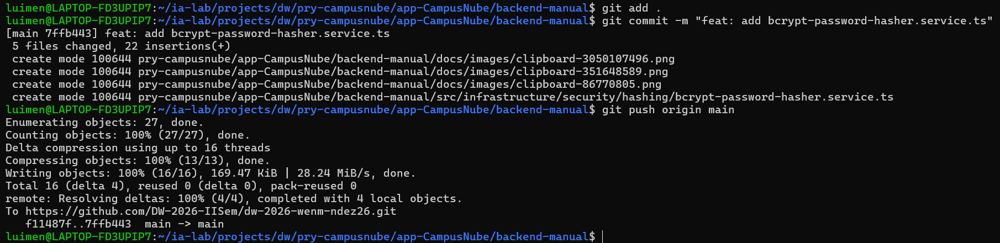

Verificamos en Github

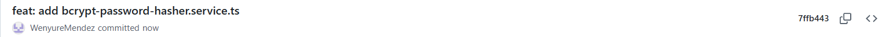

#### 6.39 — infrastructure/security/tokens/token.interface.ts

Archivo del feature en Clean Architecture.

**Archivo:** `src/infrastructure/security/tokens/token.interface.ts`

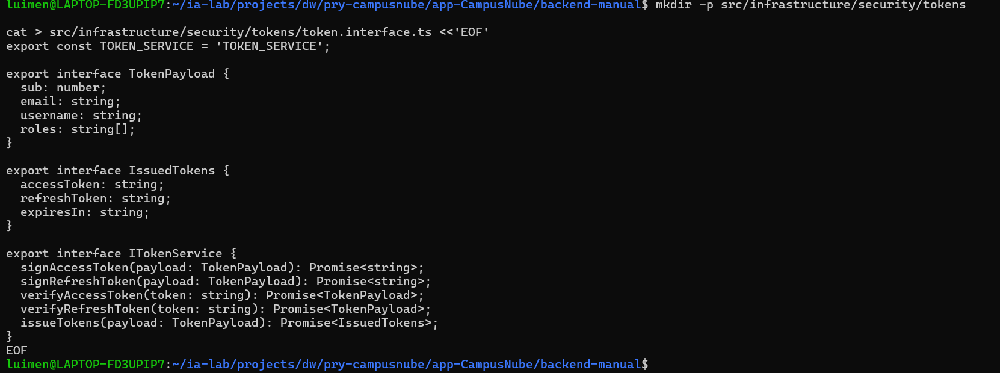

**Sugerencia de commit (issue):**

``` bash
git add . 
git commit -m "feat: add token.interface.ts"
```

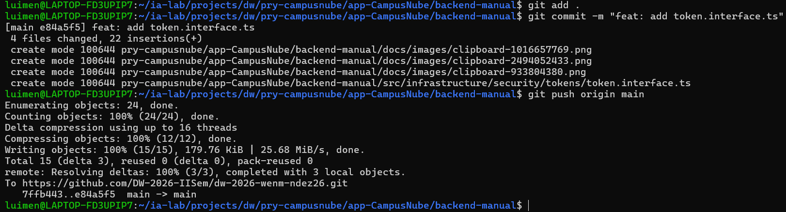

Verficamos en Github

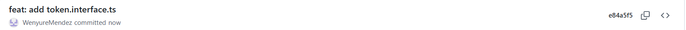

#### 6.40 — infrastructure/security/tokens/token.service.ts

Archivo del feature en Clean Architecture.

**Archivo:** `src/infrastructure/security/tokens/token.service.ts`

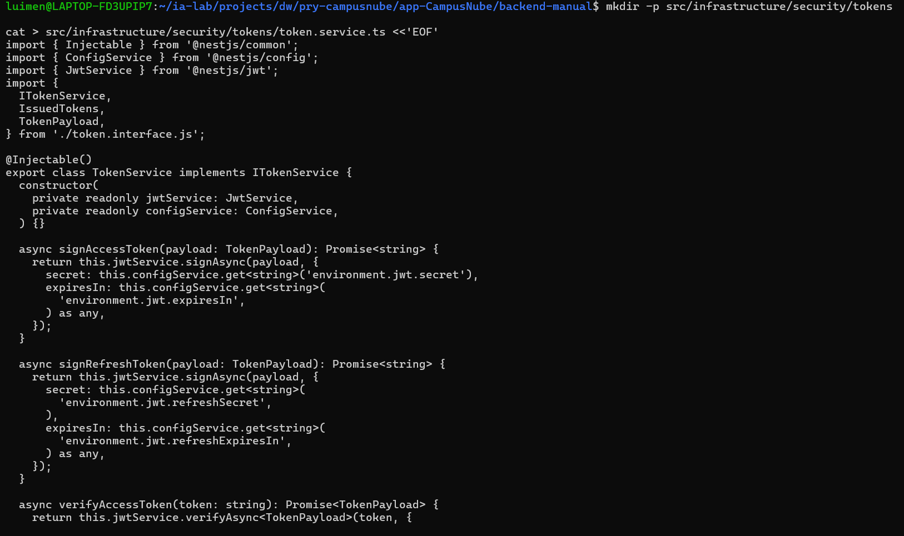

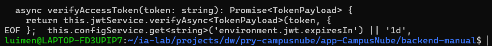

**Sugerencia de commit (issue):**

``` bash
git add . 
git commit -m "feat: add token.service.ts"
```

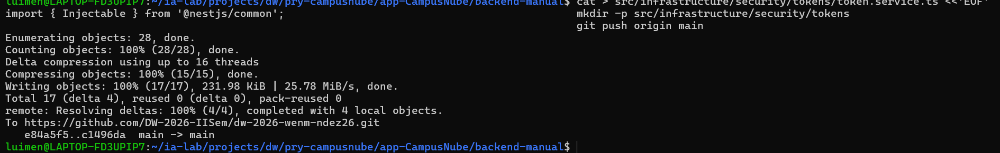

Se verificó en Github

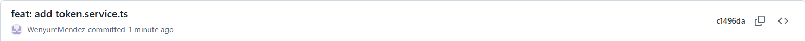

#### 6.41 — infrastructure/security/security.module.ts

Módulo Nest del feature: cablea providers, tokens DI y controller.

**Archivo:** `src/infrastructure/security/security.module.ts`

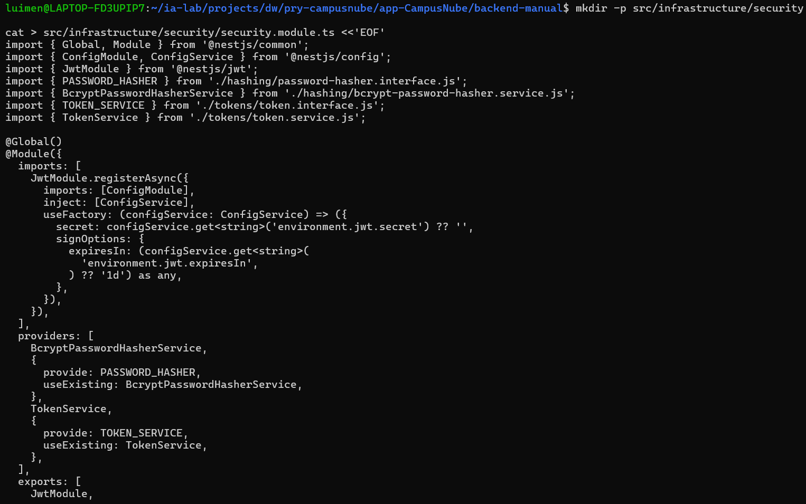

**Sugerencia de commit (issue):**

``` bash
git add . 
git commit -m "feat: wire nest module security.module.ts"
```

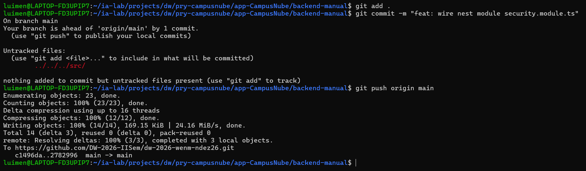

Se verificó en Github


#### 6.42 — Actualizar main.ts (bootstrap completo)

Prefix global, filters, interceptors, pipes, Swagger y manejo amigable de EADDRINUSE.

**Archivo:** `src/main.ts`

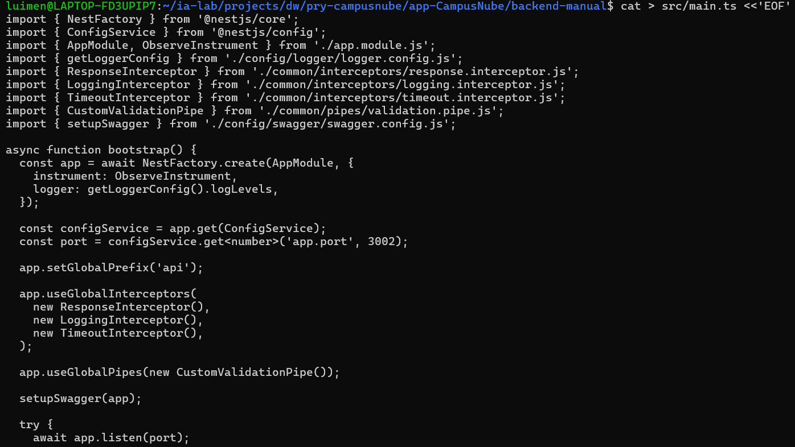

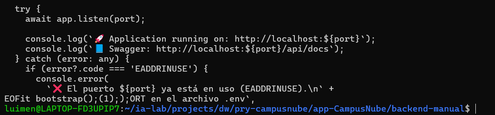

**Sugerencia de commit (issue):**

``` bash
git add . 
git commit -m "feat: harden main.ts bootstrap with swagger and global pipes"
```

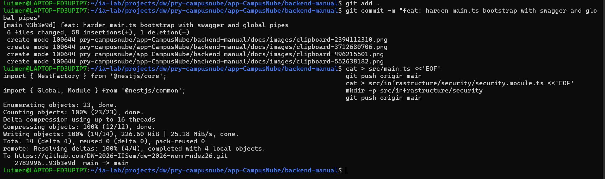

Se verificó en Github

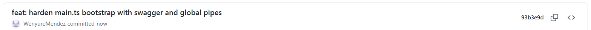

#### 6.43 — Actualizar app.module.ts (base sin features ni guards)

Cablea Config + Sequelize + Security + Logger. Business/Auth y guards llegan en fases posteriores.

**Archivo:** `src/app.module.ts`

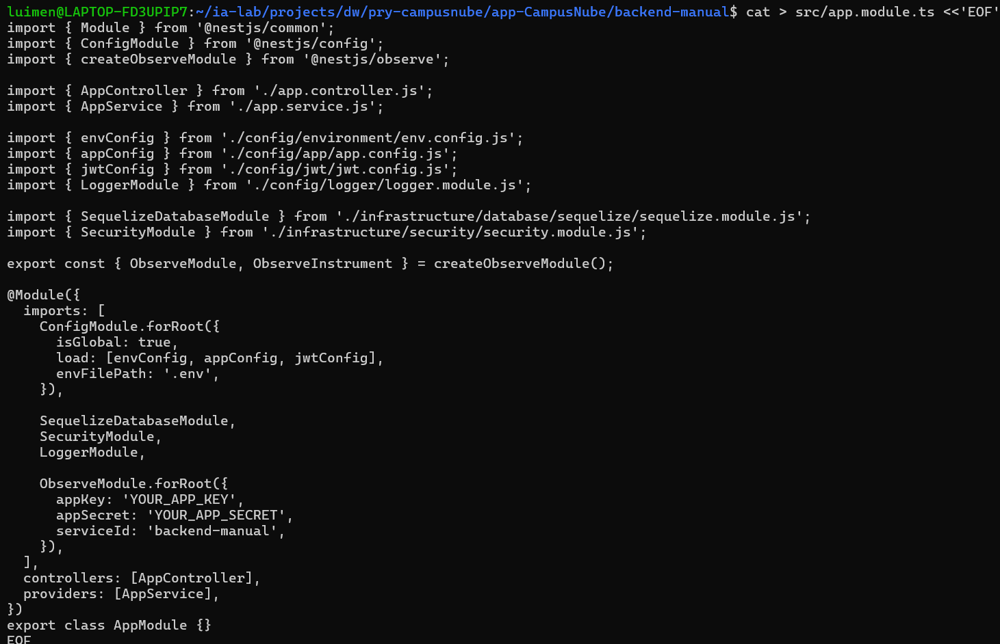

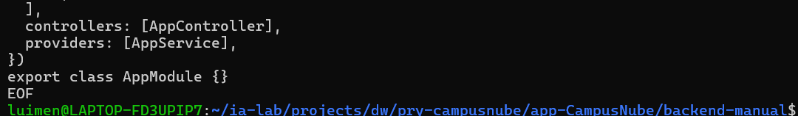

**Sugerencia de commit (issue):**

``` bash
git add . 
git commit -m "feat: wire AppModule with config database security logger"
```

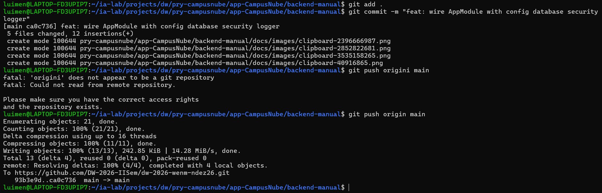

Se verificó en Github

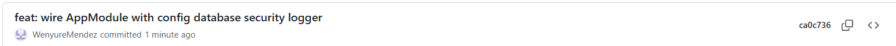

#### 6.44 — Verificar bootstrap transversal

La app debe arrancar, mostrar Swagger en `/api/docs` y conectar a BD. Todavía no hay endpoints de negocio.

``` bash
npm run start:dev # Abre http://localhost:3002/api/docs # Ctrl+C
```

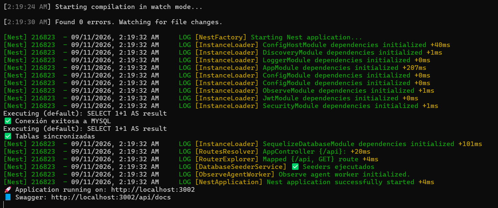

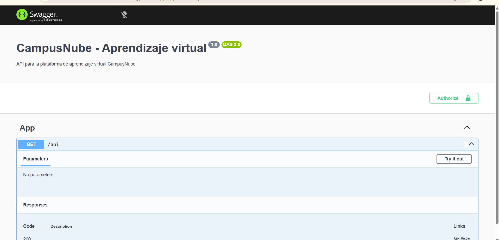

**Sugerencia de commit (issue):**

``` bash
git add . 
git commit -m "test: verify base infrastructure bootstrap"
```

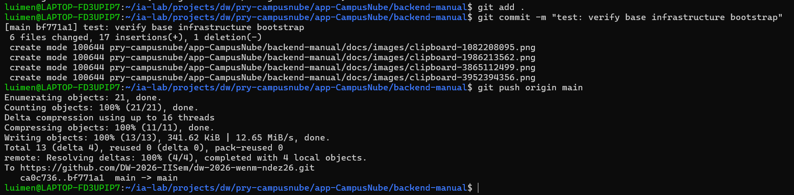

Se verificó en Github

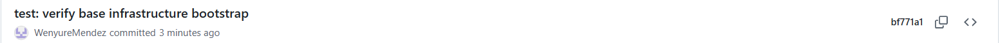

## FASE 7 — Courses

#### 7.1 — features/business/courses/domain/entities/couses.e

Entidad de dominio (TypeScript puro). No extiende Sequelize `Model`. Aquí viven las reglas del negocio.

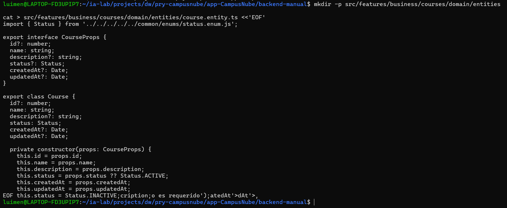

**Sugerencia de commit (issue):**

``` bash
git add . 
git commit -m "feat: add domain entity course.entity.ts"
```

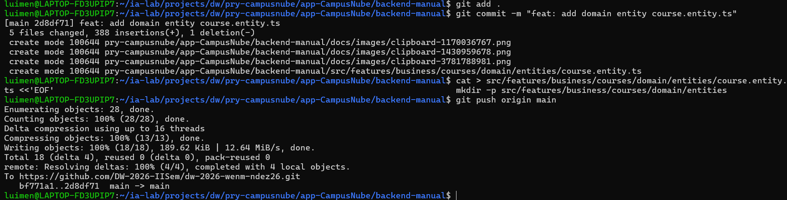

Verificamos en Github

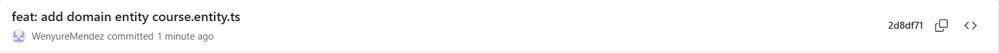

#### 7.2 — features/business/courses/domain/exceptions/course-email-already-exists.exception.ts

Excepción de dominio. El caso de uso la lanza; el filter HTTP la traduce a status code.

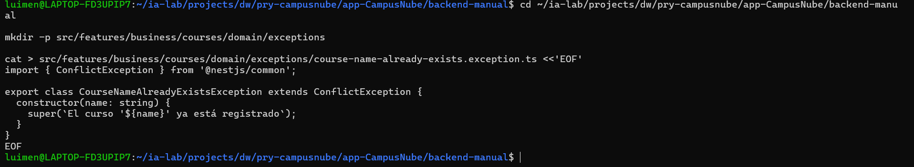

**Sugerencia de commit (issue):**

``` bash
git add . 
git commit -m "feat: add domain exception course-name-already-exists.exception.ts"
```

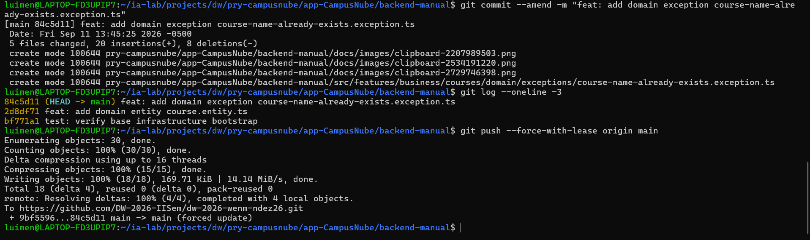

Verificamos en Github

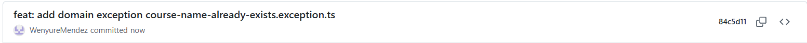

#### 7.3 — features/business/courses/domain/exceptions/course-not-found.exception.ts

Excepción de dominio. El caso de uso la lanza; el filter HTTP la traduce a status code.

**Archivo:** `src/features/business/courses/domain/exceptions/course-not-found.exception.ts`

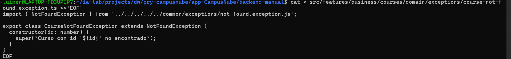

**Sugerencia de commit (issue):**

``` bash
git add . 
git commit -m "feat: add domain exception clien-not-found.exception.ts"
```

Verificamos eh Github

#### 7.4 — features/business/clients/domain/interfaces/client-repository.interface.ts

Puerto (contrato) del repositorio. La aplicación depende de esta interface, no de Sequelize.

**Archivo:** `src/features/business/clients/domain/interfaces/client-repository.interface.ts`

``` bash
mkdir -p src/features/business/clients/domain/interfaces cat > src/features/business/clients/domain/interfaces/client-repository.interface.ts <<'EOF_BACKEND_IA' import { PaginatedResult } from '../../../../../common/interfaces/pagination.interface'; import { Client } from '../entities/client.entity';  export const CLIENT_REPOSITORY = 'CLIENT_REPOSITORY';  export interface ClientFindAllParams {   page?: number;   limit?: number;   search?: string; }  export interface IClientRepository {   create(client: Client): Promise<Client>;   update(client: Client): Promise<Client>;   delete(id: number): Promise<void>;   findById(id: number): Promise<Client | null>;   findByEmail(email: string): Promise<Client | null>;   findAll(params: ClientFindAllParams): Promise<PaginatedResult<Client>>; } EOF_BACKEND_IA
```

**Sugerencia de commit (issue):**

``` bash
git add . git commit -m "feat: add repository port client-repository.interface.ts"
```

#### 7.5 — features/business/clients/domain/validators/client-email.validator.ts

Validador de dominio reutilizable (reglas independientes del framework HTTP).

**Archivo:** `src/features/business/clients/domain/validators/client-email.validator.ts`

``` bash
mkdir -p src/features/business/clients/domain/validators cat > src/features/business/clients/domain/validators/client-email.validator.ts <<'EOF_BACKEND_IA' export function isValidEmail(email: string): boolean {   const emailRegex = /^[^\s@]+@[^\s@]+\.[^\s@]+$/;   return emailRegex.test(email); } EOF_BACKEND_IA
```

**Sugerencia de commit (issue):**

``` bash
git add . git commit -m "feat: add domain validator client-email.validator.ts"
```

#### 7.6 — features/business/clients/domain/validators/client-phone.validator.ts

Validador de dominio reutilizable (reglas independientes del framework HTTP).

**Archivo:** `src/features/business/clients/domain/validators/client-phone.validator.ts`

``` bash
mkdir -p src/features/business/clients/domain/validators cat > src/features/business/clients/domain/validators/client-phone.validator.ts <<'EOF_BACKEND_IA' export function isValidPhone(phone: string): boolean {   const phoneRegex = /^[+]?[\d\s()-]{7,20}$/;   return phoneRegex.test(phone); } EOF_BACKEND_IA
```

**Sugerencia de commit (issue):**

``` bash
git add . git commit -m "feat: add domain validator client-phone.validator.ts"
```

#### 7.7 — features/business/clients/infrastructure/persistence/models/client.model.ts

Modelo Sequelize (`@Table`). Solo infraestructura: mapeo a tabla física.

**Archivo:** `src/features/business/clients/infrastructure/persistence/models/client.model.ts`

``` bash
mkdir -p src/features/business/clients/infrastructure/persistence/models cat > src/features/business/clients/infrastructure/persistence/models/client.model.ts <<'EOF_BACKEND_IA' import {   AutoIncrement,   Column,   CreatedAt,   DataType,   HasMany,   Model,   PrimaryKey,   Table,   UpdatedAt, } from 'sequelize-typescript'; import { Status } from '../../../../../../common/enums/status.enum';  @Table({ tableName: 'clients' }) export class ClientModel extends Model {   @PrimaryKey   @AutoIncrement   @Column(DataType.INTEGER)   declare id: number;    @Column({ type: DataType.STRING(150), allowNull: false })   declare name: string;    @Column({ type: DataType.STRING(255), allowNull: true })   declare address: string | null;    @Column({ type: DataType.STRING(30), allowNull: true })   declare phone: string | null;    @Column({ type: DataType.STRING(150), allowNull: true, unique: true })   declare email: string | null;    @Column({ type: DataType.STRING(255), allowNull: true })   declare password: string | null;    @Column({     type: DataType.ENUM(...Object.values(Status)),     allowNull: false,     defaultValue: Status.ACTIVE,   })   declare status: Status;    @CreatedAt   declare createdAt: Date;    @UpdatedAt   declare updatedAt: Date;    @HasMany(() => require('../../../../sales/infrastructure/persistence/models/sale.model').SaleModel)   declare sales: unknown[]; } EOF_BACKEND_IA
```

**Sugerencia de commit (issue):**

``` bash
git add . git commit -m "feat: add sequelize model client.model.ts"
```

#### 7.8 — features/business/clients/infrastructure/persistence/repositories/client.repository.ts

Adaptador del repositorio: implementa el puerto de dominio con Sequelize.

**Archivo:** `src/features/business/clients/infrastructure/persistence/repositories/client.repository.ts`

``` bash
mkdir -p src/features/business/clients/infrastructure/persistence/repositories cat > src/features/business/clients/infrastructure/persistence/repositories/client.repository.ts <<'EOF_BACKEND_IA' import { Injectable } from '@nestjs/common'; import { Op } from 'sequelize'; import {   buildPaginatedResult,   normalizePagination, } from '../../../../../../common/utils/pagination.util'; import { Client } from '../../../domain/entities/client.entity'; import {   ClientFindAllParams,   IClientRepository, } from '../../../domain/interfaces/client-repository.interface'; import { ClientMapper } from '../../../application/mappers/client.mapper'; import { ClientModel } from '../models/client.model';  @Injectable() export class ClientRepository implements IClientRepository {   async create(client: Client): Promise<Client> {     const model = await ClientModel.create(ClientMapper.toPersistence(client));     return ClientMapper.toDomain(model);   }    async update(client: Client): Promise<Client> {     await ClientModel.update(ClientMapper.toPersistence(client), {       where: { id: client.id },     });     const updated = await ClientModel.findByPk(client.id!);     return ClientMapper.toDomain(updated!);   }    async delete(id: number): Promise<void> {     await ClientModel.destroy({ where: { id } });   }    async findById(id: number): Promise<Client | null> {     const model = await ClientModel.findByPk(id);     return model ? ClientMapper.toDomain(model) : null;   }    async findByEmail(email: string): Promise<Client | null> {     const model = await ClientModel.findOne({ where: { email } });     return model ? ClientMapper.toDomain(model) : null;   }    async findAll(params: ClientFindAllParams) {     const { page, limit, offset } = normalizePagination(       params.page,       params.limit,     );      const where = params.search       ? {           [Op.or]: [             { name: { [Op.like]: `%${params.search}%` } },             { email: { [Op.like]: `%${params.search}%` } },           ],         }       : {};      const { rows, count } = await ClientModel.findAndCountAll({       where,       limit,       offset,       order: [['createdAt', 'DESC']],     });      return buildPaginatedResult(       rows.map((row) => ClientMapper.toDomain(row)),       count,       page,       limit,     );   } } EOF_BACKEND_IA
```

**Sugerencia de commit (issue):**

``` bash
git add . git commit -m "feat: add sequelize repository client.repository.ts"
```

#### 7.9 — features/business/clients/infrastructure/persistence/migrations/create-clients-table.migration.ts

Migración documental/auxiliar de la tabla. En dev el sync de Sequelize crea el esquema.

**Archivo:** `src/features/business/clients/infrastructure/persistence/migrations/create-clients-table.migration.ts`

``` bash
mkdir -p src/features/business/clients/infrastructure/persistence/migrations cat > src/features/business/clients/infrastructure/persistence/migrations/create-clients-table.migration.ts <<'EOF_BACKEND_IA' export const createClientsTableMigration = {   name: 'create-clients-table',   async up(): Promise<void> {     // Sequelize sync handles table creation in development.     // Production: CREATE TABLE clients (id, name, address, phone, email, password, status, createdAt, updatedAt)   },   async down(): Promise<void> {     // Production: DROP TABLE clients   }, }; EOF_BACKEND_IA
```

**Sugerencia de commit (issue):**

``` bash
git add . git commit -m "chore: add migration create-clients-table.migration.ts"
```

#### 7.10 — features/business/clients/infrastructure/persistence/seeders/clients.seeder.ts

Seeder de datos iniciales para desarrollo y verificación física en BD.

**Archivo:** `src/features/business/clients/infrastructure/persistence/seeders/clients.seeder.ts`

``` bash
mkdir -p src/features/business/clients/infrastructure/persistence/seeders cat > src/features/business/clients/infrastructure/persistence/seeders/clients.seeder.ts <<'EOF_BACKEND_IA' import { ClientModel } from '../models/client.model'; import { BcryptPasswordHasherService } from '../../../../../../infrastructure/security/hashing/bcrypt-password-hasher.service'; import { Status } from '../../../../../../common/enums/status.enum';  export async function seedClients(): Promise<void> {   const count = await ClientModel.count();   if (count > 0) {     return;   }    const hasher = new BcryptPasswordHasherService();    await ClientModel.bulkCreate([     {       name: 'Juan Pérez',       address: 'Calle Principal 123',       phone: '+57 300 1234567',       email: 'juan.perez@example.com',       password: await hasher.hash('password123'),       status: Status.ACTIVE,     },     {       name: 'María García',       address: 'Av. Central 456',       phone: '+57 310 9876543',       email: 'maria.garcia@example.com',       password: await hasher.hash('password123'),       status: Status.ACTIVE,     },   ]); } EOF_BACKEND_IA
```

**Sugerencia de commit (issue):**

``` bash
git add . git commit -m "chore: add seeder clients.seeder.ts"
```

#### 7.11 — features/business/clients/application/dto/client-filter.dto.ts

DTO de entrada/salida HTTP con `class-validator` / Swagger.

**Archivo:** `src/features/business/clients/application/dto/client-filter.dto.ts`

``` bash
mkdir -p src/features/business/clients/application/dto cat > src/features/business/clients/application/dto/client-filter.dto.ts <<'EOF_BACKEND_IA' import { ApiPropertyOptional } from '@nestjs/swagger'; import { Type } from 'class-transformer'; import { IsInt, IsOptional, IsPositive, IsString, Min } from 'class-validator';  export class ClientFilterDto {   @ApiPropertyOptional({ example: 1, default: 1 })   @IsOptional()   @Type(() => Number)   @IsInt()   @Min(1)   page?: number;    @ApiPropertyOptional({ example: 10, default: 10 })   @IsOptional()   @Type(() => Number)   @IsInt()   @IsPositive()   limit?: number;    @ApiPropertyOptional({ example: 'juan' })   @IsOptional()   @IsString()   search?: string; } EOF_BACKEND_IA
```

**Sugerencia de commit (issue):**

``` bash
git add . git commit -m "feat: add dto client-filter.dto.ts"
```

#### 7.12 — features/business/clients/application/dto/client-response.dto.ts

DTO de entrada/salida HTTP con `class-validator` / Swagger.

**Archivo:** `src/features/business/clients/application/dto/client-response.dto.ts`

``` bash
mkdir -p src/features/business/clients/application/dto cat > src/features/business/clients/application/dto/client-response.dto.ts <<'EOF_BACKEND_IA' import { ApiProperty, ApiPropertyOptional } from '@nestjs/swagger'; import { Status } from '../../../../../common/enums/status.enum';  export class ClientResponseDto {   @ApiProperty({ example: 1 })   id: number;    @ApiProperty({ example: 'Juan Pérez' })   name: string;    @ApiPropertyOptional({ example: 'Calle Principal 123' })   address?: string;    @ApiPropertyOptional({ example: '+57 300 1234567' })   phone?: string;    @ApiPropertyOptional({ example: 'juan.perez@example.com' })   email?: string;    @ApiProperty({ enum: Status, example: Status.ACTIVE })   status: Status;    @ApiProperty()   createdAt: Date;    @ApiProperty()   updatedAt: Date; } EOF_BACKEND_IA
```

**Sugerencia de commit (issue):**

``` bash
git add . git commit -m "feat: add dto client-response.dto.ts"
```

#### 7.13 — features/business/clients/application/dto/create-client.dto.ts

DTO de entrada/salida HTTP con `class-validator` / Swagger.

**Archivo:** `src/features/business/clients/application/dto/create-client.dto.ts`

``` bash
mkdir -p src/features/business/clients/application/dto cat > src/features/business/clients/application/dto/create-client.dto.ts <<'EOF_BACKEND_IA' import { ApiProperty, ApiPropertyOptional } from '@nestjs/swagger'; import {   IsEmail,   IsNotEmpty,   IsOptional,   IsString,   MaxLength,   MinLength, } from 'class-validator';  export class CreateClientDto {   @ApiProperty({ example: 'Juan Pérez' })   @IsString()   @IsNotEmpty()   @MaxLength(150)   name: string;    @ApiPropertyOptional({ example: 'Calle Principal 123' })   @IsOptional()   @IsString()   @MaxLength(255)   address?: string;    @ApiPropertyOptional({ example: '+57 300 1234567' })   @IsOptional()   @IsString()   @MaxLength(30)   phone?: string;    @ApiPropertyOptional({ example: 'juan.perez@example.com' })   @IsOptional()   @IsEmail()   @MaxLength(150)   email?: string;    @ApiPropertyOptional({ example: 'password123' })   @IsOptional()   @IsString()   @MinLength(6)   @MaxLength(255)   password?: string; } EOF_BACKEND_IA
```

**Sugerencia de commit (issue):**

``` bash
git add . git commit -m "feat: add dto create-client.dto.ts"
```

#### 7.14 — features/business/clients/application/dto/update-client.dto.ts

DTO de entrada/salida HTTP con `class-validator` / Swagger.

**Archivo:** `src/features/business/clients/application/dto/update-client.dto.ts`

``` bash
mkdir -p src/features/business/clients/application/dto cat > src/features/business/clients/application/dto/update-client.dto.ts <<'EOF_BACKEND_IA' import { PartialType } from '@nestjs/mapped-types'; import { CreateClientDto } from './create-client.dto';  export class UpdateClientDto extends PartialType(CreateClientDto) {} EOF_BACKEND_IA
```

**Sugerencia de commit (issue):**

``` bash
git add . git commit -m "feat: add dto update-client.dto.ts"
```

#### 7.15 — features/business/clients/application/mappers/client.mapper.ts

Mapper entre entidad de dominio y DTO de respuesta.

**Archivo:** `src/features/business/clients/application/mappers/client.mapper.ts`

``` bash
mkdir -p src/features/business/clients/application/mappers cat > src/features/business/clients/application/mappers/client.mapper.ts <<'EOF_BACKEND_IA' import { Status } from '../../../../../common/enums/status.enum'; import { Client } from '../../domain/entities/client.entity'; import { ClientResponseDto } from '../dto/client-response.dto'; import { ClientModel } from '../../infrastructure/persistence/models/client.model';  export class ClientMapper {   static toDomain(model: ClientModel): Client {     return Client.reconstitute({       id: model.id,       name: model.name,       address: model.address ?? undefined,       phone: model.phone ?? undefined,       email: model.email ?? undefined,       password: model.password ?? undefined,       status: model.status,       createdAt: model.createdAt,       updatedAt: model.updatedAt,     });   }    static toResponse(entity: Client): ClientResponseDto {     return {       id: entity.id!,       name: entity.name,       address: entity.address,       phone: entity.phone,       email: entity.email,       status: entity.status,       createdAt: entity.createdAt!,       updatedAt: entity.updatedAt!,     };   }    static toPersistence(entity: Client): Partial<ClientModel> {     return {       id: entity.id,       name: entity.name,       address: entity.address ?? null,       phone: entity.phone ?? null,       email: entity.email ?? null,       password: entity.password ?? null,       status: entity.status ?? Status.ACTIVE,     };   } } EOF_BACKEND_IA
```

**Sugerencia de commit (issue):**

``` bash
git add . git commit -m "feat: add mapper client.mapper.ts"
```

#### 7.16 — features/business/clients/application/use-cases/create-client.use-case.ts

Caso de uso (aplicación). Orquesta dominio + repositorio. El controller solo lo invoca.

**Archivo:** `src/features/business/clients/application/use-cases/create-client.use-case.ts`

``` bash
mkdir -p src/features/business/clients/application/use-cases cat > src/features/business/clients/application/use-cases/create-client.use-case.ts <<'EOF_BACKEND_IA' import { Inject, Injectable } from '@nestjs/common'; import {   type IPasswordHasher,   PASSWORD_HASHER, } from '../../../../../infrastructure/security/hashing/password-hasher.interface'; import { ClientEmailAlreadyExistsException } from '../../domain/exceptions/client-email-already-exists.exception'; import { Client } from '../../domain/entities/client.entity'; import {   CLIENT_REPOSITORY,   type IClientRepository, } from '../../domain/interfaces/client-repository.interface'; import { CreateClientDto } from '../dto/create-client.dto'; import { ClientMapper } from '../mappers/client.mapper';  @Injectable() export class CreateClientUseCase {   constructor(     @Inject(CLIENT_REPOSITORY)     private readonly clientRepository: IClientRepository,     @Inject(PASSWORD_HASHER)     private readonly passwordHasher: IPasswordHasher,   ) {}    async execute(dto: CreateClientDto) {     if (dto.email) {       const existing = await this.clientRepository.findByEmail(dto.email);       if (existing) {         throw new ClientEmailAlreadyExistsException(dto.email);       }     }      let password = dto.password;     if (password) {       password = await this.passwordHasher.hash(password);     }      const client = Client.create({       name: dto.name,       address: dto.address,       phone: dto.phone,       email: dto.email,       password,     });      const created = await this.clientRepository.create(client);     return ClientMapper.toResponse(created);   } } EOF_BACKEND_IA
```

**Sugerencia de commit (issue):**

``` bash
git add . git commit -m "feat: add use case create-client.use-case.ts"
```

#### 7.17 — features/business/clients/application/use-cases/delete-client.use-case.ts

Caso de uso (aplicación). Orquesta dominio + repositorio. El controller solo lo invoca.

**Archivo:** `src/features/business/clients/application/use-cases/delete-client.use-case.ts`

``` bash
mkdir -p src/features/business/clients/application/use-cases cat > src/features/business/clients/application/use-cases/delete-client.use-case.ts <<'EOF_BACKEND_IA' import { Inject, Injectable } from '@nestjs/common'; import { ClientNotFoundException } from '../../domain/exceptions/client-not-found.exception'; import {   CLIENT_REPOSITORY,   type IClientRepository, } from '../../domain/interfaces/client-repository.interface';  @Injectable() export class DeleteClientUseCase {   constructor(     @Inject(CLIENT_REPOSITORY)     private readonly clientRepository: IClientRepository,   ) {}    async execute(id: number): Promise<void> {     const client = await this.clientRepository.findById(id);     if (!client) {       throw new ClientNotFoundException(id);     }      await this.clientRepository.delete(id);   } } EOF_BACKEND_IA
```

**Sugerencia de commit (issue):**

``` bash
git add . git commit -m "feat: add use case delete-client.use-case.ts"
```

#### 7.18 — features/business/clients/application/use-cases/get-client.use-case.ts

Caso de uso (aplicación). Orquesta dominio + repositorio. El controller solo lo invoca.

**Archivo:** `src/features/business/clients/application/use-cases/get-client.use-case.ts`

``` bash
mkdir -p src/features/business/clients/application/use-cases cat > src/features/business/clients/application/use-cases/get-client.use-case.ts <<'EOF_BACKEND_IA' import { Inject, Injectable } from '@nestjs/common'; import { ClientNotFoundException } from '../../domain/exceptions/client-not-found.exception'; import {   CLIENT_REPOSITORY,   type IClientRepository, } from '../../domain/interfaces/client-repository.interface'; import { ClientMapper } from '../mappers/client.mapper';  @Injectable() export class GetClientUseCase {   constructor(     @Inject(CLIENT_REPOSITORY)     private readonly clientRepository: IClientRepository,   ) {}    async execute(id: number) {     const client = await this.clientRepository.findById(id);     if (!client) {       throw new ClientNotFoundException(id);     }      return ClientMapper.toResponse(client);   } } EOF_BACKEND_IA
```

**Sugerencia de commit (issue):**

``` bash
git add . git commit -m "feat: add use case get-client.use-case.ts"
```

#### 7.19 — features/business/clients/application/use-cases/list-clients.use-case.ts

Caso de uso (aplicación). Orquesta dominio + repositorio. El controller solo lo invoca.

**Archivo:** `src/features/business/clients/application/use-cases/list-clients.use-case.ts`

``` bash
mkdir -p src/features/business/clients/application/use-cases cat > src/features/business/clients/application/use-cases/list-clients.use-case.ts <<'EOF_BACKEND_IA' import { Inject, Injectable } from '@nestjs/common'; import {   CLIENT_REPOSITORY,   type IClientRepository, } from '../../domain/interfaces/client-repository.interface'; import { ClientFilterDto } from '../dto/client-filter.dto'; import { ClientMapper } from '../mappers/client.mapper';  @Injectable() export class ListClientsUseCase {   constructor(     @Inject(CLIENT_REPOSITORY)     private readonly clientRepository: IClientRepository,   ) {}    async execute(filter: ClientFilterDto) {     const result = await this.clientRepository.findAll(filter);     return {       items: result.items.map((client) => ClientMapper.toResponse(client)),       meta: result.meta,     };   } } EOF_BACKEND_IA
```

**Sugerencia de commit (issue):**

``` bash
git add . git commit -m "feat: add use case list-clients.use-case.ts"
```

#### 7.20 — features/business/clients/application/use-cases/update-client.use-case.ts

Caso de uso (aplicación). Orquesta dominio + repositorio. El controller solo lo invoca.

**Archivo:** `src/features/business/clients/application/use-cases/update-client.use-case.ts`

``` bash
mkdir -p src/features/business/clients/application/use-cases cat > src/features/business/clients/application/use-cases/update-client.use-case.ts <<'EOF_BACKEND_IA' import { Inject, Injectable } from '@nestjs/common'; import {   type IPasswordHasher,   PASSWORD_HASHER, } from '../../../../../infrastructure/security/hashing/password-hasher.interface'; import { ClientEmailAlreadyExistsException } from '../../domain/exceptions/client-email-already-exists.exception'; import { ClientNotFoundException } from '../../domain/exceptions/client-not-found.exception'; import {   CLIENT_REPOSITORY,   type IClientRepository, } from '../../domain/interfaces/client-repository.interface'; import { UpdateClientDto } from '../dto/update-client.dto'; import { ClientMapper } from '../mappers/client.mapper';  @Injectable() export class UpdateClientUseCase {   constructor(     @Inject(CLIENT_REPOSITORY)     private readonly clientRepository: IClientRepository,     @Inject(PASSWORD_HASHER)     private readonly passwordHasher: IPasswordHasher,   ) {}    async execute(id: number, dto: UpdateClientDto) {     const client = await this.clientRepository.findById(id);     if (!client) {       throw new ClientNotFoundException(id);     }      if (dto.email && dto.email !== client.email) {       const existing = await this.clientRepository.findByEmail(dto.email);       if (existing) {         throw new ClientEmailAlreadyExistsException(dto.email);       }     }      const updateData = { ...dto };     if (dto.password) {       updateData.password = await this.passwordHasher.hash(dto.password);     }      client.update(updateData);     const updated = await this.clientRepository.update(client);     return ClientMapper.toResponse(updated);   } } EOF_BACKEND_IA
```

**Sugerencia de commit (issue):**

``` bash
git add . git commit -m "feat: add use case update-client.use-case.ts"
```

#### 

## 

## 
