## FASE 1 — `00_BASE_INIT_NESTJS`

### Inicialización del proyecto NestJS

#### 1.1 — Crear carpetas padre y permisos

##### En este caso ya habíamos creado la carpeta vamos a dar el permiso

mkdir -p backend-manual

chmod -R 755 backend-manual

## Evidencia


**Sugerencia de commit (issue):**

Realizamos el primer commit

git add .

git commit -m "chore: prepare workspace folders for nest backend"


#### 1.2 — Instalar Nest CLI (si no existe)

El CLI generamos `main.ts`, `app.module.ts`, `tsconfig`, scripts npm entre otros


**Sugerencia de commit (issue):**

Realizamos el segundo commit


#### 1.3 — Crear proyecto NestJS

Usamos el nombre `backend_ia` (workspace didáctico). Responde las preguntas del CLI (package manager: npm).

``` bash
cd ~/ia-lab/projects/dw/pry-campusnube/app-CampusNube
nest new backend-manual
```

Evidencia de que quedo creado el proyecto


**Sugerencia de commit (issue):**

**Sugerencia de commit (issue):**

``` bash
git add . 
git commit -m "chore: scaffold nestjs project backend_manual"
git push origin main
```

#### 


#### 1.4 — Crear `.env` mínimo (puerto)

El puerto `3002` evita choques con el 3000. Más adelante el `.env` crecerá con BD y JWT.

``` bash
cat > .env <<'EOF_BACKEND_MANUAL' PORT=3002 NODE_ENV=development EOF_BACKEND_MANUAL
```

Evidenciamos


**Sugerencia de commit (issue):**

``` bash
git add .
git commit -m "chore: add initial .env with PORT=3002"
```

Evidencia de qeu se realizó el commit correctamente desde la terminal de Ubutntun y en Github


#### 1.5 — Commit inicial del esqueleto

Congela el punto de partida reproducible.

``` bash
git init
git add .
git commit -m "chore: inicialización del proyecto NestJS"
```

## FASE 2 — `01_BASE_DEPS_Y_PUERTO`

### Dependencias + manejo de puerto (EADDRINUSE)

En esta fase realizamos las dependencias y el manejo de puesto de CampusNube

#### 2.1 — Dependencias de producción

Config, Swagger, JWT/Passport, Sequelize + drivers de 4 motores, validación, bcrypt y utilidades HTTP.

``` bash
npm install @nestjs/config @nestjs/swagger @nestjs/jwt @nestjs/passport @nestjs/mapped-types \   passport passport-jwt sequelize sequelize-typescript mysql2 pg tedious oracledb \   class-validator class-transformer bcrypt reflect-metadata express compression helmet
```

Evidencia del las dependencias


**Sugerencia de commit (issue):**

``` bash
git add .
git commit -m "chore: install production dependencies for ca backend"
```

Evudencia del Commit Por Ubuntu


En github se verfica si quedo registrado.


#### 2.2 — Dependencias de desarrollo

En este paso se realizan las dependencias de desarrollo

Tipados y sequelize-cli para herramientas de BD.

``` bash
npm install -D @types/bcrypt @types/passport-jwt sequelize-cli
```

Evidencia de que se instalo de dependencias de desarrollo

**Sugerencia de commit (issue):**

``` bash
git add . 
git commit -m "chore: install auth and sequelize-cli devDependencies"
```

Se evidencia que se realizó el commit correctamente desde la consola de Ubuntu


Desde Github


#### 2.3 — Script para liberar puerto (evita EADDRINUSE)

En este paso realizamos para liberar el puerto en Linux/WSL

Si reinicias Nest sin matar el proceso anterior, Node lanza `listen EADDRINUSE`. Este script lee `PORT` del `.env` y libera el puerto en Linux/WSL.

``` bash
mkdir -p scripts cat > scripts/free-port.js <<'EOF_BACKEND_IA' /**  * Libera el puerto configurado en .env (PORT) antes de arrancar Nest.  * Evita EADDRINUSE cuando queda una instancia previa de start:dev.  */ const { execSync } = require('child_process'); const fs = require('fs'); const path = require('path');  function readPortFromEnv() {   const envPath = path.join(__dirname, '..', '.env');   let port = 3002;    if (fs.existsSync(envPath)) {     const content = fs.readFileSync(envPath, 'utf8');     const match = content.match(/^\s*PORT\s*=\s*(\d+)\s*$/m);     if (match) {       port = parseInt(match[1], 10);     }   }    if (process.env.PORT) {     port = parseInt(process.env.PORT, 10) || port;   }    return port; }  function freePort(port) {   try {     // Linux/WSL: mata el proceso que escucha en el puerto     execSync(`fuser -k ${port}/tcp`, { stdio: 'ignore' });     console.log(`✅ Puerto ${port} liberado`);   } catch {     // No había proceso escuchando: ok     console.log(`ℹ️  Puerto ${port} disponible`);   } }  const port = readPortFromEnv(); freePort(port); EOF_BACKEND_MANUAL
```

Evudencia desde la consola de ubuntu


**Sugerencia de commit (issue):**

``` bash
git add .
git commit -m "chore: add scripts/free-port.js to avoid EADDRINUSE"
```

En este paso realizamos el commit desde la consola de Ubuntu


Verficamos desde Github


#### 2.4 — Actualizar scripts npm en package.json

En este paso se actualiza los scripts npm

Integra `free:port` en `start:dev` / `start:debug`. Aplica el cambio con Node para no editar JSON a mano.

``` bash
node <<'EOF_BACKEND_MANUAL' const fs = require('fs'); const pkg = JSON.parse(fs.readFileSync('package.json', 'utf8')); pkg.scripts = {   ...pkg.scripts,   'free:port': 'node scripts/free-port.js',   'start:dev': 'npm run free:port && nest start --watch',   'start:debug': 'npm run free:port && nest start --debug --watch', }; fs.writeFileSync('package.json', JSON.stringify(pkg, null, 2) + '\n'); console.log('✅ package.json scripts actualizados'); EOF_BACKEND_MANUAL
```


Se verifica si se actualizó correctamente


**Sugerencia de commit (issue):**

Ahora se realizá el commit desde la consola de Ubuntu.

``` bash
git add . 
git commit -m "chore: wire free:port into nest start scripts"
```


Desde Github


#### 2.5 — Verificar arranque base

En este paso se realizá el levantamiento del Hello World de Nest en el Puerto del `.env`.

``` bash
npm run start:dev # Ctrl+C cuando veas el log de arranque curl -s http://localhost:3002 || true
```


**Sugerencia de commit (issue):**

Ahora realizamos el commit desde la terminal de Ubuntu

``` bash
git add . git commit -m "test: verify nest boots after dependency install"
```

------------------------------------------------------------------------


Ahora verifficamos desde Github


## FASE 3 — `02_BASE_ESTRUCTURA_CA`

### Estructura de carpetas Clean Architecture

> En esta fase se realizó la creación del mapa mental: config / common / infrastructure / features (business + auth).

#### 3.1 — Crear árbol base de carpetas

Aún no hay código de dominio. Solo directorios y módulos vacíos de features para anclar imports futuros.

``` bash
cd ~/ia-lab/projects/dw/pry-campusnube/app-CampusNube/backend-manual

mkdir -p src/config/{app,database,environment,jwt,logger,swagger}

mkdir -p src/common/{constants,decorators,enums,exceptions,filters,guards,interceptors,interfaces,pipes,types,utils,validators}

mkdir -p src/infrastructure/database/{sequelize,migrations,seeders}

mkdir -p src/infrastructure/{logging,security/hashing,security/tokens}
```


**Sugerencia de commit (issue):**

Ahora realizamos el commit en la terminal de Ubuntu

``` bash
git add . 
git commit -m "chore: create clean architecture folder tree and empty feature modules"
```


Ahora se verifica si se creo el commit correctamente en Github


#### 3.2 — Recordatorio de responsabilidades

| Carpeta           | Responsabilidad                              |
|-------------------|----------------------------------------------|
| `config/`         | Cómo se configura la app (env, jwt, swagger) |
| `common/`         | Piezas transversales reutilizables           |
| `infrastructure/` | Detalles técnicos (Sequelize, bcrypt, JWT)   |
| `features/*`      | Dominios (business/auth) con CA interna      |

**Error típico:** poner `@Table` de Sequelize dentro de `domain/entities`.

**Sugerencia de commit (issue):**

Realizamos el commit

``` bash
git add . git commit -m "docs: note clean architecture folder responsibilities"
```


Verfificamos en Github


------------------------------------------------------------------------

## FASE 4 — `03_BASE_ENTORNO_ENV`

### Configuración del entorno tipado (multi-base)

> **Objetivo de la fase:** Centralizar variables en `.env`: selector `DB_DIALECT` y un bloque de credenciales por motor (MySQL, PostgreSQL, SQL Server, Oracle). Validar antes del boot.

#### 4.1 — Crear `.env.example` y actualizar `.env` completo

El `.env` real NO se sube a Git. Usa BD dedicada CampusNube.

**Contrato multi-base (igual que `docs/Prompt.md`):** - `DB_DIALECT` = `mysql` \| `postgres` \| `mssql` \| `oracle` (elige qué motor corre). - MySQL: `DB_MYSQL_HOST`, `DB_MYSQL_PORT`, `DB_MYSQL_USERNAME`, `DB_MYSQL_PASSWORD`, `DB_MYSQL_NAME`. - PostgreSQL: `DB_POSTGRES_*` (puerto lab 5432). - SQL Server: `DB_MSSQL_*` (puerto lab 1433, usuario `sa`). - Oracle: `DB_ORACLE_*` + `DB_ORACLE_CONNECT_STRING` (puerto lab 1521). - Para cambiar de motor, cambia **solo** `DB_DIALECT`. No uses `DB_HOST` / `DB_USERNAME` genéricos.

``` bash
```


**Ahora realizamos el siguiente paso:**

``` bash

cp .env.example .env # Laboratorio: DB_DIALECT + un bloque por motor (MYSQL/POSTGRES/MSSQL/ORACLE). # Cambia solo el bloque del motor que uses. Mantén DB_*_NAME=tecnogua_ia
```


**Sugerencia de commit (issue):**

Realizamos el commit correspondinete

``` bash
git add .
git commit -m "chore: add typed env template and local .env for campusnube"
```


Verificamos en Github


#### 4.2 — Interface de entorno

En este paso relaizamos lo siguiente

Tipos TypeScript de las variables de entorno (APP, DB, JWT) y enum de dialectos.

**Archivo:** `src/config/environment/env.interface.ts`


**Sugerencia de commit (issue):**

Realizamos el commit

``` bash
git add .
git commit -m "feat: add environment interfaces and DatabaseDialect enum"
```


Verficamos en Github


#### 4.3 — Validación de entorno con class-validator

Si falta JWT_SECRET o DB_DIALECT es inválido, o el bloque del motor activo está vacío, el boot falla con mensaje claro.

**Archivo:** `src/config/environment/env.validation.ts`

``` bash
```


**Sugerencia de commit (issue):**

``` bash
git add .
git commit -m "feat: validate environment variables with class-validator"
```


Verifacamos en Github


#### 4.4 — Resolver de credenciales por motor

Lee el bloque DB_MYSQL\_\* / DB_POSTGRES\_\* / DB_MSSQL\_\* / DB_ORACLE\_\* según DB_DIALECT.

**Archivo:** `src/config/environment/db-env.ts`


**Sugerencia de commit (issue):**

``` bash
git add . 
git commit -m "feat: resolve database credentials per dialect"
```


Verifacamos en Github


#### 4.5 — Factory registerAs de entorno

Expone `environment.*` vía ConfigService (`registerAs`).

**Archivo:** `src/config/environment/env.config.ts`


**Sugerencia de commit (issue):**

``` bash
git add . 
git commit -m "feat: register environment config factory"
```


Vereficamos en Github


## FASE 5 — `04_BASE_DATABASE_SEQUELIZE`

### Base de datos multi-dialecto (Sequelize)

> Conectamos Sequelize al motor de `DB_DIALECT` usando el bloque `DB_MYSQL_*` / `DB_POSTGRES_*` / `DB_MSSQL_*` / `DB_ORACLE_*`. Aún sin features (ALL_MODELS vacío).

#### 5.1 — Constante SEQUELIZE_TOKEN

Token DI para inyectar la instancia Sequelize en repositorios.

**Archivo:** `src/common/constants/database.constants.ts`

``` bash
mkdir -p src/common/constants cat > src/common/constants/database.constants.ts <<'EOF_BACKEND_MANUAL' export const SEQUELIZE_TOKEN = 'SEQUELIZE'; EOF_BACKEND_MANUAL
```


**Sugerencia de commit (issue):**

``` bash
git add .
git commit -m "feat: add SEQUELIZE_TOKEN constant"
```


#### 5.2 — Tipos auxiliares de database config

Tipos auxiliares del bloque config/database (legado/compat).

**Archivo:** `src/config/database/database.types.ts`

``` bash
```


**Sugerencia de commit (issue):**

``` bash
git add . git commit -m "chore: add database.types helpers"
```


Verificamos si se creo en Github


#### 5.3 — database.config.ts

Factory registerAs opcional para namespace `database` (complementa environment).

**Archivo:** `src/config/database/database.config.ts`

``` bash
```


**Sugerencia de commit (issue):**

``` bash
git add .
git commit -m "feat: add database.config registerAs"
```


Verificamos en Github


#### 5.4 — database.module.ts / providers

Módulo de configuración de BD (forFeature). Los providers quedan vacíos a propósito.

**Archivo:** `src/config/database/database.module.ts`

``` bash
mkdir -p src/config/database cat > src/config/database/database.module.ts <<'EOF_BACKEND_MANUAL' import { Module } from '@nestjs/common'; import { ConfigModule } from '@nestjs/config'; import { databaseConfig } from './database.config';  @Module({   imports: [ConfigModule.forFeature(databaseConfig)],   exports: [ConfigModule], }) export class DatabaseConfigModule {} EOF_BACKEND_MANUAL
```


**Sugerencia de commit (issue):**

``` bash
git add .
git commit -m "feat: add DatabaseConfigModule"
```


Se verifica en Github


#### 5.5 — database.providers.ts

Placeholder de providers de config/database.

**Archivo:** `src/config/database/database.providers.ts`

``` bash
mkdir -p src/config/database cat > src/config/database/database.providers.ts <<'EOF_BACKEND_MANULA' export const DATABASE_PROVIDERS = []; EOF_BACKEND_MANUAL
```


**Sugerencia de commit (issue):**

``` bash
git add .
git commit -m "chore: add empty DATABASE_PROVIDERS"
```


Se verifica en Github


#### 5.6 — Opciones Sequelize por dialecto

Arma host/port/user/password/logging con el bloque del motor seleccionado por DB_DIALECT.

**Archivo:** `src/infrastructure/database/sequelize/sequelize.options.ts`


**Sugerencia de commit (issue):**

``` bash
git add .
git commit -m "feat: add getSequelizeOptions multi-dialect"
```


Se verificó si se creo en Github


#### 5.7 — Factory Sequelize (sin modelos aún)

Crea la instancia Sequelize. `ALL_MODELS` empieza vacío: se llena al crear cada entidad.

**Archivo:** `src/infrastructure/database/sequelize/sequelize.factory.ts`


**Sugerencia de commit (issue):**

``` bash
git add . 
git commit -m "feat: add createSequelizeInstance with empty ALL_MODELS"
```


#### 5.8 — DatabaseSeederService (sin seeders aún)

Hook OnModuleInit para seeders. Todavía no llama a ningún seeder de feature.

**Archivo:** `src/infrastructure/database/seeders/database-seeder.service.ts`


**Sugerencia de commit (issue):**

``` bash
git add . 
git commit -m "feat: add DatabaseSeederService scaffold"
```


Se verifica en Github


#### 5.9 — Módulo global Sequelize

Módulo `@Global()` que provee `SEQUELIZE_TOKEN` + ejecuta seeders.

**Archivo:** `src/infrastructure/database/sequelize/sequelize.module.ts`

``` bash
```


**Sugerencia de commit (issue):**

``` bash
git add . 
git commit -m "feat: add global SequelizeDatabaseModule"
```


Se verifica en Github


#### 5.10 — Verificar conexión a BD

Crea la BD vacía CampusNube en el motor que indica `DB_DIALECT`. Aún no hay tablas de negocio. Si falla el authenticate, corrige el **bloque de ese motor** en `.env` (no el de otro).

``` bash
# mysql: # mysql -u root -p -e "CREATE DATABASE IF NOT EXISTS campusnube;" # postgres: # createdb campusnube # mssql (sqlcmd): # sqlcmd -S localhost -U sa -Q "CREATE DATABASE campusnube;" # oracle: crea el schema/PDB que apunte DB_ORACLE_CONNECT_STRING npm run start:dev # Busca: ✅ Conexión exitosa a MYSQL (o POSTGRES / MSSQL / ORACLE según DB_DIALECT) # Ctrl+C
```


**Sugerencia de commit (issue):**

``` bash
git add .
git commit -m "test: verify sequelize authenticates against tecnogua_ia"
```


Ahora verificamos en Github


#### 6.1 — config/app/app.constants.ts

Archivo del feature en Clean Architecture.

**Archivo:** `src/config/app/app.constants.ts`

``` bash
mkdir -p src/config/app cat > src/config/app/app.constants.ts <<'EOF_BACKEND_MANUAL' export const APP_CONFIG_NAME = 'app';  export const APP_DEFAULTS = {   PORT: 3002,   NODE_ENV: 'development', }; EOF_BACKEND_MANUAL
```


**Sugerencia de commit (issue):**

``` bash
git add .
git commit -m "feat: add app.constants.ts"
```


Se verifica desde Github


#### 6.2 — config/app/app.config.ts

Archivo del feature en Clean Architecture.

**Archivo:** `src/config/app/app.config.ts`


**Sugerencia de commit (issue):**

``` bash
git add . 
git commit -m "feat: add app.config.ts"
```


Verificamos en Github


#### 6.3 — config/logger/logger.config.ts

Archivo del feature en Clean Architecture.

**Archivo:** `src/config/logger/logger.config.ts`

``` bash
```


**Sugerencia de commit (issue):**

``` bash
git add . 
git commit -m "feat: add logger.config.ts"
```


Verificamos en Github


#### 6.4 — config/logger/logger.module.ts

Módulo Nest del feature: cablea providers, tokens DI y controller.

**Archivo:** `src/config/logger/logger.module.ts`


**Sugerencia de commit (issue):**

``` bash
git add . 
git commit -m "feat: wire nest module logger.module.ts"
```


Verficamos en Github


#### 6.5 — config/jwt/jwt.constants.ts

Archivo del feature en Clean Architecture.

**Archivo:** `src/config/jwt/jwt.constants.ts`


**Sugerencia de commit (issue):**

``` bash
git add .
git commit -m "feat: add jwt.constants.ts"
```


Verificamos Github


#### 6.6 — config/jwt/jwt.config.ts

Archivo del feature en Clean Architecture.

**Archivo:** `src/config/jwt/jwt.config.ts`


**Sugerencia de commit (issue):**

``` bash
git add . 
git commit -m "feat: add jwt.config.ts"
```


Verificamos en Github


#### 6.7 — config/swagger/swagger.constants.ts

Archivo del feature en Clean Architecture.

**Archivo:** `src/config/swagger/swagger.constants.ts`


**Sugerencia de commit (issue):**

``` bash
git add .
git commit -m "feat: add swagger.constants.ts"
```


Verificamos en Github


#### 6.8 — config/swagger/swagger.config.ts

Archivo del feature en Clean Architecture.

**Archivo:** `src/config/swagger/swagger.config.ts`


**Sugerencia de commit (issue):**

``` bash
git add .
git commit -m "feat: add swagger.config.ts"
```


Verificamos en Ghitub


#### 6.9 — common/enums/status.enum.ts

Archivo del feature en Clean Architecture.

**Archivo:** `src/common/enums/status.enum.ts`


**Sugerencia de commit (issue):**

``` bash
git add . 
git commit -m "feat: add status.enum.ts"
```


Verificamos en Github


#### 6.10 — common/enums/http-method.enum.ts

Archivo del feature en Clean Architecture.

**Archivo:** `src/common/enums/http-method.enum.ts`


**Sugerencia de commit (issue):**

``` bash
git add .
git commit -m "feat: add http-method.enum.ts"
```


Verificamos en Github


#### 6.11 — common/enums/sort-order.enum.ts

Archivo del feature en Clean Architecture.

**Archivo:** `src/common/enums/sort-order.enum.ts`


**Sugerencia de commit (issue):**

``` bash
git add . 
git commit -m "feat: add sort-order.enum.ts"
```


Verificar en Github


#### 6.12 — common/constants/app.constants.ts

Archivo del feature en Clean Architecture.

**Archivo:** `src/common/constants/app.constants.ts`


**Sugerencia de commit (issue):**

``` bash
git add .
git commit -m "feat: add app.constants.ts"
```


Se verfica en Github


#### 6.13 — common/constants/pagination.constants.ts

Archivo del feature en Clean Architecture.

**Archivo:** `src/common/constants/pagination.constants.ts`


**Sugerencia de commit (issue):**

``` bash
git add .
git commit -m "feat: add pagination.constants.ts"
```


Verificamos en Github


#### 6.14 — common/exceptions/application.exception.ts

Archivo del feature en Clean Architecture.

**Archivo:** `src/common/exceptions/application.exception.ts`


**Sugerencia de commit (issue):**

``` bash
git add . 
git commit -m "feat: add application.exception.ts"
```


Verificamos en Github


#### 6.15 — common/exceptions/domain.exception.ts

Archivo del feature en Clean Architecture.

**Archivo:** `src/common/exceptions/domain.exception.ts`


**Sugerencia de commit (issue):**

``` bash
git add . 
git commit -m "feat: add domain.exception.ts"
```


Verificamos con Github


#### 6.16 — common/exceptions/entity-not-found.exception.ts

Archivo del feature en Clean Architecture.

**Archivo:** `src/common/exceptions/entity-not-found.exception.ts`


**Sugerencia de commit (issue):**

``` bash
git add .
git commit -m "feat: add entity-not-found.exception.ts"
```


Verificamos en Github


#### 6.17 — common/exceptions/validation.exception.ts

Archivo del feature en Clean Architecture.

**Archivo:** `src/common/exceptions/validation.exception.ts`


**Sugerencia de commit (issue):**

``` bash
git add .
git commit -m "feat: add validation.exception.ts"
```


Verificar en Github


#### 6.18 — common/filters/global-exception.filter.ts

Archivo del feature en Clean Architecture.

**Archivo:** `src/common/filters/global-exception.filter.ts`


**Sugerencia de commit (issue):**

``` bash
git add .
git commit -m "feat: add global-exception.filter.ts"
```


Verificamos en Github


#### 6.19 — common/filters/sequelize-exception.filter.ts

Archivo del feature en Clean Architecture.

**Archivo:** `src/common/filters/sequelize-exception.filter.ts`


**Sugerencia de commit (issue):**

``` bash
git add . 
git commit -m "feat: add sequelize-exception.filter.ts"
```


Verificamos en Github


#### 6.20 — common/interceptors/response.interceptor.ts

Archivo del feature en Clean Architecture.

**Archivo:** `src/common/interceptors/response.interceptor.ts`


**Sugerencia de commit (issue):**

``` bash
git add . 
git commit -m "feat: add response.interceptor.ts"
```


Verificamos en Github


#### 6.21 — common/interceptors/logging.interceptor.ts

Archivo del feature en Clean Architecture.

**Archivo:** `src/common/interceptors/logging.interceptor.ts`


**Sugerencia de commit (issue):**

``` bash
git add . 
git commit -m "feat: add logging.interceptor.ts"
```


Verificamos en Github


#### 6.22 — common/interceptors/timeout.interceptor.ts

Archivo del feature en Clean Architecture.

**Archivo:** `src/common/interceptors/timeout.interceptor.ts`


**Sugerencia de commit (issue):**

``` bash
git add .
git commit -m "feat: add timeout.interceptor.ts"
```


Verificamos en Github


#### 6.23 — common/pipes/validation.pipe.ts

Archivo del feature en Clean Architecture.

**Archivo:** `src/common/pipes/validation.pipe.ts`


**Sugerencia de commit (issue):**

``` bash
git add .
git commit -m "feat: add validation.pipe.ts"
```


Verificamos en Github


#### 6.24 — common/pipes/parse-positive-int.pipe.ts

Archivo del feature en Clean Architecture.

**Archivo:** `src/common/pipes/parse-positive-int.pipe.ts`


**Sugerencia de commit (issue):**

``` bash
git add . 
git commit -m "feat: add parse-positive-int.pipe.ts"
```


Verificamos en Github


#### 6.25 — common/decorators/public.decorator.ts

Archivo del feature en Clean Architecture.

**Archivo:** `src/common/decorators/public.decorator.ts`


**Sugerencia de commit (issue):**

``` bash
git add . 
git commit -m "feat: add public.decorator.ts"
```


Verificamos en Github


#### 6.26 — common/decorators/roles.decorator.ts

Archivo del feature en Clean Architecture.

**Archivo:** `src/common/decorators/roles.decorator.ts`


**Sugerencia de commit (issue):**

``` bash
git add . 
git commit -m "feat: add roles.decorator.ts"
```


Verificamos con Github


#### 6.27 — common/decorators/current-user.decorator.ts

Archivo del feature en Clean Architecture.

**Archivo:** `src/common/decorators/current-user.decorator.ts`


**Sugerencia de commit (issue):**

``` bash
git add . 
git commit -m "feat: add current-user.decorator.ts"
```


Verificamos en Github


#### 6.28 — common/decorators/resource.decorator.ts

Archivo del feature en Clean Architecture.

**Archivo:** `src/common/decorators/resource.decorator.ts`


**Sugerencia de commit (issue):**

``` bash
git add .
git commit -m "feat: add resource.decorator.ts"
```


Verificamos en Github


#### 6.29 — common/interfaces/authenticated-user.interface.ts

Archivo del feature en Clean Architecture.

**Archivo:** `src/common/interfaces/authenticated-user.interface.ts`


**Sugerencia de commit (issue):**

``` bash
git add . 
git commit -m "feat: add authenticated-user.interface.ts"
```


Verificamos en Github


#### 6.30 — common/interfaces/pagination.interface.ts

Archivo del feature en Clean Architecture.

**Archivo:** `src/common/interfaces/pagination.interface.ts`


**Sugerencia de commit (issue):**

``` bash
git add . 
git commit -m "feat: add pagination.interface.ts"
```


Se verifcó en Github


#### 6.31 — common/interfaces/api-response.interface.ts

Archivo del feature en Clean Architecture.

**Archivo:** `src/common/interfaces/api-response.interface.ts`


**Sugerencia de commit (issue):**

``` bash
git add . 
git commit -m "feat: add api-response.interface.ts"
```


Se verificó en Github


#### 6.32 — common/types/nullable.type.ts

Archivo del feature en Clean Architecture.

**Archivo:** `src/common/types/nullable.type.ts`


**Sugerencia de commit (issue):**

``` bash
git add . 
git commit -m "feat: add nullable.type.ts"
```


Se verificó en Github


#### 6.33 — common/types/optional.type.ts

Archivo del feature en Clean Architecture.

**Archivo:** `src/common/types/optional.type.ts`


**Sugerencia de commit (issue):**

``` bash
git add . 
git commit -m "feat: add optional.type.ts"
```


Se verificó en Github


#### 6.34 — common/utils/pagination.util.ts

Archivo del feature en Clean Architecture.

**Archivo:** `src/common/utils/pagination.util.ts`


**Sugerencia de commit (issue):**

``` bash
git add . 
git commit -m "feat: add pagination.util.ts"
```


Se verifcó en Github


#### 6.35 — common/utils/date.util.ts

Archivo del feature en Clean Architecture.

**Archivo:** `src/common/utils/date.util.ts`


**Sugerencia de commit (issue):**

``` bash
git add .
git commit -m "feat: add date.util.ts"
```


Se verificó en Github


#### 6.36 — common/utils/string.util.ts

Archivo del feature en Clean Architecture.

**Archivo:** `src/common/utils/string.util.ts`¿


**Sugerencia de commit (issue):**

``` bash
git add . 
git commit -m "feat: add string.util.ts"
```


Verificamos en Github


#### 6.37 — infrastructure/security/hashing/password-hasher.interface.ts

Archivo del feature en Clean Architecture.

**Archivo:** `src/infrastructure/security/hashing/password-hasher.interface.ts`


**Sugerencia de commit (issue):**

``` bash
git add . 
git commit -m "feat: add password-hasher.interface.ts"
```


Verficamos en Github


#### 6.38 — infrastructure/security/hashing/bcrypt-password-hasher.service.ts

Archivo del feature en Clean Architecture.

**Archivo:** `src/infrastructure/security/hashing/bcrypt-password-hasher.service.ts`


**Sugerencia de commit (issue):**

``` bash
git add . 
git commit -m "feat: add bcrypt-password-hasher.service.ts"
```


Verificamos en Github


#### 6.39 — infrastructure/security/tokens/token.interface.ts

Archivo del feature en Clean Architecture.

**Archivo:** `src/infrastructure/security/tokens/token.interface.ts`


**Sugerencia de commit (issue):**

``` bash
git add . 
git commit -m "feat: add token.interface.ts"
```


Verficamos en Github


#### 6.40 — infrastructure/security/tokens/token.service.ts

Archivo del feature en Clean Architecture.

**Archivo:** `src/infrastructure/security/tokens/token.service.ts`


**Sugerencia de commit (issue):**

``` bash
git add . 
git commit -m "feat: add token.service.ts"
```


Se verificó en Github


#### 6.41 — infrastructure/security/security.module.ts

Módulo Nest del feature: cablea providers, tokens DI y controller.

**Archivo:** `src/infrastructure/security/security.module.ts`


**Sugerencia de commit (issue):**

``` bash
git add . 
git commit -m "feat: wire nest module security.module.ts"
```


Se verificó en Github


#### 6.42 — Actualizar main.ts (bootstrap completo)

Prefix global, filters, interceptors, pipes, Swagger y manejo amigable de EADDRINUSE.

**Archivo:** `src/main.ts`


**Sugerencia de commit (issue):**

``` bash
git add . 
git commit -m "feat: harden main.ts bootstrap with swagger and global pipes"
```


Se verificó en Github


#### 6.43 — Actualizar app.module.ts (base sin features ni guards)

Cablea Config + Sequelize + Security + Logger. Business/Auth y guards llegan en fases posteriores.

**Archivo:** `src/app.module.ts`


**Sugerencia de commit (issue):**

``` bash
git add . 
git commit -m "feat: wire AppModule with config database security logger"
```


Se verificó en Github


#### 6.44 — Verificar bootstrap transversal

La app debe arrancar, mostrar Swagger en `/api/docs` y conectar a BD. Todavía no hay endpoints de negocio.

``` bash
npm run start:dev # Abre http://localhost:3002/api/docs # Ctrl+C
```


**Sugerencia de commit (issue):**

``` bash
git add . 
git commit -m "test: verify base infrastructure bootstrap"
```


Se verificó en Github


## FASE 7 — Courses

#### 7.1 — features/business/courses/domain/entities/couses.e


**Sugerencia de commit (issue):**

``` bash
git add . 
git commit -m "feat: add domain entity course.entity.ts"
```


Verificamos en Github


#### 7.2 — course-name-already-exists.exception.ts

Excepción de dominio. El caso de uso la lanza; el filter HTTP la traduce a status code.


**Sugerencia de commit (issue):**

``` bash
git add . 
git commit -m "feat: add domain exception course-name-already-exists.exception.ts"
```


Verificamos en Github


#### 7.3 — course-not-found.exception.ts

Excepción de dominio. El caso de uso la lanza; el filter HTTP la traduce a status code.

**Archivo:** `src/features/business/courses/domain/exceptions/course-not-found.exception.ts`


**Sugerencia de commit (issue):**

``` bash
git add . 
git commit -m "feat: add domain exception course-not-found.exception.ts"
```

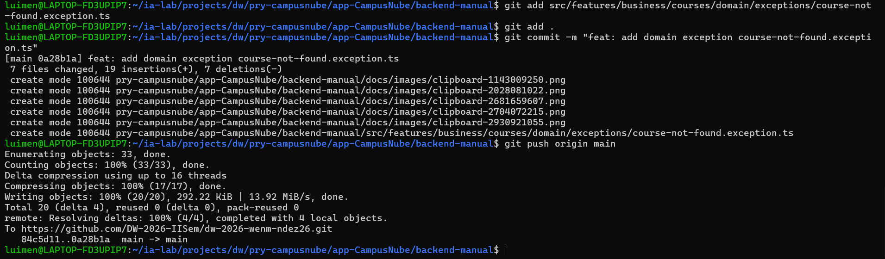

Verificamos eh Github

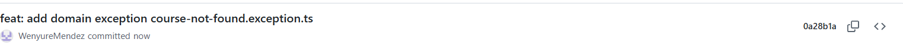

#### 7.4 — course-repository.por.ts

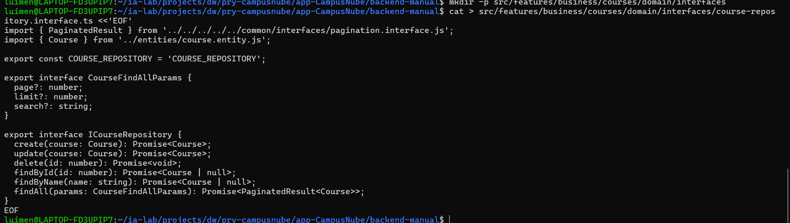

**Sugerencia de commit (issue):**

``` bash
git add . 
git commit -m "feat: add repository port course-repository.interface.ts"
```

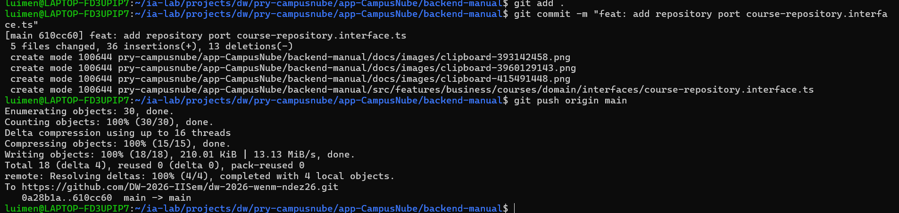

Verificamos en Github

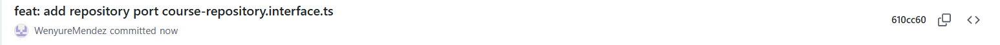

#### 7.5 — course-name.validator.ts

Validador de dominio reutilizable (reglas independientes del framework HTTP).

**Archivo:** `src/features/business/courses/domain/validators/course-name.validator.ts`

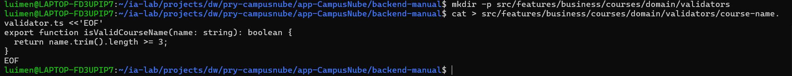

**Sugerencia de commit (issue):**

``` bash
git add . 
git commit -m "feat: add domain validator course-name.validator.ts"
```

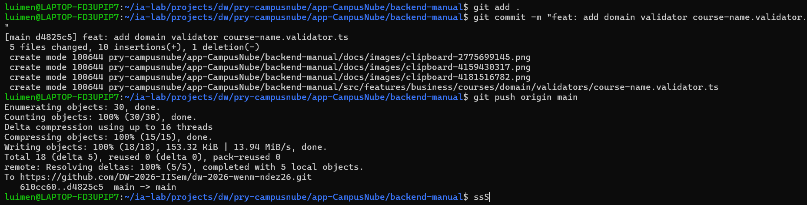

Verificamos en Github

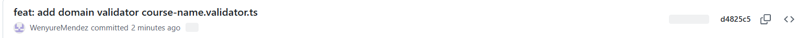

#### 7.6 — course-descrition.validator.ts

Validador de dominio reutilizable (reglas independientes del framework HTTP).

**Archivo:** `src/features/business/courses/domain/validators/course.description.validator.ts`

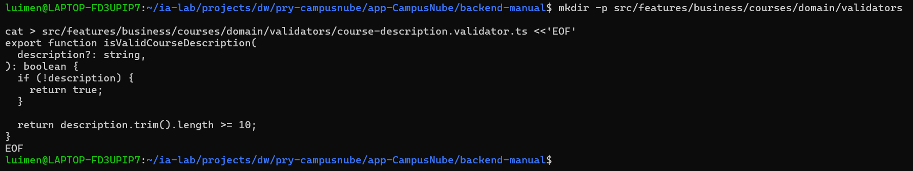

**Sugerencia de commit (issue):**

``` bash
git add . 
git commit -m "feat: add domain validator course-description.validator.ts"
```

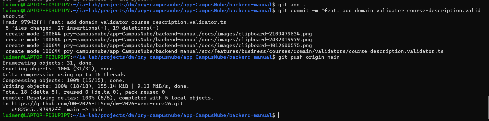

Verificamos en Github

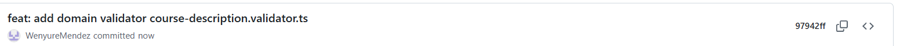

#### 7.7 — Modelo Sequelize

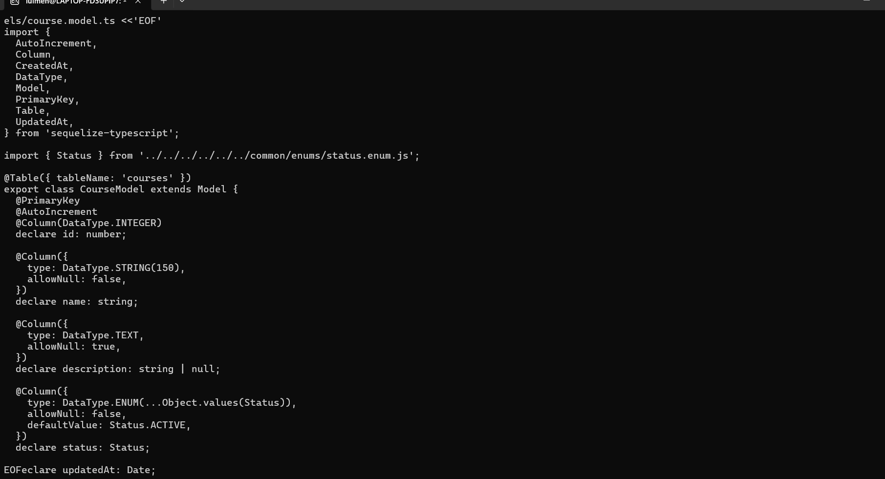

**Sugerencia de commit (issue):**

``` bash
git add . 
git commit -m "feat: add sequelize model course.model.ts"
```

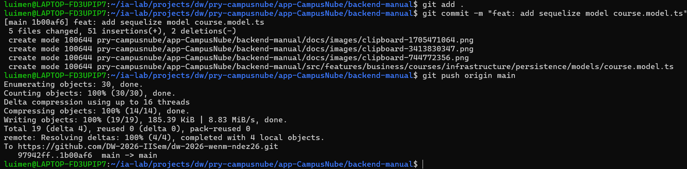

Verificamos en Github

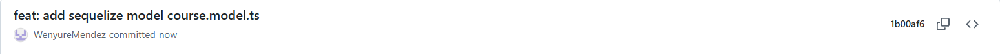

#### 7.8 —course.repository.ts

Adaptador del repositorio: implementa el puerto de dominio con Sequelize.

**Archivo:**

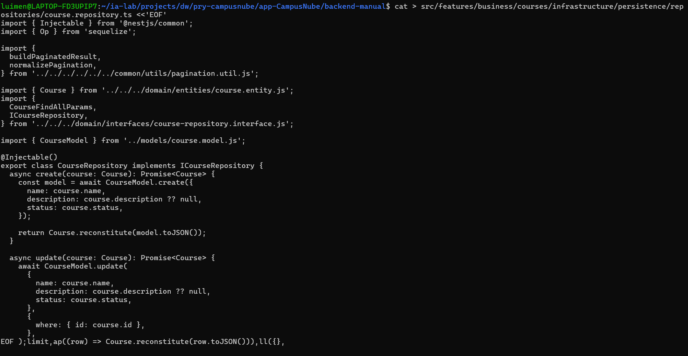

**Sugerencia de commit (issue):**

``` bash
git add . 
git commit -m "feat: add sequelize repository course.repository.ts"
```

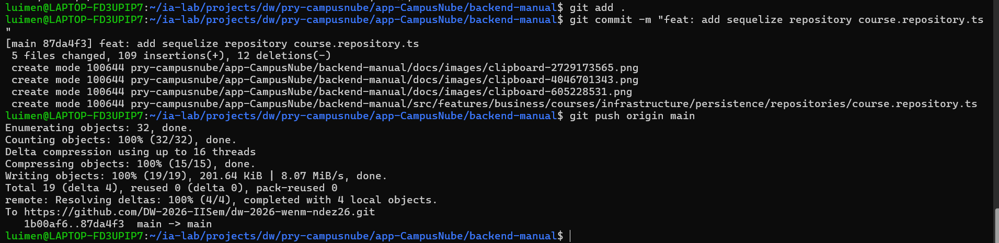

Verificamos en Github

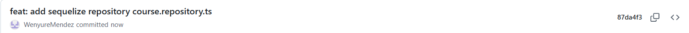

#### 7.9 — create-course-table.migration.ts

Migración documental/auxiliar de la tabla. En dev el sync de Sequelize crea el esquema.

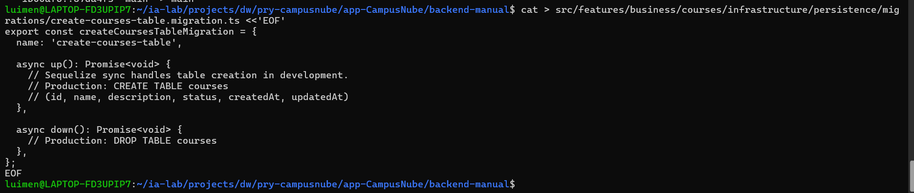

**Sugerencia de commit (issue):**

``` bash
git add . 
git commit -m "chore: add migration create-courses-table.migration.ts"
```

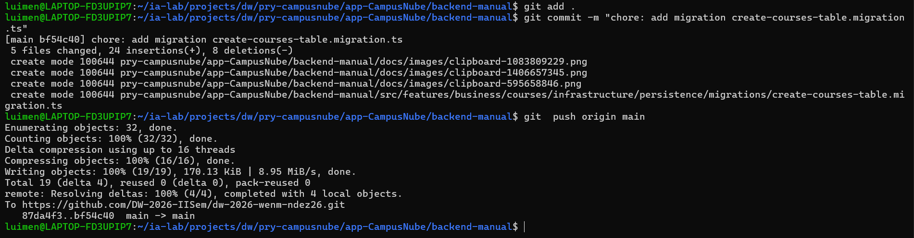

Verificamos en Github

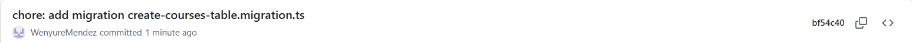

#### 7.10 — courses.seeder.ts

Seeder de datos iniciales para desarrollo y verificación física en BD.

**Archivo:**

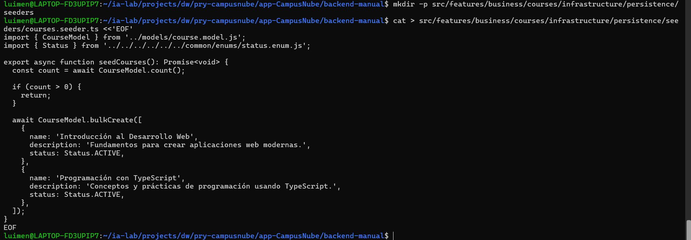

**Sugerencia de commit (issue):**

``` bash
git add .
git commit -m "chore: add seeder courses.seeder.ts"
```

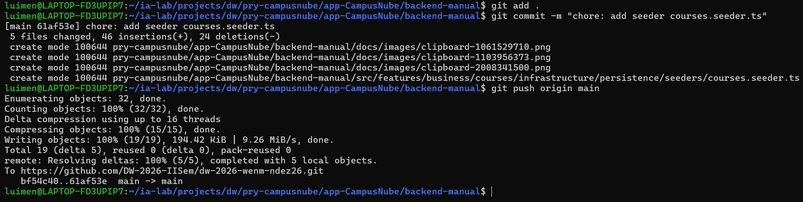

Verificamos en Github

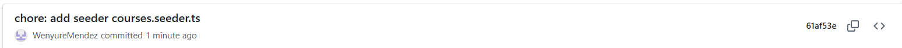

#### 7.11 — course-filter.dto.ts

DTO de entrada/salida HTTP con `class-validator` / Swagger.

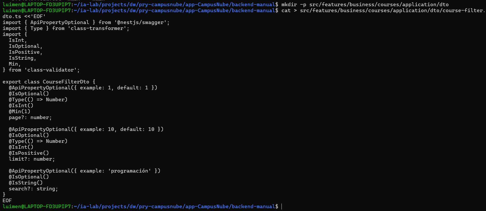

**Sugerencia de commit (issue):**

``` bash
git add . 
git commit -m "feat: add dto course-filter.dto.ts"
```

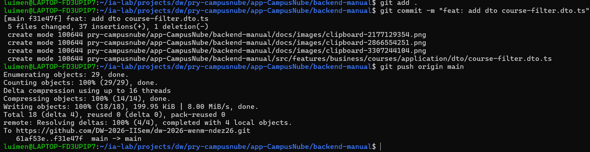

Verificar en github

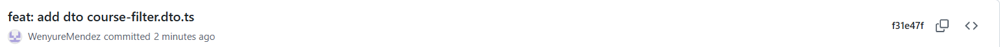

#### 7.12 — course-response.dto.ts

DTO de entrada/salida HTTP con `class-validator` / Swagger.

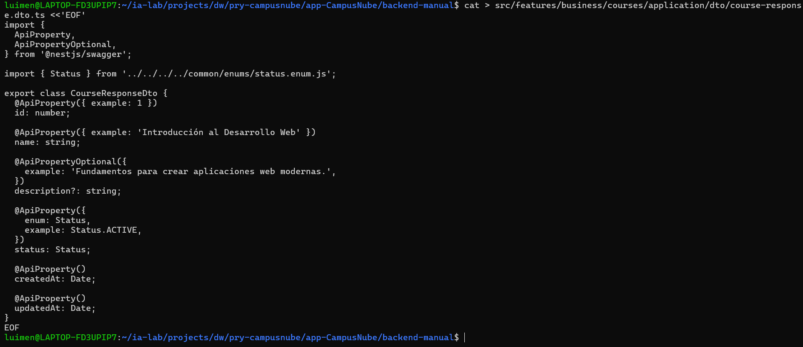

**Sugerencia de commit (issue):**

``` bash
git add . 
git commit -m "feat: add dto course-response.dto.ts"
```

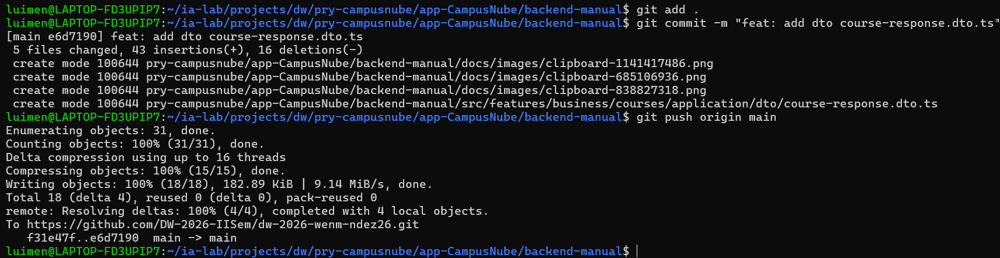

Verificamos en Github

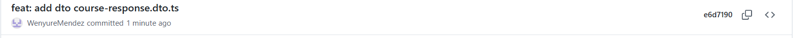

#### 7.13 — create-course.dto.ts

DTO de entrada/salida HTTP con `class-validator` / Swagger.

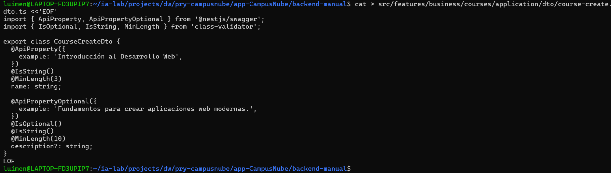

**Sugerencia de commit (issue):**

``` bash
git add . 
git commit -m "feat: add dto course-create.dto.ts"
```

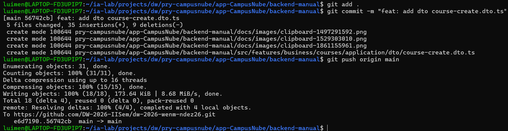

Verificamos en Github

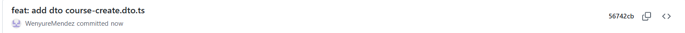

#### 7.14 — update-course.dto.ts

DTO de entrada/salida HTTP con `class-validator` / Swagger.

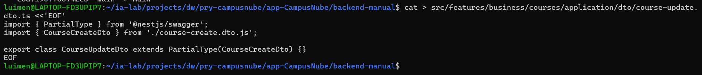

**Sugerencia de commit (issue):**

``` bash
git add . 
git commit -m "feat: add dto course-update.dto.ts"
```

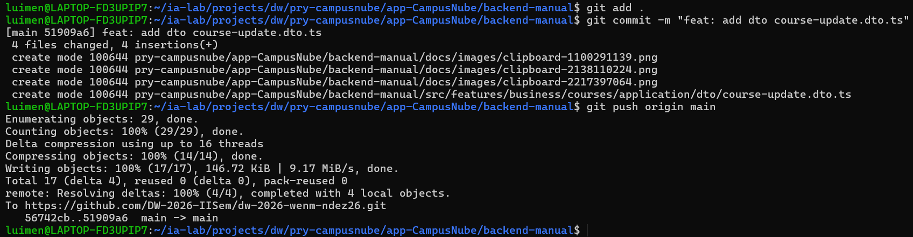

Verificamos en Github

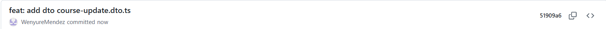

#### 7.15 — course.mapper.ts

Mapper entre entidad de dominio y DTO de respuesta.

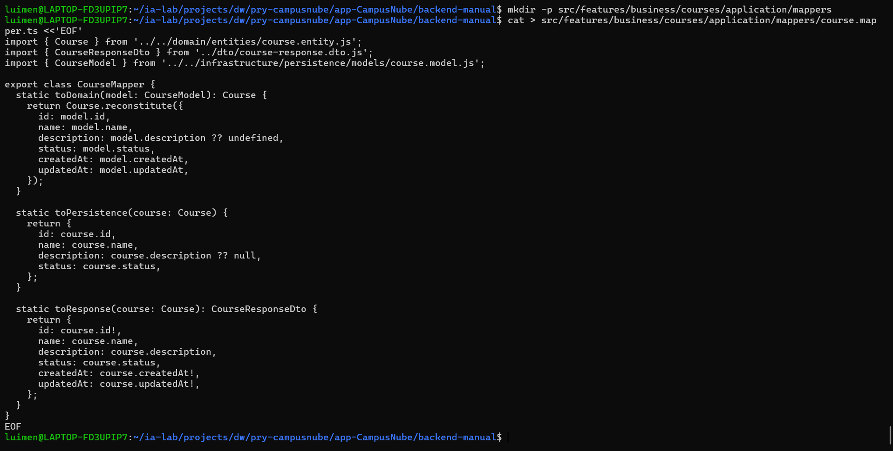

**Sugerencia de commit (issue):**

``` bash
git add .
git commit -m "feat: add mapper course.mapper.ts"
```

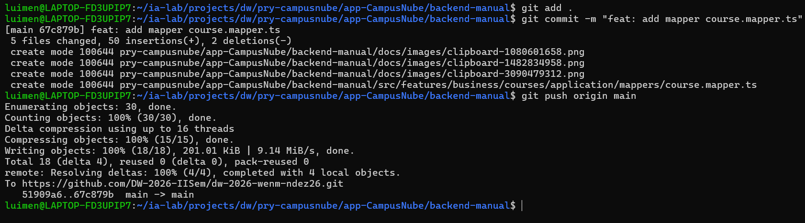

Verificamos en Github

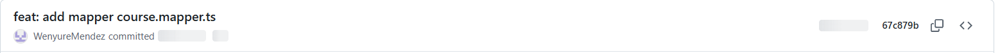

#### 7.16 — create-course.use-case.ts

Caso de uso (aplicación). Orquesta dominio + repositorio. El controller solo lo invoca.

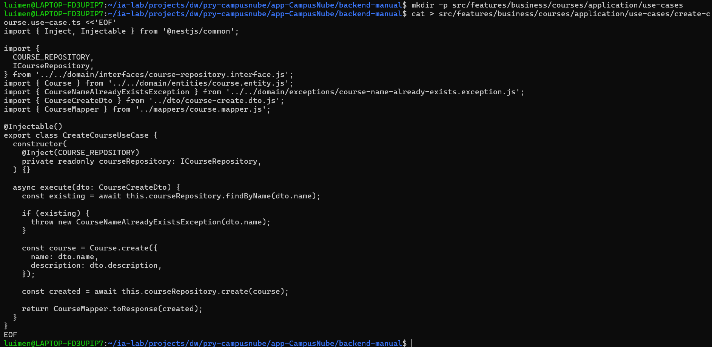

**Sugerencia de commit (issue):**

``` bash
git add . 
git commit -m "feat: add use case create-course.use-case.ts""
```

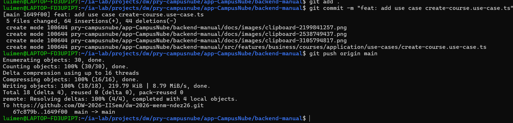

Verificamos en Github

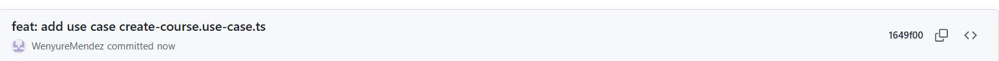

#### 7.17 — delete-course.use-case.ts

Caso de uso (aplicación). Orquesta dominio + repositorio. El controller solo lo invoca.

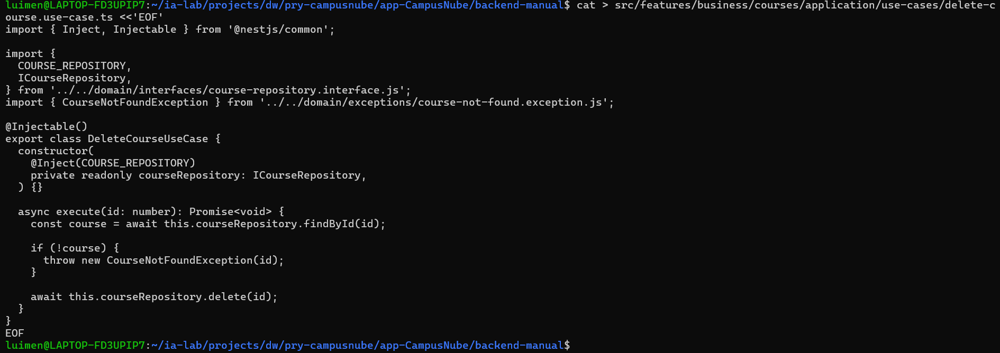

**Sugerencia de commit (issue):**

``` bash
git add .
git commit -m "feat: add use case delete-course.use-case.ts"
```

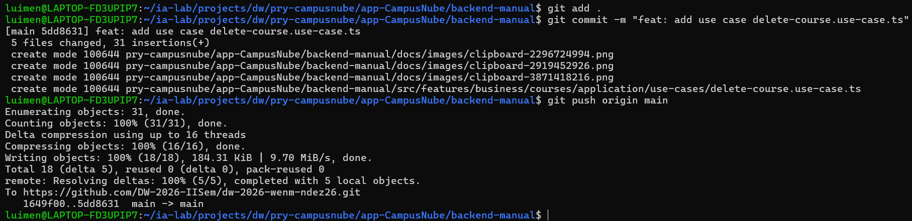

Verifcamos eb Github

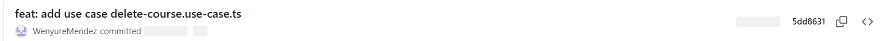

#### 7.18 — Get-course.use-case.ts

Caso de uso (aplicación). Orquesta dominio + repositorio. El controller solo lo invoca.

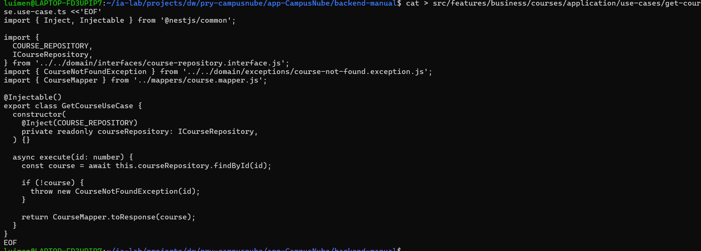

**Sugerencia de commit (issue):**

``` bash
git add . 
git commit -m "feat: add use case get-course.use-case.ts"
```

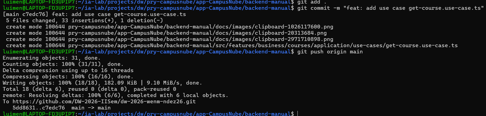

Verificamos en Github

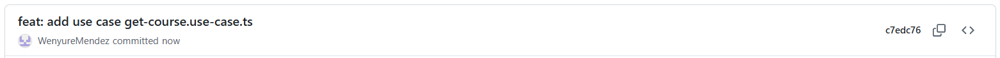

#### 7.19 — List-clients.use-case.ts

Caso de uso (aplicación). Orquesta dominio + repositorio. El controller solo lo invoca.

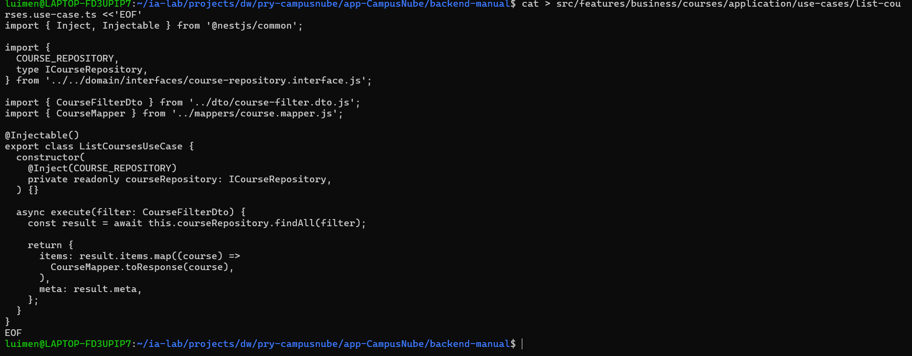

**Sugerencia de commit (issue):**

``` bash
git add . 
git commit -m "feat: add use case list-courses.use-case.ts"
```

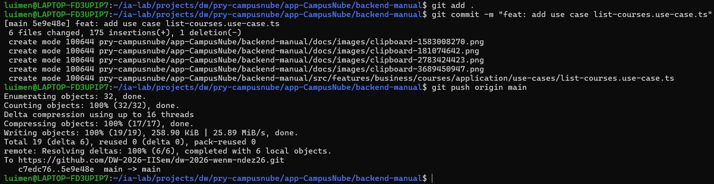

Verificamos en Github

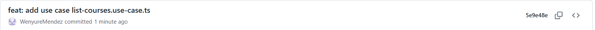

#### 7.20 — update-course.use-case.ts

Caso de uso (aplicación). Orquesta dominio + repositorio. El controller solo lo invoca.

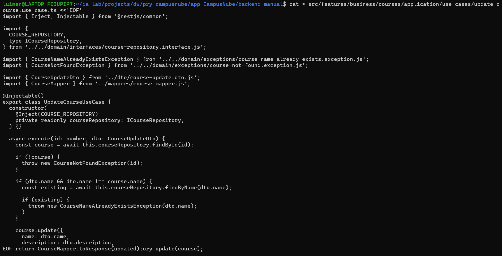

**Sugerencia de commit (issue):**

``` bash
git add . 
git commit -m "feat: add use case update-course.use-case.ts"
```

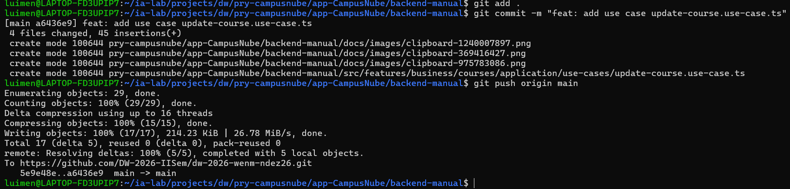

Verficamos en Github

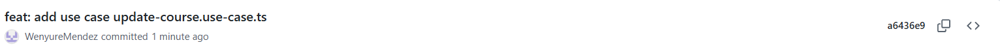

#### 7.21 — Course.serializer.ts

Serializer de presentación (forma estable de la respuesta HTTP).

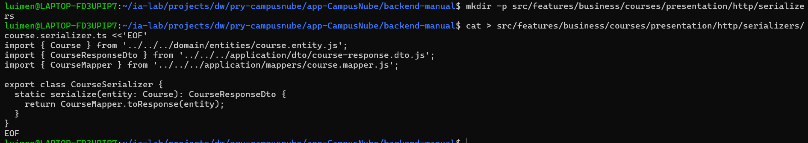

**Sugerencia de commit (issue):**

``` bash
git add . 
git commit -m "feat: add serializer course.serializer.ts"
```

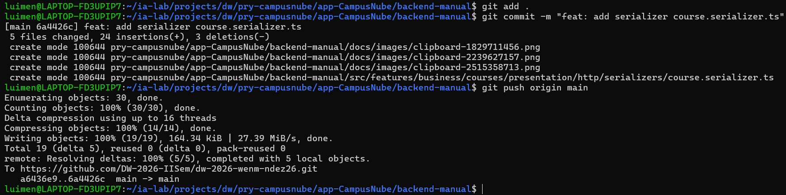

Verificamos en Github

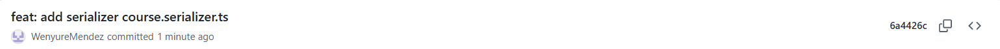

#### 7.22 — courses.controller.ts

Controller delgado: valida DTO, llama use-case, devuelve respuesta.

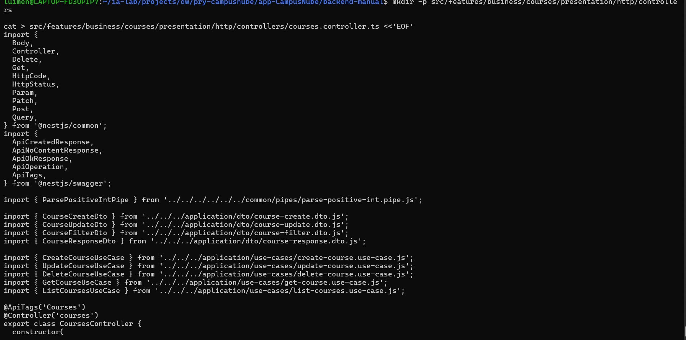

**Sugerencia de commit (issue):**

``` bash
git add . 
git commit -m "feat: add controller courses.controller.ts"
```

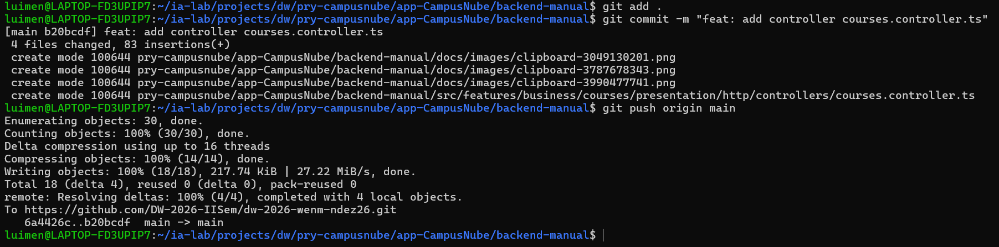

Verficamos en Github

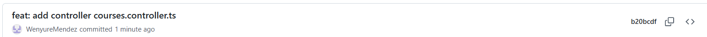

#### 7.23 — courses/index.ts

Barrel export del feature para imports limpios.

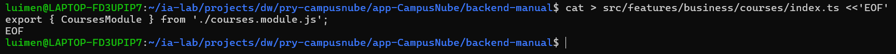

**Sugerencia de commit (issue):**

``` bash
git add . 
git commit -m "chore: add barrel export courses"
```

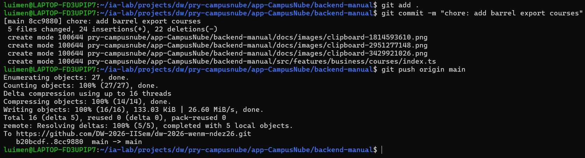

Verficamos en Github

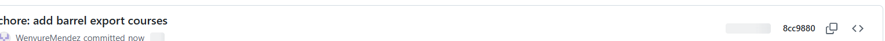

#### 7.24 — courses.module.ts

Módulo Nest del feature: cablea providers, tokens DI y controller.

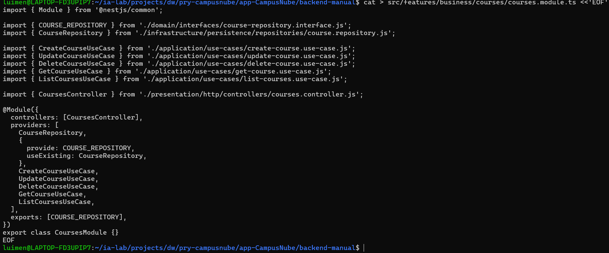

**Sugerencia de commit (issue):**

``` bash
git add . 
git commit -m "feat: wire nest module courses.module.ts"
```

Verificamos en Github

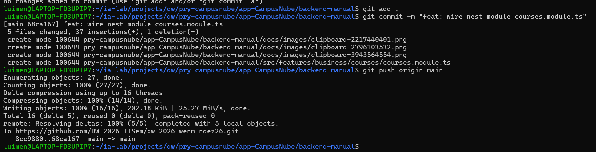

#### 7.25 — Actualizar sequelize.factory.ts (registrar modelos)

Registra en ALL_MODELS solo los modelos ya creados (orden de dependencias).

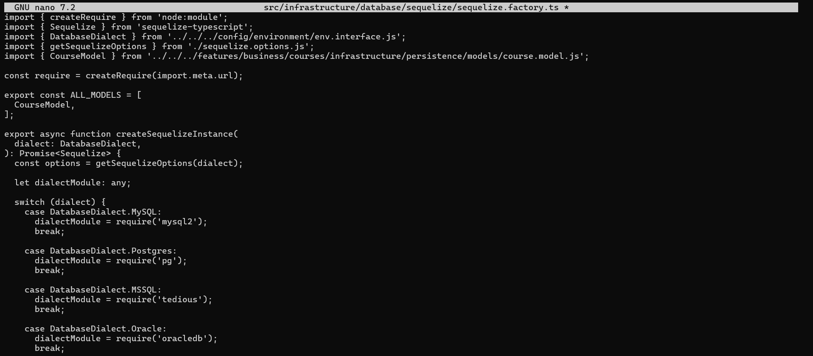

**Sugerencia de commit (issue):**

``` bash
git add .
git commit -m "feat: register CourseModel in sequelize factory"
```

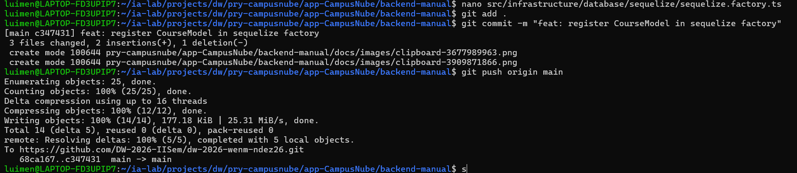

Verificamos en Github

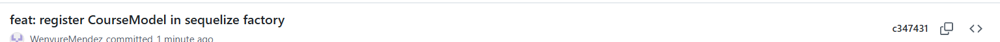

#### 7.26 — Actualizar business.module.ts

Agrega el feature module de negocio recién terminado.

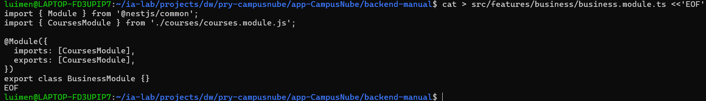

**Sugerencia de commit (issue):**

``` bash
git add . 
git commit -m "feat: export CoursesModule from BusinessModule"
```

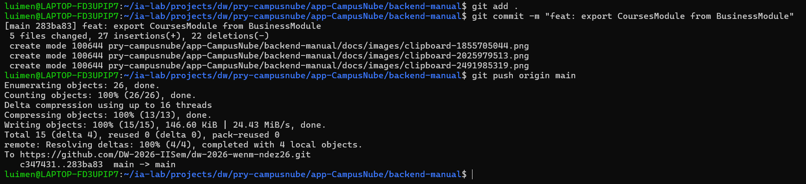

Verificamos en Github

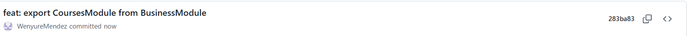

#### 7.27 — Actualizar database-seeder.service.ts

Ejecuta seeders en orden de dependencias al arrancar (dev).

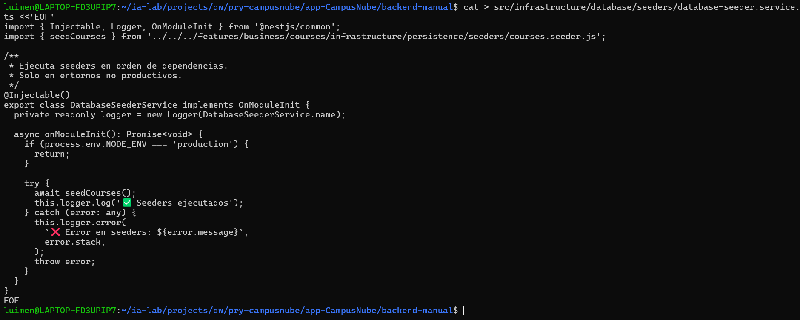

**Sugerencia de commit (issue):**

``` bash
git add . 
git commit -m "chore: run seedCourses on bootstrap"
```

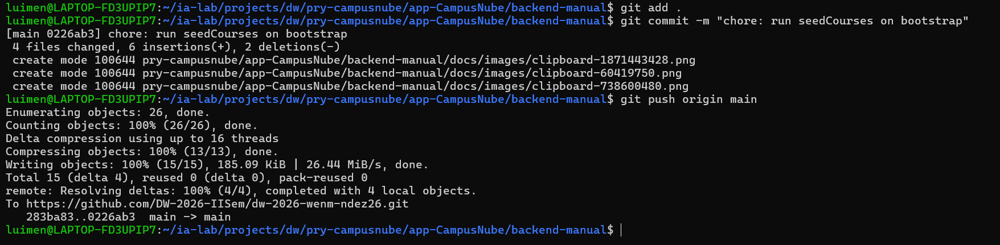

Verficamos en Github

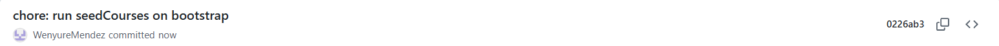

#### 7.28 — Actualizar app.module.ts

Importa BusinessModule y/o AuthModule según el avance. Los guards globales llegan en la fase RBAC.

**Archivo:** `src/app.module.ts`

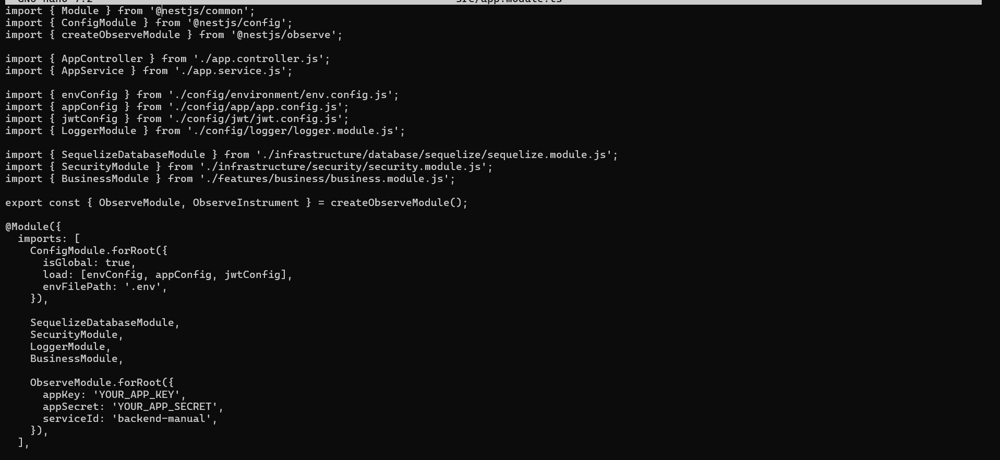

**Sugerencia de commit (issue):**

``` bash
git add . 
git commit -m "feat: import BusinessModule into AppModule"
```

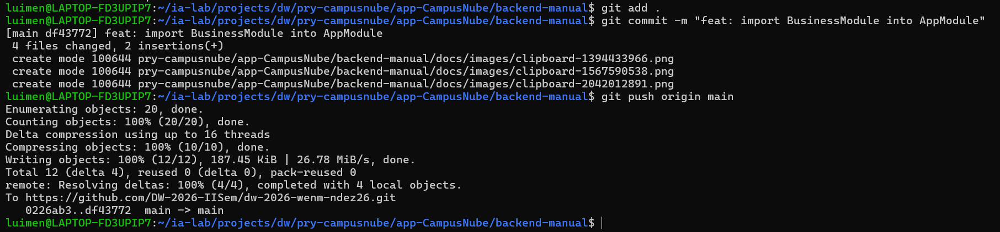

Verificar en Github

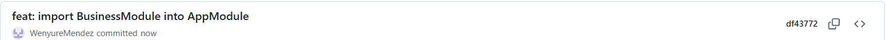

#### 7.29 — Verificar tabla física `courses` y API

Arranca la app. Debe crear/sync tabla `courses`, correr seeder y exponer `/api/clients`. Prueba list/create en Swagger o curl.

``` bash
npm run start:dev
```

**Sugerencia de commit (issue):**

``` bash
git add . 
git commit -m "test: verify courses table and crud endpoints"
```

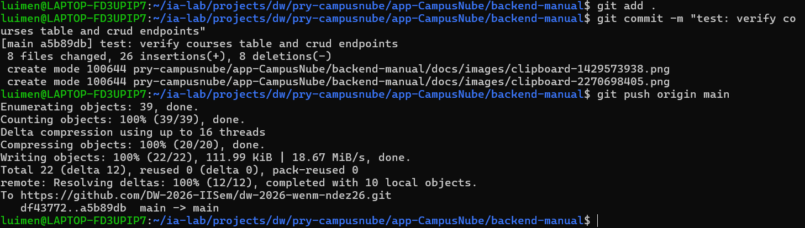

Verifcar en Github

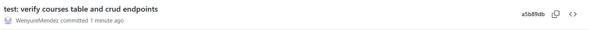

## FASE 8 — `07_BUSINESS_ENROLLMENT`

### Business — Enrollment

> **Objetivo de la fase:** Catálogo de tipos de producto. Misma plantilla CA que Courses.

#### 8.1 — Enrollment.entity.ts

Entidad de dominio (TypeScript puro). No extiende Sequelize `Model`. Aquí viven las reglas del negocio.

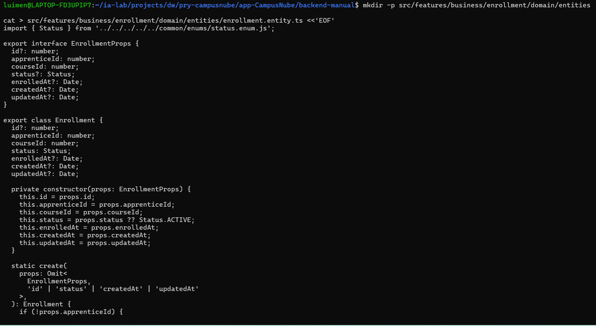

**Sugerencia de commit (issue):**

``` bash
git add . 
git commit -m "feat: add domain entity enrollment.entity.ts"
```

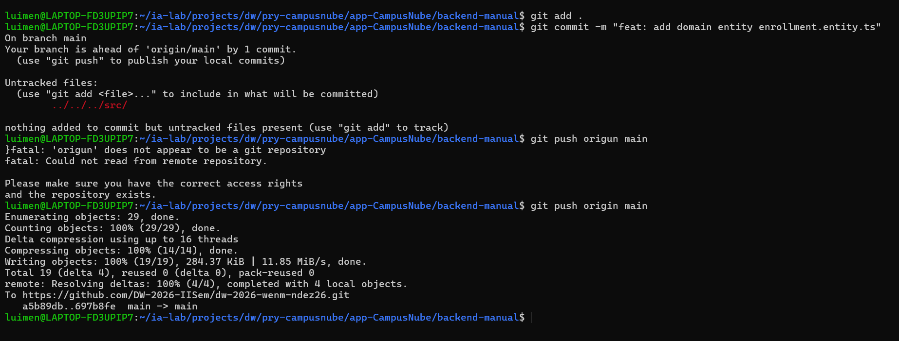

Verificamos en Github

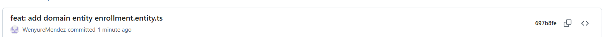

#### 8.2 — Enrollment-not-found.exception.ts

Excepción de dominio. El caso de uso la lanza; el filter HTTP la traduce a status code.

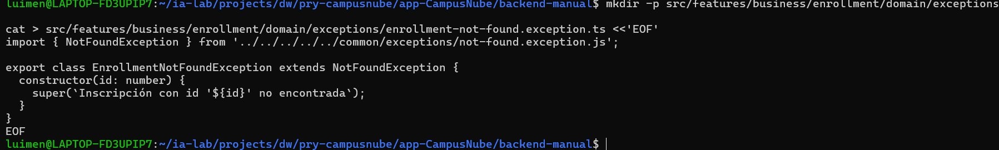

**Sugerencia de commit (issue):**

``` bash
git add . 
git commit -m "feat: add domain exception enrollment-not-found.exception.ts"
```

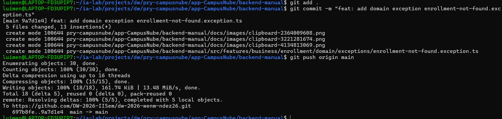

Verificamos en Github

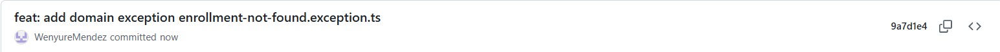

#### 8.3 — Enrollment-repository.interface.ts

Puerto (contrato) del repositorio. La aplicación depende de esta interface, no de Sequelize.

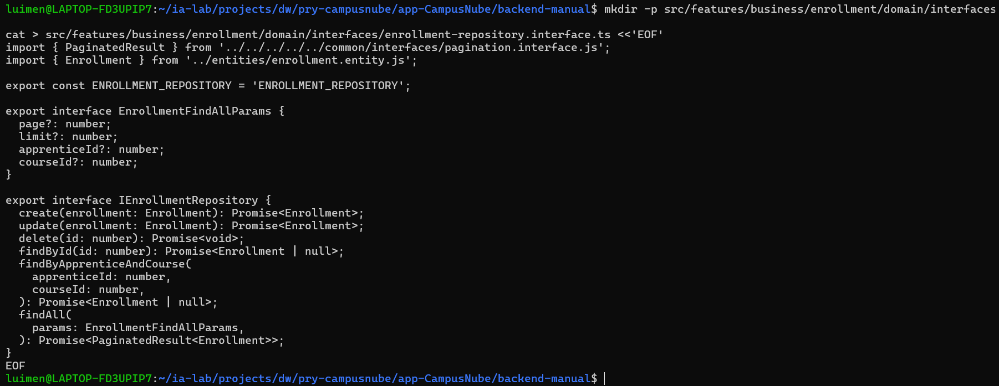

**Sugerencia de commit (issue):**

``` bash
git add . 
git commit -m "feat: add repository port enrollment-repository.interface.ts"
```

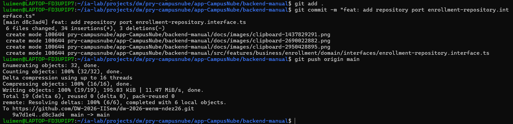

Verificar en Github

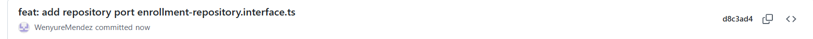

#### 8.4 — Enrollment.model.ts

Modelo Sequelize (`@Table`). Solo infraestructura: mapeo a tabla física.

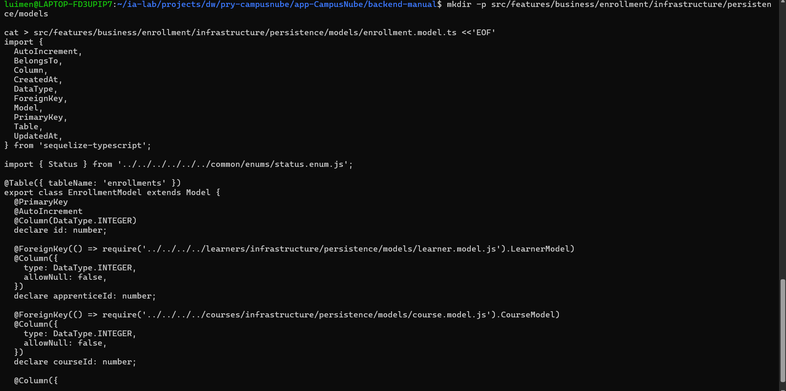

**Sugerencia de commit (issue):**

``` bash
git add . 
git commit -m "feat: add sequelize model enrollment.model.ts"
```

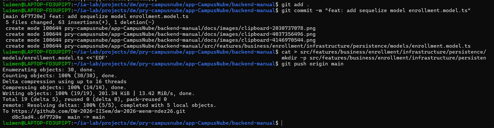

Verificar en Github

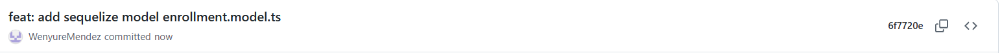

#### 8.5 — Erollment.repository.ts

Adaptador del repositorio: implementa el puerto de dominio con Sequelize.

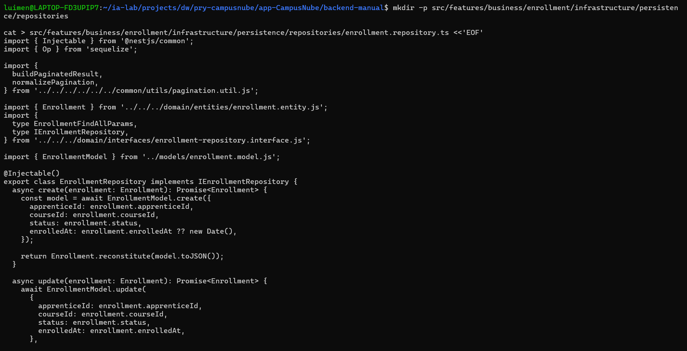

**Sugerencia de commit (issue):**

``` bash
git add .
git commit -m "feat: add sequelize repository enrollment.repository.ts"
```

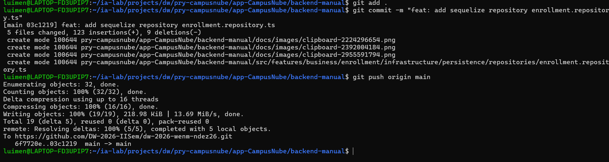

Verificamos en Github

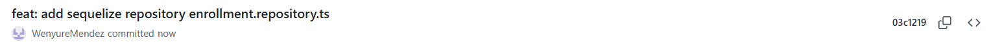

#### 8.6 —table.migration.ts

Migración documental/auxiliar de la tabla. En dev el sync de Sequelize crea el esquema.

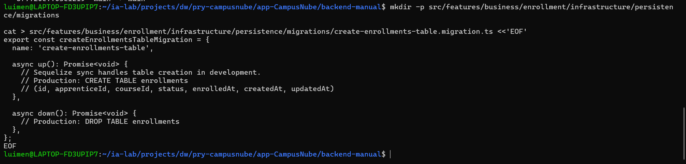

**Sugerencia de commit (issue):**

``` bash
git add . 
git commit -m "chore: add migration create-enrollments-table.migration.ts"
```

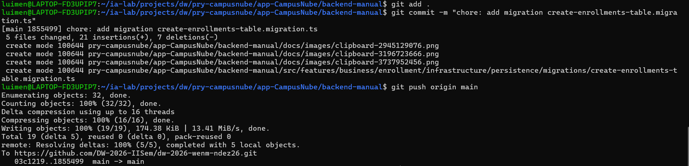

Verificamos en Github

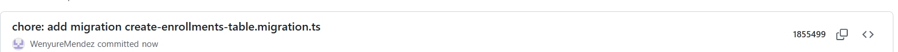

#### 8.7 —Enrollments.seeder.ts

Seeder de datos iniciales para desarrollo y verificación física en BD.

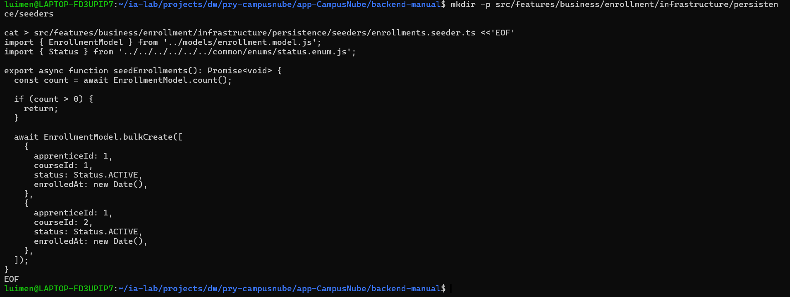

**Sugerencia de commit (issue):**

``` bash
git add . 
git commit -m "chore: add seeder enrollments.seeder.ts"
```

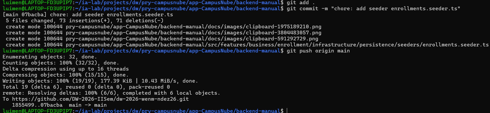

Verificamos con Github

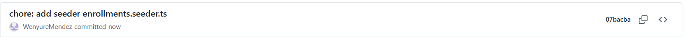

#### 8.8 — create-enrollment.dto.ts

DTO de entrada/salida HTTP con `class-validator` / Swagger.

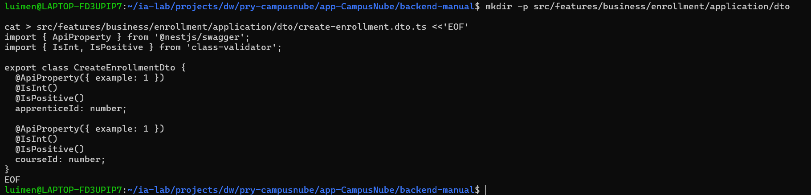

**Sugerencia de commit (issue):**

``` bash
git add . 
git commit -m "feat: add dto create-enrollment.dto.ts"
```

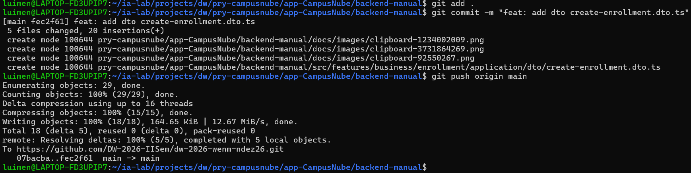

Verificar en Github

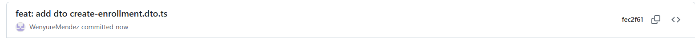

#### 8.9 —Enrollment-filter.dto.ts

DTO de entrada/salida HTTP con `class-validator` / Swagger.

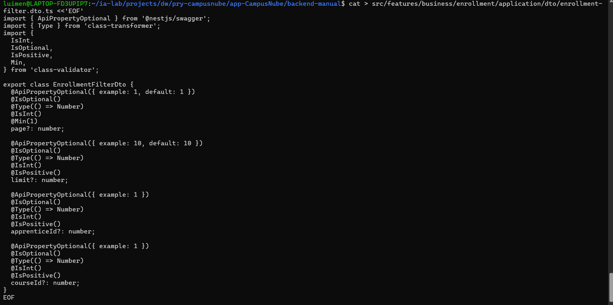

**Sugerencia de commit (issue):**

``` bash
git add . 
git commit -m "feat: add dto enrollment-filter.dto.ts"
```

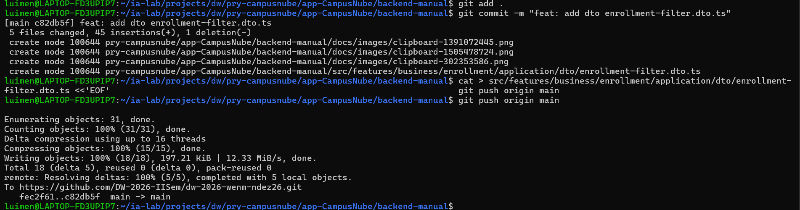

Verificamos en Github

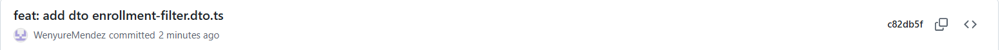

#### 8.10 — Enrollment-response.dto.ts

DTO de entrada/salida HTTP con `class-validator` / Swagger.

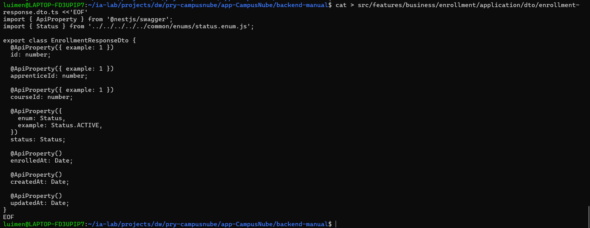

**Sugerencia de commit (issue):**

``` bash
git add . 
git commit -m "feat: add dto enrollment-response.dto.ts"
```


Verificar en Github

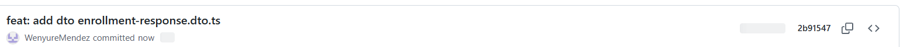

#### 8.11 — Update-enrollment.dto.ts

DTO de entrada/salida HTTP con `class-validator` / Swagger.

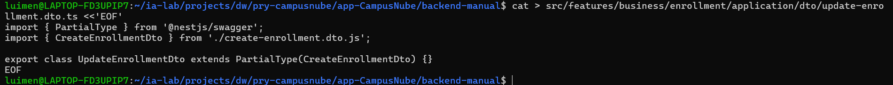

**Sugerencia de commit (issue):**

``` bash
git add . 
git commit -m "feat: add dto update-enrollment.dto.ts"
```

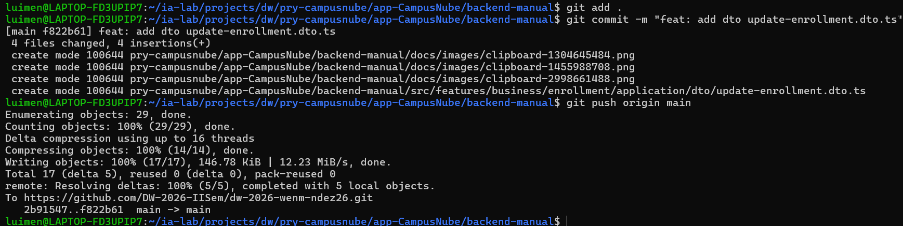

Verificar en Github

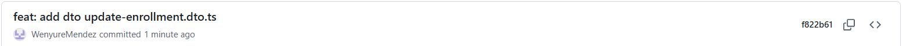

#### 8.12 — Enrollment.mapper.ts

Mapper entre entidad de dominio y DTO de respuesta.

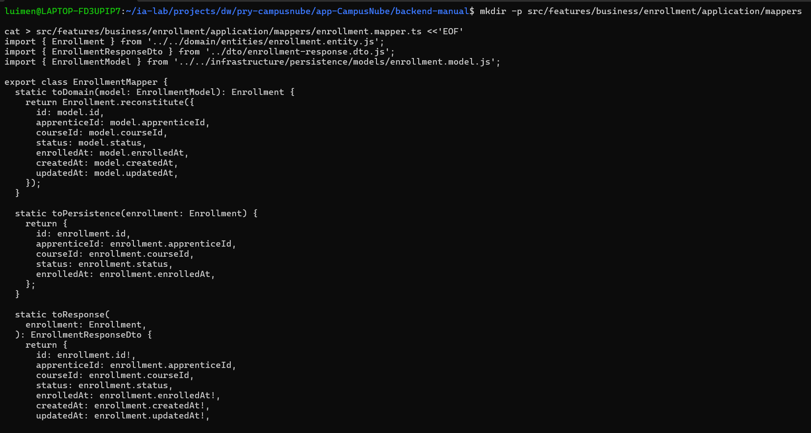

**Sugerencia de commit (issue):**

``` bash
git add . 
git commit -m "feat: add mapper enrollment.mapper.ts"
```

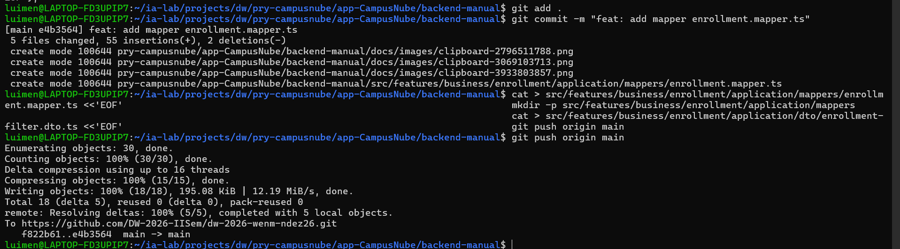

Verificar en github

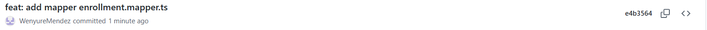

#### 8.13 —use-cases/create-enrollment.use-case.ts

Caso de uso (aplicación). Orquesta dominio + repositorio. El controller solo lo invoca.

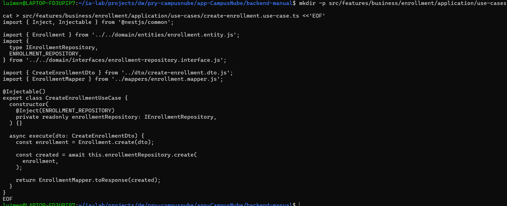

**Sugerencia de commit (issue):**

``` bash
git add . 
git commit -m "feat: add use case create-enrollment.use-case.ts"
```

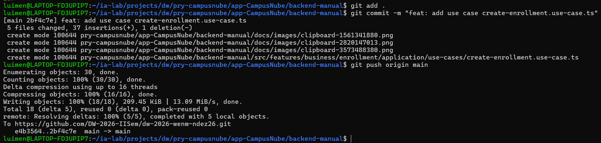

Verificamos en Github

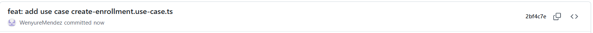

#### 8.14 — use-cases/delete-enrollment.use-case.ts

Caso de uso (aplicación). Orquesta dominio + repositorio. El controller solo lo invoca.

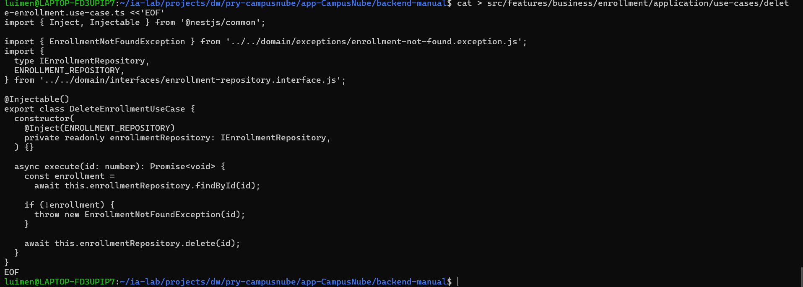

**Sugerencia de commit (issue):**

``` bash
git add . 
git commit -m "feat: add use case delete-enrollment.use-case.ts"
```

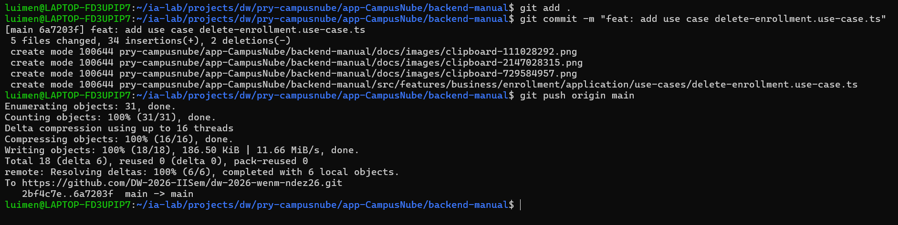

Verificamos en Github

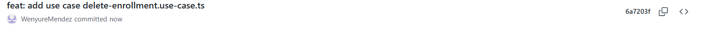

#### 8.15 —Get-enrollment.use-case.ts

Caso de uso (aplicación). Orquesta dominio + repositorio. El controller solo lo invoca.

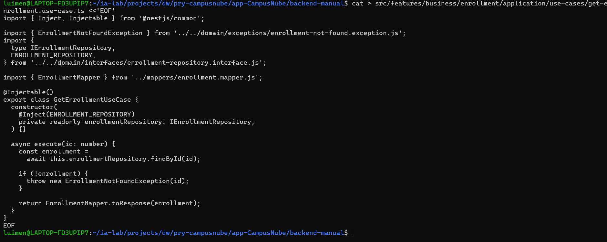

**Sugerencia de commit (issue):**

``` bash
git add . 
git commit -m "feat: add use case get-product-type.use-case.ts"
```

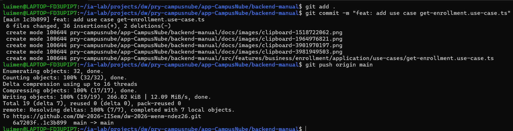

Verificamos en Github

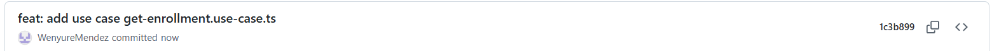

#### 8.16 — list-enrollment.use-case.ts

Caso de uso (aplicación). Orquesta dominio + repositorio. El controller solo lo invoca.

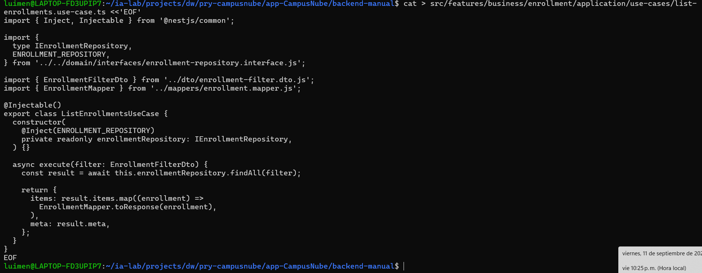

**Sugerencia de commit (issue):**

``` bash
git add . 
git commit -m "feat: add use case list-enrollments.use-case.ts"
```

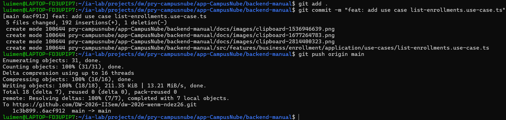

Verificar en Github

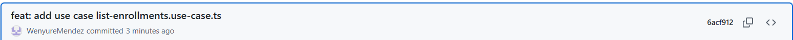

#### 8.17 — update-enrollment.use-case.ts

Caso de uso (aplicación). Orquesta dominio + repositorio. El controller solo lo invoca.

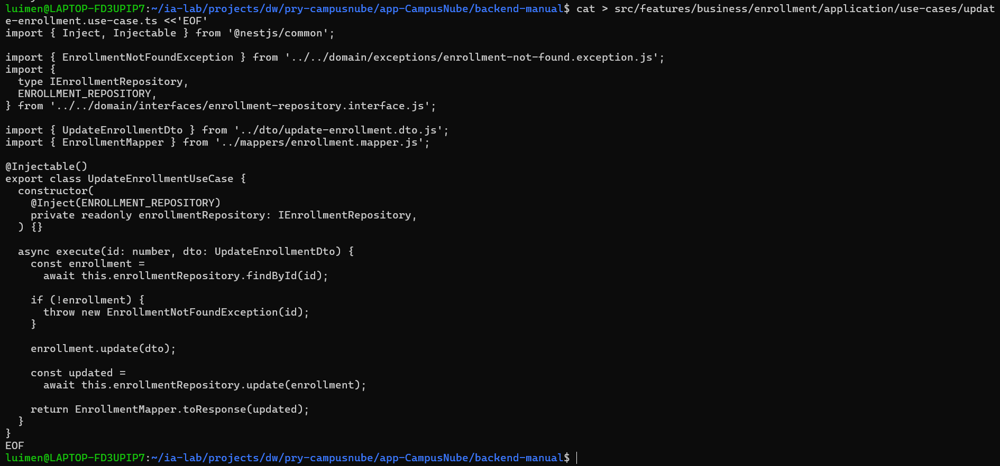

**Sugerencia de commit (issue):**

``` bash
git add . 
git commit -m "feat: add use case update-enrollment.use-case.ts"
```

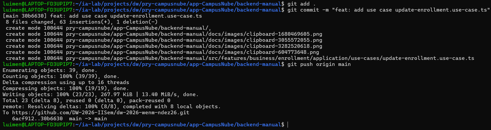

Verificar en Github

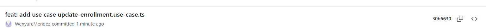

#### 8.18 — Enrollment.serializer.ts

Serializer de presentación (forma estable de la respuesta HTTP).

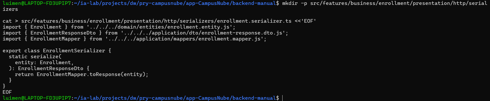

**Sugerencia de commit (issue):**

``` bash
git add .
git commit -m "feat: add serializer enrollment.serializer.ts"
```

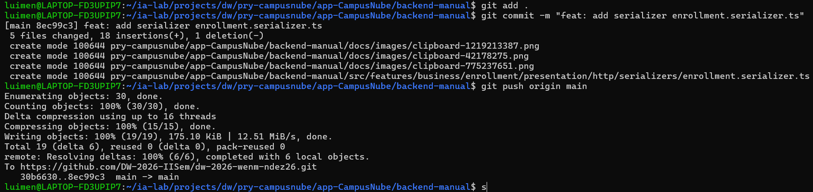

Verificar en Github

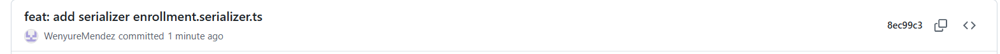

#### 8.19 —contro.controller.ts

Controller delgado: valida DTO, llama use-case, devuelve respuesta.

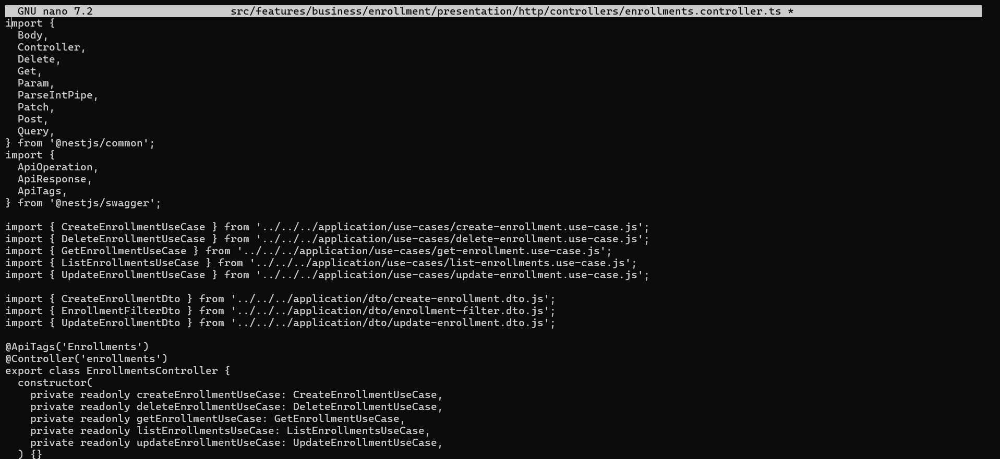

**Sugerencia de commit (issue):**

``` bash
git add . 
git commit -m "feat: add controller enrollments.controller.ts"
```

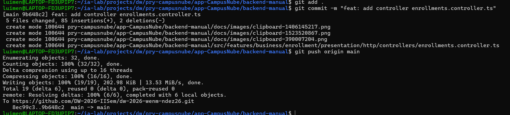

Verificar en Github

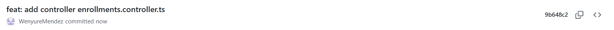

#### 8.20 — features/business/enrollment/index.ts

Barrel export del feature para imports limpios.

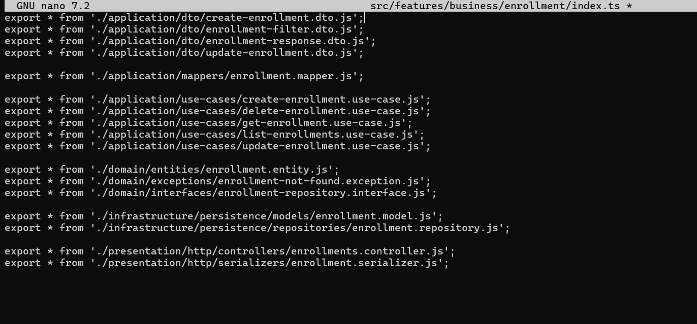

**Sugerencia de commit (issue):**

``` bash
git add . 
git commit -m "chore: add barrel export enrollment"
```

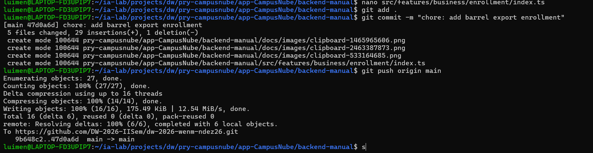

Verificar en Github

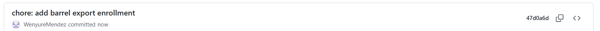

#### 8.21 — Enrolllment.module.ts

Módulo Nest del feature: cablea providers, tokens DI y controller.

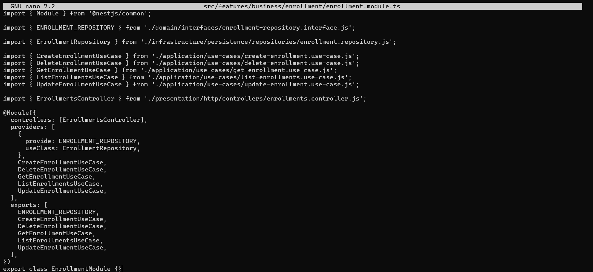

**Sugerencia de commit (issue):**

``` bash
git add . 
git commit -m "feat: wire nest module enrollment.module.ts"
```

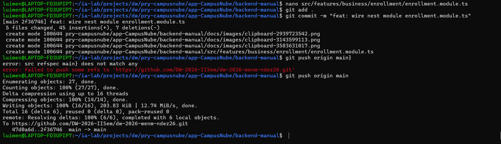

Vereficar en Github

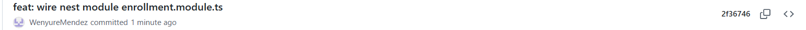

#### 8.22 — Actualizar sequelize.factory.ts (registrar modelos)

Registra en ALL_MODELS solo los modelos ya creados (orden de dependencias).

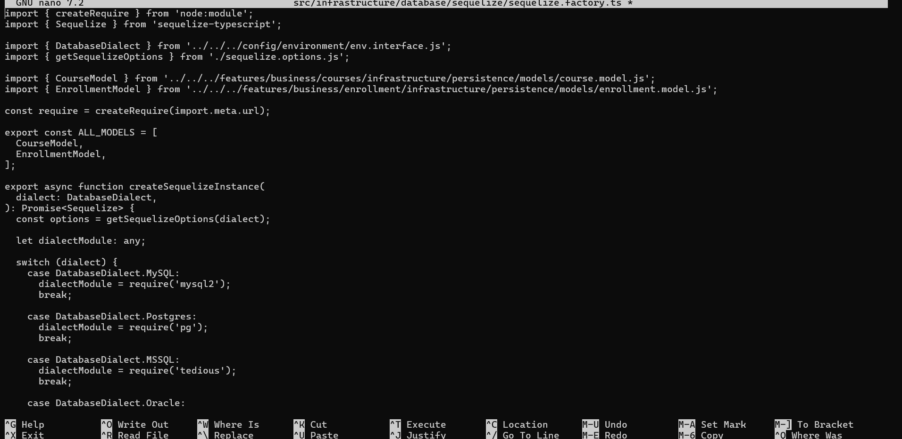

**Sugerencia de commit (issue):**

``` bash
git add . 
git commit -m "feat: register EnrollmentModel in sequelize factory"
```

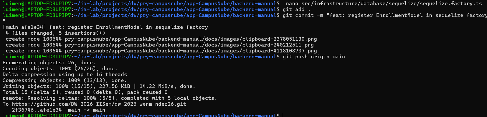

Verificamos en Github

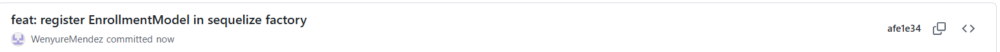

#### 8.23 — Actualizar business.module.ts

Agrega el feature module de negocio recién terminado.

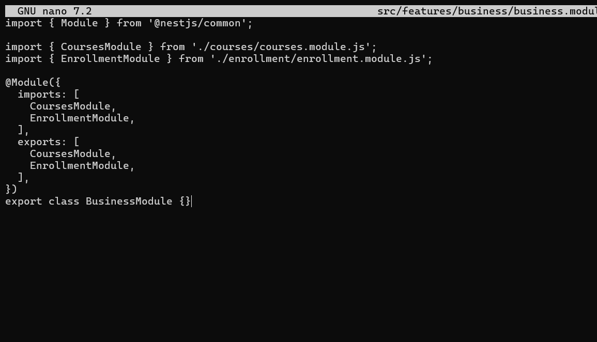

**Sugerencia de commit (issue):**

``` bash
git add . 
git commit -m "feat: add EnrollmentModule to BusinessModule"
```

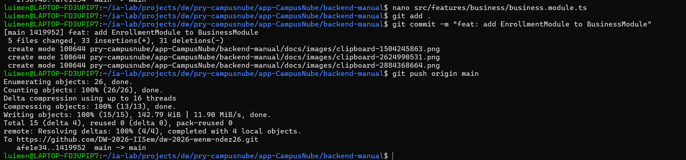

Verificamos en Github

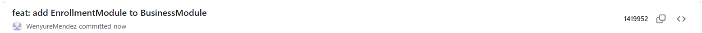

#### 8.24 — Actualizar database-seeder.service.ts

Ejecuta seeders en orden de dependencias al arrancar (dev).

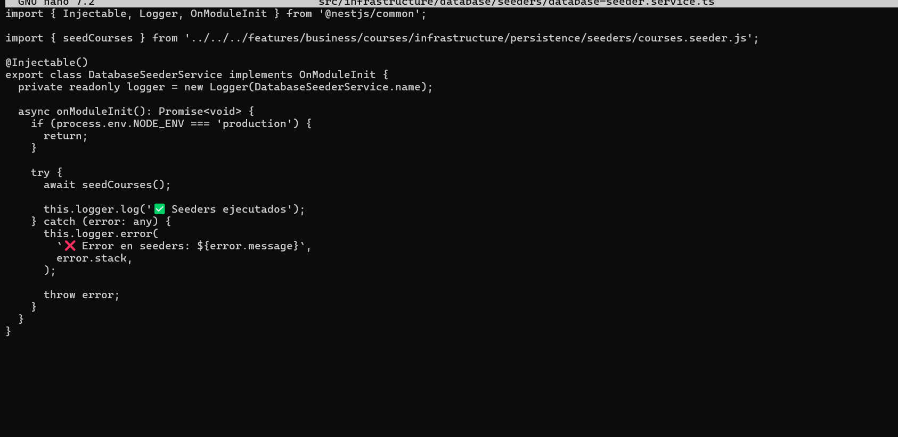

``` bash
git add .
git commit -m "chore: keep course seeder on bootstrap"
```

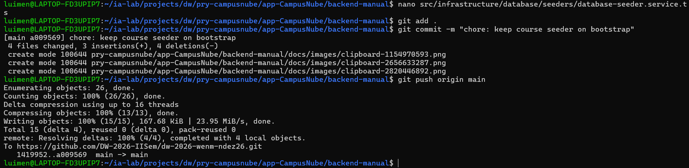

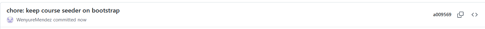

#### 8.25 — Actualizar app.module.ts

Importa BusinessModule y/o AuthModule según el avance. Los guards globales llegan en la fase RBAC.

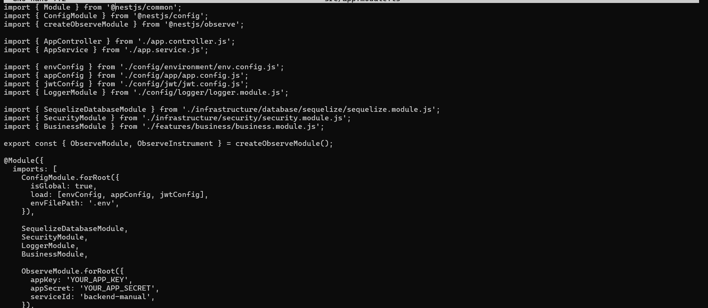

**Sugerencia de commit (issue):**

``` bash
git add . 
git commit -m "chore: keep BusinessModule wired in AppModule"
```

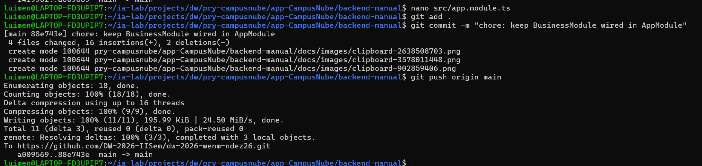

#### 8.26 — Verificar tabla enrollment

Confirma sync/seeder y endpoints `/api/enrollment-types`.

``` bash
npm run start:dev
```

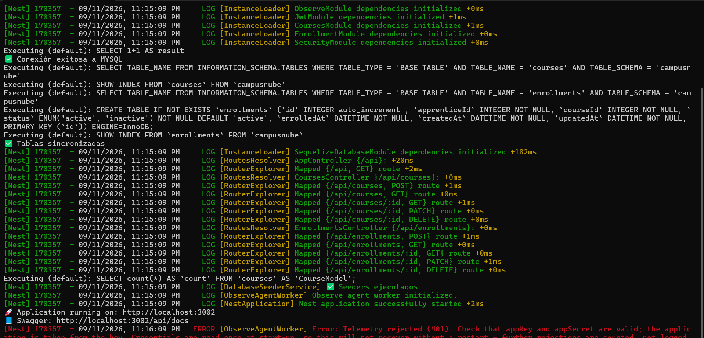

**Sugerencia de commit (issue):**

``` bash
git add . 
git commit -m "test: verify enrollments table and endpoints"
```

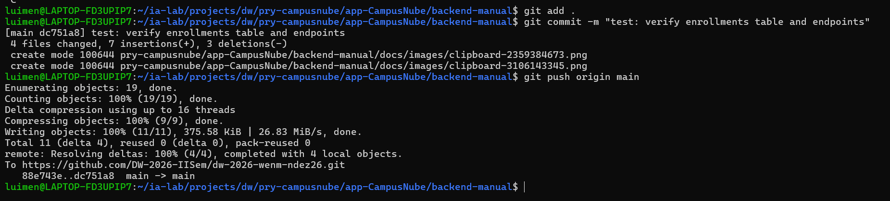

## 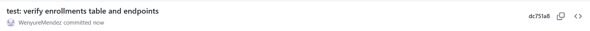

## FASE 9 — apprentice

#### 9.1 — apprentice.entity.ts

Entidad de dominio (TypeScript puro). No extiende Sequelize `Model`. Aquí viven las reglas del negocio.

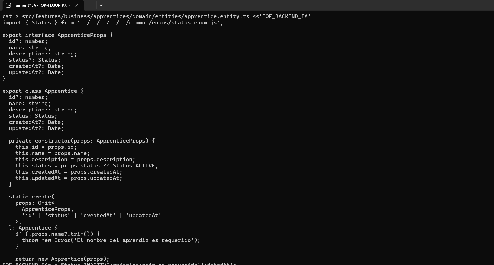

**Sugerencia de commit (issue):**

``` bash
git add . 
git commit -m "feat: add domain entity apprentice.entity.ts"
```

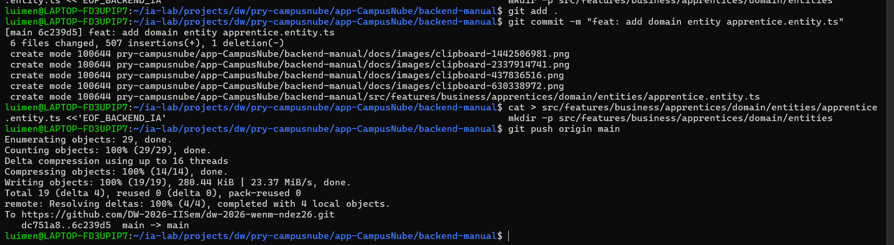

#### 9.2 — Apprentice-not-found.exceptd.exce

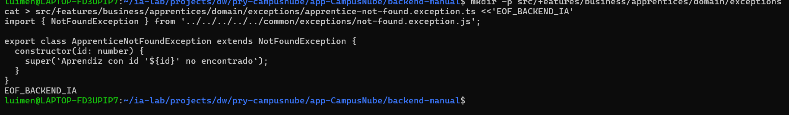

**Sugerencia de commit (issue):**

``` bash
git add . 
git commit -m "feat: add domain exception apprentice-not-found.exception.ts"
```

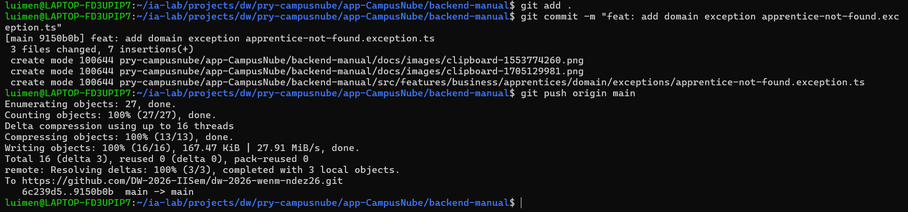

#### 9.3 — apprentice.exception.ts

Excepción de dominio. El caso de uso la lanza; el filter HTTP la traduce a status code.

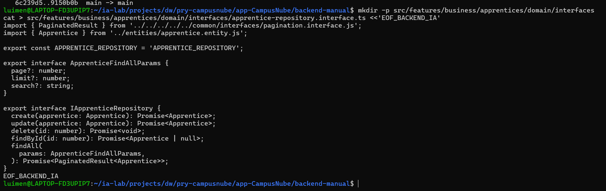

**Sugerencia de commit (issue):**

``` bash
git add . 
git commit -m "feat: add repository port apprentice-repository.interface.ts"
```

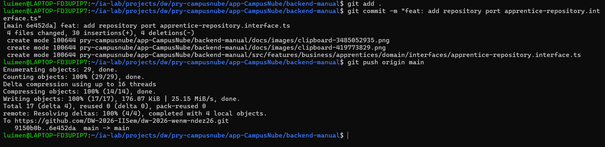

#### 9.4 — apprentice-not-found.exception.ts

Excepción de dominio. El caso de uso la lanza; el filter HTTP la traduce a status code.

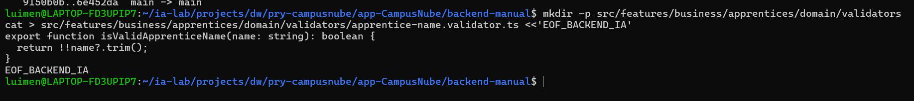

**Sugerencia de commit (issue):**

``` bash
git add .
git commit -m "feat: add domain validator apprentice-name.validator.ts"
```

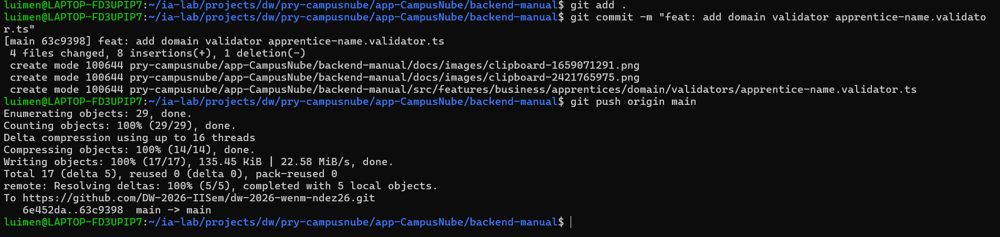

#### 9.5 — features/business/products/domain/interfaces/product-repository.interface.ts

Puerto (contrato) del repositorio. La aplicación depende de esta interface, no de Sequelize.

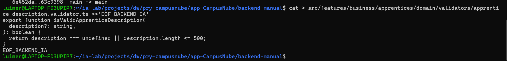

**Sugerencia de commit (issue):**

``` bash
git add .
git commit -m "feat: add domain validator apprentice-description.validator.ts"
```

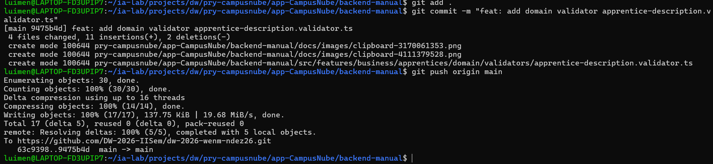

#### 9.6 — apprentices.validator.ts

Validador de dominio reutilizable (reglas independientes del framework HTTP).

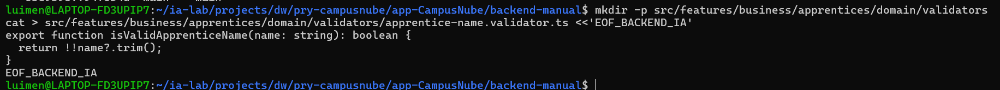

**Sugerencia de commit (issue):**

``` bash
git add .
git commit -m "feat: add domain validator apprentice-name.validator.ts"
```

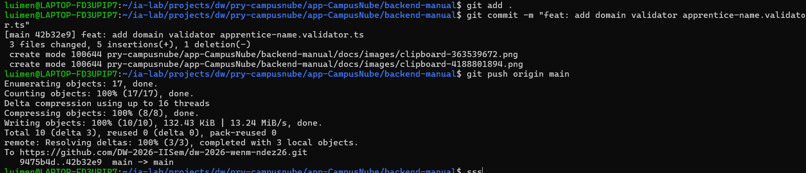

#### 9.7 — apprentices.validator.ts

Validador de dominio reutilizable (reglas independientes del framework HTTP).

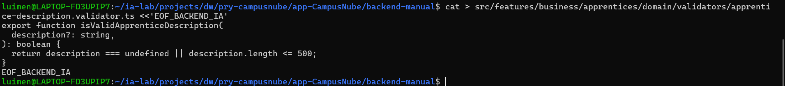

**Sugerencia de commit (issue):**

``` bash
git add . 
git commit -m "feat: add domain validator apprentice-description.validator.ts"
```

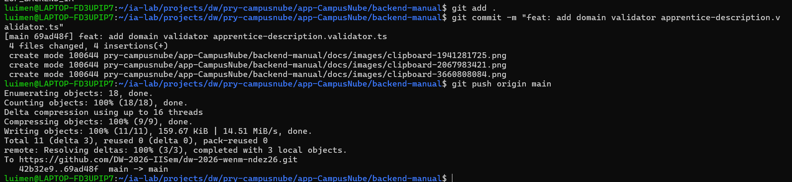

#### 9.8 — apprentice.model.ts

Modelo Sequelize (`@Table`). Solo infraestructura: mapeo a tabla física.

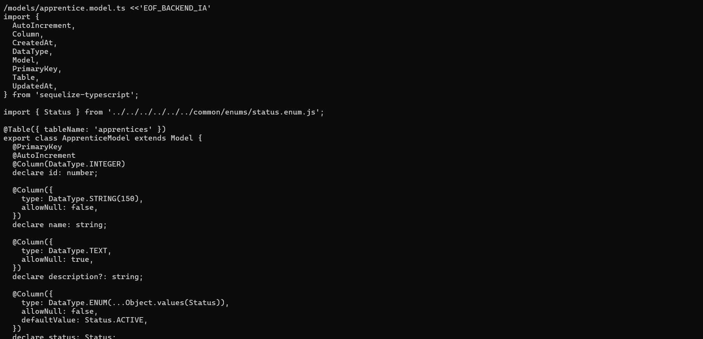

**Sugerencia de commit (issue):**

``` bash
git add . 
git commit -m "feat: add sequelize model product.model.ts"
```

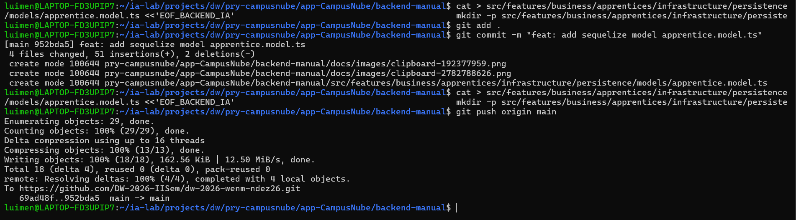

#### 9.9 —apprentices.repository.ts

Adaptador del repositorio: implementa el puerto de dominio con Sequelize.

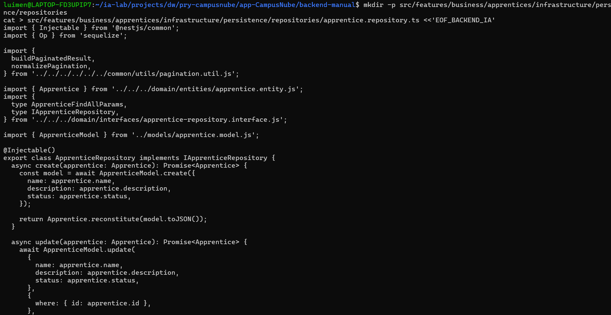

**Sugerencia de commit (issue):**

``` bash
git add . 
git commit -m "feat: add sequelize repository apprentice.repository.ts"
```

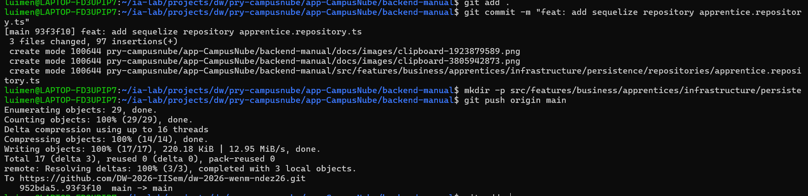

#### 9.10 — apprentice-table.migration.ts

Migración documental/auxiliar de la tabla. En dev el sync de Sequelize crea el esquema.

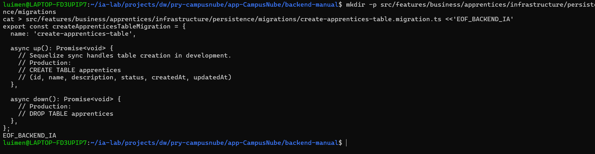

**Sugerencia de commit (issue):**

``` bash
git add .
git commit -m "chore: add migration create-apprentices-table.migration.ts"
```

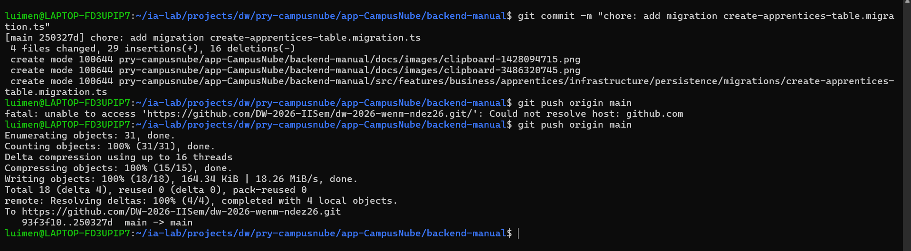

#### 9.11 — apprentice.seeder.ts

Seeder de datos iniciales para desarrollo y verificación física en BD.

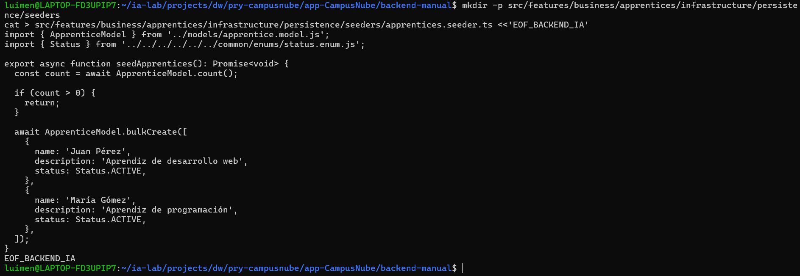

**Sugerencia de commit (issue):**

``` bash
git add . 
git commit -m "chore: add seeder apprentices.seeder.ts"
```

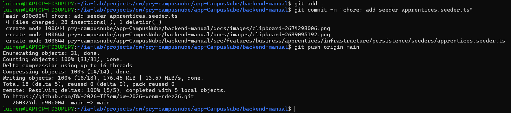

#### 9.12 — create-apprentice.dto.ts

DTO de entrada/salida HTTP con `class-validator` / Swagger.

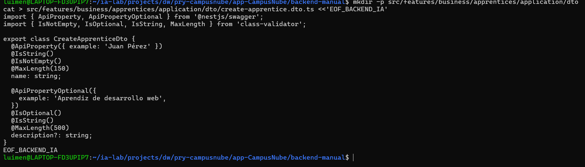

**Sugerencia de commit (issue):**

``` bash
git add .
git commit -m "feat: add dto create-apprentice.dto.ts"
```

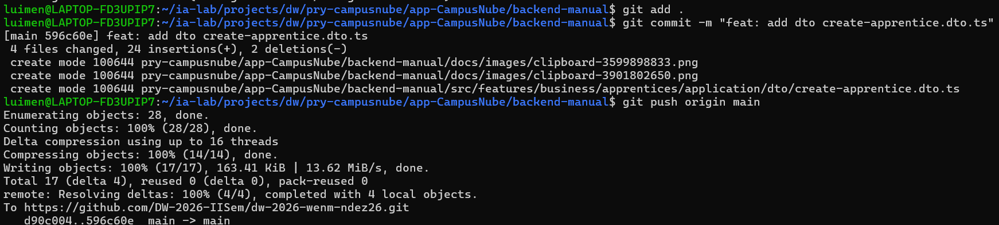

#### 9.13 — apprentice-filter.dto.ts

DTO de entrada/salida HTTP con `class-validator` / Swagger.

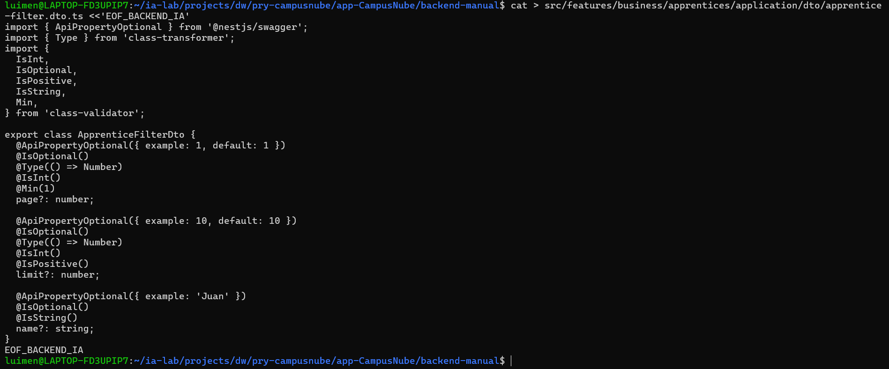

**Sugerencia de commit (issue):**

``` bash
git add . 
git commit -m "feat: add dto apprentice-filter.dto.ts"
```

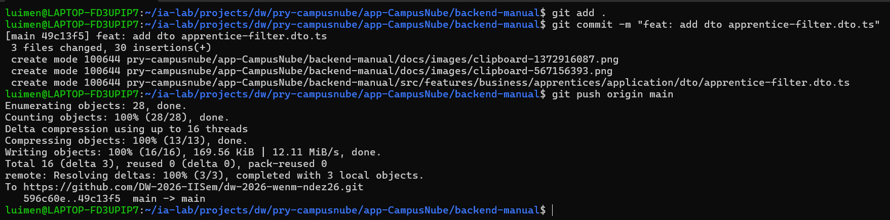

#### 9.14 — apprentice-response.dto.ts

DTO de entrada/salida HTTP con `class-validator` / Swagger.

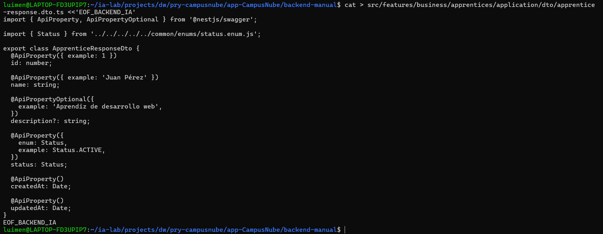

**Sugerencia de commit (issue):**

``` bash
git add . 
git commit -m "feat: add dto apprentice-response.dto.ts"
```

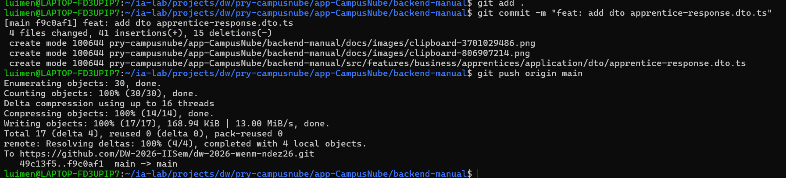

#### 9.15 —update-apprentice.dto.ts

DTO de entrada/salida HTTP con `class-validator` / Swagger.

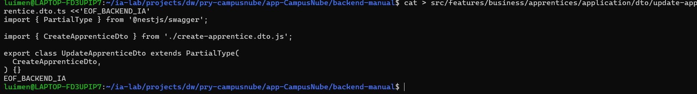

**Sugerencia de commit (issue):**

``` bash
git add . 
git commit -m "feat: add dto update-product.dto.ts"
```

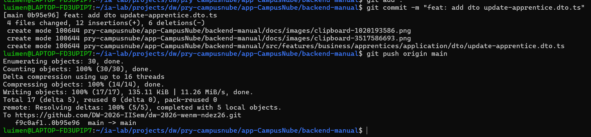

#### 9.16 — apprentice.mapper.ts

Mapper entre entidad de dominio y DTO de respuesta.

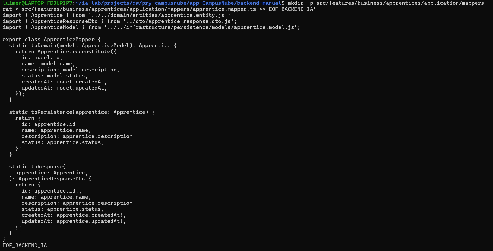

**Sugerencia de commit (issue):**

``` bash
git add . 
git commit -m "feat: add mapper apprentice.mapper.ts"
```

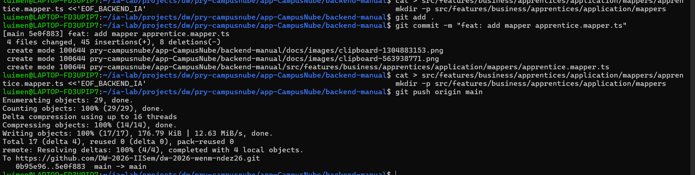

#### 9.17 — create-apprentice.use-case.ts

Caso de uso (aplicación). Orquesta dominio + repositorio. El controller solo lo invoca.

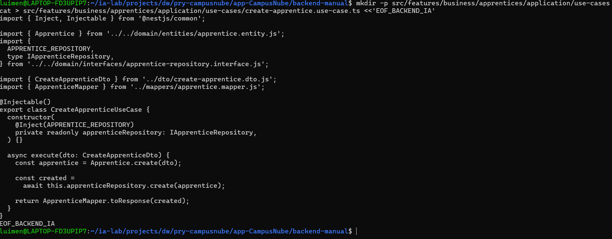

**Sugerencia de commit (issue):**

``` bash
git add . 
git commit -m "feat: add use case create-apprentice.use-case.ts"
```

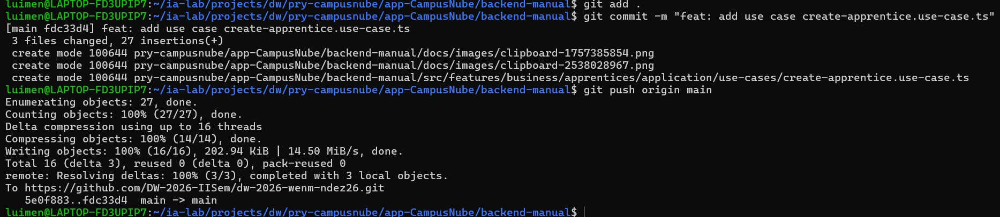

#### 9.18 — delete-apprentice.use-case.ts

Caso de uso (aplicación). Orquesta dominio + repositorio. El controller solo lo invoca.

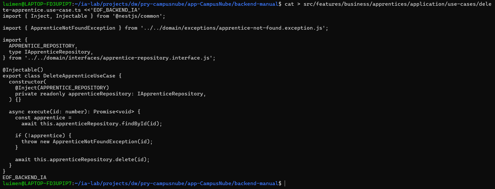

**Sugerencia de commit (issue):**

``` bash
git add .
git commit -m "feat: add use case delete-apprentice.use-case.ts"
```

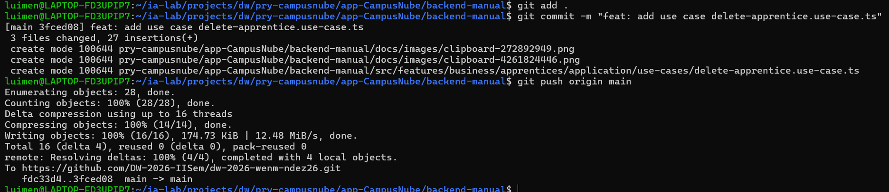

#### 9.19 — get-apprentice.use-case.ts

Caso de uso (aplicación). Orquesta dominio + repositorio. El controller solo lo invoca.

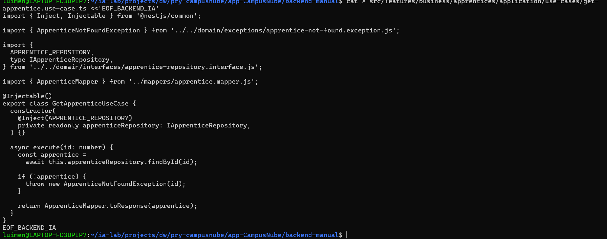

**Sugerencia de commit (issue):**

``` bash
git add .
git commit -m "feat: add use case get-apprentice.use-case.ts"
```

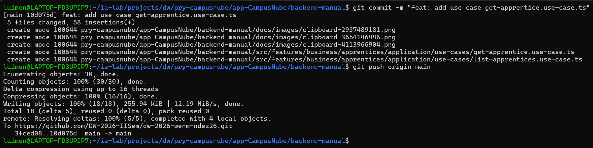

#### 9.20 —list-apprentice.use-case.ts

Caso de uso (aplicación). Orquesta dominio + repositorio. El controller solo lo invoca.

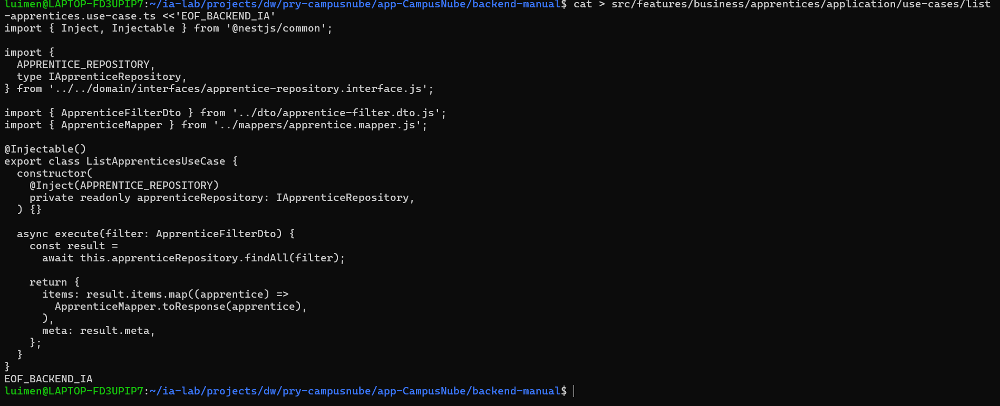

**Sugerencia de commit (issue):**

``` bash
git add . 
git commit -m "feat: add use case list-apprentices.use-case.ts"
```

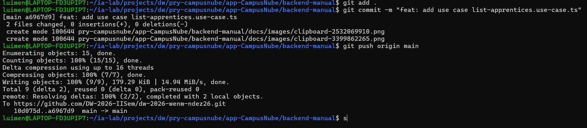

#### 9.21 — update-apprentice.use-case.ts

Caso de uso (aplicación). Orquesta dominio + repositorio. El controller solo lo invoca.

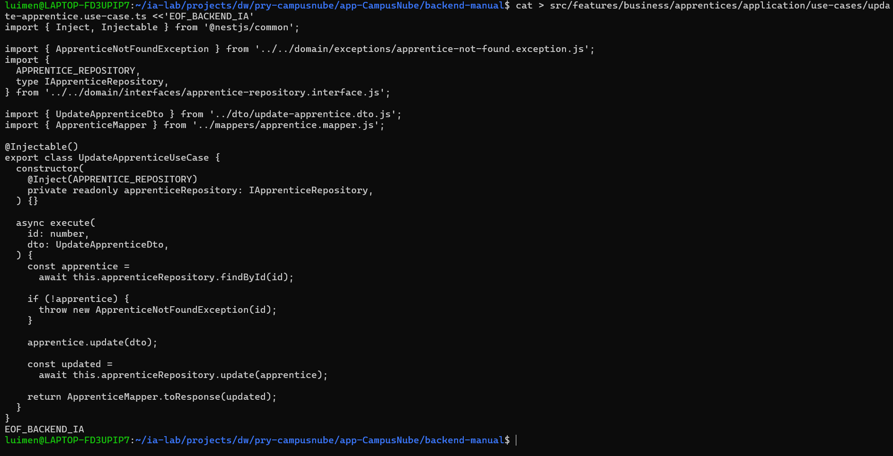

**Sugerencia de commit (issue):**

``` bash
git add . 
git commit -m "feat: add use case update-product.use-case.ts"
```

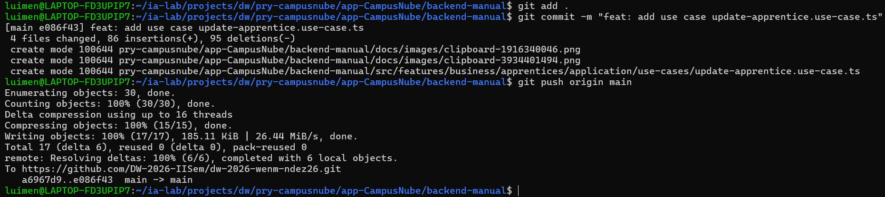

#### 9.22 — apprentice.serializer.ts

Serializer de presentación (forma estable de la respuesta HTTP).

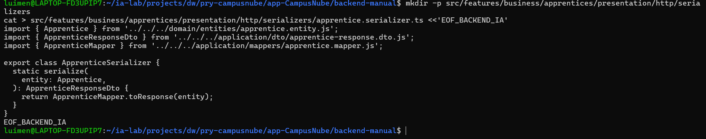

**Sugerencia de commit (issue):**

``` bash
git add .
git commit -m "feat: add serializer apprentice.serializer.ts
```

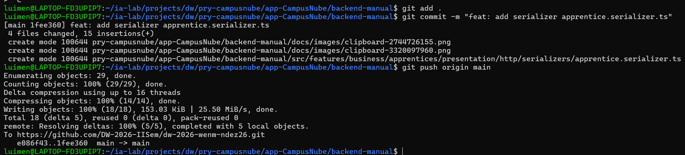

#### 9.23 — apprentice.controller.ts

Controller delgado: valida DTO, llama use-case, devuelve respuesta.

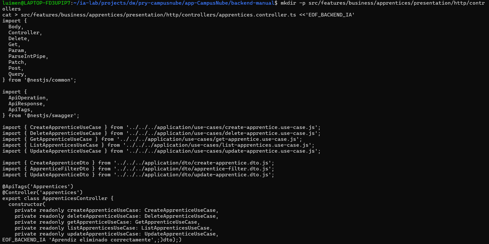

**Sugerencia de commit (issue):**

``` bash
git add . 
git commit -m "feat: add controller apprentices.controller.ts"
```

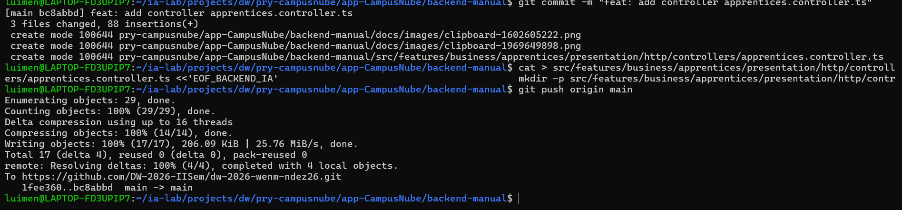

#### 9.24 — apprentice/index.ts

Barrel export del feature para imports limpios.

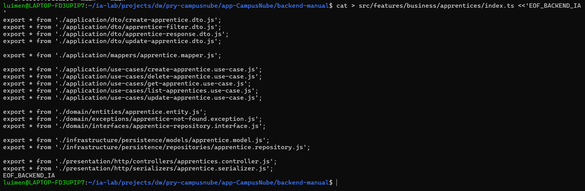

**Sugerencia de commit (issue):**

``` bash
git add . 
git commit -m "chore: add barrel export apprentices"
```

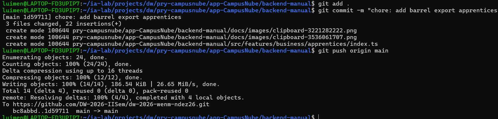

#### 9.25 — apprentice.module.ts

Módulo Nest del feature: cablea providers, tokens DI y controller.

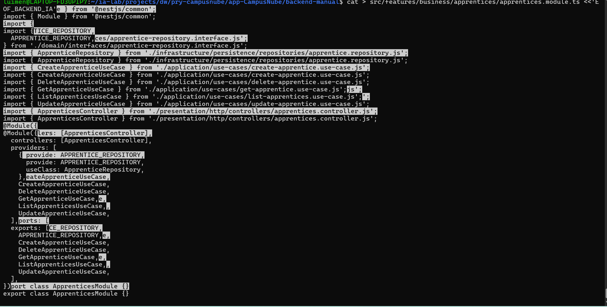

**Sugerencia de commit (issue):**

``` bash
git add . 
git commit -m "feat: wire nest module products.module.ts"
```

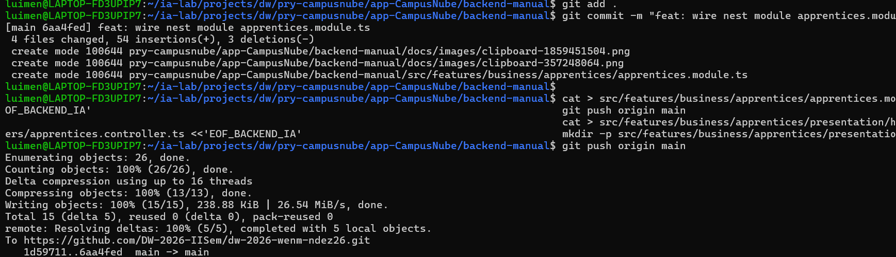

#### 9.26 — Actualizar sequelize.factory.ts (registrar modelos)

Registra en ALL_MODELS solo los modelos ya creados (orden de dependencias).

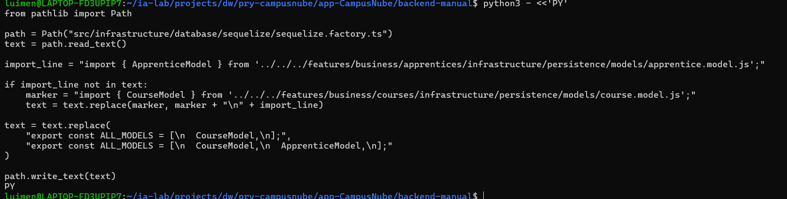

**Sugerencia de commit (issue):**

``` bash
git add .
git commit -m "feat: register ApprenticeModel in sequelize factory"
```

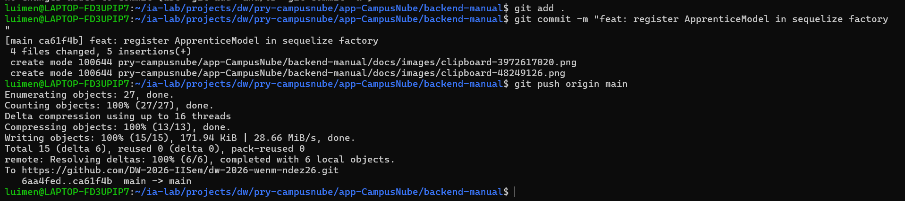

#### 9.27 — Actualizar business.module.ts

Agrega el feature module de negocio recién terminado.

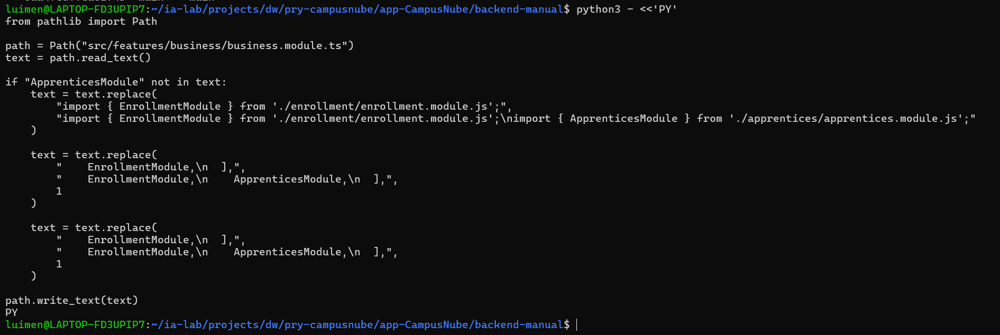

**Sugerencia de commit (issue):**

``` bash
git add .
git commit -m "feat: add ApprenticesModule to BusinessModule"
```

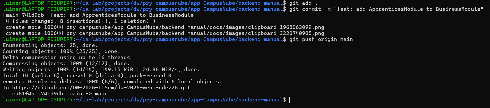

#### 9.28 — Actualizar database-seeder.service.ts

Ejecuta seeders en orden de dependencias al arrancar (dev).

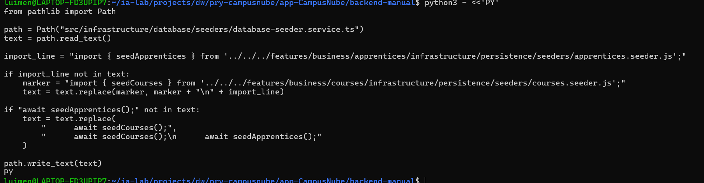

**Sugerencia de commit (issue):**

``` bash
git add . 
git commit -m "chore: run seedApprentices on bootstrap"
```

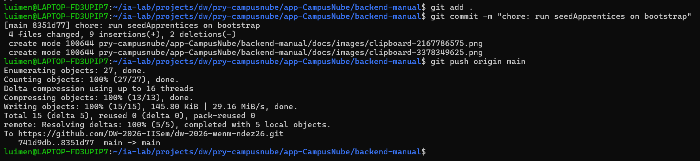

#### 9.29 — Actualizar app.module.ts

Importa BusinessModule y/o AuthModule según el avance. Los guards globales llegan en la fase RBAC.

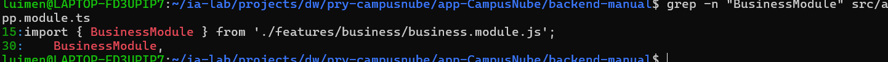

#### 9.30 — Verificar tabla `apprentices`

Confirma FK a product_types, seeder y CRUD `/api/apprentices`.

``` bash
npm run start:dev
```

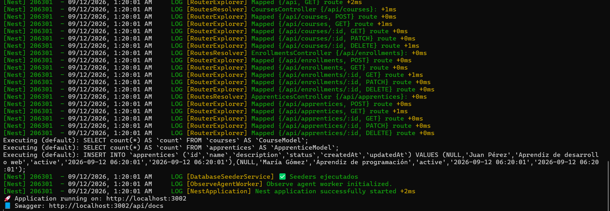

**Sugerencia de commit (issue):**

``` bash
git add . 
git commit -m "test: verify apprentices table and endpoints"
```

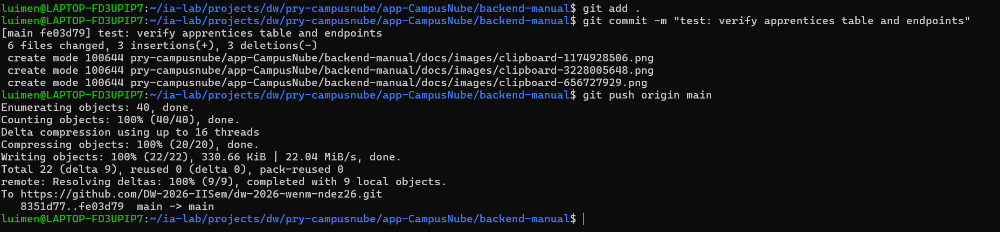

------------------------------------------------------------------------

## FASE 10 — Learning-content

#### 10.1 — learning.entity.ts

Entidad de dominio (TypeScript puro). No extiende Sequelize `Model`. Aquí viven las reglas del negocio.

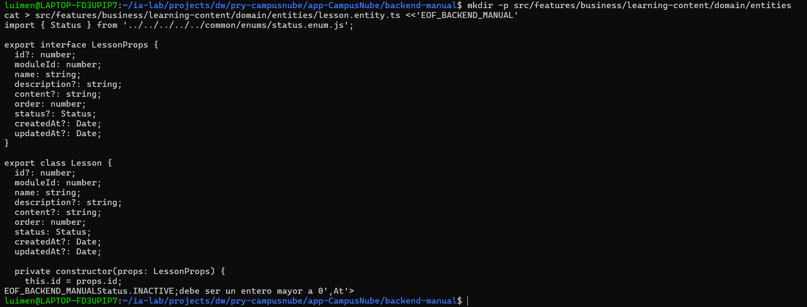

**Sugerencia de commit (issue):**

``` bash
git add .
git commit -m "feat: add domain entity lesson.entity.ts"
```


#### 10.2 — invalid-lesson.order.exception.ts

Excepción de dominio. El caso de uso la lanza; el filter HTTP la traduce a status code.

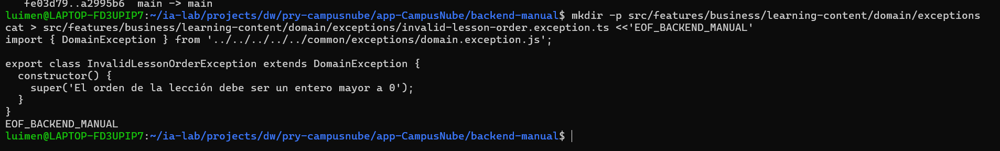

**Sugerencia de commit (issue):**

``` bash
git add . 
git commit -m "feat: add domain exception invalid-lesson-order.exception.ts"
```

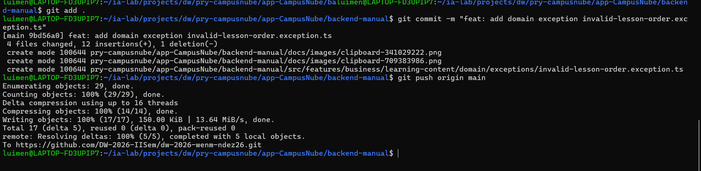

#### 10.3 — lesson-not-found.exception.ts

Excepción de dominio. El caso de uso la lanza; el filter HTTP la traduce a status code.

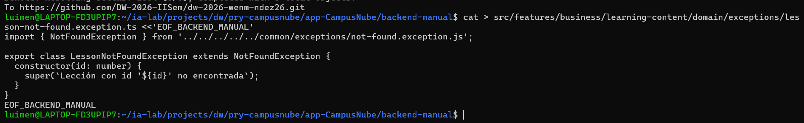

**Sugerencia de commit (issue):**

``` bash
git add .
git commit -m "feat: add domain exception lesson-not-found.exception.ts"
```

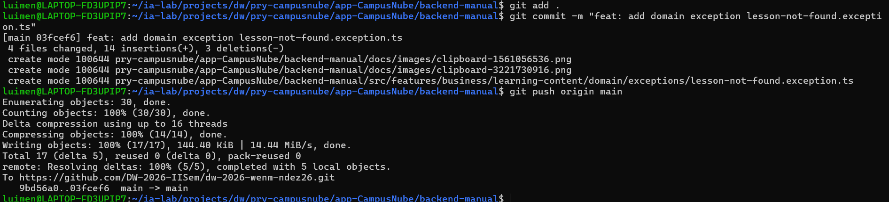

#### 10.4 — lesson-repository.interface.ts

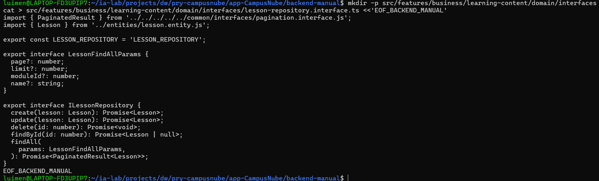

**Sugerencia de commit (issue):**

``` bash
git add .
git commit -m "feat: add repository port lesson-repository.interface.ts"
```

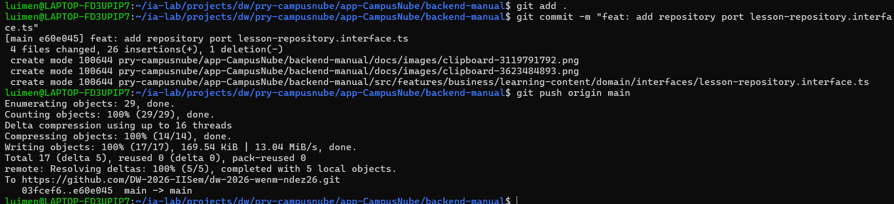

#### 10.5 — learning-content.domain-service.ts

Servicio de dominio (lógica pura sin I/O).

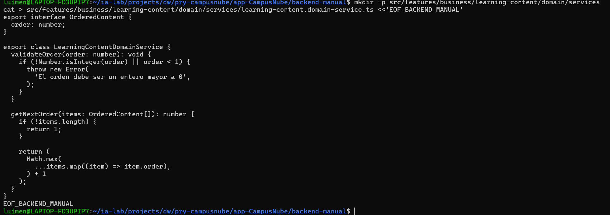

**Sugerencia de commit (issue):**

``` bash
git add . 
git commit -m "feat: add domain service sale-calculator.domain-service.ts"
```

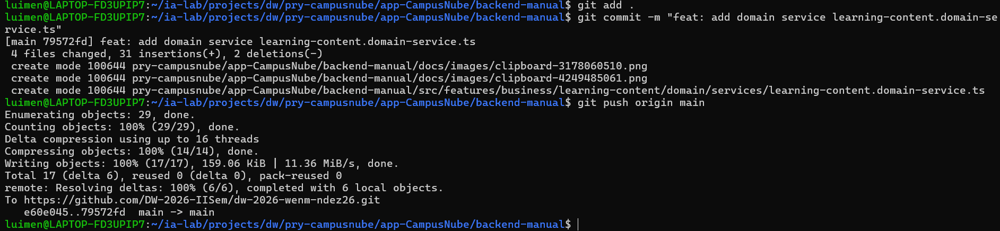

#### 10.6 — lesson.model.ts

Modelo Sequelize (`@Table`). Solo infraestructura: mapeo a tabla física.

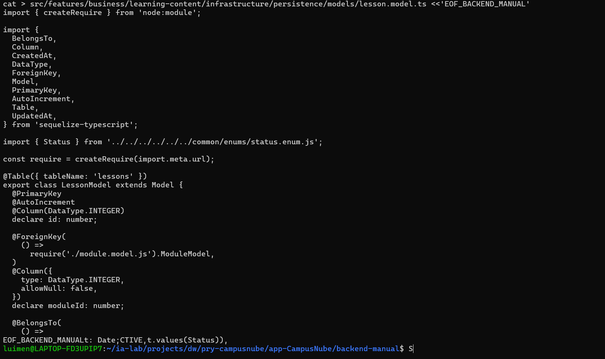

**Sugerencia de commit (issue):**

``` bash
git add .
git commit -m "feat: add sequelize model lesson.model.ts"
```

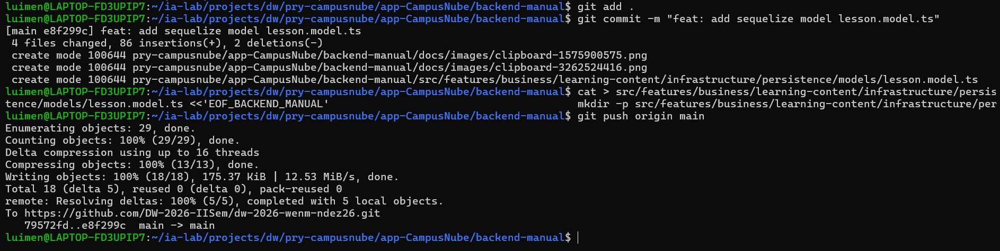

#### 10.7 — module.model.ts

Modelo Sequelize (`@Table`). Solo infraestructura: mapeo a tabla física.

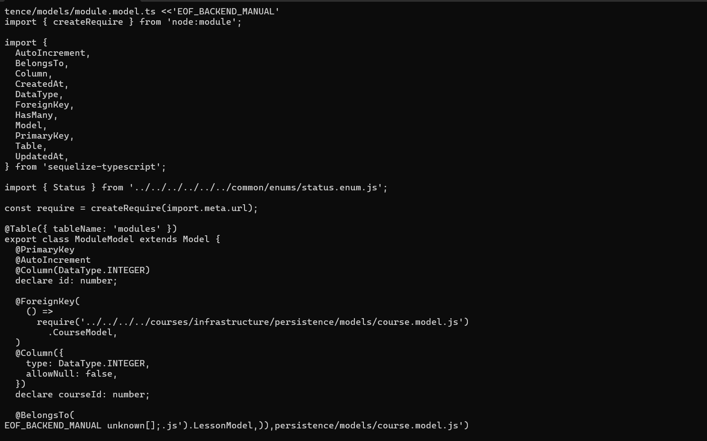

**Sugerencia de commit (issue):**

``` bash
git add . 
git commit -m "feat: add sequelize model module.model.ts"
```

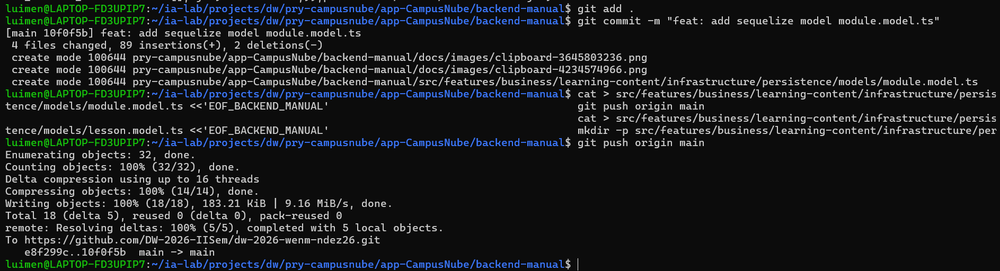

#### 10.8 — lesson.repository.ts

Adaptador del repositorio: implementa el puerto de dominio con Sequelize

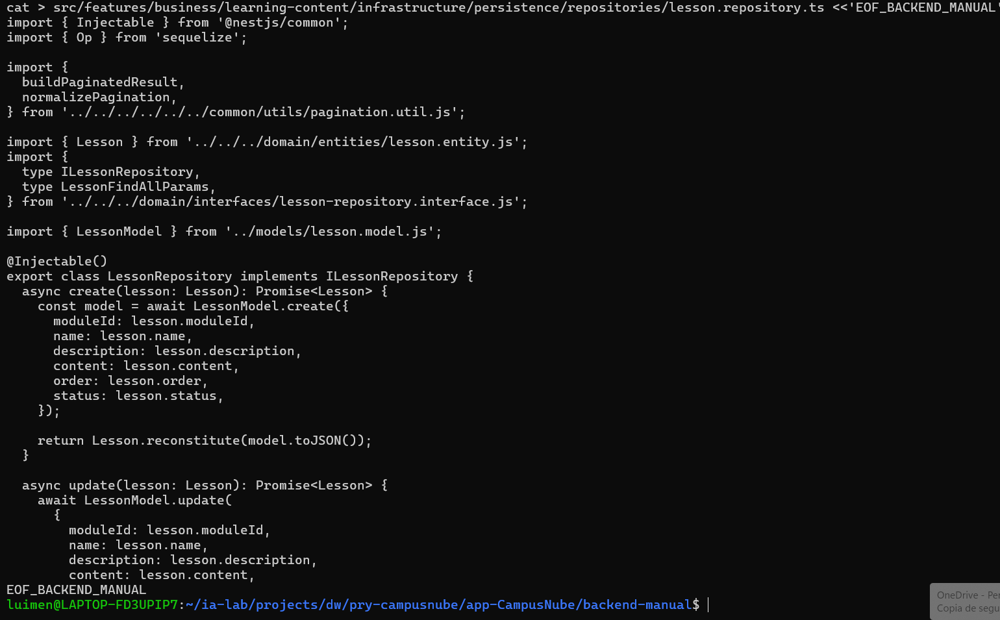

**Sugerencia de commit (issue):**

``` bash
git add .
git commit -m "feat: add sequelize repository lesson.repository.ts"
```


#### 10.9 — create-learning-content-table.migration.ts

Migración documental/auxiliar de la tabla. En dev el sync de Sequelize crea el esquema.

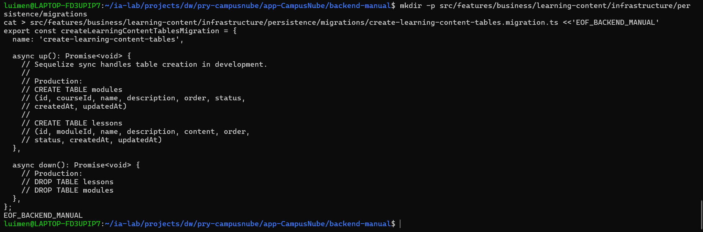

**Sugerencia de commit (issue):**

``` bash
git add .
git commit -m "chore: add migration create-learning-content-tables.migration.ts"
```

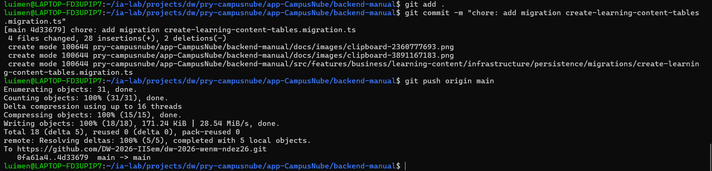

#### 10.10 — features/business/sales/infrastructure/persistence/seeders/sales.seeder.ts

Seeder de datos iniciales para desarrollo y verificación física en BD.

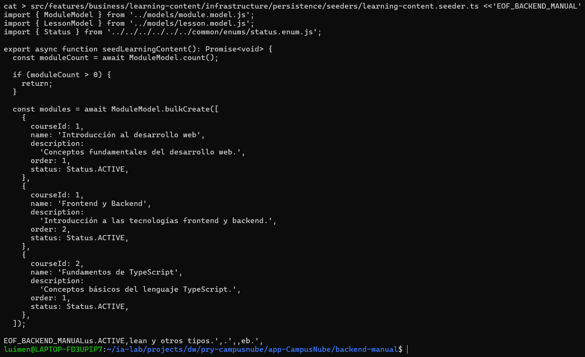

**Sugerencia de commit (issue):**

``` bash
git add . 
git commit -m "chore: add seeder sales.seeder.ts"
```

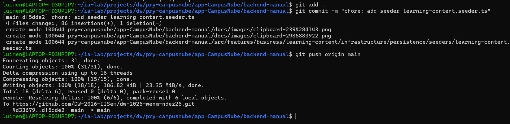

#### 10.11 — create-lesson.dto.ts

DTO de entrada/salida HTTP con `class-validator` / Swagger.

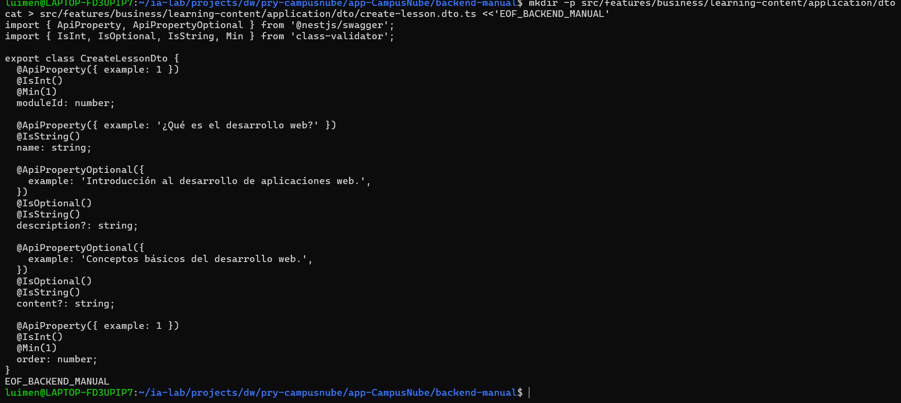

**Sugerencia de commit (issue):**

``` bash
git add . 
git commit -m "feat: add dto create-lesson.dto.ts"
```

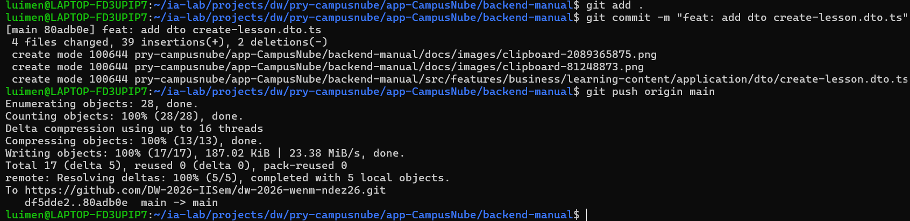

#### 10.12 — lesson-filter.dto.ts

DTO de entrada/salida HTTP con `class-validator` / Swagger.

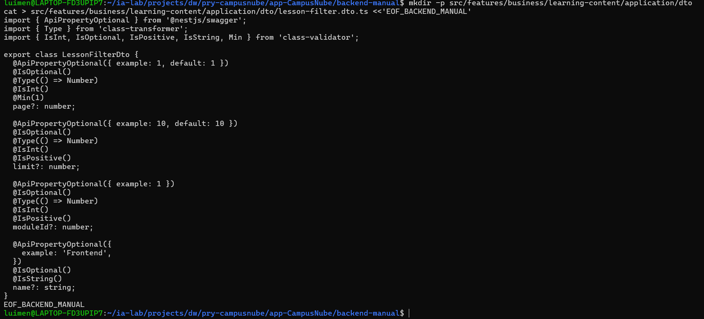

**Sugerencia de commit (issue):**

``` bash
git add .
git commit -m "feat: add dto lesson-filter.dto.ts"
```

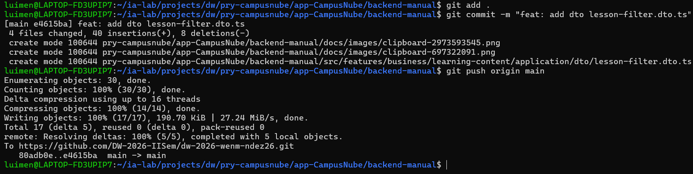

#### 10.13 — lesson-response.dto.ts

DTO de entrada/salida HTTP con `class-validator` / Swagger.

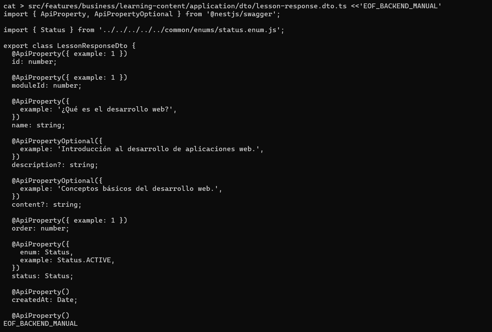

**Sugerencia de commit (issue):**

``` bash
git add . 
git commit -m "feat: add dto lesson-response.dto.ts"
```

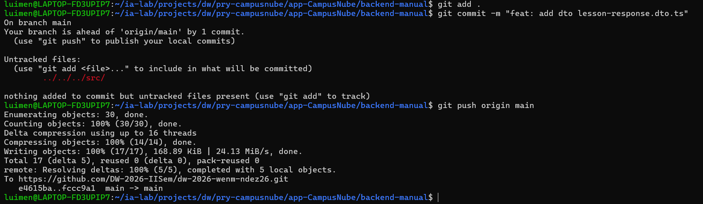

#### 10.14 — lesson.mapper.ts

Mapper entre entidad de dominio y DTO de respuesta.

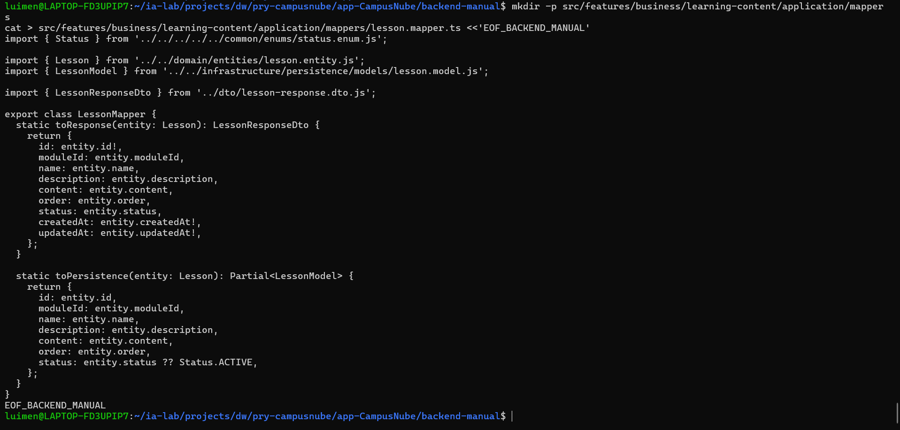

**Sugerencia de commit (issue):**

``` bash
git add . 
git commit -m "feat: add mapper lesson.mapper.ts"
```


#### 10.15 — delete-lesson.use-case.ts

Caso de uso (aplicación). Orquesta dominio + repositorio. El controller solo lo invoca.

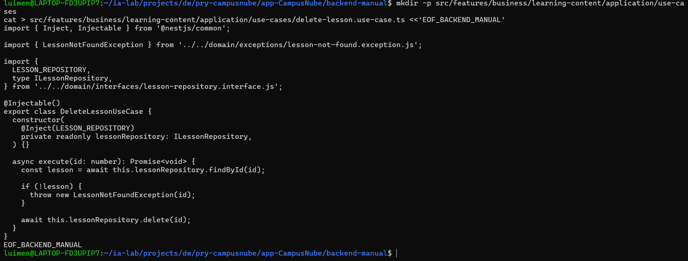

**Sugerencia de commit (issue):**

``` bash
git add . 
git commit -m "feat: add use case delete-lesson.use-case.ts"
```

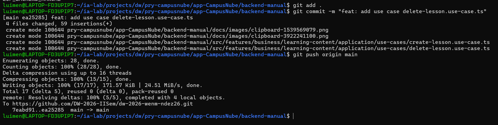

#### 10.16 — create-lesson.use-case.ts

Caso de uso (aplicación). Orquesta dominio + repositorio. El controller solo lo invoca.

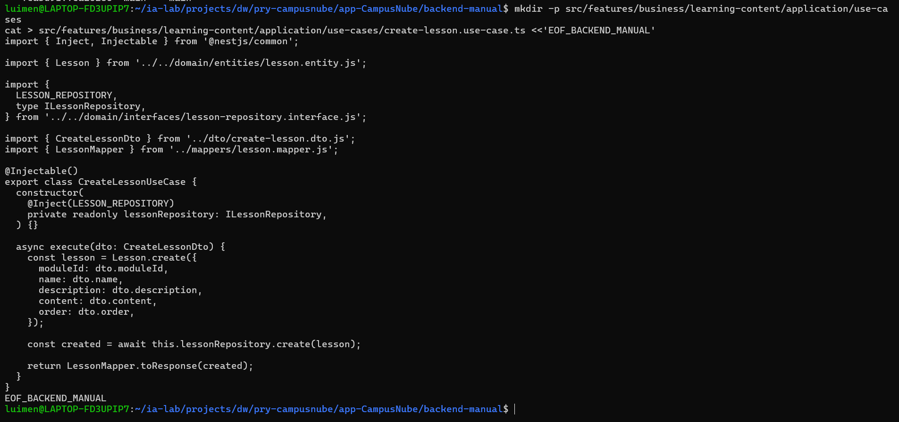

**Sugerencia de commit (issue):**

``` bash
git add .
git commit -m "feat: add use case create-lesson.use-case.ts"
```

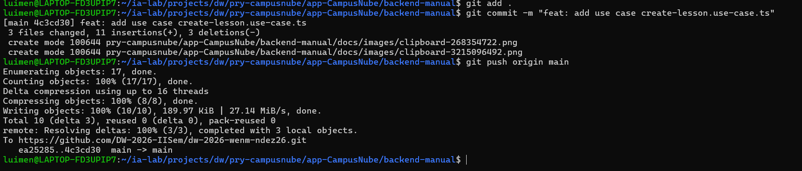

#### 10.17 — get-lesson.use-case.ts

Caso de uso (aplicación). Orquesta dominio + repositorio. El controller solo lo invoca.

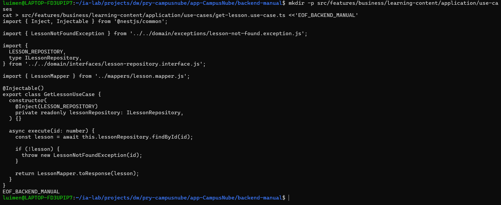

**Sugerencia de commit (issue):**

``` bash
git add . 
git commit -m "feat: add use case get-lesson.use-case.ts"
```

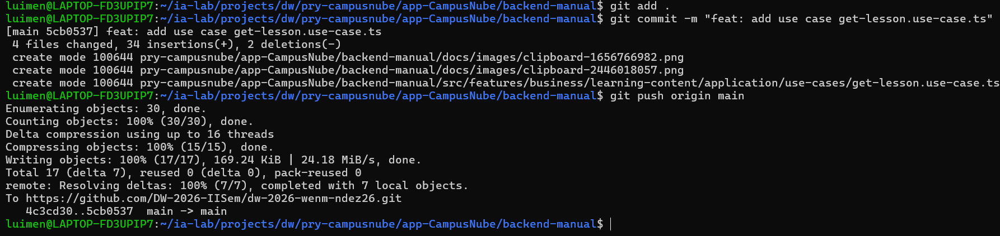

#### 10.18 — list-lesson.use-case.ts

Caso de uso (aplicación). Orquesta dominio + repositorio. El controller solo lo invoca.

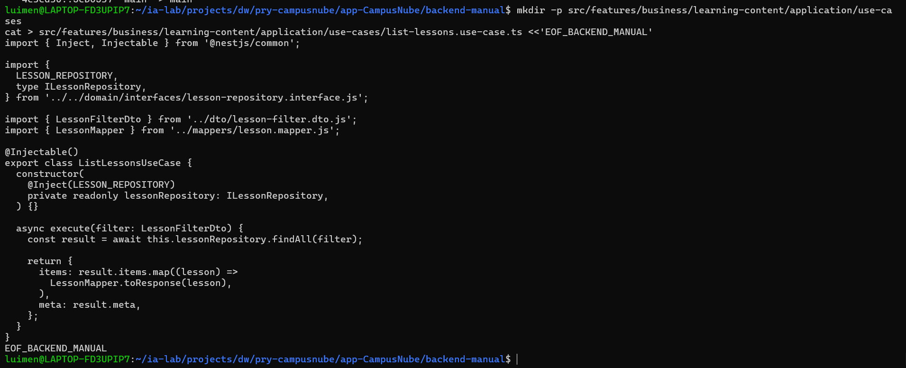

**Sugerencia de commit (issue):**

``` bash
git add . 
git commit -m "feat: add use case list-lessons.use-case.ts"
```

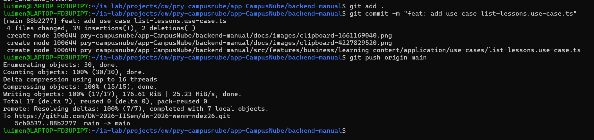

#### 10.19 — lesson.serializer.ts

Serializer de presentación (forma estable de la respuesta HTTP).

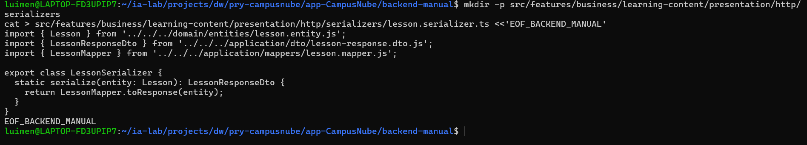

**Sugerencia de commit (issue):**

``` bash
git add . 
git commit -m "feat: add serializer lesson.serializer.ts"
```

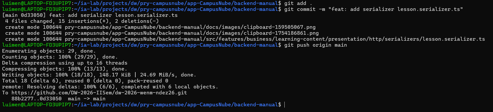

#### 10.20 — lesson.controller.ts

Controller delgado: valida DTO, llama use-case, devuelve respuesta.

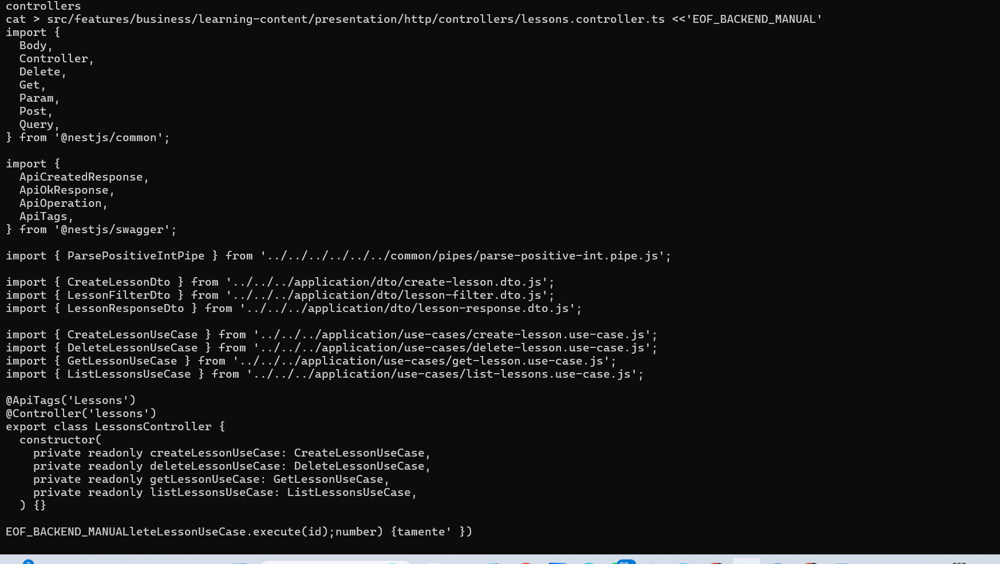

**Sugerencia de commit (issue):**

``` bash
git add . 
git commit -m "feat: add controller lessons.controller.ts"
```

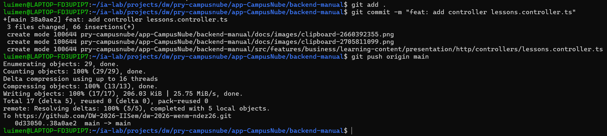

#### 10.21 — features/business/sales/index.ts

Barrel export del feature para imports limpios.

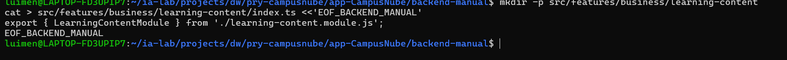

**Sugerencia de commit (issue):**

``` bash
git add . 
git commit -m "chore: add barrel export learning-content"
```

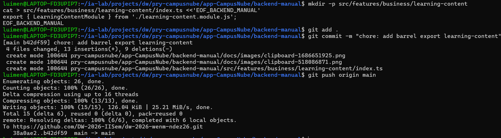

#### 10.22 — learning-content.module.ts

Módulo Nest del feature: cablea providers, tokens DI y controller.

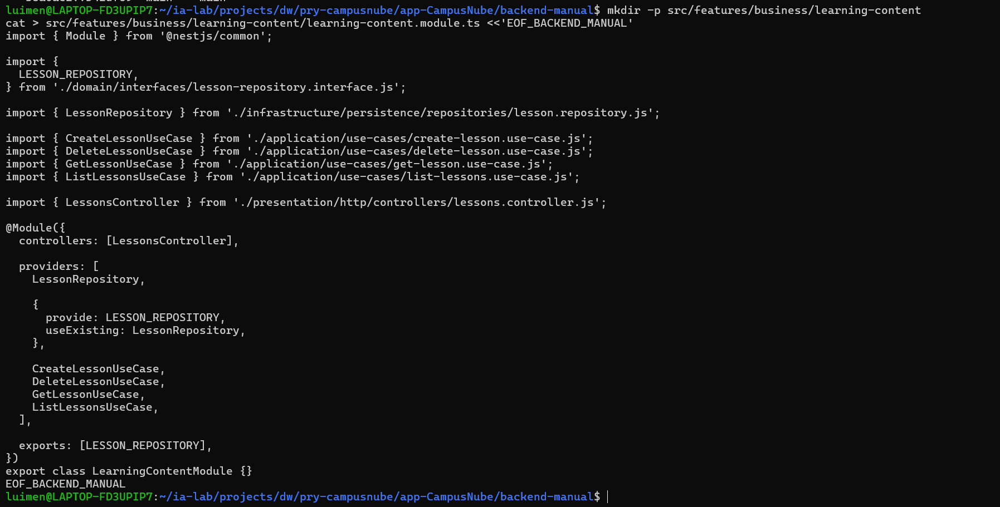

**Sugerencia de commit (issue):**

``` bash
git add . 
git commit -m "feat: wire nest module learning-content.module.ts"
```

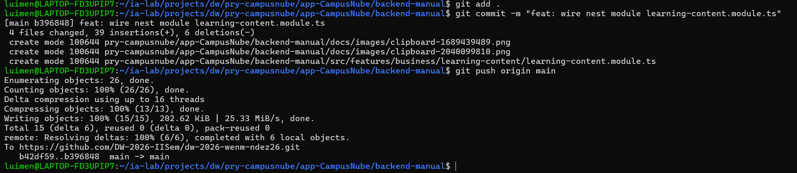

#### 10.23 — business/index.ts

Exports públicos del bounded context business.

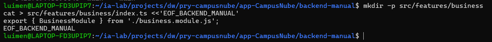

**Sugerencia de commit (issue):**

``` bash
git add . 
git commit -m "chore: add business barrel exports"
```

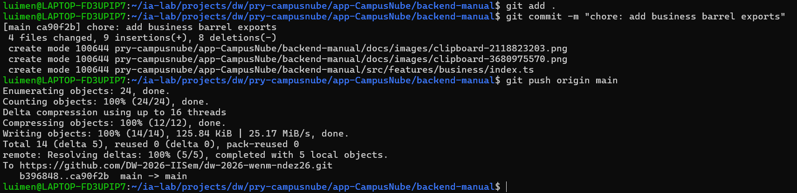

#### 10.24 — Actualizar sequelize.factory.ts (registrar modelos)

Registra en ALL_MODELS solo los modelos ya creados (orden de dependencias).

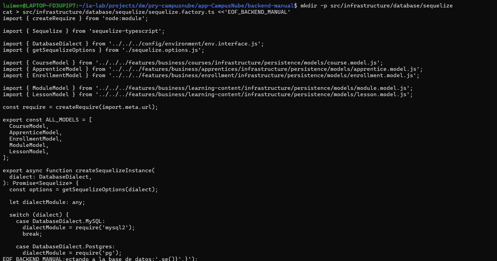

**Sugerencia de commit (issue):**

``` bash
git add . 
git commit -m "feat: register ModuleModel and LessonModel"
```

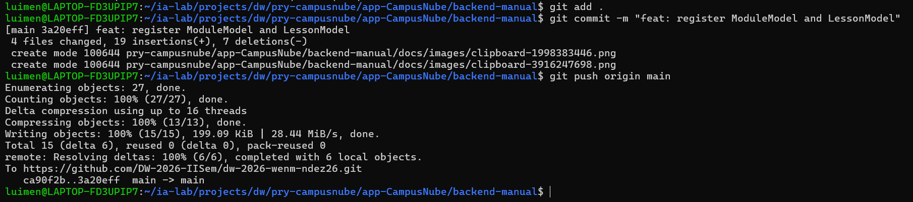

#### 10.25 — Actualizar business.module.ts

Agrega el feature module de negocio recién terminado.

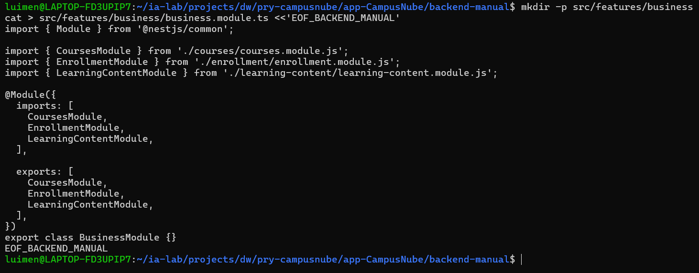

**Sugerencia de commit (issue):**

``` bash
git add . 
git commit -m "feat: add LearningContentModule to BusinessModule"
```

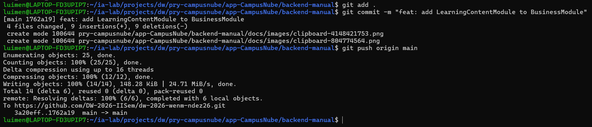

#### 10.26 — Actualizar database-seeder.service.ts

Ejecuta seeders en orden de dependencias al arrancar (dev).

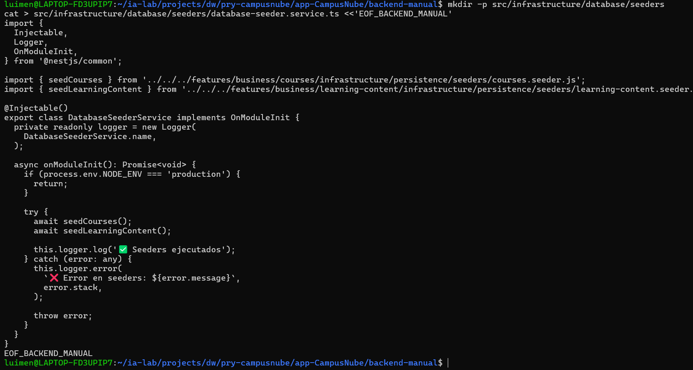

**Sugerencia de commit (issue):**

``` bash
git add .
git commit -m "chore: run seedLearningContent on bootstrap"
```

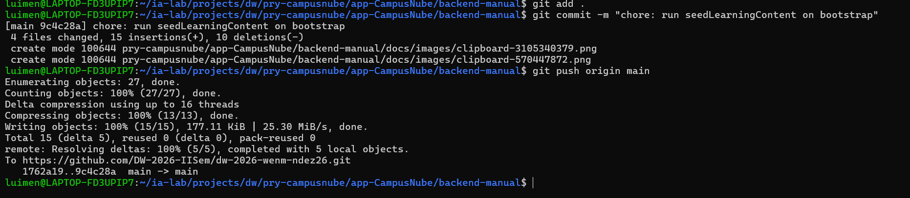

#### 10.27 — Actualizar app.module.ts

Importa BusinessModule y/o AuthModule según el avance. Los guards globales llegan en la fase RBAC.

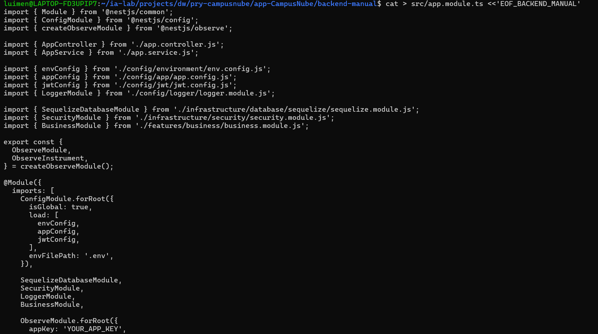

**Sugerencia de commit (issue):**

``` bash
git add .
git commit -m "chore: keep BusinessModule wired in AppModule"
```

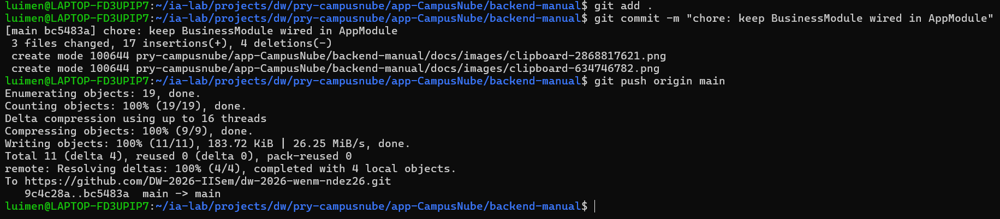

#### 10.28 — Verificar tablas `sales` / `product_sales`

Prueba crear una venta y cancelarla. Revisa stock de productos y filas en product_sales.

``` bash
npm run start:dev
```

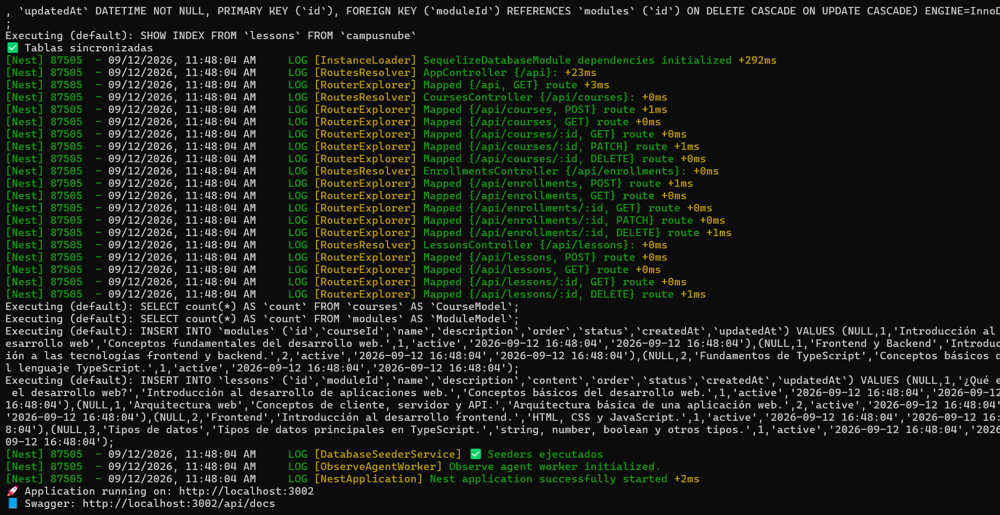

**Sugerencia de commit (issue):**

``` bash
git add .
git commit -m "test: verify learning content flow"
```

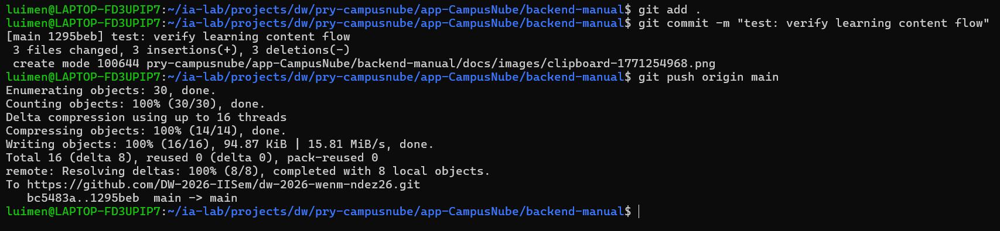

## FASE 11 — module.entity.ts

#### 11.1 — module.entity.ts

Entidad de dominio (TypeScript puro). No extiende Sequelize `Model`. Aquí viven las reglas del negocio.

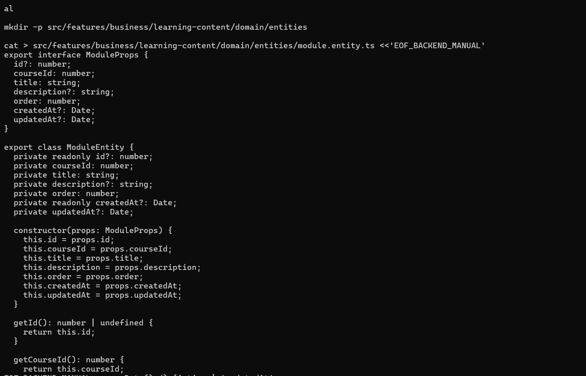

**Sugerencia de commit (issue):**

``` bash
git add .
git commit -m "feat: add domain entity module.entity.ts"
```

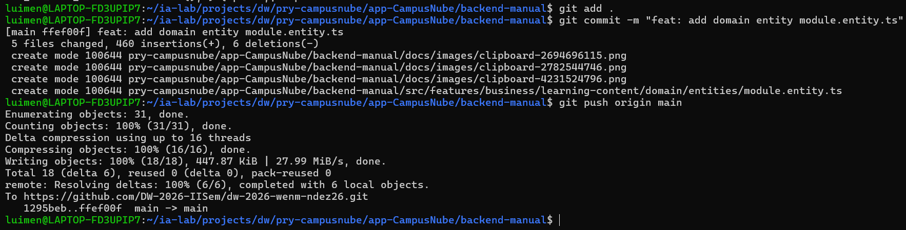

#### 11.2 — ivalid-module-order.exception.ts

Excepción de dominio. El caso de uso la lanza; el filter HTTP la traduce a status code.

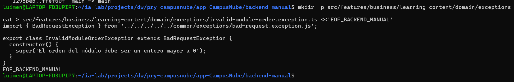

**Sugerencia de commit (issue):**

``` bash
git add . 
git commit -m "feat: add domain exception invalid-module-order.exception.ts"
```

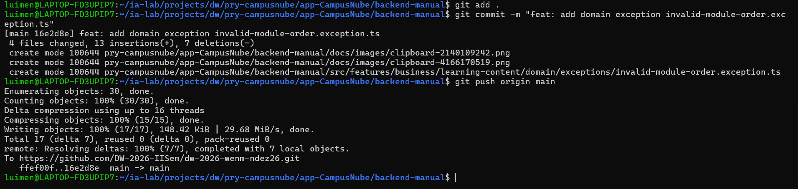

#### 11.3 —module-not-found.exception.ts

Excepción de dominio. El caso de uso la lanza; el filter HTTP la traduce a status code.

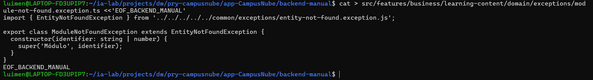

**Sugerencia de commit (issue):**

``` bash
git add . 
git commit -m "feat: add domain exception module-not-found.exception.ts"
```

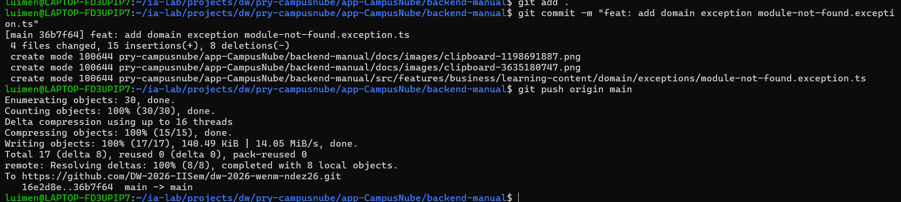

#### 11.4 — module-repository.inteface.ts

Excepción de dominio. El caso de uso la lanza; el filter HTTP la traduce a status code.

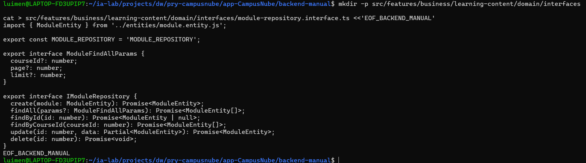

**Sugerencia de commit (issue):**

``` bash
git add . 
git commit -m "feat: add module repository port"
```

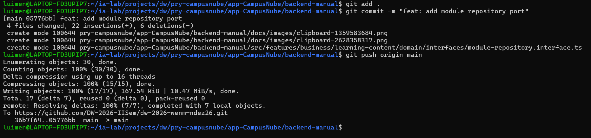

#### 11.5 — module-demain.service.ts

Puerto (contrato) del repositorio. La aplicación depende de esta interface, no de Sequelize.

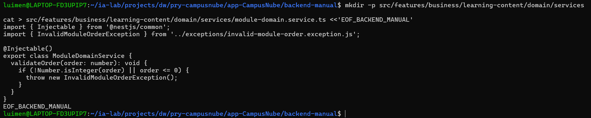

**Sugerencia de commit (issue):**

``` bash
git add .
git commit -m "feat: add repository port user-repository.interface.ts"
```

#### 11.6 — features/auth/users/infrastructure/persistence/models/user.model.ts (sin asociaciones cruzadas aún)

Modelo Sequelize (`@Table`). Solo infraestructura: mapeo a tabla física. En esta fase se crea **sin** BelongsToMany/HasMany hacia módulos aún no creados, para poder compilar y sincronizar la tabla.

**Archivo:** `src/features/auth/users/infrastructure/persistence/models/user.model.ts`

``` bash
mkdir -p src/features/auth/users/infrastructure/persistence/models cat > src/features/auth/users/infrastructure/persistence/models/user.model.ts <<'EOF_BACKEND_IA' import {   Table,   Column,   Model,   DataType,   CreatedAt,   UpdatedAt, } from 'sequelize-typescript'; import { Status } from '../../../../../../common/enums/status.enum';  @Table({ tableName: 'users' }) export class UserModel extends Model {   @Column({     type: DataType.INTEGER,     primaryKey: true,     autoIncrement: true,   })   declare id: number;    @Column({ type: DataType.STRING(100), allowNull: false, unique: true })   declare username: string;    @Column({ type: DataType.STRING(150), allowNull: false, unique: true })   declare email: string;    @Column({ type: DataType.STRING(255), allowNull: false })   declare password: string;    @Column({     type: DataType.ENUM(...Object.values(Status)),     allowNull: false,     defaultValue: Status.ACTIVE,   })   declare isActive: Status;    @Column({ type: DataType.STRING(500), allowNull: true })   declare avatar: string | null;    @CreatedAt   declare createdAt: Date;    @UpdatedAt   declare updatedAt: Date; } EOF_BACKEND_IA
```

**Sugerencia de commit (issue):**

``` bash
git add . git commit -m "feat: add sequelize model user.model.ts without cross associations"
```

#### 11.7 — features/auth/users/infrastructure/persistence/repositories/sequelize-user.repository.ts

Adaptador del repositorio: implementa el puerto de dominio con Sequelize.

**Archivo:** `src/features/auth/users/infrastructure/persistence/repositories/sequelize-user.repository.ts`

``` bash
mkdir -p src/features/auth/users/infrastructure/persistence/repositories cat > src/features/auth/users/infrastructure/persistence/repositories/sequelize-user.repository.ts <<'EOF_BACKEND_IA' import { Injectable } from '@nestjs/common'; import { User } from '../../../domain/entities/user.entity'; import { USER_REPOSITORY } from '../../../domain/interfaces/user-repository.interface'; import type { IUserRepository } from '../../../domain/interfaces/user-repository.interface'; import { UserModel } from '../models/user.model'; import { UserMapper } from '../../../application/mappers/user.mapper';  @Injectable() export class SequelizeUserRepository implements IUserRepository {   async create(user: User): Promise<User> {     const model = await UserModel.create(UserMapper.toPersistence(user));     return UserMapper.toDomain(model);   }    async findAll(): Promise<User[]> {     const models = await UserModel.findAll({ order: [['id', 'ASC']] });     return models.map(UserMapper.toDomain);   }    async findById(id: number): Promise<User | null> {     const model = await UserModel.findByPk(id);     return model ? UserMapper.toDomain(model) : null;   }    async findByEmail(email: string): Promise<User | null> {     const model = await UserModel.findOne({ where: { email } });     return model ? UserMapper.toDomain(model) : null;   }    async findByUsername(username: string): Promise<User | null> {     const model = await UserModel.findOne({ where: { username } });     return model ? UserMapper.toDomain(model) : null;   }    async update(id: number, data: Partial<User>): Promise<User> {     const model = await UserModel.findByPk(id);     if (!model) {       throw new Error(`User ${id} not found`);     }     await model.update(UserMapper.toPersistence({ ...UserMapper.toDomain(model), ...data }));     return UserMapper.toDomain(model);   }    async delete(id: number): Promise<void> {     await UserModel.destroy({ where: { id } });   } }  export const userRepositoryProvider = {   provide: USER_REPOSITORY,   useClass: SequelizeUserRepository, }; EOF_BACKEND_IA
```

**Sugerencia de commit (issue):**

``` bash
git add . git commit -m "feat: add sequelize repository sequelize-user.repository.ts"
```

#### 11.8 — features/auth/users/infrastructure/persistence/seeders/users.seeder.ts

Seeder de datos iniciales para desarrollo y verificación física en BD.

**Archivo:** `src/features/auth/users/infrastructure/persistence/seeders/users.seeder.ts`

``` bash
mkdir -p src/features/auth/users/infrastructure/persistence/seeders cat > src/features/auth/users/infrastructure/persistence/seeders/users.seeder.ts <<'EOF_BACKEND_IA' /**  * Seeder de feature deshabilitado.  * El bootstrap central vive en:  * src/infrastructure/database/seeders/auth-bootstrap.seeder.ts  * para respetar el orden de dependencias Business → Auth.  */ export class FeatureSeederDisabled {} EOF_BACKEND_IA
```

**Sugerencia de commit (issue):**

``` bash
git add . git commit -m "chore: add seeder users.seeder.ts"
```

#### 11.9 — features/auth/users/application/dto/create-user.dto.ts

DTO de entrada/salida HTTP con `class-validator` / Swagger.

**Archivo:** `src/features/auth/users/application/dto/create-user.dto.ts`

``` bash
mkdir -p src/features/auth/users/application/dto cat > src/features/auth/users/application/dto/create-user.dto.ts <<'EOF_BACKEND_IA' import {   IsEmail,   IsEnum,   IsNotEmpty,   IsOptional,   IsString,   MinLength, } from 'class-validator'; import { Status } from '../../../../../common/enums/status.enum';  export class CreateUserDto {   @IsString()   @IsNotEmpty()   username: string;    @IsEmail()   email: string;    @IsString()   @MinLength(6)   password: string;    @IsOptional()   @IsEnum(Status)   isActive?: Status;    @IsOptional()   @IsString()   avatar?: string; }  export class UpdateUserDto {   @IsOptional()   @IsString()   @IsNotEmpty()   username?: string;    @IsOptional()   @IsEmail()   email?: string;    @IsOptional()   @IsString()   @MinLength(6)   password?: string;    @IsOptional()   @IsEnum(Status)   isActive?: Status;    @IsOptional()   @IsString()   avatar?: string; } EOF_BACKEND_IA
```

**Sugerencia de commit (issue):**

``` bash
git add . git commit -m "feat: add dto create-user.dto.ts"
```

#### 11.10 — features/auth/users/application/dto/update-user.dto.ts

DTO de entrada/salida HTTP con `class-validator` / Swagger.

**Archivo:** `src/features/auth/users/application/dto/update-user.dto.ts`

``` bash
mkdir -p src/features/auth/users/application/dto cat > src/features/auth/users/application/dto/update-user.dto.ts <<'EOF_BACKEND_IA' export { UpdateUserDto } from './create-user.dto'; EOF_BACKEND_IA
```

**Sugerencia de commit (issue):**

``` bash
git add . git commit -m "feat: add dto update-user.dto.ts"
```

#### 11.11 — features/auth/users/application/mappers/user.mapper.ts

Mapper entre entidad de dominio y DTO de respuesta.

**Archivo:** `src/features/auth/users/application/mappers/user.mapper.ts`

``` bash
mkdir -p src/features/auth/users/application/mappers cat > src/features/auth/users/application/mappers/user.mapper.ts <<'EOF_BACKEND_IA' import { User } from '../../domain/entities/user.entity'; import { UserModel } from '../../infrastructure/persistence/models/user.model';  export class UserMapper {   static toDomain(model: UserModel): User {     return new User({       id: model.id,       username: model.username,       email: model.email,       password: model.password,       isActive: model.isActive,       avatar: model.avatar ?? undefined,       createdAt: model.createdAt,       updatedAt: model.updatedAt,     });   }    static toPersistence(entity: User): Partial<UserModel> {     return {       id: entity.id,       username: entity.username,       email: entity.email,       password: entity.password,       isActive: entity.isActive,       avatar: entity.avatar ?? null,     };   }    static toResponse(entity: User) {     return {       id: entity.id,       username: entity.username,       email: entity.email,       isActive: entity.isActive,       avatar: entity.avatar,       createdAt: entity.createdAt,       updatedAt: entity.updatedAt,     };   } } EOF_BACKEND_IA
```

**Sugerencia de commit (issue):**

``` bash
git add . git commit -m "feat: add mapper user.mapper.ts"
```

#### 11.12 — features/auth/users/application/use-cases/create-user.use-case.ts

Caso de uso (aplicación). Orquesta dominio + repositorio. El controller solo lo invoca.

**Archivo:** `src/features/auth/users/application/use-cases/create-user.use-case.ts`

``` bash
mkdir -p src/features/auth/users/application/use-cases cat > src/features/auth/users/application/use-cases/create-user.use-case.ts <<'EOF_BACKEND_IA' import { Inject, Injectable } from '@nestjs/common'; import { Status } from '../../../../../common/enums/status.enum'; import { PASSWORD_HASHER } from '../../../../../infrastructure/security/hashing/password-hasher.interface'; import type { IPasswordHasher } from '../../../../../infrastructure/security/hashing/password-hasher.interface'; import { User } from '../../domain/entities/user.entity'; import { UserEmailExistsException } from '../../domain/exceptions/user-email-exists.exception'; import { UserUsernameExistsException } from '../../domain/exceptions/user-username-exists.exception'; import { USER_REPOSITORY } from '../../domain/interfaces/user-repository.interface'; import type { IUserRepository } from '../../domain/interfaces/user-repository.interface'; import { CreateUserDto } from '../dto/create-user.dto'; import { UserMapper } from '../mappers/user.mapper';  @Injectable() export class CreateUserUseCase {   constructor(     @Inject(USER_REPOSITORY)     private readonly userRepository: IUserRepository,     @Inject(PASSWORD_HASHER)     private readonly passwordHasher: IPasswordHasher,   ) {}    async execute(dto: CreateUserDto) {     const existingEmail = await this.userRepository.findByEmail(dto.email);     if (existingEmail) {       throw new UserEmailExistsException(dto.email);     }      const existingUsername = await this.userRepository.findByUsername(dto.username);     if (existingUsername) {       throw new UserUsernameExistsException(dto.username);     }      const hashedPassword = await this.passwordHasher.hash(dto.password);      const user = new User({       username: dto.username,       email: dto.email,       password: hashedPassword,       isActive: dto.isActive ?? Status.ACTIVE,       avatar: dto.avatar,     });      const created = await this.userRepository.create(user);     return UserMapper.toResponse(created);   } } EOF_BACKEND_IA
```

**Sugerencia de commit (issue):**

``` bash
git add . git commit -m "feat: add use case create-user.use-case.ts"
```

#### 11.13 — features/auth/users/application/use-cases/delete-user.use-case.ts

Caso de uso (aplicación). Orquesta dominio + repositorio. El controller solo lo invoca.

**Archivo:** `src/features/auth/users/application/use-cases/delete-user.use-case.ts`

``` bash
mkdir -p src/features/auth/users/application/use-cases cat > src/features/auth/users/application/use-cases/delete-user.use-case.ts <<'EOF_BACKEND_IA' import { Inject, Injectable } from '@nestjs/common'; import { USER_REPOSITORY } from '../../domain/interfaces/user-repository.interface'; import type { IUserRepository } from '../../domain/interfaces/user-repository.interface'; import { UserNotFoundException } from '../../domain/exceptions/user-not-found.exception';  @Injectable() export class DeleteUserUseCase {   constructor(     @Inject(USER_REPOSITORY)     private readonly userRepository: IUserRepository,   ) {}    async execute(id: number): Promise<void> {     const existing = await this.userRepository.findById(id);     if (!existing) {       throw new UserNotFoundException(id);     }     await this.userRepository.delete(id);   } } EOF_BACKEND_IA
```

**Sugerencia de commit (issue):**

``` bash
git add . git commit -m "feat: add use case delete-user.use-case.ts"
```

#### 11.14 — features/auth/users/application/use-cases/get-user.use-case.ts

Caso de uso (aplicación). Orquesta dominio + repositorio. El controller solo lo invoca.

**Archivo:** `src/features/auth/users/application/use-cases/get-user.use-case.ts`

``` bash
mkdir -p src/features/auth/users/application/use-cases cat > src/features/auth/users/application/use-cases/get-user.use-case.ts <<'EOF_BACKEND_IA' import { Inject, Injectable } from '@nestjs/common'; import { USER_REPOSITORY } from '../../domain/interfaces/user-repository.interface'; import type { IUserRepository } from '../../domain/interfaces/user-repository.interface'; import { UserNotFoundException } from '../../domain/exceptions/user-not-found.exception'; import { UserMapper } from '../mappers/user.mapper';  @Injectable() export class GetUserUseCase {   constructor(     @Inject(USER_REPOSITORY)     private readonly userRepository: IUserRepository,   ) {}    async execute(id: number) {     const user = await this.userRepository.findById(id);     if (!user) {       throw new UserNotFoundException(id);     }     return UserMapper.toResponse(user);   } } EOF_BACKEND_IA
```

**Sugerencia de commit (issue):**

``` bash
git add . git commit -m "feat: add use case get-user.use-case.ts"
```

#### 11.15 — features/auth/users/application/use-cases/list-users.use-case.ts

Caso de uso (aplicación). Orquesta dominio + repositorio. El controller solo lo invoca.

**Archivo:** `src/features/auth/users/application/use-cases/list-users.use-case.ts`

``` bash
mkdir -p src/features/auth/users/application/use-cases cat > src/features/auth/users/application/use-cases/list-users.use-case.ts <<'EOF_BACKEND_IA' import { Inject, Injectable } from '@nestjs/common'; import { USER_REPOSITORY } from '../../domain/interfaces/user-repository.interface'; import type { IUserRepository } from '../../domain/interfaces/user-repository.interface'; import { UserMapper } from '../mappers/user.mapper';  @Injectable() export class ListUsersUseCase {   constructor(     @Inject(USER_REPOSITORY)     private readonly userRepository: IUserRepository,   ) {}    async execute() {     const users = await this.userRepository.findAll();     return users.map(UserMapper.toResponse);   } } EOF_BACKEND_IA
```

**Sugerencia de commit (issue):**

``` bash
git add . git commit -m "feat: add use case list-users.use-case.ts"
```

#### 11.16 — features/auth/users/application/use-cases/update-user.use-case.ts

Caso de uso (aplicación). Orquesta dominio + repositorio. El controller solo lo invoca.

**Archivo:** `src/features/auth/users/application/use-cases/update-user.use-case.ts`

``` bash
mkdir -p src/features/auth/users/application/use-cases cat > src/features/auth/users/application/use-cases/update-user.use-case.ts <<'EOF_BACKEND_IA' import { Inject, Injectable } from '@nestjs/common'; import { PASSWORD_HASHER } from '../../../../../infrastructure/security/hashing/password-hasher.interface'; import type { IPasswordHasher } from '../../../../../infrastructure/security/hashing/password-hasher.interface'; import { UserEmailExistsException } from '../../domain/exceptions/user-email-exists.exception'; import { UserNotFoundException } from '../../domain/exceptions/user-not-found.exception'; import { UserUsernameExistsException } from '../../domain/exceptions/user-username-exists.exception'; import { USER_REPOSITORY } from '../../domain/interfaces/user-repository.interface'; import type { IUserRepository } from '../../domain/interfaces/user-repository.interface'; import { UpdateUserDto } from '../dto/update-user.dto'; import { UserMapper } from '../mappers/user.mapper';  @Injectable() export class UpdateUserUseCase {   constructor(     @Inject(USER_REPOSITORY)     private readonly userRepository: IUserRepository,     @Inject(PASSWORD_HASHER)     private readonly passwordHasher: IPasswordHasher,   ) {}    async execute(id: number, dto: UpdateUserDto) {     const existing = await this.userRepository.findById(id);     if (!existing) {       throw new UserNotFoundException(id);     }      if (dto.email && dto.email !== existing.email) {       const emailTaken = await this.userRepository.findByEmail(dto.email);       if (emailTaken) {         throw new UserEmailExistsException(dto.email);       }     }      if (dto.username && dto.username !== existing.username) {       const usernameTaken = await this.userRepository.findByUsername(dto.username);       if (usernameTaken) {         throw new UserUsernameExistsException(dto.username);       }     }      const updateData: Partial<typeof existing> = { ...dto };     if (dto.password) {       updateData.password = await this.passwordHasher.hash(dto.password);     }      const updated = await this.userRepository.update(id, updateData);     return UserMapper.toResponse(updated);   } } EOF_BACKEND_IA
```

**Sugerencia de commit (issue):**

``` bash
git add . git commit -m "feat: add use case update-user.use-case.ts"
```

#### 11.17 — features/auth/users/presentation/http/controllers/users.controller.ts

Controller delgado: valida DTO, llama use-case, devuelve respuesta.

**Archivo:** `src/features/auth/users/presentation/http/controllers/users.controller.ts`

``` bash
mkdir -p src/features/auth/users/presentation/http/controllers cat > src/features/auth/users/presentation/http/controllers/users.controller.ts <<'EOF_BACKEND_IA' import {   Body,   Controller,   Delete,   Get,   Param,   ParseIntPipe,   Post,   Put, } from '@nestjs/common'; import { CreateUserDto } from '../../../application/dto/create-user.dto'; import { UpdateUserDto } from '../../../application/dto/update-user.dto'; import { CreateUserUseCase } from '../../../application/use-cases/create-user.use-case'; import { DeleteUserUseCase } from '../../../application/use-cases/delete-user.use-case'; import { GetUserUseCase } from '../../../application/use-cases/get-user.use-case'; import { ListUsersUseCase } from '../../../application/use-cases/list-users.use-case'; import { UpdateUserUseCase } from '../../../application/use-cases/update-user.use-case';  @Controller('users') export class UsersController {   constructor(     private readonly createUserUseCase: CreateUserUseCase,     private readonly listUsersUseCase: ListUsersUseCase,     private readonly getUserUseCase: GetUserUseCase,     private readonly updateUserUseCase: UpdateUserUseCase,     private readonly deleteUserUseCase: DeleteUserUseCase,   ) {}    @Post()   create(@Body() dto: CreateUserDto) {     return this.createUserUseCase.execute(dto);   }    @Get()   findAll() {     return this.listUsersUseCase.execute();   }    @Get(':id')   findOne(@Param('id', ParseIntPipe) id: number) {     return this.getUserUseCase.execute(id);   }    @Put(':id')   update(@Param('id', ParseIntPipe) id: number, @Body() dto: UpdateUserDto) {     return this.updateUserUseCase.execute(id, dto);   }    @Delete(':id')   async remove(@Param('id', ParseIntPipe) id: number) {     await this.deleteUserUseCase.execute(id);     return { message: 'Usuario eliminado' };   } } EOF_BACKEND_IA
```

**Sugerencia de commit (issue):**

``` bash
git add . git commit -m "feat: add controller users.controller.ts"
```

#### 11.18 — features/auth/users/users.module.ts

Módulo Nest del feature: cablea providers, tokens DI y controller.

**Archivo:** `src/features/auth/users/users.module.ts`

``` bash
mkdir -p src/features/auth/users cat > src/features/auth/users/users.module.ts <<'EOF_BACKEND_IA' import { Module } from '@nestjs/common'; import { CreateUserUseCase } from './application/use-cases/create-user.use-case'; import { DeleteUserUseCase } from './application/use-cases/delete-user.use-case'; import { GetUserUseCase } from './application/use-cases/get-user.use-case'; import { ListUsersUseCase } from './application/use-cases/list-users.use-case'; import { UpdateUserUseCase } from './application/use-cases/update-user.use-case'; import { userRepositoryProvider } from './infrastructure/persistence/repositories/sequelize-user.repository'; import { UsersController } from './presentation/http/controllers/users.controller';  @Module({   controllers: [UsersController],   providers: [     userRepositoryProvider,     CreateUserUseCase,     GetUserUseCase,     ListUsersUseCase,     UpdateUserUseCase,     DeleteUserUseCase,   ],   exports: [userRepositoryProvider], }) export class UsersModule {} EOF_BACKEND_IA
```

**Sugerencia de commit (issue):**

``` bash
git add . git commit -m "feat: wire nest module users.module.ts"
```

#### 11.19 — Actualizar sequelize.factory.ts (registrar modelos)

Registra en ALL_MODELS solo los modelos ya creados (orden de dependencias).

**Archivo:** `src/infrastructure/database/sequelize/sequelize.factory.ts`

``` bash
mkdir -p src/infrastructure/database/sequelize cat > src/infrastructure/database/sequelize/sequelize.factory.ts <<'EOF_BACKEND_IA' import { Sequelize } from 'sequelize-typescript'; import { DatabaseDialect } from '../../../config/environment/env.interface'; import { getSequelizeOptions } from './sequelize.options';  import { ClientModel } from '../../../features/business/clients/infrastructure/persistence/models/client.model'; import { ProductTypeModel } from '../../../features/business/product-types/infrastructure/persistence/models/product-type.model'; import { ProductModel } from '../../../features/business/products/infrastructure/persistence/models/product.model'; import { SaleModel } from '../../../features/business/sales/infrastructure/persistence/models/sale.model'; import { ProductSaleModel } from '../../../features/business/sales/infrastructure/persistence/models/product-sale.model'; import { UserModel } from '../../../features/auth/users/infrastructure/persistence/models/user.model';  export const ALL_MODELS = [   ClientModel,   ProductTypeModel,   ProductModel,   SaleModel,   ProductSaleModel,   UserModel, ];  export async function createSequelizeInstance(   dialect: DatabaseDialect, ): Promise<Sequelize> {   const options = getSequelizeOptions(dialect);    let dialectModule: any;    switch (dialect) {     case DatabaseDialect.MySQL:       dialectModule = require('mysql2');       break;     case DatabaseDialect.Postgres:       dialectModule = require('pg');       break;     case DatabaseDialect.MSSQL:       dialectModule = require('tedious');       break;     case DatabaseDialect.Oracle:       dialectModule = require('oracledb');       break;     default:       throw new Error(`Dialecto no soportado: ${dialect}`);   }    const sequelize = new Sequelize({     ...options,     dialectModule,     models: ALL_MODELS,   } as any);    try {     await sequelize.authenticate();     console.log(`✅ Conexión exitosa a ${dialect.toUpperCase()}`);   } catch (error: any) {     console.error(       `❌ Error conectando a ${dialect.toUpperCase()}:`,       error.message,     );     throw error;   }    if (process.env.NODE_ENV !== 'production') {     await sequelize.sync({ alter: false });     console.log('✅ Tablas sincronizadas');   }    return sequelize; } EOF_BACKEND_IA
```

**Sugerencia de commit (issue):**

``` bash
git add . git commit -m "feat: register auth models up to user"
```

#### 11.20 — Actualizar auth.module.ts

Agrega el feature module de auth recién terminado.

**Archivo:** `src/features/auth/auth.module.ts`

``` bash
mkdir -p src/features/auth cat > src/features/auth/auth.module.ts <<'EOF_BACKEND_IA' import { Module } from '@nestjs/common'; import { UsersModule } from './users/users.module';  @Module({   imports: [UsersModule],   exports: [UsersModule], }) export class AuthModule {} EOF_BACKEND_IA
```

**Sugerencia de commit (issue):**

``` bash
git add . git commit -m "feat: add users to AuthModule"
```

#### 11.21 — Actualizar database-seeder.service.ts

Ejecuta seeders en orden de dependencias al arrancar (dev).

**Archivo:** `src/infrastructure/database/seeders/database-seeder.service.ts`

``` bash
mkdir -p src/infrastructure/database/seeders cat > src/infrastructure/database/seeders/database-seeder.service.ts <<'EOF_BACKEND_IA' import { Injectable, Logger, OnModuleInit } from '@nestjs/common'; import { seedClients } from '../../../features/business/clients/infrastructure/persistence/seeders/clients.seeder'; import { seedProductTypes } from '../../../features/business/product-types/infrastructure/persistence/seeders/product-types.seeder'; import { seedProducts } from '../../../features/business/products/infrastructure/persistence/seeders/products.seeder'; import { seedSales } from '../../../features/business/sales/infrastructure/persistence/seeders/sales.seeder';  /**  * Ejecuta seeders en orden de dependencias.  * Solo en entornos no productivos.  */ @Injectable() export class DatabaseSeederService implements OnModuleInit {   private readonly logger = new Logger(DatabaseSeederService.name);    async onModuleInit(): Promise<void> {     if (process.env.NODE_ENV === 'production') {       return;     }      try {       await seedClients();       await seedProductTypes();       await seedProducts();       await seedSales();       this.logger.log('✅ Seeders ejecutados');     } catch (error: any) {       this.logger.error(`❌ Error en seeders: ${error.message}`, error.stack);       throw error;     }   } } EOF_BACKEND_IA
```

**Sugerencia de commit (issue):**

``` bash
git add . git commit -m "chore: update auth/business seeders bootstrap order"
```

#### 11.22 — Actualizar app.module.ts

Importa BusinessModule y/o AuthModule según el avance. Los guards globales llegan en la fase RBAC.

**Archivo:** `src/app.module.ts`

``` bash
mkdir -p src cat > src/app.module.ts <<'EOF_BACKEND_IA' import { Module } from '@nestjs/common'; import { ConfigModule } from '@nestjs/config'; import { envConfig } from './config/environment/env.config'; import { appConfig } from './config/app/app.config'; import { jwtConfig } from './config/jwt/jwt.config'; import { LoggerModule } from './config/logger/logger.module'; import { SequelizeDatabaseModule } from './infrastructure/database/sequelize/sequelize.module'; import { SecurityModule } from './infrastructure/security/security.module'; import { BusinessModule } from './features/business/business.module'; import { AuthModule } from './features/auth/auth.module'; import { AppController } from './app.controller'; import { AppService } from './app.service';  @Module({   imports: [     ConfigModule.forRoot({       isGlobal: true,       load: [envConfig, appConfig, jwtConfig],       envFilePath: '.env',     }),     SequelizeDatabaseModule,     SecurityModule,     LoggerModule,     BusinessModule,     AuthModule,   ],   controllers: [AppController],   providers: [     AppService,   ], }) export class AppModule {} EOF_BACKEND_IA
```

**Sugerencia de commit (issue):**

``` bash
git add . git commit -m "feat: import AuthModule into AppModule"
```

#### 11.23 — Verificar feature auth (Auth — Users)

Arranca y confirma tablas/endpoints del feature. Si hay asociaciones pendientes, el sync de columnas principales ya debe existir.

``` bash
npm run start:dev
```

**Sugerencia de commit (issue):**

``` bash
git add . git commit -m "test: verify 10_auth_users auth feature"
```

------------------------------------------------------------------------

## 

## 
