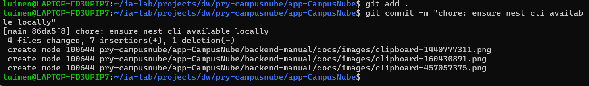

## FASE 1 — `00_BASE_INIT_NESTJS`

### Inicialización del proyecto NestJS

#### 1.1 — Crear carpetas padre y permisos

##### En este caso ya habíamos creado la carpeta vamos a dar el permiso 

mkdir -p backend-manual

chmod -R 755 backend-manual

## Evidencia

**Sugerencia de commit (issue):**

Realizamos el primer commit

git add .

git commit -m "chore: prepare workspace folders for nest backend"

#### 1.2 — Instalar Nest CLI (si no existe)

El CLI generamos `main.ts`, `app.module.ts`, `tsconfig`, scripts npm entre otros

**Sugerencia de commit (issue):**

