## MOTORES DE BASE DE DATOS CON DOCKER COMPOSE

### WENYURE MENDEZ LAFAURIE 

### Crear 4 Motores de Base de Datos con Docker Compose
## 1. Requisitos Previos

## 1.1 WSL2 instalado y funcionando
Wsl2 instalado correctamente y funcionando 

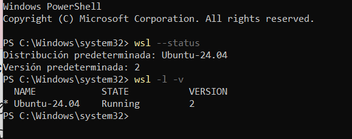

## Docker funcionando dentro de WSL
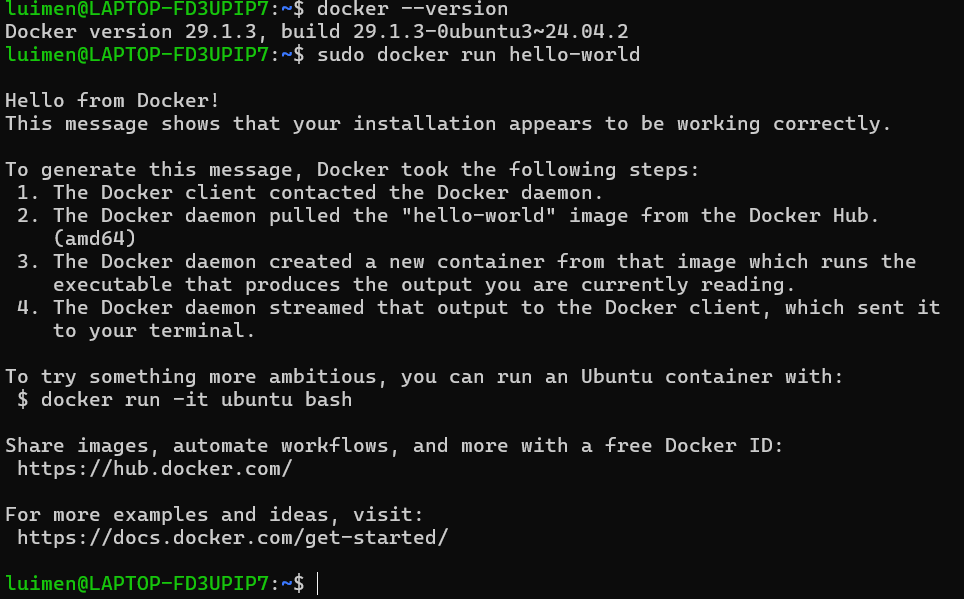

## Acceso a terminal bash en WSL
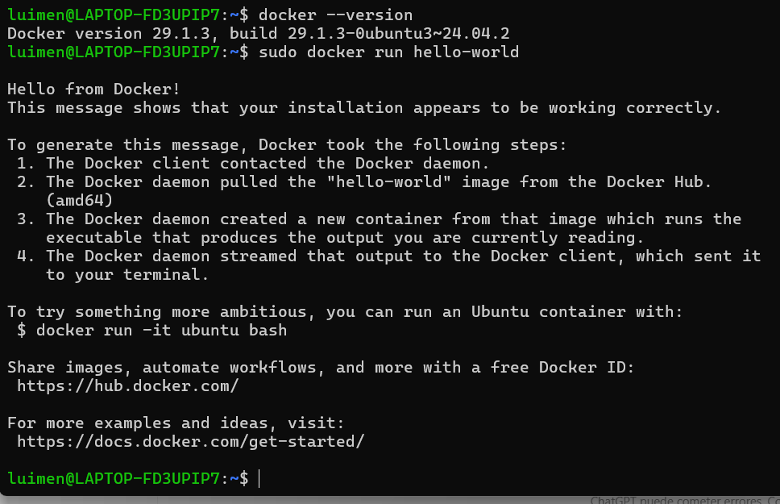

## Instalar Docker y Compose
### Add Docker's official GPG key:
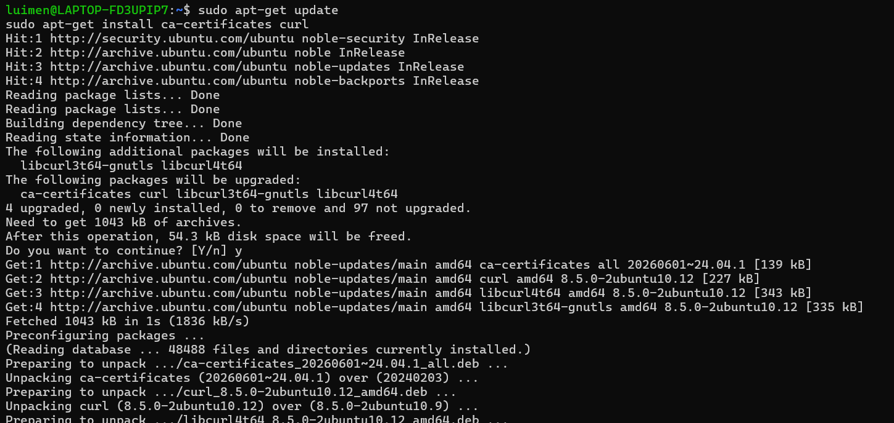
## Add the repository to Apt sources:
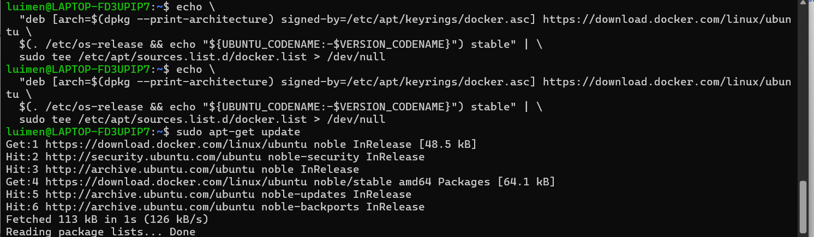
En este paso se instalo compose anteriormmente instalamos docker 
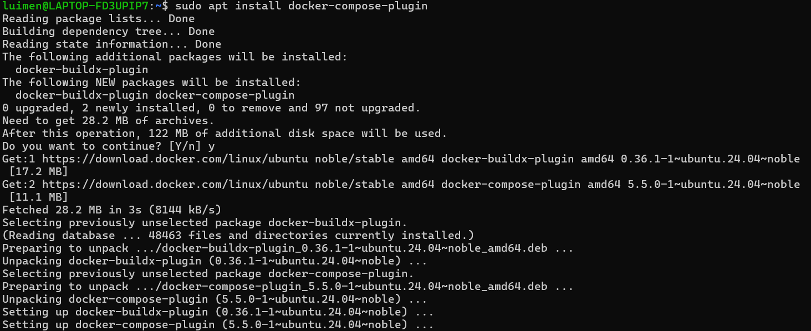
## Verifica Docker:
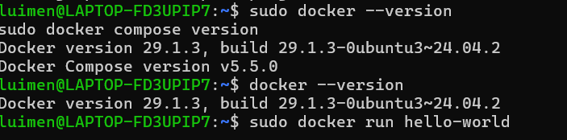

## 2. Paso 1: Crear Carpetas
Iniciamos instalando tree
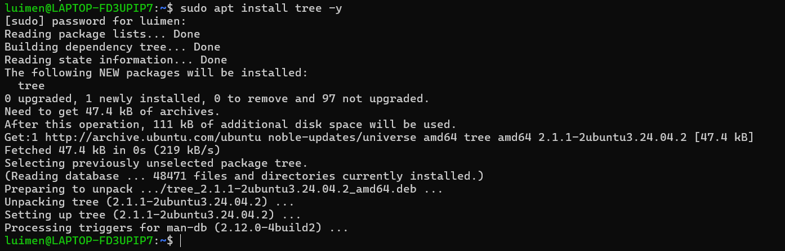
En este paso cree las carpetas  
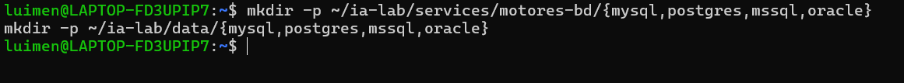
## Se verificó que se creo correctamente y su estructura
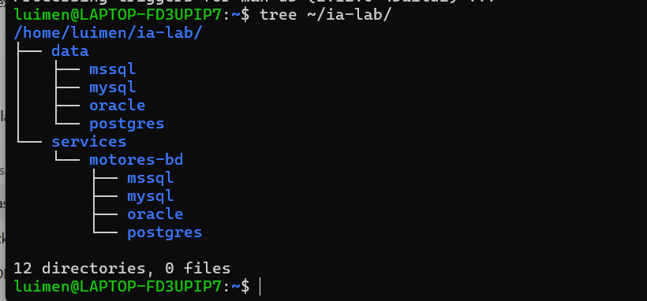

## 3. Paso 2: Crear la Red Docker Compartida
Todos los contenedores compartirán una misma red Docker para comunicarse entre sí:
En este paso cree una red docker compartida 
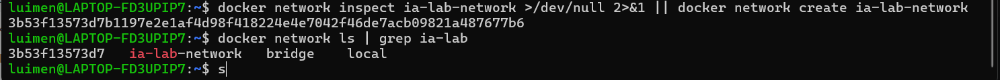
# 4. Paso 3: MySQL
## 4.1 Crear el archivo docker-compose.yml
este paso cree un archivo docker-compose.yml
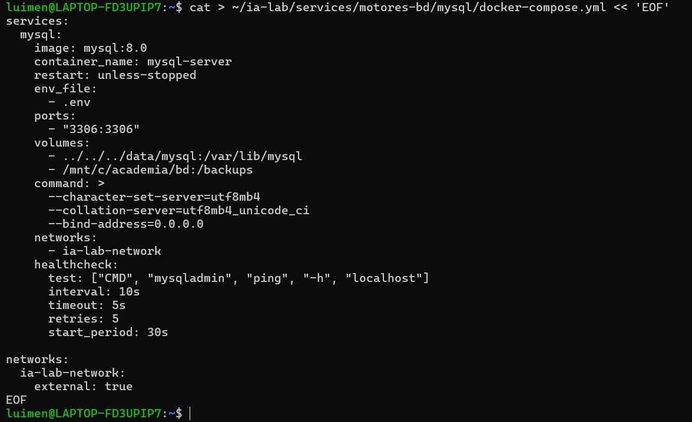
### 4.2 Crear el archivo .env
cree un archivo .env 
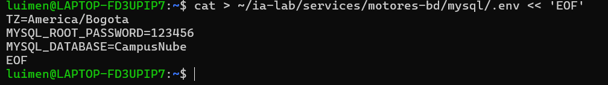
### 4.3 Crear README.md
cree corectamente el archivo 
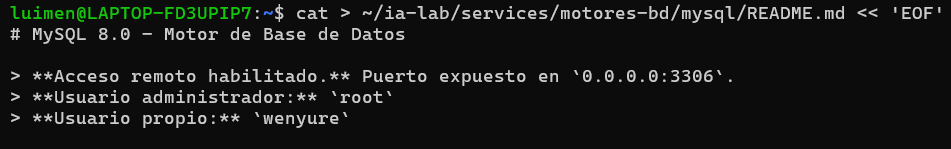
## Conectar desde WSL (local)
En este paso conecte desde la wsl local.
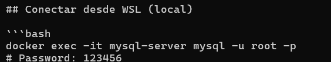
## Conectar remotamente desde cualquier equipo
En este paso conecte correctamente desde cualquier equipo 
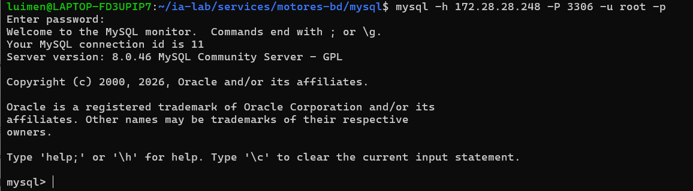
## Crear un usuario PROPIO con ACCESO REMOTO
cree exitosamente un usuario propio con acceso remoto
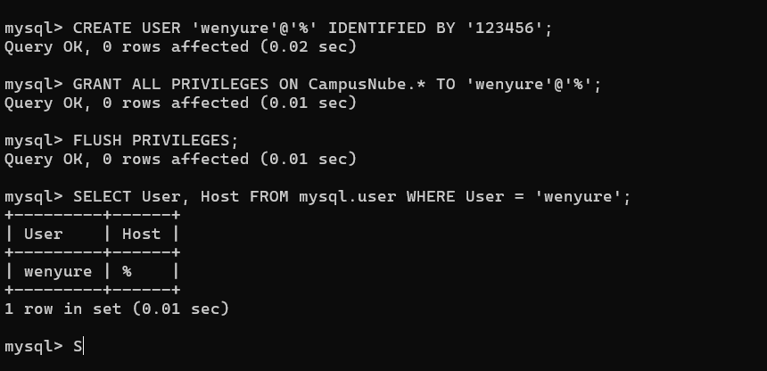
## Backup de una base de datos
se realizó un backaup y se verifico que se creo correctamnente 
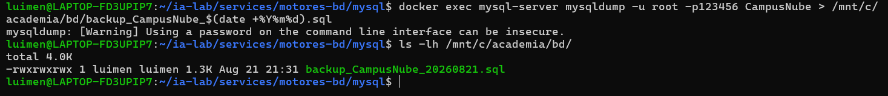
## Variables clave del .env

| Variable              | Descripcion                                      |
|-----------------------|--------------------------------------------------|
| `MYSQL_ROOT_PASSWORD` | Password del usuario root                        |
| `MYSQL_DATABASE`      | Base de datos creada automaticamente al arrancar |
## 4.4 Levantar MySQL
En este paso se levanto MySQL y así mismo se verfificó que estiviera corriendo correctamente 
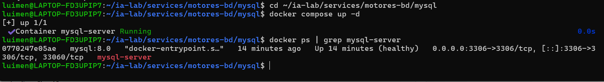
Verificar que está corriendo los logs:
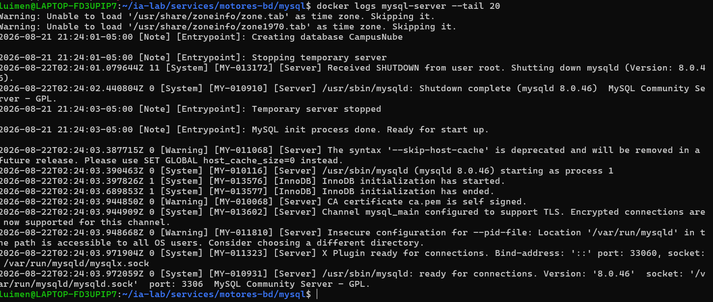
## 5. Paso 4: PostgreSQL
Ahora en este paso haremos lo mismo que hicimos con MySQL 
### 5.1 Crear docker-compose.yml
Ahora cree el docker-compose.yml para posgretSQL
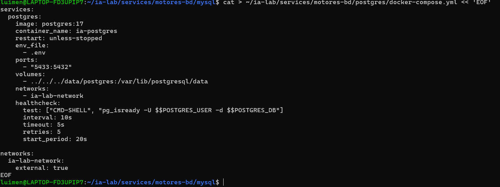
### Se verificó que este se creo correctamente 
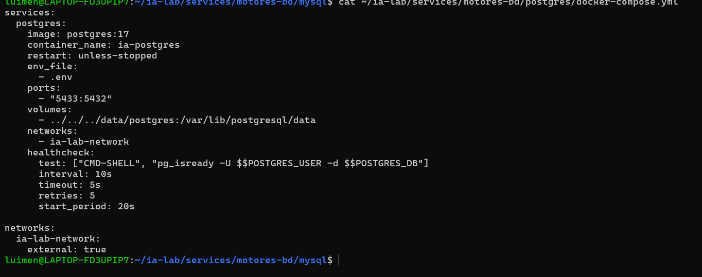
## 5.2 Crear .env
En este paso creamos el archivo .env y verficamos que se creo correctamente 
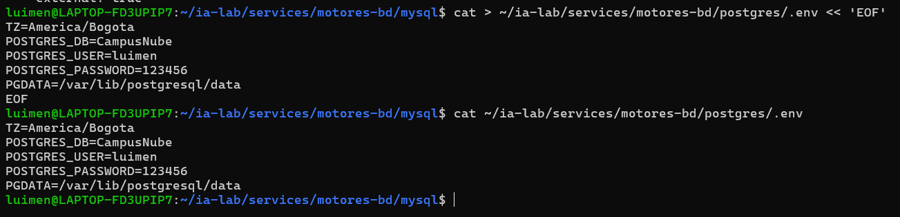
## 5.3 Crear README.md
En este paso cree el archivo correctamente 
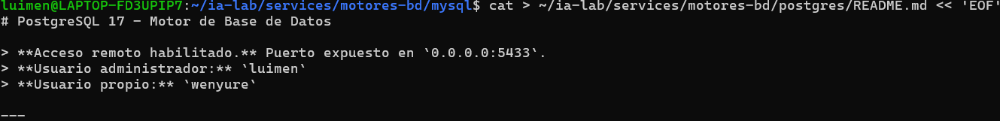
## Conectar desde WSL (local)
se hizo la conexión desde WSL local
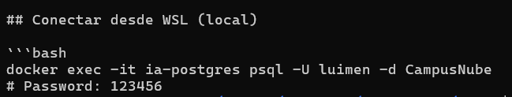
## instalar psql
En este paso antes de hacer la conexión desde cualquier equipo se instalo psql
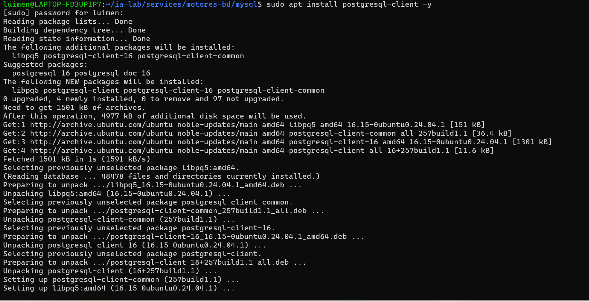
## Conectar remotamente desde cualquier equipo
Se realizó la conexión desde cualquier equipo 
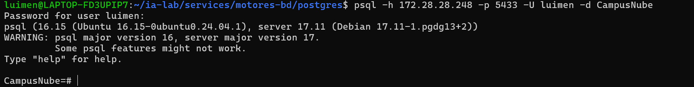
## Crear un usuario PROPIO con ACCESO REMOTO
Crear la base de datos (este paso ya esta creado)
### Crear usuario propio (por defecto puede conectarse desde cualquier host)

### Dar permisos sobre la base de datos
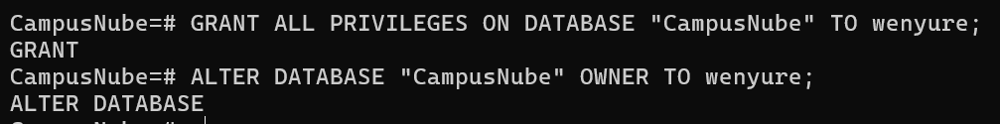
## Backup de una base de datos 
En este paso se creo correctamenre el backaup de esta base de datos 
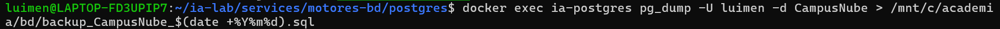
## Se verificó que se creó correctamente 
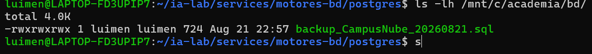
## Variables clave del .env

| Variable            | Descripcion                              |
|---------------------|------------------------------------------|
| `POSTGRES_USER`     | Usuario administrador (ialab)            |
| `POSTGRES_PASSWORD` | Password del administrador               |
| `POSTGRES_DB`       | Base de datos inicial creada al arrancar |

### 5.4 Levantar PostgreSQL
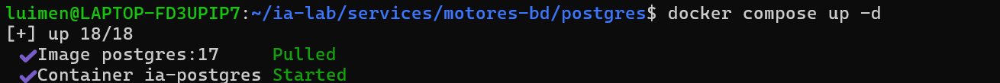
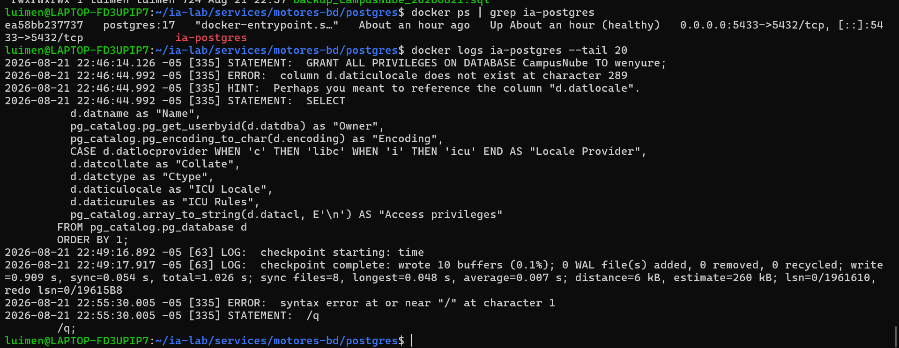
## 6. Paso 5: SQL Server
Ahora se trabajará el motor SQL Server
# 6.1 Crear docker-compose.yml
### Inciamos creando el docker-compose.yml
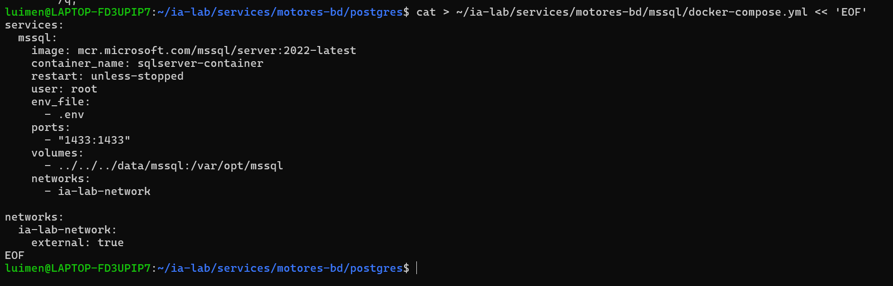
# 6.2 Crear .env
en este caso se creo el archivo .env
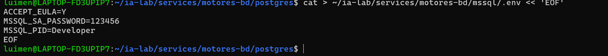

### 6.3 Crear README.md
en este paso siguiendo la guia creamos el README.md
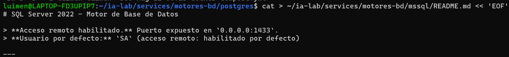
## Conectar desde WSL (local)
Se conecto desde wsl local
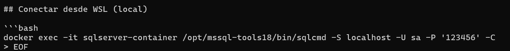
y se verfica que se creo correctamente
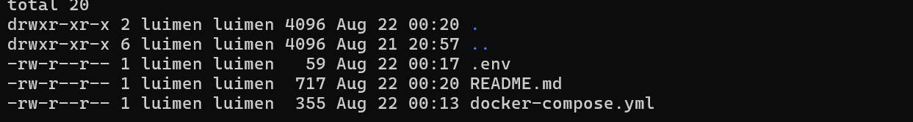
## Crear un usuario PROPIO con ACCESO REMOTO

###  Crear la base de datos
primero creamos la base de datos

##  Crear login (autenticacion a nivel servidor, acceso remoto por defecto)
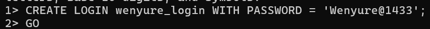
## Crear usuario dentro de la base de datos
creamos el usuario dentro de la base de datos creada
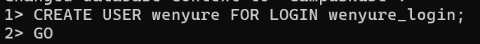
## Dar permisos de dueno de la base de datos
se le dió permmisos a la base de datos
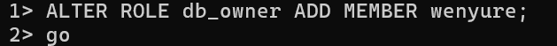

## Backup de una base de datos
Realizamos el backaup de manera exitosa y verficamos que este se realizó correctamente
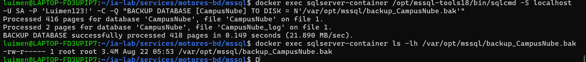

## Variables clave del .env

| Variable            | Descripcion                             |
|---------------------|-----------------------------------------|
| `MSSQL_SA_PASSWORD` | Password del usuario SA (administrador) |
| `MSSQL_PID`         | Edicion de SQL Server (Developer)       |

EOF
### 6.4 Levantar SQL Server
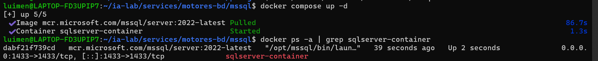

## 7. Paso 6: Oracle XE
Ahora iniciamos con el ultimó motor que es Oracle XE
### 7.1 Crear docker-compose.yml
Iniciamos con crear el docker-compose.yml
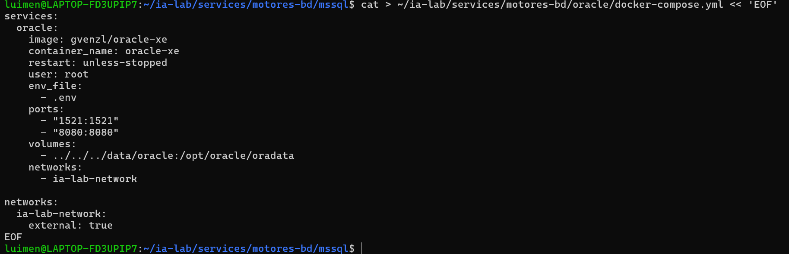
### 7.2 Crear .env
Cree un archivo .env exitosamente 
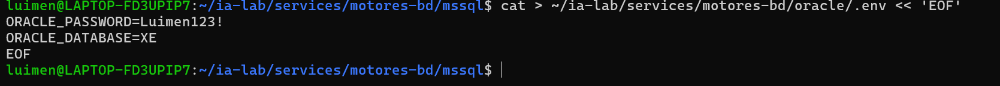
### 7.3 Crear README.md
Ahora creamos un README.md
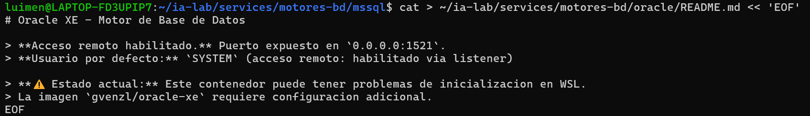
## Conectar desde WSL (local)
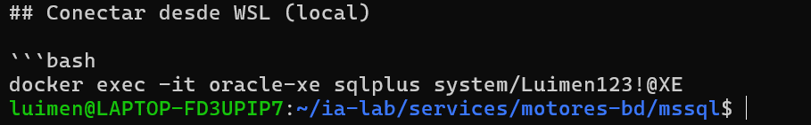
## Conectar remotamente desde cualquier equipo
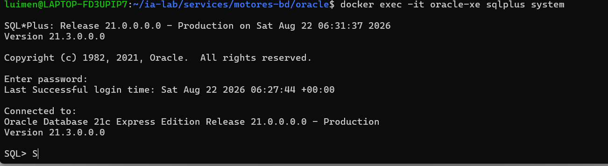
# Crear un usuario PROPIO con ACCESO REMOTO
## Crear tablespace para el usuario
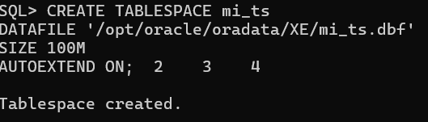
## Crear usuario propio (puede conectarse desde cualquier host via listener)
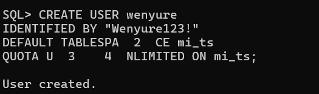
## Dar permisos basicos
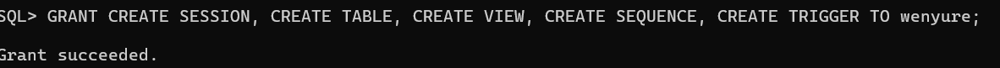
## Dar permisos de DBA
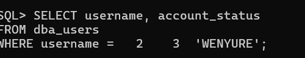
## Variables clave del .env

| Variable          | Descripcion                 |
|-------------------|-----------------------------|
| `ORACLE_PASSWORD` | Password del usuario SYSTEM |
| `ORACLE_DATABASE` | Nombre de la instancia (XE) |

### 7.4 Levantar Oracle
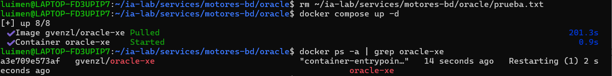
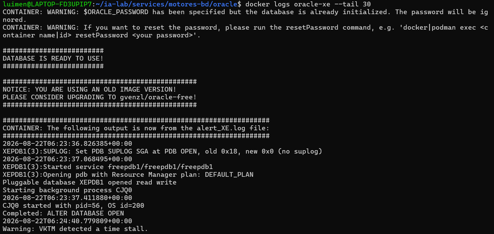
## INICIAMOS CON LA CONEXIÓN DE MYSQL EN DBeaver 
### Para este paso teniendo en cuenta los datos y ip que se usaron cuando creamos las base de datos
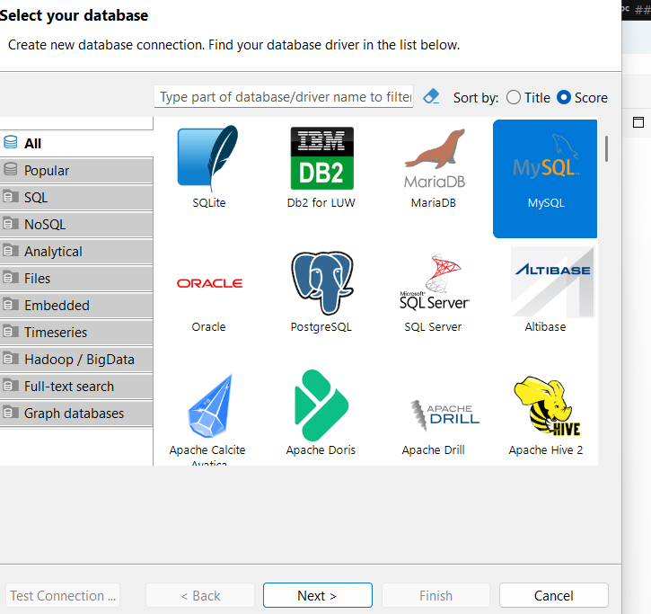
### Seleccionamos nuestra base de datos en este caso MySQL
### Ahora realizamos la coenzión 
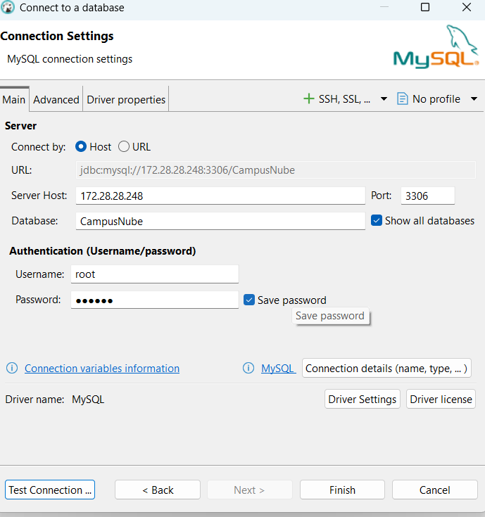
### Realizamos una test conetion antes 
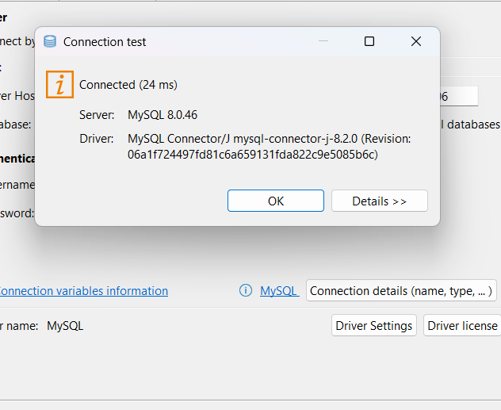
### Finalizamos y conectamos correctamente 
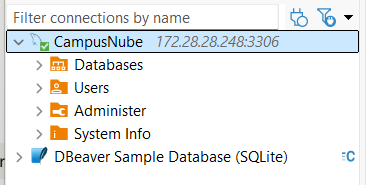
## INICIAMOS CON LA CONEXIÓN DE MYSQL SERVER EN DBeaver
### Seleccionamos nuestra base de datos en este caso MySQL Server
### Ahora realizamos la coenzión 
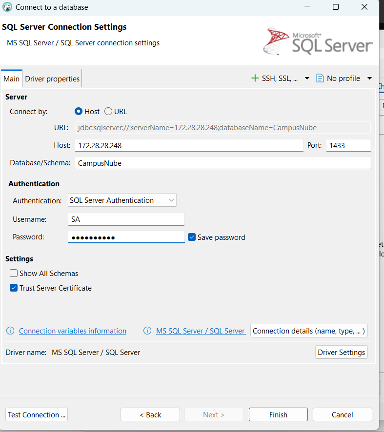
 ### Realizamos una test conetion antes 
 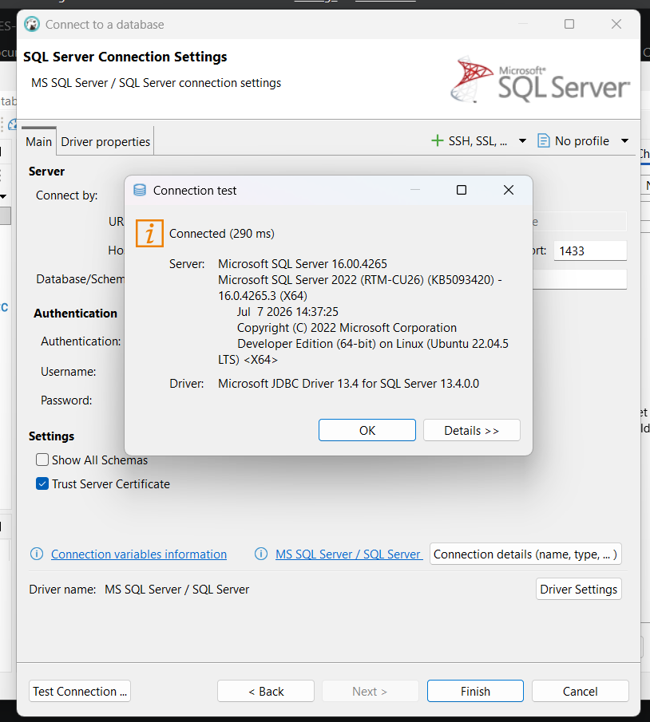
 ###  Finalizamos y conectamos correctamente 
 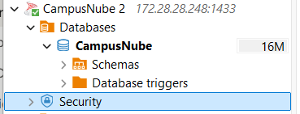
 ## INICIAMOS CON LA CONEXIÓN DE POSGRET EN DBeaver
### Seleccionamos nuestra base de datos en este caso Posgret
### Ahora realizamos la coenzión 
!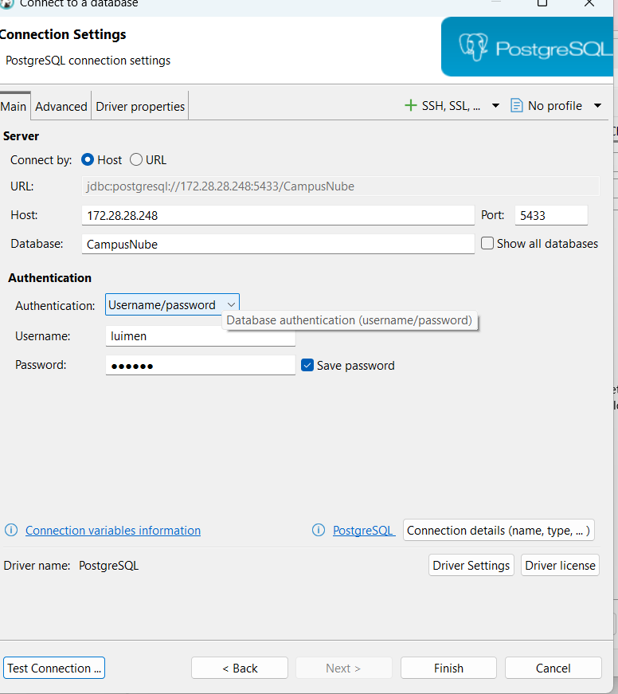
 ### Realizamos una test conetion antes 
 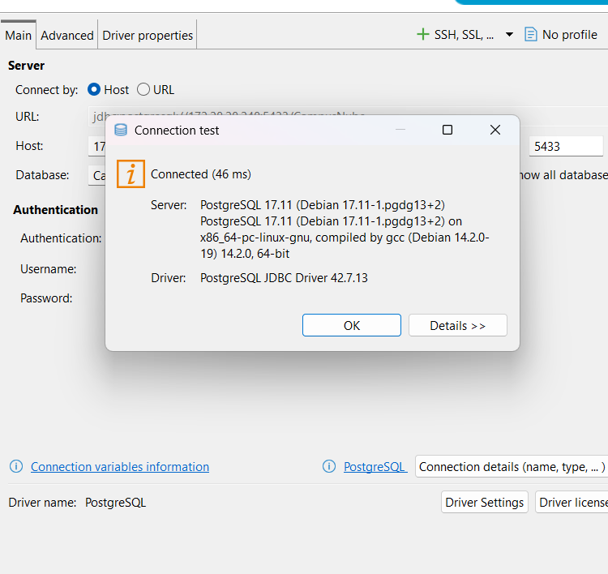
 ### Finalizamos y conectamos correctamente 
 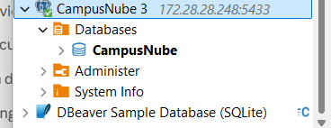
 ## INICIAMOS CON LA CONEXIÓN DE ORACLE EN DBeaver
### Seleccionamos nuestra base de datos en este caso Oracle
### Ahora realizamos la coenzión 
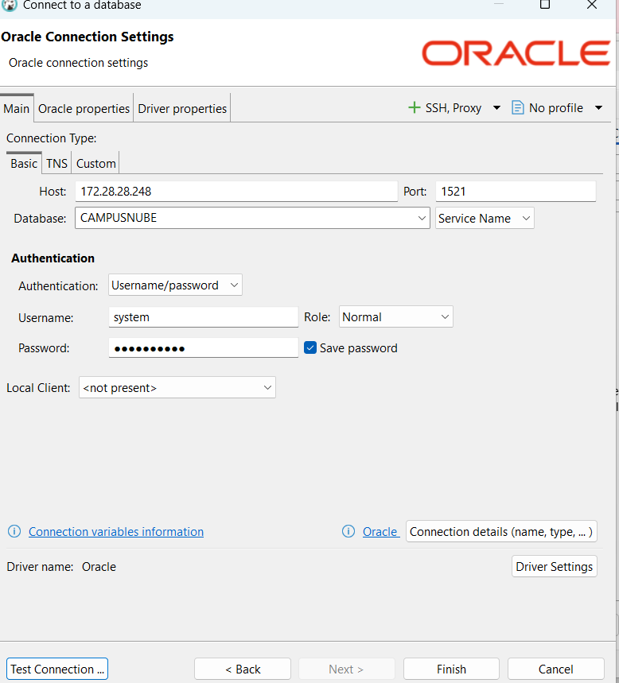
 ## Realizamos una test conetion antes 
 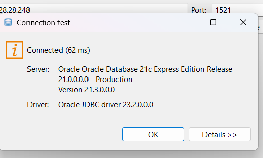
 ## Finalizamos y conectamos correctamente 
 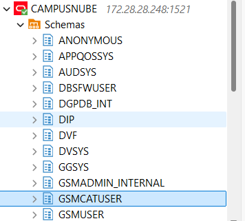

